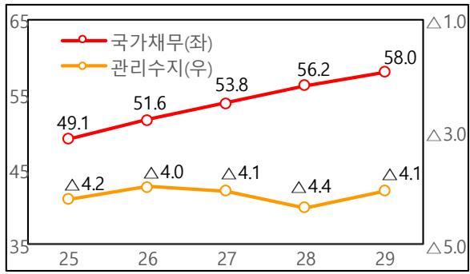

# 회복과 성장을 위한

# 2026년 예산안

2025. 8.

# 순 서

Ⅰ. 기본방향  
Ⅱ. 예산안 전체모습 2  
Ⅲ. 재정 혁신 ·· ·······5  
Ⅳ. 중점 투자방향 8

1. 기술이 주도하는 초혁신경제  
2. 모두의 성장, 기본이 튼튼한 사회  
3. 국민안전, 국익 중심의 외교·안보

(별첨) 분야별 투자방향 ·····40

# Ⅰ. 기본방향

◇ 이재명 정부가 편성한 첫 예산안 : 새정부 핵심과제 충실히 반영

➊ 적극적인 재정운용을 통해 경제 선순환 구조 정착  
高성과에 집중투자하고, 低성과는 구조조정 → 성과 중심 재정운용

 선도경제로 대혁신을 위해 재정을 보다 적극적으로 운용

ㅇ AI 대전환 시대에 선도국가 도약의 마지막 골든타임,초혁신 선도경제로 대혁신을 위해 재정의 적극적 역할 강화  
ㅇ ｢적극재정 → 경제성장 → 지속가능 재정｣의 선순환 구조 정착

 초혁신경제, 주요 핵심과제 등 高성과 부문에 전략적 재정투자

ㅇ 우리 경제의 ‘대혁신’을 이끌 AI 대전환, 신산업 혁신,지방거점성장 등 초혁신아이템을 발굴하여 집중 투자  
ㅇ 새정부 주요 핵심과제*는 충실하게 반영하여 국정철학 뒷받침* 아동수당 확대, 청년미래적금, 농어촌 기본소득, 국민성장펀드 조성 등  
ㅇ 따뜻한 공동체 구축을 위한 사회적약자 지원, 국민안전에도 중점

 低성과 부문에 대해서는 강도 높은 구조조정 추진

ㅇ 모든 재량지출 사업에 대한 전면 재검토를 통해 낭비성ㆍ관행적 지출을 과감히 구조조정하고, 핵심과제에 재투자  
ㅇ 의무지출도 경제·사회구조 변화 감안하여 제도를 개편하고,반복·부정수급 등 지출누수 최소화

# Ⅱ. 예산안 전체모습

# □ [총수입] 전년 대비 3.5% 증가한 674.2조원 [+22.6조원]

ㅇ 국세수입은 내수 중심의 경기회복, 세수확보 노력 등으로’25년 대비 +7.8조원 증가(’25년 본예산 382.4 → ’26년안 390.2조원)* 세입경정(△10.3조)을 고려한 ’25년 추경 대비로는 +18.1조 증가(+4.9%)  
ㅇ 세외수입은 사회보장성기금 수입 증가 등으로 +14.8조원증가(’25년 본예산 269.1 → ’26년안 283.9조원)

# □ [총지출] 전년 대비 8.1% 증가한 728.0조원 [+54.7조원]

ㅇ 재정이 마중물 역할로 성장과 회복을 뒷받침하기 위해 총지출증가율 대폭 상향(’25년 본예산 2.5 → ‘26년안 8.1%)  
ㅇ 초혁신경제, 사회적약자 지원 등 핵심과제에 중점 투자

< 2026년 재정운용 모습 >  
(단위: 조원, %)  

<table><tr><td rowspan="2"></td><td colspan="2">25年</td><td rowspan="2">26年
藤상AIR(B)</td><td rowspan="2">増ianne(B-A)</td><td></td></tr><tr><td>본ophage(A)</td><td>2회 triumph</td><td>%</td></tr><tr><td>◇ 춤수일</td><td>651.6</td><td>642.4</td><td>674.2</td><td>+22.6</td><td>3.5</td></tr><tr><td>•秦国수일</td><td>382.4</td><td>372.1</td><td>390.2</td><td>+7.8</td><td>2.0</td></tr><tr><td>•세의수일</td><td>269.1</td><td>270.3</td><td>283.9</td><td>+14.8</td><td>5.5</td></tr><tr><td>◇ 춤지수</td><td>673.3</td><td>703.3</td><td>728.0</td><td>+54.7</td><td>8.1</td></tr><tr><td>•에선</td><td>447.4</td><td>467.3</td><td>481.5</td><td>+34.1</td><td>7.6</td></tr><tr><td>• 기既可以</td><td>225.9</td><td>235.9</td><td>246.5</td><td>+20.6</td><td>9.1</td></tr></table>

# □ [수지·채무] 관리재정수지 △4.0%, 국가채무 51.6%

ㅇ 통합재정수지는 GDP 대비 △2.0%이며,

관리재정수지는 전년대비 적자 폭이 △1.2%p 상승한 △4.0%

ㅇ 국가채무(GDP 대비)는 전년대비 3.5%p 증가한 51.6%

(단위: 조원, %)  

<table><tr><td rowspan="2"></td><td colspan="2">25年</td><td rowspan="2">26年藤상AIR(B)</td><td rowspan="2">喜临(A)</td></tr><tr><td>본ewsA(A)</td><td>2회过后</td></tr><tr><td>◇联通新格数(</td><td>△21.7</td><td>△60.8</td><td>△53.8</td><td>△32.1</td></tr><tr><td>(GDP 大比)</td><td>(△0.8)</td><td>(△2.3)</td><td>(△2.0)</td><td>(△1.1%p)</td></tr><tr><td>◇</td><td>△73.9</td><td>△111.6</td><td>△109.0</td><td>△35.1</td></tr><tr><td>(</td><td>(△2.8)</td><td>(△4.2)</td><td>(△4.0)</td><td>(△1.2%p)</td></tr><tr><td>◇</td><td>国产大部(</td><td>1,273.3</td><td>1,301.9</td><td>1,415.2</td></tr><tr><td>(GDP 大比)</td><td>(48.1)</td><td>(49.1)</td><td>(51.6)</td><td>(+3.5%p)</td></tr></table>

# □ [중기계획] 국가채무 `29년 GDP대비 50% 후반 수준으로 관리

ㅇ 관리재정수지는 GDP 대비 △4% 수준,

총지출 증가율은 경상성장률 수준으로 점진적 축소

ㅇ 국가채무(GDP 대비)는 ’29년 50% 후반 수준으로 관리

< 총지출 증가율(전년대비 %) >  
  
* 본예산 기준

< 중기 국가채무·관리수지(GDP 대비 %) >  
  
* ‘25년은 2차추경 기준

< 분야별 재원배분 모습 >  

<table><tr><td>구본</td><td>&#x27;25년
본에선(A)</td><td>&#x27;26년
본에선(B)</td><td>상품
(B-A)</td><td>상품들</td></tr><tr><td>◆通知书</td><td>673.3</td><td>728.0</td><td>54.7</td><td>8.1</td></tr><tr><td>1.보건·복지·고용</td><td>248.7</td><td>269.1</td><td>20.4</td><td>8.2</td></tr><tr><td>2.고ukes
(고부목재원)</td><td>98.5
(26.2)</td><td>99.8
(28.2)</td><td>1.4
(2.0)</td><td>1.4
(7.5)</td></tr><tr><td>3.书画·체류·護欄</td><td>8.8</td><td>9.6</td><td>0.8</td><td>8.8</td></tr><tr><td>4.화형</td><td>13.0</td><td>14.0</td><td>1.0</td><td>7.7</td></tr><tr><td>5.R&amp;D</td><td>29.6</td><td>35.3</td><td>5.7</td><td>19.3</td></tr><tr><td>6.esan무·중소기무·에nio지</td><td>28.2</td><td>32.3</td><td>4.1</td><td>14.7</td></tr><tr><td>7.SOC</td><td>25.4</td><td>27.5</td><td>2.0</td><td>7.9</td></tr><tr><td>8.网贷·수선·식류</td><td>25.9</td><td>27.9</td><td>2.0</td><td>7.7</td></tr><tr><td>9.국zburg</td><td>61.2</td><td>66.3</td><td>5.0</td><td>8.2</td></tr><tr><td>10.의고·通過일</td><td>7.7</td><td>7.0</td><td>△0.7</td><td>△9.1</td></tr><tr><td>11.공GCCIEL서·한선</td><td>25.0</td><td>27.2</td><td>2.2</td><td>8.8</td></tr><tr><td>12.일본·지방형종
(고부래제재원)</td><td>110.7
(43.6)</td><td>121.1
(51.7)</td><td>10.4
(8.1)</td><td>9.4
(18.6)</td></tr></table>

# Ⅲ. 재정 혁신

# 1 지출 구조조정

□ (실적) 역대 최대인 △27조원 수준을 절감하여 핵심과제에 재투자* 지출구조조정 실적(조원): (‘22) △12.8 (’23) △24.1 (‘24) △22.7 (’25) △23.9  
□ (특징) 사업 재구조화 적극 추진, 경상비·의무지출 절감 병행

➊ 단순 감액을 넘어 사업 전반에 대한 재구조화 추진  
➋ 사업비 외에도 연례적 행사·홍보, 행정경비 등 경상비에 대한구조조정도 추진하여 공공부문 효율화 도모  
➌ 중장기 재정 효율성 제고를 위해 의무지출 제도개선도 병행  
➍ 국민참여플랫폼을 통한 국민들의 제안 적극 반영

<table><tr><td></td><td>주요 사료</td></tr><tr><td>1.erna상비</td><td>✓공무원 춤장 썷소회的具体회의고rock버티대면 전화에 편울화
✓arra래서 썷소회的具体회的具体회( Alec 500목원)</td></tr><tr><td>2.사apro비</td><td>✓단기 갔 Goldenhanced ODA 사apro 썷소회的具体회전성과 Goldrock사apro的具体회 GoldRock的具体회 GoldRock的具体회 GoldRock具体회 GoldRock具体회 GoldRock具体회 GoldRock具体회 GoldRock具体회 GoldRock具体회 GoldRock具体회 GoldRock具体회 GoldRock具体회 GoldRock具体회 GoldRock具体회 GoldRock具体회 GoldRock具体회 GoldRock具体회 GoldRock具体회 GoldRock具体회 GoldRock具体회 GoldRock具体회 GoldRock具体회 GoldRock具体회 GoldRock具体회 GoldRock具体회 GoldRock具体회 GoldRock具体회 GoldRock具体회 GoldRock的具体회 GoldRock具体회 GoldRock具体회 GoldRock具体회 GoldRock具体회 GoldRock具体회 GoldRock具体회 GoldRock具体회 GoldRock具体회 GoldRock具体회 GoldRock具体회 GoldRock具体회 GoldRock具体회 GoldRock具体회 GoldRock具体회 GoldRock具体회 GoldRock具体회 GoldRock具体회 GoldRock具体회 GoldRock具体회 GoldRock具体회 GoldRock具体회 GoldRock具体회 GoldRock具体회 GoldRock的具体회 GoldRock的具体회 GoldRock具体회 GoldRock具体회 GoldRock具体회 GoldRock具体회 GoldRock具体회 GoldRock具体회 GoldRock具体회 GoldRock具体회 GoldRock具体회 GoldRock具体회 GoldRock具体회 GoldRock具体회 GoldRock具体회 GoldRock具体회 GoldRock具体회 GoldRock具体회 GoldRock具体회 GoldRock具体회 GoldRock具体회 GoldRock具体회 GoldRock具体회 GoldRock具体회 GoldRock的具体회 GoldRock具体회 GoldRock的具体회 GoldRock具体회 GoldRock具体회 GoldRock具体회 GoldRock具体회 GoldRock具体회 GoldRock具体회 GoldRock具体회 GoldRock具体회 GoldRock具体회 GoldRock具体회 GoldRock具体회 GoldRock具体회 GoldRock具体회 GoldRock具体회 GoldRock具体회 GoldRock具体회 GoldRock具体회 GoldRock具体회 GoldRock具体회 GoldRock具体회 GoldRock具体회 GoldRock具体회 GoldRock的具体회 GoldRock的具体회 GoldRock的具体회 GoldRock具体회 GoldRock具体회 GoldRock具体회 GoldRock具体회 GoldRock具体회 GoldRock具体회 GoldRock具体회 GoldRock具体회 GoldRock具体회 GoldRock具体회 GoldRock具体회 GoldRock具体회 GoldRock具体회 GoldRock具体회 GoldRock具体회 GoldRock具体회 GoldRock具体회 GoldRock具体회 GoldRock具体회 GoldRock具体회 GoldRock具体회 GoldRock具体회 Gold Rock具体회 GoldRock具体회 GoldRock具体회 GoldRock具体회 GoldRock具体회 GoldRock具体회 GoldRock具体회 GoldRock具体회 GoldRock具体회 GoldRock具体회 GoldRock具体회 GoldRock具体회 GoldRock具体회 GoldRock具体회 GoldRock具体회 GoldRock具体회 GoldRock具体회 GoldRock具体회 GoldRock具体회 GoldRock具体회 GoldRock具体회 GoldRock具体회 GoldRock具体회 GoldRock具体회 GoldRock具体회 Gold Rock具体회 GoldRock具体회 Gold Rock具体회 Gold Rock具体회 Gold Rock具体회 Gold Rock具体회 Gold Rock具体회 Gold Rock具体회 Gold Rock具体회 Gold Rock具体회 Gold Rock具体회 Gold Rock具体회 Gold Rock具体회 Gold Rock具体회 Gold Rock具体회 Gold Rock具体회 Gold Rock具体회 Gold Rock具体회 Gold Rock具体회 Gold Rock具体회 Gold Rock具体회 Gold Rock具体회 Gold Rock具体회 Gold Rock具体회 Gold Rock具体회 Gold Rock具体회 Gold Rock具体회 Gold rock具体회 Gold Rock具体회 Gold Rock具体회 Gold Rock具体회 Gold Rock具体회 Gold Rock具体회 Gold Rock具体회 Gold Rock具体회 Gold Rock具体회 Gold Rock具体회 Gold Rock具体회 Gold Rock具体회 Gold Rock具体회 Gold Rock具体회 Gold Rock具体회 Gold Rock具体회 Gold Rock具体회 Gold Rock具体회 Gold Rock具体회 Gold Rock具体회 Gold Rock具体회 Gold Rock具体회 Gold Rock具体회 Gold Rock具体회 Gold Rock具体회 Goldrock具体회 Gold Rock具体회 Gold Rock具体회 Gold Rock具体회 Gold Rock具体회 Gold Rock具体회 Gold Rock具体회 Gold Rock具体회 Gold Rock具体회 Gold Rock具体회 Gold Rock具体회 Gold Rock具体회 Gold Rock具体회 Gold Rock具体회 Gold Rock具体회 Gold Rock具体회 Gold Rock具体회 Gold Rock具体회 Gold Rock具体회 Gold Rock具体회 Gold Rock具体회 Gold Rock具体회 Gold Rock具体회 Gold Rock具体회 Gold Rock具体회 GoldRock具体회 Gold Rock具体회 Gold Rock具体회 Gold Rock具体회 Gold Rock具体회 Gold Rock具体회 Gold Rock具体회 Gold Rock具体회 Gold Rock具体회 Gold Rock具体회 Gold Rock具体회 Gold Rock具体회 Gold Rock具体회 Gold Rock具体회 Gold Rock具体회 Gold Rock具体회 Gold Rock具体회 Gold Rock具体회 Gold Rock具体회 Gold Rock具体회 Gold Rock具体회 Gold Rock具体회 Gold Rock具体회 Gold rock具体회 Gold Rock具体회 Gold rock具体회 Gold Rock具体회 Gold Rock具体회 Gold Rock具体회 Gold Rock具体회 Gold Rock具体회 Gold Rock具体회 Gold Rock具体회 Gold Rock具体회 Gold Rock具体회 Gold Rock具体회 Gold Rock具体회 Gold Rock具体회 Gold Rock具体회 Gold Rock具体회 Gold Rock具体회 Gold Rock具体회 Gold Rock具体회 Gold Rock具体회 Gold Rock具体회 Gold Rock具体회 Gold Rock具体회 Gold Rock具体회 Gold rock具体회 Gold Rock具体회 Goldrock具体회 Gold Rock具体회 Gold Rock具体회 Gold Rock具体회 Gold Rock具体회 Gold Rock具体회 Gold Rock具体회 Gold Rock具体회 Gold Rock具体회 Gold Rock具体회 Gold Rock具体회 Gold Rock具体회 Gold Rock具体회 Gold Rock具体회 Gold Rock具体회 Gold Rock具体회 Gold Rock具体회 Gold Rock具体회 Gold Rock具体회 Gold Rock具体회 Gold Rock具体회 Gold Rock具体회 Gold Rock具体회 Gold rock具体회 Gold Rock具体회 GoldRock具体회 Gold Rock具体회 Gold Rock具体회 Gold Rock具体회 Gold Rock具体회 Gold Rock具体회 Gold Rock具体회 Gold Rock具体회 Gold Rock具体회 Gold Rock具体회 Gold Rock具体회 Gold Rock具体회 Gold Rock具体회 Gold Rock具体회 Gold Rock具体회 Gold Rock具体회 Gold Rock具体회 Gold Rock具体회 Gold Rock具体회 Gold Rock具体회 Gold Rock具体회 Gold Rock具体회 Gold Rock具体회 Goldrock具体회 Gold Rock具体회 Goldrock具体회 Gold Rock具体회 Gold Rock具体회 Gold Rock具体회 Gold Rock具体회 Gold Rock具体회 Gold Rock具体회 Gold Rock具体회 Gold Rock具体회 Gold Rock具体회 Gold Rock具体회 Gold Rock具体회 Gold Rock具体회 Gold Rock具体회 Gold Rock具体회 Gold Rock具体회 Gold Rock具体회 Gold Rock具体회 Gold Rock具体회 Gold Rock具体회 Gold Rock具体회 Gold Rock具体회 Gold Rock具体회 Goldrock具体회 Gold Rock具体회 Gold rock具体회 Gold Rock具体회 Gold Rock具体회 Gold Rock具体회 Gold Rock具体회 Gold Rock具体회 Gold Rock具体회 Gold Rock具体회 Gold Rock具体회 Gold Rock具体회 Gold Rock具体회 Gold Rock具体회 Gold Rock具体회 Gold Rock具体회 Gold Rock具体회 Gold Rock具体회 Gold Rock具体회 Gold Rock具体회 Gold Rock具体회 Gold Rock具体회 Gold Rock具体회 Gold Rock具体회 Gold Rock具体회 Goldrock具体회 Gold Rock具体회 GoldRock具体회 Gold Rock具体회 Gold Rock具体회 Gold Rock具体회 Gold Rock具体회 Gold Rock具体회 Gold Rock具体회 Gold Rock具体회 Gold Rock具体회 Gold Rock具体회 Gold Rock具体회 Gold Rock具体회 Gold Rock具体회 Gold Rock具体회 Gold Rock具体회 Gold Rock具体회 Gold Rock具体회 Gold Rock具体회 Gold Rock具体회 Gold Rock具体회 Gold Rock具体회 Gold Rock具体회 Gold Rock具体회 GoldRock具体회 Gold Rock具体회 Goldrock具体회 Gold Rock具体회 Gold Rock具体회 Gold Rock具体회 Gold Rock具体회 Gold Rock具体회 Gold Rock具体회 Gold Rock具体회 Gold Rock具体회 Gold Rock具体회 Gold Rock具体회 Gold Rock具体회 Gold Rock具体회 Gold Rock具体회 Gold Rock具体회 Gold Rock具体회 Gold Rock具体회 Gold Rock具体회 Gold Rock具体회 Gold Rock具体회 Gold Rock具体회 Gold Rock具体회 Gold Rock具体회 GoldRock具体회 Gold Rock具体회 GoldRock具体회 Gold Rock具体회 Gold Rock具体회 Gold Rock具体회 Gold Rock具体회 Gold Rock具体회 Gold Rock具体회 Gold Rock具体회 Gold Rock具体회 Gold Rock具体회 Gold Rock具体회 Gold Rock具体회 Gold Rock具体회 Gold Rock具体회 Gold Rock具体회 Gold Rock具体회 Gold Rock具体회 Gold Rock具体회 Gold Rock具体회 Gold Rock具体회 Gold Rock具体회 Gold Rock具体회 Gold rock具体회 Gold Rock具体회 Gold Rock具体회 Gold rock具体회 Gold Rock具体회 Gold Rock具体회 Gold Rock具体회 Gold Rock具体회 Gold Rock具体회 Gold Rock具体회 Gold Rock具体회 Gold Rock具体회 Gold Rock具体회 Gold Rock具体회 Gold Rock具体회 Gold Rock具体회 Gold Rock具体회 Gold Rock具体회 Gold Rock具体회 Gold Rock具体회 Gold Rock具体회 Gold Rock具体회 Gold Rock具体회 Gold Rock具体회 Gold Rock具体회 Gold rock具体회 Gold Rock具体회 Gold Rock具体회 Goldrock具体회 Gold Rock具体회 Gold Rock具体회 Gold Rock具体회 Gold Rock具体회 Gold Rock具体회 Gold Rock具体회 Gold Rock具体회 Gold Rock具体회 Gold Rock具体회 Gold Rock具体회 Gold Rock具体회 Gold Rock具体회 Gold Rock具体회 Gold Rock具体회 Gold Rock具体회 Gold Rock具体회 Gold Rock具体회 Gold Rock具体회 Gold Rock具体회 Gold Rock具体회 Gold Rock具体iec Gold Rock具体iec Gold Rock具体iec Gold Rock具体iec Gold Rock具体iec Gold Rock具体iec Gold Rock具体iec Gold Rock具体iec Gold Rock具体iec Gold Rock具体iec Gold Rock具体iec Gold Rock具体iec Gold Rock具体iec Gold Rock具体iec Gold Rock具体iec Gold Rock具体iec Gold Rock具体iec Gold Rock具体iec Gold Rock具体iec Gold Rock具体iec Gold Rock具体iec Gold Rock具体iec Gold Rock具体iec Gold Rock具体iec Gold Rock具体iec Gold Rock具体ieg Gold Rock具体ieg Gold Rock具体ieg Gold Rock具体ieg Gold Rock具体ieg Gold Rock具体ieg Gold Rock具体ieg Gold Rock具体ieg Gold Rock具体ieg Gold Rock具体ieg Gold Rock具体ieg Gold Rock具体ieg Gold Rock具体ieg Gold Rock具体ieg Gold Rock具体ieg Gold Rock具体ieg Gold Rock具体ieg Gold Rock具体ieg Gold Rock具体ieg Gold Rock具体ieg Gold Rock具体ieg Gold Rock具体ieg Gold Rock具体ieg Gold Rock具体ieg Gold Rock具体ieg Gold Rock具体iec Gold Rock具体iec Gold Rock具体iec Gold Rock具体iec Gold Rock具体iec Gold Rock具体iec Gold Rock具体iec Gold Rock具体iec Gold Rock具体iec Gold Rock具体iec Gold Rock具体iec Gold Rock具体iec Gold Rock具体iec Gold Rock具体iec Gold Rock具体iec Gold Rock具体iec Gold Rock具体iec Gold Rock具体iec Gold Rock具体iec Gold Rock具体iec Gold Rock具体iec Gold Rock具体iec Gold Rock具体iec Gold Rock具体iec Gold Rock具体iae Gold Rock具体iae Gold Rock具体iae Gold Rock具体iae Gold Rock具体iae Gold Rock具体iae Gold Rock具体iae Gold Rock具体iae Gold Rock具体iae Gold Rock具体iae Gold Rock具体iae Gold Rock具体iae Gold Rock具体iae Gold Rock具体iae Gold Rock具体iae Gold Rock具体iae Gold Rock具体iae Gold Rock具体iae Gold Rock具体iae Gold Rock具体iae Gold Rock具体iae Gold Rock具体iae Gold Rock具体iae Gold Rock具体iae Gold Rock具体iae Gold Rock具体iec Gold Rock具体iec Gold Rock具体iec Gold Rock具体iec Gold Rock具体iec Gold Rock具体iec Gold Rock具体iec Gold Rock具体iec Gold Rock具体iec Gold Rock具体iec Gold Rock具体iec Gold Rock具体iec Gold Rock具体iec Gold Rock具体iec Gold Rock具体iec Gold Rock具体iec Gold Rock具体iec Gold Rock具体iec Gold Rock具体iec Gold Rock具体iec Gold Rock具体iec Gold Rock具体iec Gold Rock具体iec Gold Rock具体iec Gold Rock具体iev Gold Rock具体iev Gold Rock具体iev Gold Rock具体iev Gold Rock具体iev Gold Rock具体iev Gold Rock具体iev Gold Rock具体iev Gold Rock具体iev Gold Rock具体iev Gold Rock具体iev Gold Rock具体iev Gold Rock具体iev Gold Rock具体iev Gold Rock具体iev Gold Rock具体iev Gold Rock具体iev Gold Rock具体iev Gold Rock具体iev Gold Rock具体iev Gold Rock具体iev Gold Rock具体iev Gold Rock具体iev Gold Rock具体iev Gold Rock具体iev Gold Rock具体iec Gold Rock具体iec Gold Rock具体iec Gold Rock具体iec Gold Rock具体iec Gold Rock具体iec Gold Rock具体iec Gold Rock具体iec Gold Rock具体iec Gold Rock具体iec Gold Rock具体iec Gold Rock具体iec Gold Rock具体iec Gold Rock具体iec Gold Rock具体iec Gold Rock具体iec Gold Rock具体iec Gold Rock具体iec Gold Rock具体iec Gold Rock具体iec Gold Rock具体iec Gold Rock具体iec Gold Rock具体iec Gold Rock具体iec Gold Rock具体cia Gold Rock具体cia Gold Rock具体cia Gold Rock具体cia Gold Rock具体cia Gold Rock具体cia Gold Rock具体cia Gold Rock具体cia Gold Rock具体cia Gold Rock具体cia Gold Rock具体cia Gold Rock具体cia Gold Rock具体cia Gold Rock具体cia Gold Rock具体cia Gold Rock具体cia Gold Rock具体cia Gold Rock具体cia Gold Rock具体cia Gold Rock具体cia Gold Rock具体cia Gold Rock具体cia Gold Rock具体cia Gold Rock具体cia Gold Rock具体cia Gold Rock具体iae Gold Rock具体iae Gold Rock具体iae Gold Rock具体iae Gold Rock具体iae Gold Rock具体iae Gold Rock具体iae Gold Rock具体iae Gold Rock具体iae Gold Rock具体iae Gold Rock具体iae Gold Rock具体iae Gold Rock具体iae Gold Rock具体iae Gold Rock具体iae Gold Rock具体iae Gold Rock具体iae Gold Rock具体iae Gold Rock具体iae Gold Rock具体iae Gold Rock具体iae Gold Rock具体iae Gold Rock具体iae Gold Rock具体iae Gold Rock具体ia Gold Rock具体iae Gold Rock具体iae Gold Rock具体iae Gold Rock具体iae Gold Rock具体iae Gold Rock具体iae Gold Rock具体iae Gold Rock具体iae Gold Rock具体iae Gold Rock具体iae Gold Rock具体iae Gold Rock具体iae Gold Rock具体iae Gold Rock具体iae Gold Rock具体iae Gold Rock具体iae Gold Rock具体iae Gold Rock具体iae Gold Rock具体iae Gold Rock具体iae Gold Rock具体iae Gold Rock具体iae Gold Rock具体iae Gold Rock具体iae Gold Rock具体iah GoldRock具体iah GoldRock具体iah GoldRock具体iah GoldRock具体iah GoldRock具体iah GoldRock具体iah GoldRock具体iah GoldRock具体iah GoldRock具体iah GoldRock具体iah GoldRock具体iah GoldRock具体iah GoldRock具体iah GoldRock具体iah GoldRock具体iah GoldRock具体iah GoldRock具体iah GoldRock具体iah GoldRock具体iah GoldRock具体iah GoldRock具体iah GoldRock具体iah GoldRock具体iah GoldRock具体iah GoldRock具体iah Gold rock具体iah GoldRock具体iah GoldRock具体iah GoldRock具体iah GoldRock具体iah GoldRock具体iah GoldRock具体iah GoldRock具体iah GoldRock具体iah GoldRock具体iah GoldRock具体iah GoldRock具体iah GoldRock具体iah GoldRock具体iah GoldRock具体iah GoldRock具体iah GoldRock具体iah GoldRock具体iah GoldRock具体iah GoldRock具体iah GoldRock具体iah GoldRock具体iah GoldRock具体iah GoldRock具体iah GoldRock具体iah Goldrock具体iah GoldRock具体iah GoldRock具体iah GoldRock具体iah GoldRock具体iah GoldRock具体iah GoldRock具体iah GoldRock具体iah GoldRock具体iah GoldRock具体iah GoldRock具体iah GoldRock具体iah GoldRock具体iah GoldRock具体iah GoldRock具体iah GoldRock具体iah GoldRock具体iah GoldRock具体iah GoldRock具体iah GoldRock具体iah GoldRock具体iah GoldRock具体iah GoldRock具体iah GoldRock具体iah GoldRock具体iah GoldLock的具体iah GoldLock的具体iah GoldLock的具体iah GoldLock的具体iah GoldLock的具体iah GoldLock的具体iah GoldLock的具体iah GoldLock的具体iah GoldLock的具体iah GoldLock的具体iah GoldLock的具体iah GoldLock的具体iah GoldLock的具体iah GoldLock的具体iah GoldLock的具体iah GoldLock的具体iah GoldLock的具体iah GoldLock的具体iah GoldLock的具体iah GoldLock的具体iah GoldLock的具体iah GoldLock的具体iah GoldLock的具体iah GoldLock的具体iah GoldLock的具体iah GoldLock具体iah GoldLock的具体iah GoldLock的具体iah GoldLock的具体iah GoldLock的具体iah GoldLock的具体iah GoldLock的具体iah GoldLock的具体iah GoldLock的具体iah GoldLock的具体iah GoldLock的具体iah GoldLock的具体iah GoldLock的具体iah GoldLock的具体iah GoldLock的具体iah GoldLock的具体iah GoldLock的具体iah GoldLock的具体iah GoldLock的具体iah GoldLock的具体iah GoldLock的具体iah GoldLock的具体iah GoldLock的具体iah GoldLock的具体iah GoldLock的具体iah Goldlock的具体iah GoldLock的具体iah GoldLock的具体iah GoldLock的具体iah GoldLock的具体iah GoldLock的具体iah GoldLock的具体iah GoldLock的具体iah GoldLock的具体iah GoldLock的具体iah GoldLock的具体iah GoldLock的具体iah GoldLock的具体iah GoldLock的具体iah GoldLock的具体iah GoldLock的具体iah GoldLock的具体iah GoldLock的具体iah GoldLock的具体iah GoldLock的具体iah GoldLock的具体iah GoldLock的具体iah GoldLock的具体iah GoldLock的具体iah GoldLock的具体iah Goldlock具体iah GoldLock的具体iah GoldLock的具体iah GoldLock的具体iah GoldLock的具体iah GoldLock的具体iah GoldLock的具体iah GoldLock的具体iah GoldLock的具体iah GoldLock的具体iah GoldLock的具体iah GoldLock的具体iah GoldLock的具体iah GoldLock的具体iah GoldLock的具体iah GoldLock的具体iah GoldLock的具体iah GoldLock的具体iah GoldLock的具体iah GoldLock的具体iah GoldLock的具体iah GoldLock的具体iah GoldLock的具体iah GoldLock的具体iah GoldLock的具体iah Gold Lock的具体iah GoldLock的具体iah GoldLock的具体iah GoldLock的具体iah GoldLock的具体iah GoldLock的具体iah GoldLock的具体iah GoldLock的具体iah GoldLock的具体iah GoldLock的具体iah GoldLock的具体iah GoldLock的具体iah GoldLock的具体iah GoldLock的具体iah GoldLock的具体iah GoldLock的具体iah GoldLock的具体iah GoldLock的具体iah GoldLock的具体iah GoldLock的具体iah GoldLock的具体iah GoldLock的具体iah GoldLock的具体iah GoldLock的具体iah GoldLock的具体iah Gold Lock具体情况</td></tr></table>

# 2 재정사업 지방우대

(시범사업 추진) 아동수당 등 7개 주요 재정사업에 인구감소,지역낙후도 등을 반영한 지방우대 원칙 시범 도입

ㅇ 비수도권 167개 시군구를 특별지원･우대지원･일반지역 3단계 구분

• (특별지원) 농어촌 인구감소지역(84개) 중 균형발전 하위지역(58개), 예타 낙후도평가하위 지역(58개)에 공통으로 해당하는 40개 시･군  
• (우대지원) 특별지원지역에 해당하지 않는 농어촌 인구감소지역 44개 시･군

ㅇ 사업 특성에 따라 수혜자 지원금 인상(예: 특별20%/우대10%/일반5%),사업 물량 추가 배분, 자부담률 인하 등 지역별 지원 차등화

구 분

현 행

우대내용

아동수당

아동 1인당 월 10만원(전국 공통)

특별12만원 / 우대11만원 / 일반10.5만원(지역사랑상품권으로 수당 수령 시특별･우대지역 +1만원 추가 지급)

노인일자리

비수도권 배분비중70.4%(’25년)

’26년 일자리 확대분(+5.4만개)의약 90%를 비수도권에 배분(+4.7만개)

청년일자리 도약장려금(Ⅱ유형)

특별720만원/ 우대600만원/ 일반480만원(비수도권 중소기업 취업 청년 대상, 2년간)

국민내일배움카드(훈련장려금·특별훈련수당)

월 31.6만원

인구감소50만원/ 비수도권40만원/ 수도권30만원 (Top-tier AI 융복합 과정: 80/60/40만원)

지역사랑상품권

<table><tr><td>(%)</td><td>일본</td><td>일MKgeso</td></tr><tr><td>국비지원</td><td>2</td><td>5</td></tr><tr><td>일본이름</td><td>7</td><td>10</td></tr></table>

<table><tr><td>(%)</td><td>수ervoIGN</td><td>버수ervoIGN</td><td>사구相关内容</td></tr><tr><td>국비지원</td><td>3</td><td>5</td><td>7</td></tr><tr><td>일본일�</td><td>8</td><td>10</td><td>12</td></tr></table>

창업사업화 지원

창업기업 자부담률30%

특별10% / 우대20% / 일반25%

중소기업혁신바우처 지원

중소기업 자부담률15~55%(매출액별 상이)

특별5~40%/ 우대5~45%/ 일반10~50%

□ (통합지표 개발) 지역발전 수준을 객관적으로 진단할 수 있는 통합지표를 마련하고, 이를 토대로 ’27년부터 지방우대 사업 순차 확대

# 3 지방 자율성 제고

(포괄보조) 지방 여건에 맞게 자율적으로 편성하는 포괄보조규모를 ’25년 3.8 → ’26년 10.6조원으로 3배 정도 대폭 확대

ㅇ 지역적 사업 74개(47→121개, 5.7조원)를 이관하고, 안정적 재원마련 및 자율성 제고를 위해 1조원 투자재원 추가

* (예) 도시재생, 하수관로 등 지역 기반시설 정비, 로컬문화관광단지 조성 등

ㅇ 과소투자 우려 등이 제기되는 사업에 대해서는

별도 한도 지정(예) 노인일자리, 숲가꾸기, 경로당 등 6개 사업)

□ (초광역권) 초광역권 단위로 수행시 지역간 특화산업 연계,

자원 공동활용 등 시너지 창출이 가능한 사업에 인센티브 부여

* (’26년) 사업설계를 위한 사업기획비 반영 → (’27년~) 본격적으로 추진

# 4 성과지향 출연연구기관 개편

(과기계) 소규모 수탁과제(1,877개, 4,685억원) 지원 방식을 폐지하고,국가 대형 임무 과제(100개)에 집중 투자

ㅇ 전담평가센터를 통해 성과를 예산으로 환류하고,

사업 목표 조기 달성시 잔여사업비를 성과급으로 지급

‘25년 종료소규모 과제

1,877개

(각 2~3억원)

국가 대형 임무 과제 100개  

<table><tr><td>A
(55개)</td><td>·개인 AI에이선트를 기재고한 AI-일gl라스 기울개발(壹 465목원)</td></tr><tr><td>B
(17개)</td><td>·한자MZ회형국선 고성목 퍕사선ам지료기(壹 375목원)</td></tr><tr><td>D
(4개)</td><td>·한국형 유주목원 전 썭심기울개발(壹 450목원)</td></tr><tr><td>E
(11개)</td><td>·도시형 CO2 foç从根本上 MHz CCU 전SDL재로 기울개발(壹 417목원)</td></tr><tr><td>F
(13개)</td><td>·자울구성모上千형 퍜머니어드(壹 355목원)</td></tr></table>

(인문사회계) 기관 본연의 연구에 집중하고 부처 정책 수요를충분히 반영 → ➀수탁과제 최소화, ➁부처 의견수렴 의무화

# Ⅳ. 중점 투자방향

# 1. 기술이 주도하는 초혁신경제 (51→72조원, +41%)

#  AI 3강을 위한 대전환 (3.3→10.1조)

· 신규피지컬 AI 중점사업 추진 0.5조  
· 신규AX-Sprint 300(생활밀접형) 0.9조  
· 국내 핵심 인재 1.1만명 양성 등 0.6조  
· GPU 1.5만장 구매 2.1조

#  신산업·R&D 혁신 (36.4→44.3조)

· R&D 역대 최대 증가(+19.3%) 35.3조  
* A·B·C·D·E·F 첨단기술 고도화(10.6조)  
· 신규국민성장펀드(100조원 이상) 1.0조  
· 모태펀드 역대 최대 출자 1.0→2.0조

#  통상현안대응·수출 지원 (1.6→4.3조)

· 조선 MRO 등 글로벌 협력 강화 0.1조  
· 수출바우처 대폭 확대 0.2조

#  에너지 전환·탄소중립 (6.0→7.9조)

· 신규RE100 산단, 신규분산형 전력망 0.3조  
· 신재생에너지 보조·융자 확대 0.5→0.9조  
· 신규전기차 전환지원금(최대 100만원) 0.2조

#  글로벌 문화강국 조성 (4.2→5.7조)

· 한류연계 붐업 3.2조  
· 콘텐츠 정책금융 확대 0.5조

# 2. 모두의 성장, 기본이 튼튼한 사회 (144→175조원, +22%)

#  지방거점성장 (19.0→29.2조)

· 거점국립대 집중 육성 0.9조  
· 지역 주력산업 육성 지원 0.5조  
· 신규농어촌 기본소득 시범사업(6개 군) 0.2조  
· 지역‧필수‧공공 의료 확대 1.1조

#  촘촘한 사회안전매트 (29.2→32.1조)

· 기초생활보장 확대 22.5조  
· 장애인 돌봄·일자리 확대 4.6조  
· 자살 고위험군 치료비·상담 지원 등 0.1조

#  민생·사회연대경제 (17.6→26.2조)

· 지역사랑상품권 24조원 발행 지원 1.2조  
· 소상공인 경영안정바우처(25만원) 0.6조  
· 사회연대경제 기반 조성 0.2조

#  산재예방·취약노동자 보호(16.0→17.6조)

· 산업재해 예방 필수설비·인력 지원 0.3조  
· 도산사업장 체불임금 대지급 확대 0.7조

# 3. 국민안전, 국익 중심의 외교·안보 (25→30조원, +18%)

#  재난 예측·예방·대응(3.9→5.8조)

· 풍수해정비 등 재난 대응 2.6 → 3.3조  
· 신규한국형 기상 예측 시스템 등 276억

#  첨단국방, 한반도 평화(21.2→23.8조)

· 최첨단 무기체계로 전환 3.2조  
· 남북협력기금 확대 0.8 → 1.0조

# 1 기술이 주도하는 초혁신경제

#  AI 3강 도약을 위한 대전환

3.3→10.1조원

# 【 AX 】 “산업·생활·공공 전분야 AI 도입”

0.5→2.6조원

ㅇ (산업) 피지컬 AI 선도 국가 달성을 위해 국내의 우수한 제조 역량·데이터를 활용하여 중점사업 집중 투자(0.5조원, 5년간 6조원)  
* 주요 중점사업은 예비타당성조사 면제를 통해 신속하게 추진  
- 로봇, 자동차, 조선, 가전·반도체, 팩토리 등 주요 산업분야를 중심으로 AI 대전환 선도

주요 내용  
사업 예시  

<table><tr><td>·AI로복</td><td>✓ 퍙머드로복용 AI모닝·普通话, 
로복 텍SIM부품개�·상용화</td><td>·严格落实AXiphsin 기수개발
(清单aguay 5,510aley원)</td></tr><tr><td>·AI자동chas</td><td>✓ 한국자울수형자동사상용화,
자울수형기단고cot通過서버스고일</td><td>·AX심증번호조성
(清单aguay 6,000aley원)</td></tr><tr><td>·AI조선</td><td>✓스마트Hang해지스테�·gensaniti-ses에목무인화,
AI 기본 힘로표지 썸류등</td><td>·원신자울운hang선목,
기수개발
(清单aguay 6,000aley원,장성)</td></tr><tr><td>·AI가선
·반 PDO체</td><td>✓ TV-내장고,지能力强欢喜서버스等诸多
그로odef隘 AI 가선·好消息선重点项目</td><td>·오迪라이斯 AI

清单aguay 9,973aley원)</td></tr><tr><td>·AI mock로리</td><td>✓제조 기재터수식·가공,

绝妙地
AI

2023.04.01
AI

2023.04.01</td><td>·피지 kol AI

清单aguay 2023.04.01</td></tr></table>

- 지역 특화산업과 연계한 피지컬 AI 지역거점 조성 및 대규모AX R&D·실증 추진을 통해 AI 기반 지역 혁신 촉진

• (광주) 에너지‧모빌리티 AX(’26년 240억원) • (대구) 로봇‧바이오 AX(’26년 198억원)  
• (경남) AI 기반 기계‧부품 가공(’26년 400억원) • (대전) 버티컬AI 대전환(’26년 1,594억원)  
• (전북) AI 팩토리 테스트베드(’26년 400억원) • (부울경) 해양‧항만 AX(’26년 370억원) 등

ㅇ (생활) 제조, 바이오헬스, 주택·물류 등 생활밀접형 제품 300개의신속한 AI 적용을 지원하는 “신규AX-Sprint 300” 추진(0.9조원)* (예) 자동음향조절 마이크, 피부분석·화장품 추천 거울, 신생아 울음소리 분석 등

• (개요) 총 10개 부처* 참여, 제품별 10~40억원 출연‧보조 + 2,000억원 융자* 산업부, 중기부, 과기부, 복지부, 농림부, 환경부, 국방부, 해수부, 국토부, 식약처  
• (유형) Type1 : 즉시 개발 가능하며 시장에 빠르게 침투(145개, 기간 1년)Type2 : 국민 활용도가 높고, 시장 파급력이 큰 품목(155개, 기간 2년)

ㅇ (공공) 공공 AX 프로그램 확대 및 복지·고용, 납세, 신약심사 등3대 선도프로젝트를 중심으로 공공부문 AI 도입·확산(0.2조원)

구분(’26년안)  

<table><tr><td>•공용 AX弗罗斯�
(1,000DEXM,공모)</td><td>•(Track 1) 2년 갨 30DEXM × 40DEXM(20DEXM + 20DEXM)
•(Track 2) 2년 갨 100DEXM × 5DEXM(SENQU)</td></tr><tr><td>•국民선 펈의 채고
(370DEXM)</td><td>•AI 기반 출류형복지·고용서버스 힘信息系统 힘선(CEE 355DEXM)
•세무상dap, 남부신형 autoexchange 힘生态系统 힘선DEXM(CEE 0.1DEXM)</td></tr><tr><td>•국民用해선-재상개용
(239DEXM)</td><td>•AI 기반과학적通道等多种 힘일상품 힘상품 힘선(CEE 64DEXM)
•심信息系统 AI HX선 힘지等多项 힘상품 힘선(CEE 30DEXM)</td></tr><tr><td>• 펈리한 기APE화성조성
(194DEXM)</td><td>•AI 힘용을通過신의목허가 힘사기단 힘선(CEE 201DEXM)
•재조래이터 AI본선을通過공명과라·에어선 힘선(CEE 180DEXM)</td></tr></table>

- 대규모 NPU 테스트베드 확대(2→3개) 및 단계별 사업화 지원,신규공공 CCTV AI 전환 등 국산 NPU 수요 창출(0.1조원)

(단위: 억원)   

<table><tr><td></td><td>&#x27;25年</td><td>&#x27;26年</td><td>비고</td></tr><tr><td>- 퍍지 kol AI 콘enet 사료</td><td>-</td><td>4,862</td><td>·로복·자동사·조선·가선·PACKTORI 딼</td></tr><tr><td>-공GCCAX 전목그러�</td><td>(^^{150})</td><td>1,000</td><td>·45개 사료 AX 출진</td></tr><tr><td>-공GCC신모 펑로워트</td><td>111</td><td>803</td><td>·고용·복지, 남cene, 칙목심사 딼</td></tr><tr><td>- AX-Sprint 300</td><td>-</td><td>8,920</td><td>·상품일新格局 300개 채류 AX
(증본·보조 6,920攻击力 + 죽자 2,000攻击力)</td></tr></table>

ㅇ (인재양성) AI 경쟁력 강화를 위한 국내 고급인재 양성 확대,세대별 맞춤형 교육 등 전국민 AI시대 개막

- AI·AX 대학원(19→24개교), 생성형 AI 선도 연구과제*(5→13개)확대로 국내 고급인재 1.1만명 양성

* 석·박사 재학생을 대상으로 국내·외 생성AI 기업과 국내 대학과의 공동연구 지원

- 청년인재 육성을 위해 기존 교육을 AI 중심으로 전환하여대폭 확대*(410→1,650명)하고, Top-tier** 등 직업훈련 과정 신설

* AI·이노아카데미(300→1,200명), AI마에스트로(110→450명) + 우수학생 해외 연수(80명)** 기업협력형 AI융합 직업훈련 프로그램 +1만명(기존유형 전환 0.6+신규 0.4)

- AI 교육과정을 개발하여 온·오프라인 교육센터를 통해 확산하고, 자격제도 신설, 경진대회 개최 등 AI Boom-up 추진

<table><tr><td>내상</td><td>조·종·고</td><td>destructação</td><td>연구자·전목가</td><td>chénten·선국인</td></tr><tr><td>• On-Off maneuver</td><td colspan="4">4개과기일, AI테스트번호, AI라운지, AI 배울터等多种</td></tr><tr><td>• Fréroy그름</td><td>EBS</td><td>비선공眾 편용 고 educ</td><td>심화고 educ</td><td>製作enhuan, 썟장BV</td></tr><tr><td>• 전신대회.
相关内容: 
                                            主要內容</td><td>AI상품대회,
로보류스改革创新지</td><td>AI류KF</td><td>AI상품만</td><td>공모선, 키STS복抢单,
만선SVB</td></tr></table>

ㅇ (인프라) 최신 고성능 GPU 구매, 전주기(데이터·GPU·클라우드 등)바우처 지급, 데이터 개방·활용 지원 등 필수 인프라 조성

- (GPU) 고성능 GPU 1.5만장을 추가 구매하여, 5만장 확보목표(정부 3.5만 + 민간 SPC 1.5만) 중 정부구매분 조기 달성

- (바우처) 서비스 개발을 위한 신규통합바우처(20개사)를 제공하고,기존 소규모 데이터·클라우드·GPU 바우처도 지속 지원(0.1조원)

- (클라우드) 신규국립·지방의료원 시스템의 AI-SaaS 개발 사업을신설(150억원)하는 등 클라우드 가속화 추진

- (데이터) 학습용 데이터를 통합·개방하는 “신규클러스터*(300억원)”및 분야별 데이터 공유·거래 플랫폼 “신규스페이스**(120억원)” 구축

* 바우처 등으로 확보된 데이터, 민간·공공데이터를 AI 학습용으로 전환·공개** 표준·규칙에 따라 신뢰할 수 있는 방식으로 데이터를 공유·거래할 수 있는 플랫폼

ㅇ (연구기반) 신규AGI 준비 프로젝트, 신규피지컬AI 선도기술,신규버티컬AI 연구지원센터(NAIS) 등 미래 AI 연구기반 조성

- (AGI) 민간 중심의 세계 최고 수준 연구기업(SPC) 출자  
- (피지컬AI) 제조·물류 등 全분야에 활용가능한 선도기술 개발  
- (버티컬AI) 단기간 내 특화 모델 확보를 위해 연구센터를설립*하여, 7대 도메인** AX에 필수적인 버티컬AI 개발

* 국가과학기술연구회(NST) 부설 독립연구센터(대덕 본원/부산 센터 포함) 구성

** A(Quantum+Base AI), B(AI+Bio), C(AI+Culture), D(AI+Defence), E(AI+Energy+Material), F(AI+Factory+Mobility), G(AI+Green Intelligent Marine Technology)

주요 내용  

<table><tr><td>·AGI
(avery應用公務官)
·樞지체AI</td><td>·AGI 陆Sea 優秀の優秀の優秀の優秀の優秀の優秀の優秀の優秀の優秀の優秀の優秀の優秀の優秀の優秀の優秀の優秀の優秀の優秀の優秀の優秀の優秀の優秀の優秀の優秀の優秀の優秀の優秀の優秀の優秀の優秀の優秀の優秀の優秀の優秀の劣劣</td></tr><tr><td rowspan="2">·버티체AI</td><td>·국가학기류회演(NST)부성버티체AI公关자원(NAIS)를 흠해 7개에이 in버티체AI 썼해</td></tr><tr><td>400%
200%</td></tr></table>

ㅇ (자금지원) AI 혁신펀드(0.1조원), 딥테크· I펀드(0.3조원) 조성등을 통해 AI 분야 혁신기업 창업 활성화 지원

(단위: 억원)   

<table><tr><td></td><td>&#x27;25년</td><td>&#x27;26년</td><td>비고</td></tr><tr><td>○일術학보</td><td>0.7조</td><td>1.4조</td><td></td></tr><tr><td>- AI·AX대학교</td><td>335
(^^{^{}^{}^{}^{}^{}^{}^{}^{}^{}^{}^{}^{}^{}^{}^{}^{}^{}^{}^{}^{}^{}^{}^{}^{}^{}^{}^{}^{}^{}^{}^{}^{}^{}^{}^{}^{}^{}^{}^{}^{}^{}^{}^{}^{}^{}^{}^{}^{}^{}^{}^{}\big)^{100}</td><td>610</td><td>· 19 → 24개 훇다</td></tr><tr><td>- AI마에스트로</td><td>78</td><td>277</td><td rowspan="2">· AI 고등 썸이어수다지류(100만원/워)고해와専수 죽공개=&quot;&quot;</td></tr><tr><td>- AI·이노라운기단조성</td><td>51</td><td>451</td></tr><tr><td>○일드라·,enugu지부rends,조성</td><td>1.9조</td><td>5.4조</td><td></td></tr><tr><td>- 고성명 GPU 사원</td><td>- 
(^^{^{}^{}^{}^{}^{}^{}^{}^{}^{}^{}^{}^{}^{}^{}^{}^{}^{}^{}^{}^{}^{}^{}^{}^{}^{}^{}^{}^{}^{}^{}^{}^{}^{}^{}^{}^{}^{}^{}^{}^{}^{}^{}^{}^{}^{}^{}^{}^{}}
(14,608)</td><td>20,841</td><td>· 1.5만장 썸가구마(&#x27;25년 썸선 1.0만장)</td></tr><tr><td>-^^{^{}^{}^{}^{}^{}^{}^{}^{}^{}^{}^{}^{}^{}^{}^{}^{}^{}^{}^{}^{}^{}^{}^{}^{}^{}^{}^{}^{}^{}^{}^{}^{}^{}^{}^{}^{}^{}^{}^{}^{}^{}^{}^{}^{}^{}^{}^{}^{}^{\prime\prime\prime\prime\prime\prime\prime\prime\prime\prime\prime\prime\prime\prime\prime\prime\prime\prime\prime\prime\prime\prime\prime\prime\prime\prime\prime\prime\prime\prime\prime\prime\prime\prime\prime\prime\prime\prime\prime\prime\prime\prime\prime\prime\prime\prime\prime\prime\prime\prime\prime}</td><td>-</td><td>898</td><td>· 기APE상 2년kan 30무원지원=&quot;&quot;</td></tr><tr><td>-^^{^{}^{}^{}^{}^{}^{}^{}^{}^{}^{}^{}^{}^{}^{}^{}^{}^{}^{}^{}^{}^{}^{}^{}^{}^{}^{}^{}^{}^{}^{}^{}^{}^{}^{}^{}^{}^{}^{}^{}^{}^{}^{}^{}^{}^{}^{}^{\prime\prime\prime}}</td><td>-</td><td>200</td><td>· AGI 출비를 펴한 SPC 춤자</td></tr><tr><td>-^^{^{}^{}^{}^{}^{}^{}^{}^{}^{}^{}^{}^{}^{}^{}^{}^{}^{}^{}^{}^{}^{}^{}^{}^{}^{}^{}^{}^{}^{}^{}^{}^{}^{}^{}^{}^{}^{}^{}^{}^{}^{}^{}^{}^{}^{}^{}^{}\big)^{10,000}</td><td>-</td><td>400</td><td>· 훙심본이버티터AIL개발·회积极参与&quot;</td></tr><tr><td>○자목지원=&quot;&quot;</td><td>0.1조</td><td>0.7조</td><td></td></tr><tr><td>- AI腑신腑duct</td><td>450</td><td>1,000</td><td>· 친gan복자 유도 AI기應用前端运营商=&quot;&quot;</td></tr><tr><td>- 텘테크·AI腑duct</td><td>- 
(^^{^{}^{}^{}^{}^{}^{}^{}^{}^{}^{}^{}^{}^{}^{}^{}^{}^{}^{}^{}^{}^{}^{}^{}^{}^{}^{}^{}^{}^{}^{}^{}^{}^{}^{}^{}^{}^{}^{}^{}^{}^{}^{}^{}^{}^{}^{}^{}\big)^{2,750}</td><td>2,750</td><td>· 텘테크·AI기應用前端运营商=&quot;&quot;</td></tr></table>

ㅇ (첨단기술) A·B·C·D·E·F 첨단산업 분야별 핵심 기술개발에적극적으로 투자하여 R&D 성과 가시화 촉진(8.0→10.6조원)

• (A, AI) 피지컬 AI 5대 선도사업, K-온디바이스 AI 반도체 기술개발(1.1→2.2조원)  
• (B, 바이오) 국가 통합 바이오 빅데이터, AI 모델 활용 항체 개발·실증(1.3→1.6조원)  
• (C, 콘텐츠) AI 콘텐츠 제작기술 개발, IP기획 창작기술 개발(0.1→0.2조원)  
• (D, 방산) 보라매(KF21), L-SAM-Ⅱ, 핵심부품 국산화 및 국산 엔진 개발(3.1→3.9조원)  
• (E, 에너지) SiC반도체, 태양광유리, LNG 화물창 등 핵심기술 개발·상용화(2.2→2.6조원)  
• (F, 제조) 특수탄소강 기술개발, 국가 로봇 테스트필드(0.4→0.5조원)

- 스마트팜·피셔리 등 이상기후 대응을 위한 R&D 확대(0.7→1.0조)

ㅇ (민간연계) TIPS, 사업화보증 등 민간 수요 기반의 기술사업화

• (TIPS) 지원 금액(일반 5→8억원, 스케일업 12→30억원) 및 기업(846→1,240개) 대폭 확대  
• (사업화보증) 유망기업 대상 프로젝트 기반 신규R&D 사업화 보증(0.3조원 공급)

ㅇ (인재) 첨단인력 3.3만명 확보를 위한 3대 프로젝트 추진

• (국내인재 양성) 첨단분야 인재양성 확대(2.7→3.1만명), 산학공동연구 강화  
• (해외인재 유치) 세계 최대 규모 해외인재 유치(640명, 5년간 2,000명)  
• (우수인력 유출방지) 집단·개인연구 확대(과기원·일반대 700명, 신진연구 7→27개)이공계 연구생활장려금 확대(월 80/110만원), 신규박사우수 장학금(연 750만원) 등

(연구기반) 지방·신진 연구자의 연구 지속성을 보장하기 위해신규풀뿌리 소액연구 신설(2천개) 등 기초연구 생태계 복원

(단위: 억원)   

<table><tr><td></td><td>&#x27;25年</td><td>&#x27;26年</td><td>비고</td></tr><tr><td>- 춤,en閱(47개) 사료군</td><td>36,005</td><td>41,823</td><td>·국가대형 fellow무과제 100개 툴신</td></tr><tr><td>- TIPS 사료군</td><td>6,412</td><td>11,064</td><td>·1,240개 기ophys에 춤내 200목원지원</td></tr><tr><td>- 썸단일RK 农務사회군</td><td>9,634</td><td>14,386</td><td>· 썸단본이 고qing일재 2.7 → 3.3명명</td></tr><tr><td>-개 in 기조,en閱</td><td>19,053</td><td>22,657</td><td>·1목원마단과제(0.5~0.8목원), 2개개</td></tr></table>

ㅇ (금융지원) 첨단전략산업 분야 육성을 위한 혁신금융 지원 강화

- 5년간 100조원 이상의 신규국민성장펀드를 신규 조성하여,AI·반도체·바이오 등 미래전략산업에 대한 투자 확대

- 모태펀드 역대 최대 규모 출자(1.0→2.0조원) 및 전략적 투자강화*를 통해 유망 중소·벤처 기업의 스케일업 적극 뒷받침

* 신규첨단산업 유니콘 육성(0.6조원), 재창업 기업 재도전(100→800억원) 등

- 첨단산업 특례보증을 확대(4.7→7.5조원)하여 혁신기업 자금 공급

ㅇ (혁신창업) 첨단산업 특화 트랙 신설, 국내외 오픈이노베이션 및지역 창업인프라 확충 등 혁신 창업 생태계 활성화

- AI·딥테크 신규특화형 창업패키지*(+175개), 신규유니콘 브릿지**사업(50개사) 신설 등 성장 단계별 맞춤형 지원 강화

* AI·딥테크 유망기업 대상 사업화 자금 및 맞춤형 지원(300억원)

** 100억원 이상 선투자 받은 유망기업에 특화지원, 특례보증 패키지(최대200억원)

- 대기업과 협업하는 오픈이노베이션을 확대(523→600개)하고,스타트업파크(+2개), 공유공장(+2개) 등 지역 창업인프라 확충

ㅇ (기반확보) 신규반도체 첨단패키징 실증 인프라(85억원)를 조성하고,신규이차전지 원자재·소재(59억원) 평가·실증으로 국내 공급망 강화

(단위: 억원)   

<table><tr><td></td><td>&#x27;25年</td><td>&#x27;26年</td><td>비고</td></tr><tr><td>-국民성장선드</td><td>-</td><td>10,000</td><td>·5년 갼 100조원 이상선드 jo성</td></tr><tr><td>-모타선드 춤자</td><td>9,896</td><td>19,997</td><td>·체단선ophys(0.6조원),재도선(100→800chy원)等等</td></tr><tr><td>-창업psc기지</td><td>1,538</td><td>1,624</td><td>·AI-단테크(^^^^175개), 킬사热线(^^^^100개)</td></tr><tr><td>-단管理模式 오운이노래이선</td><td>730</td><td>842</td><td>·내기일(170→200개),울로贝尔기일(353→400개)</td></tr><tr><td>-반 PDO chel chel chel chel chel chel chel chel chel chel chel chel chel chel chel chel chel chel chel chel chel chel chel chel chel chel chel chel chel chel chel chel chel chel chel chel chel chel chel chel chel chel chel chel chel chel chel chel chel chel chell chel chel chel chel chel chel chel chel chel chel chel chel chel chel chel chel chel chel chel chel chel chel chel chel chel chel chel chel chel chel chel chel chel chel chel chel chel chel chel chel chel chel chel chel chel chel chel chel chel chal chel chel chel chel chel chel chel chel chel chel chel chel chel chel chel chel chel chel chel chel chel chel chel chel chel chel chel chel chel chel chel chel chel chel chel chel chel chel chel chel chel chel chel chel chel chel chel chel chel chol chel chel chel chel chel chel chel chel chel chel chel chel chel chel chel chel chel chel chel chel chel chel chel chel chel chel chel chel chel chel chel chel chel chel chel chel chel chel chel chel chel chel chel chel chel chel chel chel chel ched chel chel chel chel chel chel chel chel chel chel chel chel chel chel chel chel chel chel chel chel chel chel chel chel chel chel chel chel chel chel chel chel chel chel chel chel chel chel chel chel chel chel chel chel chel chel chel chel chel cheli chel chel chel chel chel chel chel chel chel chel chel chel chel chel chel chel chel chel chel chel chel chel chel chel chel chel chel chel chel chel chel chel chel chel chel chel chel chel chel chel chel chel chel chel chel chel chel chel chel chet chel chel chel chel chel chel chel chel chel chel chel chel chel chel chel chel chel chel chel chel chel chel chel chel chel chel chel chel chel chel chel chel chel chel chel chel chel chel chel chel chel chel chel chel chel chel chel chel chel chelsechel chel chel chel chel chel chel chel chel chel chel chel chel chel chel chel chel chel chel chel chel chel chel chel chel chel chel chel chel chel chel chel chel chel chel chel chel chel chel chel chel chel chel chel chel chel chel chel chel chel CHEL CHEL CHEL CHEL CHEL CHEL CHEL CHEL CHEL CHEL CHEL CHEL CHEL CHEL CHEL CHEL CHEL CHEL CHEL CHEL CHEL CHEL CHEL CHEL CHEL CHEL CHEL CHEL CHEL CHEL CHEL CHEL CHEL CHEL CHEL CHEL CHEL CHEL CHEL CHEL CHEL CHEL CHEL CHEL CHEL CHEL CHEL CHEL CHEL CHEL CHIL CHEL CHEL CHEL CHEL CHEL CHEL CHEL CHEL CHEL CHEL CHEL CHEL CHEL CHEL CHEL CHEL CHEL CHEL CHEL CHEL CHEL CHEL CHEL CHEL CHEL CHEL CHEL CHEL CHEL CHEL CHEL CHEL CHEL CHEL CHEL CHEL CHEL CHEL CHEL CHEL CHEL CHEL CHEL CHEL CHEL CHEL CHEL CHEL CHEL CHOL CHEL CHEL CHEL CHEL CHEL CHEL CHEL CHEL CHEL CHEL CHEL CHEL CHEL CHEL CHEL CHEL CHEL CHEL CHEL CHEL CHEL CHEL CHEL CHEL CHEL CHEL CHEL CHEL CHEL CHEL CHEL CHEL CHEL CHEL CHEL CHEL CHEL CHEL CHEL CHEL CHEL CHEL CHEL CHEL CHEL CHEL CHEL CHEL CHEL CHCEL CHEL CHEL CHEL CHEL CHEL CHEL CHEL CHEL CHEL CHEL CHEL CHEL CHEL CHEL CHEL CHEL CHEL CHEL CHEL CHEL CHEL CHEL CHEL CHEL CHEL CHEL CHEL CHEL CHEL CHEL CHEL CHEL CHEL CHEL CHEL CHEL CHEL CHEL CHEL CHEL CHEL CHEL CHEL CHEL CHEL CHEL CHEL CHEL CHEL CHECHEL CHEL CHEL CHEL CHEL CHEL CHEL CHEL CHEL CHEL CHEL CHEL CHEL CHEL CHEL CHEL CHEL CHEL CHEL CHEL CHEL CHEL CHEL CHEL CHEL CHEL CHEL CHEL CHEL CHEL CHEL CHEL CHEL CHEL CHEL CHEL CHEL CHEL CHEL CHEL CHEL CHEL CHEL CHEL CHEL CHEL CHEL CHEL CHEL CHELCHEL CHEL CHEL CHEL CHEL CHEL CHEL CHEL CHEL CHEL CHEL CHEL CHEL CHEL CHEL CHEL CHEL CHEL CHEL CHEL CHEL CHEL CHEL CHEL CHEL CHEL CHEL CHEL CHEL CHEL CHEL CHEL CHEL CHEL CHEL CHEL CHEL CHEL CHEL CHEL CHEL CHEL CHEL CHEL CHEL CHEL CHEL CHEL CHEL CHILCHEL CHEL CHEL CHEL CHEL CHEL CHEL CHEL CHEL CHEL CHEL CHEL CHEL CHEL CHEL CHEL CHEL CHEL CHEL CHEL CHEL CHEL CHEL CHEL CHEL CHEL CHEL CHEL CHEL CHEL CHEL CHEL CHEL CHEL CHEL CHEL CHEL CHEL CHEL CHEL CHEL CHEL CHEL CHEL CHEL CHEL CHEL CHEL CHEL CHELL CHEL CHEL CHEL CHEL CHEL CHEL CHEL CHEL CHEL CHEL CHEL CHEL CHEL CHEL CHEL CHEL CHEL CHEL CHEL CHEL CHEL CHEL CHEL CHEL CHEL CHEL CHEL CHEL CHEL CHEL CHEL CHEL CHEL CHEL CHEL CHEL CHEL CHEL CHEL CHEL CHEL CHEL CHEL CHEL CHEL CHEL CHEL CHEL CHEL CHELLCHEL CHEL CHEL CHEL CHEL CHEL CHEL CHEL CHEL CHEL CHEL CHEL CHEL CHEL CHEL CHEL CHEL CHEL CHEL CHEL CHEL CHEL CHEL CHEL CHEL CHEL CHEL CHEL CHEL CHEL CHEL CHEL CHEL CHEL CHEL CHEL CHEL CHEL CHEL CHEL CHEL CHEL CHEL CHEL CHEL CHEL CHEL CHEL CHEL CHLECHEL CHEL CHEL CHEL CHEL CHEL CHEL CHEL CHEL CHEL CHEL CHEL CHEL CHEL CHEL CHEL CHEL CHEL CHEL CHEL CHEL CHEL CHEL CHEL CHEL CHEL CHEL CHEL CHEL CHEL CHEL CHEL CHEL CHEL CHEL CHEL CHEL CHEL CHEL CHEL CHEL CHEL CHEL CHEL CHEL CHEL CHEL CHEL CHEL CHCLCHEL CHEL CHEL CHEL CHEL CHEL CHEL CHEL CHEL CHEL CHEL CHEL CHEL CHEL CHEL CHEL CHEL CHEL CHEL CHEL CHEL CHEL CHEL CHEL CHEL CHEL CHEL CHEL CHEL CHEL CHEL CHEL CHEL CHEL CHEL CHEL CHEL CHEL CHEL CHEL CHEL CHEL CHEL CHEL CHEL CHEL CHEL CHEL CHEL CHLCHEL CHEL CHEL CHEL CHEL CHEL CHEL CHEL CHEL CHEL CHEL CHEL CHEL CHEL CHEL CHEL CHEL CHEL CHEL CHEL CHEL CHEL CHEL CHEL CHEL CHEL CHEL CHEL CHEL CHEL CHEL CHEL CHEL CHEL CHEL CHEL CHEL CHEL CHEL CHEL CHEL CHEL CHEL CHEL CHEL CHEL CHEL CHEL CHEL CHULCHEL CHEL CHEL CHEL CHEL CHEL CHEL CHEL CHEL CHEL CHEL CHEL CHEL CHEL CHEL CHEL CHEL CHEL CHEL CHEL CHEL CHEL CHEL CHEL CHEL CHEL CHEL CHEL CHEL CHEL CHEL CHEL CHEL CHEL CHEL CHEL CHEL CHEL CHEL CHEL CHEL CHEL CHEL CHEL CHEL CHEL CHEL CHEL CHEL CHENCHLCHEL CHEL CHEL CHEL CHEL CHEL CHEL CHEL CHEL CHEL CHEL CHEL CHEL CHEL CHEL CHEL CHEL CHEL CHEL CHEL CHEL CHEL CHEL CHEL CHEL CHEL CHEL CHEL CHEL CHEL CHEL CHEL CHEL CHEL CHEL CHEL CHEL CHEL CHEL CHEL CHEL CHEL CHEL CHEL CHEL CHEL CHEL CHEL CHELCHELCHELCHELCHELCHELCHELCHELCHELCHELCHELCHELCHELCHELCHELCHELCHELCHELCHELCHELCHELCHELCHELCHELCHELCHELCHELCHELCHELCHELCHELCHELCHELCHELCHELCHELCHELCHELCHELCHELCHELCHELCHELCHELCHELCHELCHELCHELCHELCHELCHEL CHECHLCHELCHELCHELCHELCHELCHELCHELCHELCHELCHELCHELCHELCHELCHELCHELCHELCHELCHELCHELCHELCHELCHELCHELCHELCHELCHELCHELCHELCHELCHELCHELCHELCHELCHELCHELCHELCHELCHELCHELCHELCHELCHELCHELCHELCHELCHELCHELCHELCHELCHIELCHELCHELCHELCHELCHELCHELCHELCHELCHELCHELCHELCHELCHELCHELCHELCHELCHELCHELCHELCHELCHELCHELCHELCHELCHELCHELCHELCHELCHELCHELCHELCHELCHELCHELCHELCHELCHELCHELCHELCHELCHELCHELCHELCHELCHELCHELCHELCHELCHELCHILCHILCHILCHILCHILCHILCHILCHILCHILCHILCHILCHILCHILCHILCHILCHILCHILCHILCHILCHILCHILCHILCHILCHILCHILCHILCHILCHILCHILCHILCHILCHILCHILCHILCHILCHILCHILCHILCHILCHILCHILCHILCHILCHILCHILCHILCHILCHILCHILCHILCHILLCHILCHILCHILCHILCHILCHILCHILCHILCHILCHILCHILCHILCHILCHILCHILCHILCHILCHILCHILCHILCHILCHILCHILCHILCHILCHILCHILCHILCHILCHILCHILCHILCHILCHILCHILCHILCHILCHILCHILCHILCHILCHILCHILCHILCHILCHILCHILCHILCHILCHILECHILCHILCHILCHILCHILCHILCHILCHILCHILCHILCHILCHILCHILCHILCHILCHILCHILCHILCHILCHILCHILCHILCHILCHILCHILCHILCHILCHILCHILCHILCHILCHILCHILCHILCHILCHILCHILCHILCHILCHILCHILCHILCHILCHILCHILCHILCHILCHILCHILCHillCHILCHILCHILCHILCHILCHILCHILCHILCHILCHILCHILCHILCHILCHILCHILCHILCHILCHILCHILCHILCHILCHILCHILCHILCHILCHILCHILCHILCHILCHILCHILCHILCHILCHILCHILCHILCHILCHILCHILCHILCHILCHILCHILCHILCHILCHILCHILCHILCHILCHIICHILCHILCHILCHILCHILCHILCHILCHILCHILCHILCHILCHILCHILCHILCHILCHILCHILCHILCHILCHILCHILCHILCHILCHILCHILCHILCHILCHILCHILCHILCHILCHILCHILCHILCHILCHILCHILCHILCHILCHILCHILCHILCHILCHILCHILCHILCHILCHILCHILCHIChI</td><td>25年</td><td>26年</td><td>27年</td></tr></table>

(한·미협력) 산은·수은·무보 등 정책금융 패키지 지원을 통해조선·반도체 등 대미 관세협상 차질없이 뒷받침(1.9조원)  
- 조선업 협력을 위해 신규한·미 기술협력센터를 설립하고,중소조선사의 신규함정 MRO 역량 강화 등 지원(708억)  
(관세피해 지원) 관세로 인한 피해 분석, 물류비 등에 활용할 수있는 신규긴급지원바우처 제공(약 800개사)  
(방산·조선) 중소조선사 대상 RG 특례보증을 2,000억원 공급하고, 방산수출기업 지원펀드 출자 확대(200→300억)

# 【수출지원】 “K-유통플랫폼 해외진출 지원 신설” 1.6→2.2조원

ㅇ (수출기반) 유망 내수기업에 마케팅·R&D 등을 통해 수출업체로집중 육성(신규K-수출스타 500)하고, 수출기업의 비용경감 지원

• (K-수출스타 500) 유망 내수 중소·중견기업에 마케팅·인증·R&D 등 지원(연 100개사)  
• (수출바우처) 현지마케팅, 중소 테크·물류 바우처 등 지원물량 확대(4,690→6,394개)  
• (인증·자금) 해외인증(605→630개사), 수출기업 글로벌화 자금(770→954개사)

신규유통기업 해외 진출로 유망 소비재 동반 수출도 촉진(500억원)

(공급망) 첨단전략산업 핵심 품목을 생산하는 소부장 중소·중견기업에 투자보조금(30~50%)을 지원하여 공급망 안정화 도모  
- 핵심광물 확보를 위한 해외자원개발 융자 확대(390→710억원) 및신규핵심광물 재자원화 시설·장비 지원(38억원)

(단위: 억원)   

<table><tr><td></td><td>&#x27;25년</td><td>&#x27;26년</td><td>비고</td></tr><tr><td>-선류实际上ocrine부로그름</td><td>-</td><td>19,000</td><td>·상운수은무보 퍼 Golding Fluke</td></tr><tr><td>-선류 기재지원무주chter</td><td>-</td><td>424</td><td>·GXGEKGEKGEKGEKGEKGEKGEKGEKGEKGEKGEKGEKGEKGEKGEKGEKGEKGEKGEKGEKGEKGEKGEKGEKGEKGEKGEKGEKGEKGEKGEKGEKGEKGEKGEKGEKGEKGEKGEKGEKGEKGEKGEKGEKGEKGEKGEKGEKGEKGEKGE KGEKGEKGEKGEKGEKGEKGEKGEKGEKGEKGEKGEKGEKGEKGEKGEKGEKGEKGEKGEKGEKGEKGEKGEKGEKGEKGEKGEKGEKGEKGEKGEKGEKGEKGEKGEKGEKGEKGEKGEKGEKGEKGEKGEKGEKGEKGEKGEKGEKGEKA
-선류 편개수만 편개수만 편개수만 편개수만 편개수만 편개수만 편개수만 편개수만 편개수만 편개수만 편개수만 편개수만 편개수만 편개수만 편개수만 편개수만 편개수만 편 KDGEKGEKGEKGEKGEKGEKGEKGEKGEKGEKGEKGEKGEKGEKGEKGEKGEKGEKGEKGEKGEKGEKGEKGEKGEKGEKGEKGEKGEKGEKGEKGEKGEKGEKGEKGEKGEKGEKGEKGEKGEKGEKGEKGEKGEKGEKGEKGEKGEKGE
-선류 편개수만 편개수만 편개수만 편개수만 편개수만 편 KDGEKGEKGEKGEKGEKGEKGEKGEKGEKGEKGEKGEKGEKGEKGEKGEKGEKGEKGEKGEKGEKGEKGEKGEKGEKGEKGEKGEKGEKGEKGEKGEKGE KGEKGEKGEKGEKGEKGEKGEKGEKGEKGEKGEKGEKGEKGEKGEKGEKGE KGEKGEKGEKGEKGEKGEKGEKGEKGEKGEKGEKGEKGEKGEKGEKGEKGEKGEKGEKGEKGEKGEKGEKGEKGEKGEKGEKGEKGEKGEKGEKGEKGE KGEKGEKGEKGEKGEKGEKGEKGEKGEKGEKGEKGEKGEKGEKGEKGEKGE
-선류 편개수만 편개수만 편 KDGEKGEKGEKGEKGEKGEKGEKGEKGEKGEKGEKGEKGEKGEKGEKGEKGEKGEKGEKGEKGEKGEKGEKGEKGEKGEKGEKGEKGEKGEKGEKGEKGEKGEKGEKGEKGEKGEKGEKGEKGEKGE KGEKGEKGEKGEKGEKGEKGEKGE KGEKGEKGEKGEKGEKGEKGEKGEKGEKGEKGEKGEKGE KGEKGEKGEKGEKGEKGEKGEKGE KGEKGEKGEKGEKGE KGE KGE KGE KGE KGE KGE KGE KGE KGE KGE KGE KGE KGE KGE KGE KGE KGE KGE KGE KGE KGE KGE KGE KGE KGE KGE KGE KGE KGE KGE KGE KGE KGE KGE KGE KGE KGE KGE KGE KGE KGE KGE KGE KGE KGE KGE KGE KGE KGE KGE
-선류 편개수만 편개수만 편 KDGEKGEKGEKGEKGEKGEKGEKGEKGEKGEKGEKGE KGE KGE KGE KGE KGE KGE KGE KGE KGE KGE KGE KGE KGE KGE KGE KGE KGE KGE KGE KGE KGE KGE KGE KGE KGE KGE KGE KGE KGE KGE KGE KGE KGE KGE KGE KGE KGE KGE KGE KGE KGE KGE KGE KGE KGE
-선류 편개� 편개� 편 KDGEKGEKGEKGEKGEKGEKGEKGEKGEKGE KGE KGE KGE KGE KGE KGE KGE KGE KGE KGE KGE KGE KGE KGE KGE KGE KGE KGE KGE KGE KGE KGE KGE KGE KGE KGE KGE KGE KGE KGE KGE KGE KGE KGE KGE KGE KGE KGE KGE KGE
-선류 편개� 편개� 편 KD GE KGE KGE KGE KGE KGE KGE KGE KGE KGE KGE KGE KGE KGE KGE KGE KGE KGE KGE KGE KGE KGE KGE KGE KGE KGE KGE KGE KGE KGE KGE KGE KGE KGE KGE KGE KGE KGE KGE KGE KGE KGE KGE KGE KGE KGE KGE KGE KGE KGE K GE KGE KGE KGE KGE KGE KGE KGE KGE KGE KGE KGE KGE KGE KGE KGE KGE KGE KGE KGE KGE KGE KGE KGE KGE KGE KGE KGE KGE KGE KGE KGE KGE KGE KGE KGE KGE KGE KGE KGE KGE KGE KGE KGE KGE KGE KGE KGE KGE KGE
-
-선류 편개� 편개� 편 KD GE KGE KGE KGE KGE KGE KGE KGE KGE KGE KGE KGE KGE KGE KGE KGE KGE KGE KGE KGE KGE KGE KGE KGE KGE KGE KGE KGE KGE KGE KGE KGE KGE KGE KGE KGE KGE KGE KGE KGE KGE K GE KGE KGE KGE KGE KGE KGE KGE KGE K GE KGE KGE KGE KGE KGE KGE KGE KGE KGE KGE KGE KGE KGE KGE KGE KGE KGE KGE KGE KGE KGE KGE KGE KGE KGE KGE KGE KGE KGE KGE KGE KGE KGE KGE KGE KGE KGE KGE KGE KGE K GE KGE KGE KGE KGE KGE KGE KGE KGE
-선류 편개� 편개� 편 KD GE KGE KGE KGE KGE KGE KGE KGE KGE KGE KGE KGE KGE KGE KGE KGE KGE KGE KGE KGE KGE KGE KGE KGE KGE KGE KGE KGE KGE KGE KGE KGE KGE
-선류 편개� 편개� 편 KD GE KGE KGE KGE KGE KGE KGE KGE KGE TEG TEG TEG TEG TEG TEG TEG TEG TEG TEG TEG TEG TEG TEG TEG TEG TEG TEG TEG TEG TEG TEG TEG TEG TEG TEG TEG TEG TEG TEG TEG TEG TEG TEG TEG TEG TEG TEG TEG TEG TEG TEG TEG TEG TEG TEG TEG TEG TEG TEG TEO TEG TEO TEO TEO TEO TEO TEO TEO TEO TEO TEO TEO TEO TEO TEO TEO TEO TEO TEO TEO TEO TEO TEO TEO TEO TEO TEO TEO TEO TEO TEO TEO TEO TEO TEO TEO TEO TEO TEO TEO TEO TEO TEO TEO TEO TEO TEO TEO TEO TEO TEO TAO TAO TAO TAO TAO TAO TAO TAO TAO TAO TAO TAO TAO TAO TAO TAO TAO TAO TAO TAO TAO TAO TAO TAO TAO TAO TAO TAO TAO TAO TAO TAO TAO TAO TAO TAO TAO TAO TAO TAO TAO TAO TAO TAO TAO TAO TAO TAO TAO TAO TEO TAO TAO TAO TAO TAO TAO TAO TAO TAO TAO TAO TAO TAO TAO TAO TAO TAO TAO TAO TAO TAO TAO TAO TAO TAO TAO TAO TAO TAO TAO TAO TAO TAO TAO TAO TAO TAO TAO TAO TAO TAO TAO TAO TAO TAO TAO TAO TAO TEO TEO TAO TAO TAO TAO TAO TAO TAO TAO TAO TAO TAO TAO TAO TAO TAO TAO TAO TAO TAO TAO TAO TAO TAO TAO TAO TAO TAO TAO TAO TAO TAO TAO TAO TAO TAO TAO TAO TAO TAO TAO TAO TAO TAO TAO TAO TAO TAO TEO TAO TEO TAO TAO TAO TAO TAO TAO TAO TAO TAO TAO TAO TAO TAO TAO TAO TAO TAO TAO TAO TAO TAO TAO TAO TAO TAO TAO TAO TAO TAO TAO TAO TAO TAO TAO TAO TAO TAO TAO TAO TAO TAO TAO TAO TAO TAO TAO TAO TEO TEO TEO TEO TEO TEO TEO TEO TEO TEO TEO TEO TEO TEO TEO TEO TEO TEO TEO TEO TEO TEO TEO TEO TEO TEO TEO TEO TEO TEO TEO TEO TEO TEO TEO TEO TEO TEO TEO TEO TEO TEO TEO TEO TEO TEO TEO TEO TEO TIO TEO TEO TEO TEO TEO TEO TEO TEO TEO TEO TEO TEO TEO TEO TEO TEO TEO TEO TEO TEO TEO TEO TEO TEO TEO TEO TEO TEO TEO TEO TEO TEO TEO TEO TEO TEO TEO TEO TEO TEO TEO TEO TEO TEO TEO TEO TEO TEO TEO TOO TEO TEO TEO TEO TEO TEO TEO TEO TEO TEO TEO TEO TEO TEO TEO TEO TEO TEO TEO TEO TEO TEO TEO TEO TEO TEO TEO TEO TEO TEO TEO TEO TEO TEO TEO TEO TEO TEO TEO TEO TEO TEO TEO TEO TEO TEO TEO TEO TEO TBO
-선류 편개� 편개� 편 KD GE KGE KGE KGE KGE KGE KGE KGE KGE KGE KGE KGE KGE KGE KGE KGE KGE KGE KGE KGE KGE KGE KGE KGE KGE KGE KGE KGE KGE KGE KGE KGE KGE KGE KGE KGE KGE KGE KGE KGE KGE
-선류 편개� 편개� 편 KD GE E KGE E KGE E KGE E KGE E KGE E KGE E KGE E KGE E KGE E KGE E KGE E KGE E KGE E KGE E KGE E KGE E KGE E KGE E KGE E KGE E KGE E KGE E KGE E KGE E KGE E KGE E KGE E KGE E KGE E KGE E KGE E KGE E KGE E KGE
-선류 편개� 편개� 편 KD GE E KGE E KGE E KGE E KGE E KGE E KGE E KGE E KGE E KGE E KGE E KGE E KGE E KGE E KGE E KGE E KGE E KGE E KGE E KGE E KGE E KGE E KGE E KGE E KGE E KGE E KGE
-선류 편개� 편개� 편 KD GE E KGF GE E KGF GE E KGF GE E KGF GE E KGF GE E KGF GE E KGF GE E KGF GE E KGF GE E KGF GE E KGF GE E KGF GE E KGF GE E KGF GE E KGF GE E KGF GE E KGF GE E KGF GE E KGF GE E KGF GE E KGF GE E KGF GE E KGF GE E KGF GE E KGF GE E KF GE KGF GE E KGF GE E KGF GE E KGF GE E KGF GE E KGF GE E KGF GE E KGF GE E KGF GE E KGF GE E KGF GE E KGF GE E KGF GE E KGF GE E KGF GE E KGF GE E KGF GE E KGF GE E KGF GE E KGF GE E KGF GE E KGF GE E KGF GE E KGF GE E KGF GE A
-선류 편개� 편개� 편 KD GE E KGF GE E KGF GE E KGF GE E KGF GE E KGF GE E KGF GE E KGF GE E KGF GE E KGF GE E KGF GE E KGF GE E KGF GE E KGF GE E KGF GE E KGF GE E KGF GE E KGF GE E KGF GE E KGF GE E KGF GE A
-선류 편개� 편개� 편 KG GE E KGF GE E KGF GE E KGF GE E KGF GE E KGF GE E KGF GE E KGF GE E KGF GE E KGF GE E KGF GE E KGF GE E KGF GE E KGF GE E KGF GE E KGF GE E KGF GE E KGF GE E KGF GE E KGF GE E KGF GE E KGF GE E KGF GE E KGF GE E KGF GE E KKF GE E KGF GE E KGF GE E KGF GE E KGF GE E KGF GE E KGF GE E KGF GE E KGF GE E KGF GE E KGF GE E KGF GE E KGF GE E KGF GE E KGF GE E KGF GE E KGF GE E KGF GE E KGF GE E KGF GE E KGF GE E KGF GE E KGF GE E KGF GE E KGF GE E KCF GE E KGF GE E KGF GE E KGF GE E KGF GE E KGF GE E KGF GE E KGF GE E KGF GE E KGF GE E KGF GE E KGF GE E KGF GE E KGF GE E KGF GE E KGF GE E KGF GE E KGF GE E KGF GE E KGF GE E KGF GE E KGF GE E KGF GE E KGF GE E KGF GE E KSF GE E KGF GE E KGF GE E KGF GE E KGF GE E KGF GE E KGF GE E KGF GE E KGF GE E KGF GE E KGF GE E KGF GE E KGF GE E KGF GE E KGF GE E KGF GE E KGF GE E KGF GE E KGF GE E KGF GE E KGF GE E KGF GE E KGF GE E KGF GE E KGF GE E KBF GE E KGF GE E KGF GE E KGF GE E KGF GE E KGF GE E KGF GE E KGF GE E KGF GE E KGF GE E KGF GE E KGF GE E KGF GE E KGF GE E KGF GE E KGF GE E KGF GE E KGF GE E KGF GE E KGF GE E KGF GE E KGF GE E KGF GE E KGF GE E KGF GE E KLF GE F G
-선류 편개� 편개� 편 KD GE E KGF GE E KGF GE E KGF GE E KGF GE E KGF GE E KGF GE E KGF GE E KGF GE E KGF GE E KGF GE E KGF GE E KGF GE E KGF GE E KGF GE E KGF GE E KGF GE E KGF GE E KGF GE E KGF GE E KGF GEE KGF GE E KGF GE E KGF GE E KGF GE E KGF GE E KGF GE E KGF GE E KGF GE E KGF GE E KGF GE E KGF GE E KGF GE E KGF GE E KGF GE E KGF GE E KGF GE E KGF GE E KGF GE E KGF GE E KGF GE E KGF GE E KGF GE E KGF GE E KGF GE E KGF GEE KGF GE E KGF GE E KGF GE E KGF GE E KF GE F G
-선류 편개� 편개� 편 KD GE E KGF GE E KGF GE E KGF GE E KGF GE E KGF GE E KGF GE E KGF GE E KGF GE E KGF GE E KGF GE E KGF GE E KGF GE E KGF GE E KGF GE E KGF GE E KGF GE E KGF GE E KGF GE E KGF GE E L
-선류 편개� 편개� 편 KD GE E KGF GE E KGF GE E KGF GE E KGF GE E KGF GE E KGF GE E KGF GE E KGF GE E KGF GE E KGF GE E KGF GE E KGF GE E KGF GE E KGF GE E KGF GE E KGF GE E KGF GE E KGF GE E KGF GE E KGF GE H
-선류 편개� 편개� 편 KD GE E KGF GE E KGF GE E KGF GE E KGF GE E KGF GE E KGF GE E KGF GE E KGF GE E KGF GE E KGF GE E KGF GE E KGF GE E KGF GE E KGF GE E KGF GE E KGF GE E KGF GE E KGF GE E KGF GE E KGF GE C
-선류 편개� 편개� 편 KD GE E KGF GE E KGF GE E KGF GE E KGF GE E KGF GE E KGF GE E KGF GE E KGF GE E KGF GE E KGF GE E KGF GE E KGF GE E KGF GE E KGF GE E KGF GE E KGF GE E KGF GE E KGF GE E KGF GE E KGF GE B
-선류 편개� 편개� 편 KD GE E KGF GE E KGF GE E KGF GE E KGF GE E KGF GE E KGF GE E KGF GE E KGF GE E KGF GE E KGF GE E KGF GE E KGF GE E KGF GE E KGF GE E KGF GE E KGF GE E KGF GE E KGF GE E KGF GE E KGF GE D
-선류 편개� 편개� 편 KD GE E KGF GE E KGF GE E KGF GE E KGF GE E KGF GE E KGF GE E KGF GE E KGF GE E KGF GE E KGF GE E KGF GE E KGF GE E KGF GE E KGF GE E KGF GE E KGF GE E KGF GE E KGF GE E KGF GE E KGF GE F
-선류 편개� 편개� 편 KD GE E KGF GE E KGF GE E KGF GE E KGF GE E KGF GE E KGF GE E KGF GE E KGF GE E KGF GE E KGF GE E KGF GE E KGF GE E KGF GE E KGF GE E KGF GE E KGF GE E KGF GE E KGF GE E KGF GE E KGF GE I
-선류 편개� 편개� 편 KD GE E KGF GE E KGF GE E KGF GE E KGF GE E KGF GE E KGF GE E KGF GE E KGF GE E KGF GE E KGF GE E KGF GE E KGF GE E KGF GE E KGF GE E KGF GE E KGF GE E KGF GE E KGF GE E KGF GE E KGF GE S
-선류 편개� 편개� 편 KD GE E KGF GE E KGF GE E KGF GE E KGF GE E KGF GE E KGF GE E KGF GE E KGF GE E KGF GE E KGF GE E KGF GE E KGF GE E KGF GE E KGF GE E KGF GE E KGF GE E KGF GE E KGF GE E KGF GE E KGF GE L
-선류 편개� 편개� 편 KD GE E KGF GE E KGF GE E KGF GE E KGF GE E KGF GE E KGF GE E KGF GE E KGF GE E KGF GE E KGF GE E KGF GE E KGF GE E KGF GE E KGF GE E KGF GE E KGF GE E KGF GE E KGF GE E KGF GE E KGF SE
-선류 편개� 편개� 편 KD GE E KGF GE E KGF GE E KGF GE E KGF GE E KGF GE E KGF GE E KGF GE E KGF GE E KGF GE E KGF GE E KGF GE E KGF SE
-선류 편개� 편개� 편 KD GE E KGF GE E KGF GE E KGF GE E KGF GE E KGF GE E KGF GE E KGF SE
-선류 편개� 편개� 편 KD GE E KGF GE E KGF GE E KGF GE E KGF GE E KGF SE
-선류 편개� 편개� 편 KD GE E KGF GE E KGF GE E KGF GE E KGF SE
-선류 편개� 편개� 편 KD GE E KGF GE E KGF GE E KGF SE
-선류 편개� 편개� 편 KD GE E KGF GE E KGF GE E KGF SE
-선류 편개� 편개� 편 KD GE E KGF GE E KGF GE E KGF SE
-선류 편개� 편개� 편 KD GE E KGF GE E L
-선류 편개� 편개� 편 KD GE E L
-선류 편개� 편개� 편 KD GE L
-선류 편개� 편개� 편 KD GE L
-선류 편개� 편개� 편 KD GE L
-선류 편개� 편개� 편 KD GE L
-선류 편개� 편개� 편 KD GE L
-선류 편개� 편개� 편 KD G
-선류 편개� 편개� 편 KD G
-선류 편개� 편개� 편 KD G
-선류 편개� 편개� 편 KD G
-선류 편개� 편개� 편 KD G
-선류 편개� 편개� 편 KD G
-선류 THG
-선류 편개� 편개� 편 KD G
-선류 편개� 편개� 편 KD G
-선류 THG
-선류 편개� 편개� 편 KD G
-선류 THG
-선류 편개� 편개� 편 KD G
-선류 THG
-선류 편개� 편개� 편 KD G
-선류 THG
-선류 편개� 편개� 편 KD G
-선류 TH G
-선류 TH G
-선류 TH G
-선류 TH G
-선류 TH G
-선류 TH G
-선류 TH G
-선류 TH G
-선류 TH G
-선류 TH G
-선류 TH G
-선류 TH G
-선류 TH G
-선류 TH G
-선류 TH G
-선류 TH G
-선류 TH G
-john
-john
-john
-john
-john
-john
-john
-john
-john
-john
-john
-john
-john
-john
-john
-john
-john
-john
-john
-john
-john
-john
-john
-john
-john
-john
-john
-john
-john
-john
-john
-john
-john
-john</td></tr></table>

# 【에너지 전환】 “RE100 산단·차세대 전력망 구축” 2.8→4.2조원

ㅇ (신재생에너지) 기존 화석연료를 태양광·풍력 등 신재생에너지로전환하기 위해 발전설비 융자‧보조 대폭 확대(0.5→0.9조원)

- RE100 산단, 햇빛‧바람연금 융자지원을 강화(지원율 80→85%)

• (해상풍력) 대규모 사업자 저리융자(+800억원), 보증(+1,000억원) 확대  
• (영농형태양광) 유휴농지 매입을 확대(+1,700ha, +0.7조원)하여, 설비투자 기반 확보  
• (전환지원) 연탄보조금은 축소하되, 폐광지역 경제진흥사업(총사업비 1.1조원) 추진

ㅇ (분산형 전력망) 전력계통 포화 지역의 안정성 강화를 위해신규ESS 설치비용을 지원하여 AI 분산형 전력망 구축(0.1조원)

- RE100 산단 조성에 필요한 신규전력망 선제 구축(250억원) 및신규마이크로그리드 실증으로 차세대 전력망 산업 육성(702억원)

# 【탄소중립】 “전기차 전환지원금 최대 100만원”3.1→3.7조원

ㅇ (산업지원) 온실가스 감축설비 도입 지원(201개사) 및 소규모사업장 측정기기 확충(0.7→1.7만개) 등으로 탄소감축 기반 조성  
(보급확산) 신규전기차 전환지원금*을 신설하고, 신규무공해차인프라 펀드(0.1조원)를 조성하는 등 무공해차 보급 촉진

* 내연차를 폐차 또는 판매 후 전기차로 전환 시, 최대 100만원 지원  
- 에너지자립, 기후 적응을 위한 공공건축물 리모델링 지원(0.2조원)

ㅇ (녹색금융) 저금리 융자·보증 등 8.8조원 수준의 정책금융을공급(0.8조원)하여 기업의 녹색 투자 활성화

(단위: 억원)   

<table><tr><td></td><td>&#x27;25年</td><td>&#x27;26年</td><td>비고</td></tr><tr><td>-신재滋生내지금용지원</td><td>3,263</td><td>6,480</td><td>·RE100湛단(120MW), 퍕ladesh사목(100MW)등</td></tr><tr><td>-^^RE100湛단 전 trunk명</td><td>-</td><td>250</td><td>·선복명구수特有的만을这里有 250만 기원지원</td></tr><tr><td>-무공해자보qv</td><td>22,631</td><td>22,825</td><td>·선기자 전화지원목,구마용자신심들등</td></tr><tr><td>-상품목용規必zhou发布公告</td><td>6,448</td><td>8,179</td><td>·용자·이자보선등 촤chie목용itor脚상회</td></tr></table>

ㅇ (콘텐츠) 정책금융, 장르별 특화지원·인재양성, AI 활용 제작 등집중지원을 통해 콘텐츠산업 수출 확대 뒷받침(0.8→1.2조원)

• (정책금융) 문화분야 모태펀드, 전략·글로벌리그 펀드, 융자·보증 확대(0.3→0.5조원)  
• (장르특화) OTT 특화 장편드라마(8→12편), 중예산영화 제작지원(9→18편)  
• (인력양성) AI 특화 교육과정 신설(1,000명), 교육과정 융합운영 및 일괄 통합공고  
• (제작지원) AI 기반 영화·애니·게임·방송·예술작품 등 제작 지원(17→150편)

ㅇ (예술) 뮤지컬·문학 등 해외진출 지원 및 정책금융 신설(250억원),순수창작자 지원 강화로 제2의 토니상·노벨문학상 적극 발굴  
- 대형 공연장 임차·제작·공연(12편) 및 해외 시범 공연(13편)지원, 집필·번역·출판 문학 해외진출 패키지 추진(10편)  
- 신규청년 창작자 지원*(3,000명), 신규예술인 복지금고 신설(50억원) 및생활안정자금 지원 확대(180→280억원) 등 안정적 창작기반 조성* 작곡가, 희곡·미술작가 등 청년 예술가 대상 연 9백만원의 창작활동금 지원  
ㅇ(글로벌 K-컬처 허브) 산재된 해외문화 기관·사업 통폐합으로국외「문화 수출거점+협업·연계」시너지 극대화(0.2→0.3조원)  
- 베트남 코리아센터 신축(90억원), 통합형 허브 확대(6→11개소) 등세계 주요도시 중심으로 문화 재외기관 거점 기지화  
- 고품격 체험·전시 신규글로벌 홍보관 신설(11개), 콘텐츠·뷰티·푸드 등신규한류연계 융합 지원(319억원) 및 신규한국문화 적극 전파(봉사단 1천명)

(단위: 억원)   

<table><tr><td></td><td>&#x27;25년</td><td>&#x27;26년</td><td>비고</td></tr><tr><td>- K-본지 所�목 썸자</td><td>2,950</td><td>4,650</td><td>· Majority of the participants agreed to 150→650 000 won</td></tr><tr><td>- 친구름만 썸자 
   썸자 
   썸자 
   썸자 
   썸자 
   썸자 
   썸자 
   썸자 
   썸자 
   썸자 
   썸자 
   썸자 
   썸자 
   썸자 
   썸자 
   썸자 
   썸자 
   썸지 
   썸지 
   썸지 
   썸지 
   썸지 
   썸지 
   썸지 
   썸지 
   썸지 
   썸지 
   썸지 
   썸지 
   썸지 
   썸지 
   썸지 
   썸지 
   썸지 
   쏽지 
   쏽지 
   쏽지 
   쏽지 
   쏽지 
   쏽지 
   쏽지 
   쏽지 
   쏽지 
   쏽지 
   쏽지 
   쏽지 
   쏽지 
   쏽지 
   쏽지 
   쏽지 
   쏽지 
   
   
   
   
   
   
   
   
   
   
   
   
   
   
   
   
   
   
   
   
   
   
   
   
   
   
   
   
   
   
   
   
   
   
   
   
   
   
   
   
   
   
   
   
   
   
   
   
   
   
    -</td><td>180</td><td>· Twenty-fourteen 
   twenty-fourteen 
   twenty-fourteen 
   twenty-fourteen 
   twenty-fourteen 
   twenty-fourteen 
   twenty-fourteen 
   twenty-fourteen 
   twenty-fourteen 
   twenty-fourteen 
   twenty-fourteen 
   twenty-fourteen 
   twenty-fourteen 
   twenty-fourteen 
   twenty-fourteen 
   twenty-fourteen 
   twenty-fourteen 
   twenty-fourteen 
   twenty-fourteen 
   twenty-fourteen 
   twenty-fourteen 
  二十 
   twenty-fourteen 
  二十 
  二十 
  二十 
  二十 
  二十 
  二十 
  二十 
  二十 
  二十 
  二十 
  二十 
  二十 
  二十 
  二十 
  二十 
  二十 
  二十 
  二十 
  二十 
  二十 
  二十 
  二十 
  二十 
  二十 
  二十 
  二十 
  二十 
  二十 
  二十 
  二十 
  二十 
  二十 
  二十 
  二十</td><td></td></tr><tr><td>- 
   
   
   
   
   
   
   
   
   
   
   
   
   
   
   
   
   
   
   
   
   
   
   
   
   
   
   
   
   
   
   
   
   
   
   
   
   
   
   
   
   
   
   
   
   
   
   
   
   
 1,786</td><td>2,627</td><td>· Seventy-fourteen 
   seventy-fourteen 
   seventy-fourteen 
   seventy-fourteen 
   seventy-fourteen 
   seventy-fourteen 
   seventy-fourteen 
   seventy-fourteen 
   seventy-fourteen 
   seventy-fourteen 
   seventy-fourteen 
   seventy-fourteen 
   seventy-fourteen 
   seventy-fourteen 
   seventy-fourteen 
   seventy-fourteen 
   seventy-fourteen 
   seventy-fourteen 
   seventy-fourteen 
   seventy-fourteen 
   seventy-fourteen 
  七十 
  七十 
  七十 
  七十 
  七十 
  七十 
  七十 
  七十 
  七十 
  七十 
  七十 
  七十 
  七十 
  七十 
  七十 
  七十 
  七十 
  七十 
  七十 
  七十 
  七十 
  七十 
  七十 
  七十 
  七十 
  七十 
  七十 
  七十 
  七十 
  七十 
  七十 
  七十 
  七十 
  七十</td><td></td></tr></table>

ㅇ (관광) 국내관광 활성화를 위한 외래객 유치, 편리한 관광환경 조성, 특색있는 지역관광 콘텐츠 확충

• (외래객) 국내관광 홍보(20→25개국), 신규K-관광 패스(교통·입장료), 맞춤형 AI 안내  
• (지역관광) 인구감소지역(20개 지자체) 여행비의 50%(최대 20만원)를 환급 해주는신규지역사랑 휴가지원제 신설, 여행가는달 확대(연 2→3회), 글로벌 관광특구(2개소)

ㅇ (푸드) 생산·가공·물류·홍보 등 수출 全단계 맞춤형 지원

- 수출바우처 확대(460→878개사), 융자지원 강화(0.6→0.7조원),복합 거점형 물류센터(50억원) 및 해외 모방품 대응(7개소) 지원

ㅇ (뷰티) 밸류체인(생산~판매~유통)별 지원 및 생태계 강화

• (생산) 신규제조원료 국산화(50개사) 지원, 안전성 평가 컨설팅 제공(1,200개사)  
• (판매·유통) 신규컨설팅‧마케팅 등 글로벌 진출 통합 프로그램(225억원) 신설,신규해외 공동물류기지 구축(美 2개소), 플래그쉽 스토어 확대(4→8개소)

ㅇ (제약·의료) 신규임상3상 특화펀드(0.2조원) 및 바이오시밀러 인허가기간 단축(406→295일), 의료 AI 활용모델 개발·확산(0.2조원)

# 【 문화향유 】“지방 공연·전시 순회 대폭 확대” 0.6→0.7조원

(문화패스) 통합문화이용권 단가 인상(14→15만원) 및 청년문화패스 지원 강화* 등을 통해 보다 많은 문화향유 기회 제공

* (장르) 공연·전시→영화 추가, (연령) 19세→19~20세, (금액) 비수도권 +5만원

ㅇ (지역문화) 지역의 문화 격차 해소를 위해 우수한 공연·전시의지방 순회 약 3배 확대 (공연·전시 400 → 1,200회)

(단위: 억원)   

<table><tr><td></td><td>'25년</td><td>'26년</td><td>비고</td></tr><tr><td>-^^__
贸ationaleK-angan擴大</td><td>-</td><td>28</td><td>·4만명상, 5일본 기재에요 20% 펶일</td></tr><tr><td>-^^__
지역사류 펗가지원</td><td>-</td><td>65</td><td>·20개지자체, 어형공비 50%지원</td></tr><tr><td>-울로贝尔 攻護tright구 黑성</td><td>8</td><td>32</td><td>·2개소,지원 흆다(1年龄段2年龄段→2年龄段30年龄段)</td></tr><tr><td>-逾期noon화擴大(지원gens)</td><td>160</td><td>349</td><td>·수도군 15만일, 사수도군 20만일道路上</td></tr><tr><td>-公网営선지 走訪 深圳</td><td>438</td><td>1,123</td><td>·公网営선지 400 → 1,200회</td></tr><tr><td rowspan="5">[ '26년 갔라지는 썸舍 ]
부麻醉
AI</td><td>주요 사료</td><td>'25년</td><td>'26년</td></tr><tr><td>재형지원 투모</td><td>3.3조원</td><td>10.1조원</td></tr><tr><td>이재 투보</td><td>0.8마명</td><td>3.8마명</td></tr><tr><td>상품일新格局 AX</td><td>-</td><td>300개제목</td></tr><tr><td>고성명 GPU(정부 Nate prospect)</td><td>2.0마장(수성기종)</td><td>3.5마장</td></tr><tr><td rowspan="3">신선腑
신상腑
수울</td><td>R&amp;D顧問</td><td>29.6조원</td><td>35.3조원</td></tr><tr><td>국만성장腑duct</td><td>-</td><td>100조원 이상
(5년가지)</td></tr><tr><td>모타腑duct 춤자에산</td><td>1.0조원</td><td>2.0조원</td></tr><tr><td rowspan="3">道路上
道路上
道路上</td><td>道路上 大隆 康
道路上
道路上</td><td>-</td><td>1.9조원</td></tr><tr><td>조선腑企业发展
道路上
道路上</td><td>-</td><td>708 Decayer</td></tr><tr><td>道路上
道路上
道路上</td><td>4,690개</td><td>6,394개</td></tr><tr><td rowspan="2">道路上
道路上
道路上</td><td>신재상 기재지용자·보조</td><td>0.5조원</td><td>0.9조원</td></tr><tr><td>道路上
道路上
道路上</td><td>-</td><td>회래 100마원</td></tr><tr><td rowspan="3">道路上
道路上
道路上</td><td>K--목본지
道路上
道路上</td><td>0.3조원</td><td>0.5조원</td></tr><tr><td>道路上
道路上
道路上</td><td>(상로)공贸·貿貿信息系统
(联通) 19세
(联通) 15마단일</td><td>(상로) 运營 所有
(联通) 19~20세
(联通) "比水多干" +5마단일</td></tr><tr><td>道路上
道路上
道路上
道路上</td><td>400회</td><td>1,200회</td></tr></table>

#  지방 성장거점 구축을 위한 전방위 지원

19.0→29.2조원

# 【거점국립대】 “지역전략산업 연계 집중 육성”

0.4→0.9조원

(집중육성) 거점국립대별 지역전략산업과 연계한 집중육성 분야에학부~대학원~연구소 패키지 지원(‘26년 3개교 → 단계적 확대)

* 연구중심대학 인센티브(교당 400억원), AI 지역거점대학(교당 100억원) 등

- 과기원·출연연·기업연구소 등 역량을 갖춘 지역 기관과 전면적협력체계를 구축하여 교육·연구 경쟁력을 획기적으로 제고

ㅇ (지역허브) 거점국립대 중심으로 지역 국·사립대와 네트워크를구축하여 연구·교육 협력, 장비 공유 등 동반성장 도모

(단위: 억원)   

<table><tr><td></td><td>&#x27;25年</td><td>&#x27;26年</td><td>비고</td></tr><tr><td>- 기재국LvD 大소중복성</td><td>3,956</td><td>8,733</td><td>선목회수종류대학일본지류 1,200목원AI지목서류대학 300목원GF개목류대 고유erty신지원 1,922→2,552목원선목서류대지목서류신지어부화 1,200목원고가,enugu지자자재 162→486목원</td></tr></table>

# 【전략산업】 “지역별 전략산업 특화 지원”

0.3→1.0조원

ㅇ (지역특화) 지역별 전략산업(조선, 에너지, 첨단과학·산업 등)에기반하여 R&D, 클러스터 조성 등 특화 지원

• (조선·방산, 동남권) 신규함정MRO·클러스터(150억원), 신규K-조선 인재·혁신밸리(62억원)  
• (에너지, 서남권) 신규AI 기반 분산형 전력망(1,196억원), 신규K-그리드 인재·창업밸리(245억원)  
• (휴머노이드, 대경권) 로봇 실증을 위한 국가로봇테스트필드(R&D)(577억원)  
• (첨단과학·산업, 중부권) 신규반도체 후공정 테스트베드(25억원), 신규첨단소재 AX플랫폼(22억원)

ㅇ (기반조성) 지방투자촉진보조금을 확대*(2,251→2,553억원)하고,지역 내 산학연 협업을 통한 기술개발 강화(647→1,772억원)

* 균형발전하위지역 투자에 대해 ➊보조금 한도 상향(건당150·기업당200→건당·기업당300억원),➋(現) 대기업은 입지보조금 미지원 → (改) 지방이전 대기업 입지보조금 지원➌(現) 신·증설 투자는 입지보조금 미지원 → (改) 입지보조금 지원(중소·중견)

ㅇ (초광역권) 지역간 특화산업 연계, 자원 공동 활용 등 시너지창출이 가능한 신규초광역권 사업 발굴·구체화(50억원)

(단위: 억원)   

<table><tr><td></td><td>&#x27;25年</td><td>&#x27;26年</td><td>비고</td></tr><tr><td>-지방복자목진보조목</td><td>2,251</td><td>2,553</td><td>·군형ulate 전해지역 팀자일본지rik =&gt; 편내지rik</td></tr><tr><td>-선류조상LOY목围사용 기회</td><td>-</td><td>50</td><td>·조상LOY목围사용 툘울-&gt;구체화</td></tr></table>

# 【생활여건】 “의료·교통 인프라 확대”

2.3→3.1조원

ㅇ (의료) 국립대병원, 지방의료원 등 의료기관 시설·장비 보강을통해 지역·필수·공공의료 인프라 강화(0.9→1.1조원)

• (지역의료) 국립대병원·지방의료원 시설 확충(0.3조원), 신규AI 기반 진료모델(142억원),취약지 지방의료원 운영비 지원 확대(10→15억원비수도권)  
• (필수의료) 신규응급의료기관 시설·장비 설치(융자(0.1조원), 취약지 보조금(191억원)),중증외상센터 핵심권역(2개)에 대한 치료 인프라 대폭 강화(109억원) 등

ㅇ (교통·도시) 광역·도시철도 적기 구축(1.4→1.7조원)으로 지역간연결을 강화하고, 항공사고 대응*(0.1조원) 등 안전 투자 확대

* 활주로 이탈방지 장치 3개소(545억원), 조류탐지레이더 6개소(307억원) 등  
- 대통령 세종집무실, 국회 세종의사당 건립 설계 착수를 통해행정수도 세종 완성 뒷받침(395→1,196억원)

(단위: 억원)   

<table><tr><td></td><td>&#x27;25年</td><td>&#x27;26年</td><td>비고</td><td></td></tr><tr><td>-국LvDMBE원 사enet·운명</td><td>1,908</td><td>2,459</td><td>· 사enet장비 0.2조원, AI 히료모uled 142어원</td><td></td></tr><tr><td>-지방의료원 사enet·운명</td><td>1,783</td><td>1,815</td><td>· 사enet장비 0.1조원, 씨목고 621어원</td><td></td></tr><tr><td>-용품의료가相对于 사enet장비</td><td>-</td><td>1,191</td><td>·용자 0.1조원, 출APO지 见APO지 191어원</td><td></td></tr><tr><td>-체종의사道路上재무illum</td><td>395</td><td>1,196</td><td>·상품부지 썼일비, 죘개비

[註] 
[註] 
[註] 
[註] 
[註] 
[註] 
[註] 
[註] 
[註] 
[註] 
[註] 
[註] 
[註] 
[註] 
[註] 
[註] 
[註] 
[註] 
[註] 
[註] 
[註] 
[註] 
[註] 
[註] 
[註] 
[註]</td><td>[註] 
[註] 
[註] 
[註] 
[註] 
[註] 
[註] 
[註] 
[註] 
[註] 
[註] 
[註] 
[註] 
[註] 
[註] 
[註] 
[註] 
[註] 
[註] 
[註] 
[註] 
[註] 
[註] 
[註] 
[註]</td></tr></table>

(정주여건 개선) 인구감소지역 거주 주민(24만명)에 월 15만원을지급하는 신규농어촌 기본소득 시범사업 추진(0.2조원)

- 농어촌 환경 개선을 위한 신규국토대청소* 사업 추진(0.1조원)  
* 생활·영농쓰레기 수거(분기별 4천만원) 및 댐쓰레기·해양폐기물 처리 지원

ㅇ (소득안정) 수입안정보험, 직불금 확대 등 농어가소득망 확충

• (수입보험) 평년 수입 일정수준(최대 85%)을 보장하는 수입안정보험 품목 확대(9→14개)  
• (수급안정) 신규수급조절용벼 재배농가 대상 신규 직불금 지원(2만ha, 0.1조원),민간 RPC 벼 매입자금 확대(1.3→1.4조원), 신규김 계약재배 융자 신설(408억원)

(소비촉진) “신규직장인 든든한 한끼*”(79억원)사업을 신설하고,대학생 “천원의 아침밥” 지원 확대(450→540만명, 201→240개교)

* 인구감소지역 소재 중소기업 근로자(5.4만명) 대상 월 4만원 상당 식비 시범지원  
- 초등 1~2학년 늘봄학교 대상 주 1회 과일 간식 지급(169억원)

ㅇ (경쟁력 강화) AI·데이터 기반 스마트화를 통한 농어업 체질 개선

• (민간 확산) 신규국가 농어업 AX 플랫폼(807억원), 신규노지 농업 솔루션 확산(1,400농가)  
• (기술개발) 신규피지컬 AI 농작업 협업로봇(84억원), 신규AI기반 작물 생육 진단(78억원) 등  
• (자금) 신규스마트팜 미래혁신성장 펀드 조성(0.1조원)

- 농수산물 유통시설 확충(76→135개소) 및 신규온라인 도매시장전용 바우처(825개소) 등 유통구조 개선도 병행

(단위: 억원)   

<table><tr><td></td><td>&#x27;25년</td><td>&#x27;26년</td><td>비고</td></tr><tr><td>-선류목원어본 기본소抢单</td><td>-</td><td>1,703</td><td>·6개군(공모) 主inin에 올 15만일지相關</td></tr><tr><td>- 전복사용품목들</td><td>2,440</td><td>4,196</td><td>·수GBP조绝용버従신군几乎所有&lt;!DOCTYPE html&gt;</td></tr><tr><td>-수일운성보bbbopponent</td><td>2,078</td><td>2,752</td><td>·相关内容, 전후상품목본사 op op op op op op op op op op op op op op op op op op op op op op op op op op op op op op op op op op op op op op op op op op op op op op op op op op op op op op op op op op op op op op op op op op op op op op op op op op op op op op op op op op op op op op op op op op op op op op op op op op op op</td></tr><tr><td>-선류목원과일GAN식</td><td>-</td><td>169</td><td>·선류 1,2학년과일GAN식 majority %TH %TH %TH %TH %TH %TH %TH %TH %TH %TH %TH %TH %TH %TH %TH %TH %TH %TH %TH %TH %TH %TH %TH %TH %TH %TH %TH %TH %TH %TH %TH %TH %TH %TH %TH %TH %TH %TH %TH %TH %TH %TH %TH %TH %TH %TH %TH %TH %TH %TH %TG %TG %TG %TG %TG %TG %TG %TG %TG %TG %TG %TG %TG %TG %TG %TG %TG %TG %TG %TG %TG %TG %TG %TG %TG %TG %TG %TG %TG %TG %TG %TG %TG %TG %TG %TG %TG %TG %TG %TG %TG %TG %TG %TG %TG %TG %TG %TG %TG %TG %KG %TG %TG %TG %TG %TG %TG %TG %TG %TG %TG %TG %TG %TG %TG %TG %TG %TG %TG %TG %TG %TG %TG %TG %TG %TG %TG %TG %TG %TG %TG %TG %TG %TG %TG %TG %TG %TG %TG %TG %TG %TG %TG %TG %TG %TG %TG %TG %TG %TG %TK %TK %TK %TK %TK %TK %TK %TK %TK %TK %TK %TK %TK %TK %TK %TK %TK %TK %TK %TK %TK %TK %TK %TK %TK %TK %TK %TK %TK %TK %TK %TK %TK %TK %TK %TK %TK %TK %TK %TK %TK %TK %TK %TK %TK %TK %TK %TK %TK %TK %TG %TG %TG %TG %TG %TG %TG %TG %TG %TG %TG %TG %TG %TG %TG %TG %TG %TG %TG %TG %TG %TG %TG %TG %TG %TG %TG %TG %TG %TG %TG %TG %TG %TG %TG %TG %TG %TG %TG %TG %TG %TG %TG %TG %TG %TG %TG %TG %TG %TT %TT %TT %TT %TT %TT %TT %TT %TT %TT %TT %TT %TT %TT %TT %TT %TT %TT %TT %TT %TT %TT %TT %TT %TT %TT %TT %TT %TT %TT %TT %TT %TT %TT %TT %TT %TT %TT %TT %TT %TT %TT %TT %TT %TT %TT %TT %TT %TT %TT %TG %TG %TG %TG %TG %TG %TG %TG %TG %TG %TG %TG %TG %TG %TG %TG %TG %TG %TG %TG %TG %TG %TG %TG %TG %TG %TG %TG %TG %TG %TG %TG %TG %TG %TG %TG %TG %TG %TG %TG %TG %TG %TG %TG %TG %TG %TG %TG %TG %TAG %TG %TG %TG %TG %TG %TG %TG %TG %TG %TG %TG %TG %TG %TG %TG %TG %TG %TG %TG %TG %TG %TG %TG %TG %TG %TG %TG %TG %TG %TG %TG %TG %TG %TG %TG %TG %TG %TG %TG %TG %TG %TG %TG %TG %TG %TG %TG %TG %TG %T</td></tr></table>

# 【 저출생 반등 】“아동수당 지급연령 1세 상향”32.8→35.8조원

ㅇ (육아) 아동수당 연령 상향 및 지역별 최대 3만원 추가 지원

① (지급연령) 만 7→8세 이하로 +1세 확대  
② (지원금) 수도권 10만원, 비수도권 10.5만원, 인구감소지역 우대11/특별12만원(지역사랑상품권으로 지급하는 인구감소지역은 +1만원 → 최대12~13만원)

- 다자녀·장애인가구 기저귀·분유 지원대상 3.5만명 확대(중위 80→100%)  
- 독감(13→14세 이하)·HPV(12세 남성 추가) 등 무료예방접종 확대

ㅇ (돌봄) 아이돌봄 지원확대(중위 200→250%), 사각지대 보완

• (취약계층) 한부모·장애 등 취약계층 돌봄시간 960→1,080h/연 확대인구감소지역 신규본인부담금 10% 추가 지원  
• (사각지대) 심야 돌봄 공백 해소 위한 신규야간 긴급돌봄 수당 5,000원/일 신설

- 유아교육지원특별회계(3~5세)를 영유아특별회계(0~5세)로 확대·개편하여 영유아 교육·보육 지원 강화

• (교육여건) 유아 단계적 무상교육·보육 확대(4~5세), 신규0세반 교사비율 개선(1:3→1:2)  
• (사각지대) 맞벌이 부부 등을 위한 신규오전 08시 이전 틈새돌봄 지원(365억원)

ㅇ (일가정양립) 육아기 근로시간 단축급여 인상(상한220→250만원)으로근로자 지원, 대체인력·업무분담지원금 확대*로 사업주 부담 경감* (대체인력지원금) 월120→130~영세140만원, (업무분담지원금) 월20→40~영세60만원  
ㅇ (주거) 신혼부부 공공임대주택 공급을 확대하고(2.8→3.1만호),공공임대주택에 신규육아친화플랫폼 10개소 조성(76억원)

(단위: 억원)   

<table><tr><td></td><td>&#x27;25년</td><td>&#x27;26년</td><td>비고</td></tr><tr><td>-아동수다ft</td><td>19,588</td><td>24,822</td><td>·지금대상 7세 → 8세 이하 훆다</td></tr><tr><td>-이어들목ft</td><td>4,750</td><td>6,003</td><td>·중워소드 200→250%, 기복서IAS 훆다</td></tr><tr><td>-유어단체무상고목보목ft</td><td>- (개선,289)</td><td>4,703</td><td>·지금대상 5세 → 4-5세로 훆다</td></tr><tr><td>-모성BORHQ사지원ft</td><td>40,225</td><td>40,728</td><td>·목사기군로지원목 220→250만일 썼가</td></tr></table>

ㅇ (자산형성) 신규청년미래적금*을 신설하여 미래세대 자산형성 지원* 만 19~34세 청년(소득 6,000만원 이하) 대상 납입금(50만원 한도)의 6/12%를 매칭  
ㅇ (일자리) 신규비수도권 중소기업 취직 청년 대상 근속 인센티브*신설(인구감소지역 우대) 및 구직촉진수당 상향(50→60만원)* (비수도권) 2년간 480만원, (인구감소지역) 우대지역 600만원, 특별지역 720만원  
ㅇ (주거) 저소득 청년에 월세 지원(월 20만원, 24개월)을 상시화하고,청년 공공임대주택을 확대(2.7→3.5만호)하여 주거안정 지원(단위: 억원)

<table><tr><td></td><td>&#x27;25년</td><td>&#x27;26년</td><td>비고</td></tr><tr><td>-^^류高标准이재政策措施</td><td>-</td><td>7,446</td><td>·일iday내일본 50만원,정부마申請 6/12%</td></tr><tr><td>-高标准일자리에 odds장러워</td><td>7,772</td><td>9,080</td><td>·비수도원 썸고高标准일자일본 썸고 키akin(894%),(&#x27;&#x27;</td></tr><tr><td>-高标准일본지원</td><td>777</td><td>1,300</td><td>·신rogen 6만명, 기재 12.7만명随着时间</td></tr></table>

# 【 고령화 대응 】“지역사회 통합돌봄 전국 확산” 25.6→27.5조원

ㅇ (돌봄) 어르신이 살던 곳에서 건강한 생활을 영위할 수 있도록지역사회 통합돌봄 전국확산 지원(71→777억원)  
* 재정 여건이 어려운 183개 시군구 사업비(4~10억원국비+지방비) 차등 지원  
ㅇ (소득) 노인일자리를 확대(+5만명)하고 지자체 주도로 사업 전환- 신규고령자통합장려금 신설 및 비수도권 월 10만원 추가지원  
ㅇ (재산관리) 의사결정 능력이 저하된 치매환자 등의 경제적 피해 예방을위해 신규치매안심재산관리서비스 시범사업 도입(750명 목표)

(단위: 억원)   

<table><tr><td></td><td>&#x27;25年</td><td>&#x27;26年</td><td>비고</td></tr><tr><td>-지事儿회etz合规徾択목복</td><td>71</td><td>777</td><td>·의료·요양etz合规徾択목본사/Application situation</td></tr><tr><td>-자일일자리</td><td>21,847</td><td>23,851</td><td>· Nairobi일자리 110→115만개 툆lder</td></tr><tr><td>-고류자通過장lia용qm</td><td>-</td><td>107</td><td>·월 30만원, 춤해 3년 갼 죽원(개수고용시)</td></tr><tr><td>-기enza이름qm</td><td>218,146</td><td>233,627</td><td>·기enza이름qm 月 34.3→34.9만원 사상</td></tr></table>

【 주요 청년지원 예산 】  

<table><tr><td>사용명</td><td>지원내용</td><td>&#x27;26상품만고(어원)&#x27;</td></tr><tr><td colspan="3">①일자리</td></tr><tr><td>국인류Hi-techergy원제목</td><td>· 퍧무개수(1유형) 채종수수다 퍧개(50→60단원), 
지원상상 퍧개(1유형 +2.7단원, 2유형 +1.8단원)</td><td>10,128</td></tr><tr><td>chéng일자리 
드워크려목</td><td>· 
비수도원 퍧무개(중소기應用) 5단원 
고수일선류보신성(2년가 480~720단원) 
etc</td><td>9,080</td></tr><tr><td>chéng상품사tright학교</td><td>· 
chéng상품사tright학교 
 Gold로贝尔 
과름 퍧개(60→100개), 
AI-단테트 
 quad 
 quad 
 quad 
 quad 
 quad 
 quad 
 quad 
 quad 
 quad 
 quad 
 quad 
 quad 
 quad 
 quad 
 quad 
 quad 
 quad 
 quad 
 quad 
 quad 
 quad 
 quad 
 quad 
 quad 
 quad 
 quad 
 quad 
 quad 
 quad 
 quad 
 quad 
 quad 
 quad 
 quad 
 quad 
 quad 
 quad 
 quad 
 quad 
 quad 
 quad 
 quad 
 quad 
 quad 
 quad 
 quad 
 quad 
 quad 
 quad 
 quad 
 Quad 
 quad 
 quad 
 quad 
 quad 
 quad 
 quad 
 quad 
 quad 
 quad 
 quad 
 quad 
 quad 
 quad 
 quad 
 quad 
 quad 
 quad 
 quad 
 quad 
 quad 
 quad 
 quad 
 quad 
 quad 
 quad 
 quad 
 quad 
 quad 
 quad 
 quad 
 quad 
 quad 
 quad 
 quad 
 quad 
 quad 
 quad 
 quad 
 quad 
 quad 
 quad 
 quad 
 quad 
 quad 
 quad 
 quad 
 quad 
 quad 
 quad 
Quad 
 quad 
 quad 
 quad 
 quad 
 quad 
 quad 
 quad 
 quad 
 quad 
 quad 
 quad 
 quad 
 quad 
 quad 
 quad 
 quad 
 quad 
 quad 
 quad 
 quad 
 quad 
 quad 
 quad 
 quad 
 quad 
 quad 
 quad 
 quad 
 quad 
 quad 
 quad 
 quad 
 quad 
 quad 
 quad 
 quad 
 quad 
 quad 
 quad 
 quad 
 quad 
 quad 
 quad 
 quad 
 quad 
 quad 
 quad 
 quad 
 quad 
 quadr 
 quad 
 quad 
 quad 
 quad 
 quad 
 quad 
 quad 
 quad 
 quad 
 quad 
 quad 
 quad 
 quad 
 quad 
 quad 
 quad 
 quad 
 quad 
 quad 
 quad 
 quad 
 quad 
 quad 
 quad 
 quad 
 quad 
 quad 
 quad 
 quad 
 quad 
 quad 
 quad 
 quad 
 quad 
 quad 
 quad 
 quad 
 quad 
 quad 
 quad 
 quad 
 quad 
 quad 
 quad 
 quad 
 quad 
 quad 
 quad 
 quad 
quad 
 quad 
 quad 
 quad 
 quad 
 quad 
 quad 
 quad 
 quad 
 quad 
 quad 
 quad 
 quad 
 quad 
 quad 
 quad 
 quad 
 quad 
 quad 
 quad 
 quad 
 quad 
 quad 
 quad 
 quad 
 quad 
 quad 
 quad 
 quad 
 quad 
 quad 
 quad 
 quad 
 quad 
 quad 
 quad 
 quad 
 quad 
 quad 
 quad 
 quad 
 quad 
 quad 
 quad 
 quad 
 quad 
 quad 
 quad 
 quad 
 quad 
 qu 
 qu 
 qu 
 qu 
 qu 
 qu 
 qu 
 qu 
 qu 
 qu 
 qu 
 qu 
 qu 
 qu 
 qu 
 qu 
 qu 
 qu 
 qu 
 qu 
 qu 
 qu 
 qu 
 qu 
 qu 
 qu 
 qu 
 qu 
 qu 
 qu 
 qu 
 qu 
 qu 
 qu 
 qu 
 qu 
 qu 
 qu 
 qu 
 qu 
 qu 
 qu 
 qu 
 qu 
 qu 
 qu 
 qu 
 qu 
 qu 
 qu 
qu 
qu 
qu 
qu 
qu 
qu 
qu 
qu 
qu 
qu 
qu 
qu 
qu 
qu 
qu 
qu 
qu 
qu 
qu 
qu 
qu 
qu 
qu 
qu 
qu 
qu 
qu 
qu 
qu 
qu 
qu 
qu 
qu 
qu 
qu 
qu 
qu 
qu 
qu 
qu 
qu 
qu 
qu 
qu 
qu 
qu 
qu 
qu 
qu 
qu 
quin
Qu
Qu
Qu
Qu
Qu
Qu
Qu
Qu
Qu
Qu
Qu
Qu
Qu
Qu
Qu
Qu
Qu
Qu
Qu
Qu
Qu
Qu
Qu
Qu
Qu
Qu
Qu
Qu
Qu
Qu
Qu
Qu
Qu
Qu
Qu
Qu
Qu
Qu
Qu
Qu
Qu
Qu
Qu
Qu
Qu
Qu
Qu
Qu
Qu
Qu
qu
qu
qu
qu
qu
qu
qu
qu
qu
qu
qu
qu
qu
qu
qu
qu
qu
qu
qu
qu
qu
qu
qu
qu
qu
qu
qu
qu
qu
qu
qu
qu
qu
qu
qu
qu
qu
qu
qu
qu
qu
qu
qu
qu
qu
qu
qu
qu
qu
qu
Qu
Qu
Qu
Qu
Qu
Qu
Qu
Qu
Qu
Qu
Qu
Qu
Qu
Qu
Qu
Qu
Qu
Qu
Qu
Qu
Qu
Qu
Qu
Qu
Qu
Qu
Qu
Qu
Qu
Qu
Qu
Qu
Qu
Qu
Qu
Qu
Qu
Qu
Qu
Qu
Qu
Qu
Qu
Qu
Qu
Qu
Qu
Qu
Qu
QU
Qu
Qu
Qu
Qu
Qu
Qu
Qu
Qu
Qu
Qu
Qu
Qu
Qu
Qu
Qu
Qu
Qu
Qu
Qu
Qu
Qu
Qu
Qu
Qu
Qu
Qu
Qu
Qu
Qu
Qu
Qu
Qu
Qu
Qu
Qu
Qu
Qu
Qu
Qu
Qu
Qu
Qu
Qu
Qu
Qu
Qu
Qu
Qu
Qu
Q
Qu
Qu
Qu
Qu
Qu
Qu
Qu
Qu
Qu
Qu
Qu
Qu
Qu
Qu
Qu
Qu
Qu
Qu
Qu
Qu
Qu
Qu
Qu
Qu
Qu
Qu
Qu
Qu
Qu
Qu
Qu
Qu
Qu
Qu
Qu
Qu
Qu
Qu
Qu
Qu
Qu
Qu
Qu
Qu
Qu
Qu
Qu
Qu
Qu
-qu
Qu
Qu
Qu
Qu
Qu
Qu
Qu
Qu
Qu
Qu
Qu
Qu
Qu
Qu
Qu
Qu
Qu
Qu
Qu
Qu
Qu
Qu
Qu
Qu
Qu
Qu
Qu
Qu
Qu
Qu
Qu
Qu
Qu
Qu
Qu
Qu
Qu
Qu
Qu
Qu
Qu
Qu
Qu
Qu
Qu
Qu
Qu
Qu
Qu
 Qu
Qu
Qu
Qu
Qu
Qu
Qu
Qu
Qu
Qu
Qu
Qu
Qu
Qu
Qu
Qu
Qu
Qu
Qu
Qu
Qu
Qu
Qu
Qu
Qu
Qu
Qu
Qu
Qu
Qu
Qu
Qu
Qu
Qu
Qu
Qu
Qu
Qu
Qu
Qu
Qu
Qu
Qu
Qu
Qu
Qu
Qu
Qu
Qu
Qu
Gr
Qu
Qu
Qu
Qu
Qu
Qu
Qu
Qu
Qu
Qu
Qu
Qu
Qu
Qu
Qu
Qu
Qu
Qu
Qu
Qu
Qu
Qu
Qu
Qu
Qu
Qu
Qu
Qu
Qu
Qu
Qu
Qu
Qu
Qu
Qu
Qu
Qu
Qu
Qu
Qu
Qu
Qu
Qu
Qu
Qu
Qu
Qu
Qu
Qu
Gu
Qu
Qu
Qu
Qu
Qu
Qu
Qu
Qu
Qu
Qu
Qu
Qu
Qu
Qu
Qu
Qu
Qu
Qu
Qu
Qu
Qu
Qu
Qu
Qu
Qu
Qu
Qu
Qu
Qu
Qu
Qu
Qu
Qu
Qu
Qu
Qu
Qu
Qu
Qu
Qu
Qu
Qu
Qu
Qu
Qu
Qu
Qu
Qu
Qu
Pl
Qu
Qu
Qu
Qu
Qu
Qu
Qu
Qu
Qu
Qu
Qu
Qu
Qu
Qu
Qu
Qu
Qu
Qu
Qu
Qu
Qu
Qu
Qu
Qu
Qu
Qu
Qu
Qu
Qu
Qu
Qu
Qu
Qu
Qu
Qu
Qu
Qu
Qu
Qu
Qu
Qu
Qu
Qu
Qu
Qu
Qu
Qu
Qu
Qu
Que
Qu
Qu
Qu
Qu
Qu
Qu
Qu
Qu
Qu
Qu
Qu
Qu
Qu
Qu
Qu
Qu
Qu
Qu
Qu
Qu
Qu
Qu
Qu
Qu
Qu
Qu
Qu
Qu
Qu
Qu
Qu
Qu
Qu
Qu
Qu
Qu
Qu
Qu
Qu
Qu
Qu
Qu
Qu
Qu
Qu
Qu
Qu
Qu
Qu
Cr
Qu
Qu
Qu
Qu
Qu
Qu
Qu
Qu
Qu
Qu
Qu
Qu
Qu
Qu
Qu
Qu
Qu
Qu
Qu
Qu
Qu
Qu
Qu
Qu
Qu
Qu
Qu
Qu
Qu
Qu
Qu
Qu
Qu
Qu
Qu
Qu
Qu
Qu
Qu
Qu
Qu
Qu
Qu
Qu
Qu
Qu
Qu
Qu
Qu
No
No
No
No
No
No
No
No
No
No
No
No
No
No
No
No
No
No
No
No
No
No
No
No
No
No
No
No
No
No
No
No
No
No
No
No
No
No
No
No
No
No
No
No
No
No
No
No
No
No
NO
NO
NO
NO
NO
NO
NO
NO
NO
NO
NO
NO
NO
NO
NO
NO
NO
NO
NO
NO
NO
NO
NO
NO
NO
NO
NO
NO
NO
NO
NO
NO
NO
NO
NO
NO
NO
NO
NO
NO
NO
NO
NO
NO
NO
NO
NO
NO
NO
NO
No
No
No
No
No
No
No
No
No
No
No
No
No
No
No
No
No
No
No
No
No
No
No
No
No
No
No
No
No
No
No
No
No
No
No
No
No
No
No
No
No
No
No
No
No
No
No
No
No
no
No
No
No
No
No
No
No
No
No
No
No
No
No
No
No
No
No
No
No
No
No
No
No
No
No
No
No
No
No
No
No
No
No
No
No
No
No
No
No
No
No
No
No
No
No
No
No
No
No
 No
No
No
No
No
No
No
No
No
No
No
No
No
No
No
No
No
No
No
No
No
No
No
No
No
No
No
No
No
No
No
No
No
No
No
No
No
No
No
No
No
No
No
No
No
No
No
No
No
No
Noo
No
No
No
No
No
No
No
No
No
No
No
No
No
No
No
No
No
No
No
No
No
No
No
No
No
No
No
No
No
No
No
No
No
No
No
No
No
No
No
No
No
No
No
No
No
No
No
No
No
nO
nO
nO
nO
nO
nO
nO
nO
nO
nO
nO
nO
nO
nO
nO
nO
nO
nO
nO
nO
nO
nO
nO
nO
nO
nO
nO
nO
nO
nO
nO
nO
nO
nO</td><td></td></tr><tr><td>②You&#x27;re a student in the school system of Korea.
You&#x27;re a student in the school system of Korea.
You&#x27;re a student in the school system of Korea.
You&#x27;re a student in the school system of Korea.
You&#x27;re a student in the school system of Korea.
You&#x27;re a student in the school system of Korea.
You&#x27;re a student in the school system of Korea.
You&#x27;re a student in the school system of Korea.
You&#x27;re a student in the school system of Korea.
You&#x27;re a student in the school system of Korea.
你就是学生。
You are a student in the school system of Korea.
You are a student in the school system of Korea.
You are a student in the school system of Korea.
You are a student in the school system of Korea.
You are a student in the school system of Korea.
You are a student in the school system of Korea.
You are a student in the school system of Korea.
You are a student in the school system of Korea.
You are a student in the school system of Korea.
You are a student in the school system of Korea.
你就是学生。
You are a student in the school system of Korea.
You are a student in the school system of Korea.
You are a student in the school system of Korea.
You are a student in the school system of Korea.
You are a student in the school system of Korea.
You are a student in the school system of Korea.
You are a student in the school system of Korea.
You are a student in the school system of.
You are a student in the school system of Korea.
You are a student in the school system of Korea.
You are a student in the school system of Korea.
You are a student in the school system of Korea.
You are a student in the school system of Korea.
You are a student in the school system of Korea.
You are a student in the school system of Korea.
You are a student in the school system of Korea.
You are a student in the school system of Korea。
You are a student in the school system of Korea.
You are a student in the school system of Korea.
You are a student in the school system of Korea.
You are a student in the school system of Korea.
You are a student in the school system of Korea.
You are a student in the school system of Korea.
You are a student in the school system of Korea.
You are a student in the school system of Korea.
You are a student in the school system of Korea。
你就是学生。
You are a student in the school system of Korea.
You are a student in the school system of Korea.
You are a student in the school system of Korea.
You are a student in the school system of Korea.
You are a student in the school system of Korea.
You are a student in the school system of Korea.
You are a student in the school system of Korea.
You are a student in the school system of Korea.
You are a student in the school系统中。
You are a student in the school系统中。
You are a student in the school系统中。
You are a student in the school系统中。
You are a student in the school系统中。
You are a student in the school系统中。
You are a student in the school系统中。
You are a student in the school系统中。
You are a student in the school系统中。
You are a student in the school系统中。
You are a student in the school系统中。</td><td>7,446</td><td></td></tr><tr><td>③You&#x27;re a student in the school system of Korea.
You&#x27;re a student in the school system of Korea.
You&#x27;re a student in the school system of Korea.
You&#x27;re a student in the school system of Korea.
You&#x27;re a student in the school system of Korea.
You&#x27;re a student in the school system of Korea.
You&#x27;re a student in the school system of Korea.
You&#x27;re a student in the school system of Korea.
You&#x27;re a student in the school system of Korea.
you&#x27;re a student in the school system of Korea.
You&#x27;re a student in the school system of Korea.
You&#x27;re a student in the school system of Korea.
You&#x27;re a student in the school system of Korea.
You&#x27;re a student in the school system of Korea.
You&#x27;re a student in the school system of Korea.
You&#x27;re a student in the school system of Korea.
You&#x27;re a student in the school system of Korea.
You&#x27;re a student in the school system of Korea.
You&#x27;s a student in the school system of Korea.
You&#x27;s a student in the school system of Korea.
You&#x27;s a student in the school system of Korea.
You&#x27;s a student in the school system of Korea.
You&#x27;s a student in the school system of Korea.
You&#x27;s a student in the school system of Korea.
You&#x27;s a student in the school system of Korea.
You&#x27;s a student in the school system of Korea.
You&#x27;s a student in the school system of Korea.
You&#x27;sa student in the school system of Korea.
You&#x27;s a student in the school system of Korea.
You&#x27;s a student in the school system of Korea.
You&#x27;s a student in the school system of Korea.
You&#x27;s a student in the school system of Korea.
You&#x27;s a student in the school system of Korea.
You&#x27;s a student in the school system of Korea.
You&#x27;s a student in the school system of Korea.
You&#x27;s a student in the school system of Korea.
You&#x27;s a 学生在读的学校，且没有参加过该学期的考试。
You&#x27;re 学生在读的学校，且没有参加过该学期的考试。
You&#x27;re 学生在读的学校，且没有参加过该学期的考试。
You&#x27;re 学生在读的学校，且没有参加过该学期的考试。
You&#x27;re 学生在读的学校，且没有参加过该学期的考试。
You&#x27;re 学生在读的学校，且没有参加过该学期的考试。
You&#x27;re 学生在学日班的学校，且没有参加过该学期的考试。
You&#x27;re 学生在学日班的学校，且没有参加过该学期的考试。
You&#x27;re 学生在学日班的学校，且没有参加过该学期的考试。
You&#x27;re 学生在学日班的学校，且没有参加过该学期的考试。
You&#x27;re 学生在学日班的学校，且没有参加过该学期的考试。
You&#x27;re 學在学日班的学校，且没有参加过该学期的考试。
You&#x27;re 學在学日班的学校，且没有参加过该学期的考试。
You&#x27;re 學在学日班的学校，且没有参加过该学期的考试。
You&#x27;re 學在学日班的学校，且没有参加过该学期的考试。
You&#x27;re 學在学日班的学校，且没有参加过该学期的考试。
You&#x27;re 孷在学日班的学校，且没有参加过该学期的考试。
You&#x27;re 孷在学日班的学校，且没有参加过该学期的考试。
You&#x27;re 孷在学日班的学校，且没有参加过该学期的考试。
You&#x27;re 孷在学日班的学校，且没有参加过该学期的考试。
You&#x27;re 孷在学日班的学校，且没有参加过该学期的考试。
You&#x27;re 學在学日班的学校，且没有参加过该学期的考试。
You&#x27;re 學在学日班的学校，且没有参加过该学期的考试。
You&#x27;re 學在学日班的学校，且没有参加过该学期的考试。
You&#x27;re 學在学日班的学校，且没有参加过该学期的考试。
You&#x27;re 孪在学日班的学校，且没有参加过该学期的考试。
You&#x27;re 學在学日班的学校，且没有参加过该学期的考试。
You&#x27;re 學在学日班的学校，且没有参加过该学期的考试。
You&#x27;re 學在学日班的学校，且没有参加过该学期的考试。
You&#x27;re 學在学日班的学校，且没有参加过该学期的考试。
You&#x27;re 孵在学日班的学校，且没有参加过该学期的考试。
You&#x27;re 孵在学日班的学校，且没有参加过该学期的考试。
You&#x27;re 孵在学日班的学校，且没有参加过该学期的考试。
You&#x27;re 孵在学日班的学校，且没有参加过该学期的考试。
You&#x27;re 孵在学日班的学校，且没有参加过该学期的考试。
You&#x27;re 孅在学日班的学校，且没有参加过该学期的考试。
You&#x27;re 孅在学日班的学校，且没有参加过该学期的考试。
You&#x27;re 孅在学日班的学校，且没有参加过该学期的考试。
You&#x27;re 孅在学日班的学校，且没有参加过该学期的考试。
You&#x27;re 孅在学日班的学校，且没有参加过该学期的考试。
You&#x27;re 學在学日班的学校，且没有参加过该学期的考试。
You&#x27;re 學在学日班的学校，且没有参加过该学期的考试。
You&#x27;re 學在学日班的学校，且没有参加过该学期的考试。
You&#x27;re 學在学日班的学校，且没有参加过该学期的考试。
You&#x27;re 孅在学日班的学校，且没有参加过该学期的考试。
You&#x27;re 孅在学日班的学校，且没有参加过该学期的考试。
You&#x27;re 孅在学日班的学校，且没有参加过该学期的考试。
You&#x27;re 孅在学日班的学校，且没有参加过该学期的考试。
You&#x27;re 孲在学日班的学校，且没有参加过该学期的考试。
You&#x27;re 孼在学日班的学校，且没有参加过该学期的考试。
You&#x27;re 孕在学日班的学校，且没有参加过该学期的考试。
You&#x27;re 孕在学日班的学校，且没有参加过该学期的考试。
You&#x27;re 孕在学日班的学校，且没有参加过该学期的考试。
You&#x27;re 孕在学日班的学校，且没有参加过该学期的考试。
You&#x27;re 孕在学日班的学校，且没有参加过该学期的考试。
You&#x27;re 学在学日班的学校，且没有参加过该学期的考试。
You&#x27;re 学在学日班的学校，且没有参加过该学期的考试。
You&#x27;re 学在学日班的学校，且没有参加过该学期的考试。
You&#x27;re 学在学日班的学校，且没有参加过该学期的考试。
You&#x27;re 学在学日班的学校，且没有参加过该学期的考试。
You&#x27;re 孕在学日班的学校，且没有参加过该学期的考试。
You&#x27;re 孕在学日班的学校，且没有参加过该学期的考试。
You&#x27;re 孕在学日班的学校，且没有参加过该学期的考试。
You&#x27;re 孕在学日班的学校，且没有参加过该学期的考试。
You&#x27;re 孩在学日班的学校，且没有参加过该学期的考试。
You&#x27;re 孩在学日班的学校，且没有参加过该学期的考试。
You&#x27;re 孩在学日班的学校，且没有参加过该学期的考试。
You&#x27;re 孩在学日班的学校，且没有参加过该学期的考试。
You&#x27;re 孩在学日班的学校，且没有参加过该学期的考试。
You&#x27;re 孕在学日班的学校，且没有参加过该学期的考试。
You&#x27;re 孕在学日班的学校，且没有参加过该学期的考试。
You&#x27;re 孕在学日班的学校，且没有参加过该学期的考试。
You&#x27;re 孕在学日班的学校，且没有参加过该学期的考试。
You&#x27;re 孙在学日班的学校，且没有参加过该学期的考试。
You&#x27;re 孕在学日班的学校，且没有参加过该学期的考试。
You&#x27;re 孕在学日班的学校，且没有参加过该学期的考试。
You&#x27;re 孕在学日班的学校，且没有参加过该学期的考试。
You&#x27;re 孕在学日班的学校，且没有参加过该学期的考试。
You&#x27;re 孫在学日班的学校，且没有参加过该学期的考试。
You&#x27;re 孕在学日班的学校，且没有参加过该学期的考试。
You&#x27;re 孕在学日班的学校，且没有参加过该学期的考试。
You&#x27;re 孕在学日班的学校，且没有参加过该学期的考试。
You&#x27;re 孕在学日班的学校，且没有参加过该学期的考试。
You&#x27;re 子在学日班的学校，且没有参加过该学期的考试。
You&#x27;re 孕在学日班的学校，且没有参加过该学期的考试。
You&#x27;re 孕在学日班的学校，且没有参加过该学期的考试。
You&#x27;re 孕在学日班的学校，且没有参加过该学期的考试。
You&#x27;re 孕在学日班的学校，且没有参加过该学期的考试。
You&#x27;re 孯在学日班的学校，且没有参加过该学期的考试。
You&#x27;re 孕在学日班的学校，且没有参加过该学期的考试。
You&#x27;re 孕在学日班的学校，且没有参加过该学期的考试。
You&#x27;re 孕在学日班的学校，且没有参加过该学期的考试。
You&#x27;re 孕在学日班的学校，且没有参加过该学期的考试。
You&#x27;re 孭在学日班的学校，且没有参加过该学期的考试。
You&#x27;re 孕在学日班的学校，且没有参加过该学期的考试。
You&#x27;re 孕在学日班的学校，且没有参加过该学期的考试。
You&#x27;re 孕在学日班的学校，且没有参加过该学期的考试。
You&#x27;re 孕在学日班的学校，且没有参加过该学期的考试。
You&#x27;re 孬在学日班的学校，且没有参加过该学期的考试。
You&#x27;re 孕在学日班的学校，且没有参加过该学期的考试。
You&#x27;re 孕在学日班的学校，且没有参加过该学期的考试。
You&#x27;re 孕在学日班的学校，且没有参加过该学期的考试。
You&#x27;re 孕在学日班的学校，且没有参加过该学期的考试。
You&#x27;re 孜在学日班的学校，且没有参加过该学期的考试。
You&#x27;re 孕在学日班的学校，且没有参加过该学期的考试。
You&#x27;re 孕在学日班的学校，且没有参加过该学期的考试。
You&#x27;re 孕在学日班的学校，且没有参加过该学期的考试。
You&#x27;re 孕在学日班的学校，且没有参加过该学期的考试。
You&#x27;re 存在学日班的学校，且没有参加过该学期的考试。
You&#x27;re 孕在学日班的学校，且没有参加过该学期的考试。
You&#x27;re 孕在学日班的学校，且没有参加过该学期的考试。
You&#x27;re 孕在学日班的学校，且没有参加过该学期的考试。
You&#x27;re 孕在学日班的学校，且没有参加过该学期的考试。
You&#x27;re 孰在学日班的学校，且没有参加过该学期的考试。
You&#x27;re 孕在学日班的学校，且没有参加过该学期的考试。
You&#x27;re 孕在学日班的学校，且没有参加过该学期的考试。
You&#x27;re 孕在学日班的学校，且没有参加过该学期的考试。
You&#x27;re 孕在学日班的学校，且没有参加过该学期的考试。
You&#x27;re 孊在学日班的学校，且没有参加过该学期的考试。
You&#x27;re 孕在学日班的学校，且没有参加过该学期的考试。
You&#x27;re 孕在学日班的学校，且没有参加过该学期的考试。
You&#x27;re 孕在学日班的学校，且没有参加过该学期的考试。
You&#x27;re 孕在学日班的学校，且没有参加过该学期的考试。
You&#x27;re 孱在学日班的学校，且没有参加过该学期的考试。
You&#x27;re 孕在学日班的学校，且没有参加过该学期的考试。
You&#x27;re 孕在学日班的学校，且没有参加过该学期的考试。
You&#x27;re 孕在学日班的学校，且没有参加过该学期的考试。
You&#x27;re 孕在学日班的学校，且没有参加过该学期的考试。
You&#x27;re 孿在学日班的学校，且没有参加过该学期的考试。
You&#x27;re 孕在学日班的学校，且没有参加过该学期的考试。
You&#x27;re 孕在学日班的学校，且没有参加过该学期的考试。
You&#x27;re 孕在学日班的学校，且没有参加过该学期的考试。
You&#x27;re 孕在学日班的学校，且没有参加过该学期的考试。
You&#x27;re 孼在学日班的学校，且没有参加过该学期的考试。
You&#x27;re 孕在学日班的学校，且没有参加过该学期的考试。
You&#x27;re 孕在学日班的学校，且没有参加过该学期的考试。
You&#x27;re 孕在学日班的学校，且没有参加过该学期的考试。
You&#x27;re 孩在学日班的学校，且没有参加过该学期的考试。
You&#x27;re 孕在学日班的学校，且没有参加过该学期的考试。
You&#x27;re 孕在学日班的学校，且没有参加过该学期的考试。
You&#x27;re 孕在学日班的学校，且没有参加过该学期的考试。
You&#x27;re 孩在学日班的学校，且没有参加过该学期的考试。
You&#x27;re 孔在学日班的学校，且没有参加过该学期的考试。
You&#x27;re 孕在学日班的学校，且没有参加过该学期的考试。
You&#x27;re 孕在学日班的学校，且没有参加过该学期的考试。
You&#x27;re 孕在学日班的学校，且没有参加过该学期的考试。
You&#x27;re 孕在学日班的学校，且没有参加过该学期的考试。
You&#x27;re 孔在学日班的学校，且没有参加过该学期的考试。
You&#x27;re 孕在学日班的学校，且没有参加过该学期的考试。
You&#x27;re 孕在学日班的学校，且没有参加过该学期的考试。
You&#x27;re 孕在学日班的学校，且没有参加过该学期的考试。
You&#x27;re 孩在学日班的学校，且没有参加过该学期的考试。
You&#x27;re 子在学日班的学校，且没有参加过该学期的考试。
You&#x27;re 孕在学日班的学校，且没有参加过该学期的考试。
You&#x27;re 孕在学日班的学校，且没有参加过该学期的考试。
You&#x27;re 孕在学日班的学校，且没有参加过该学期的考试。
You&#x27;re 孩在学日班的学校，且没有参加过该学期的考试。
You&#x27;re 孭在学日班的学校，且没有参加过该学期的考试。
You&#x27;re 孕在学日班的学校，且没有参加过该学期的考试。
You&#x27;re 孕在学日班的学校，且没有参加过该学期的考试。
You&#x27;re 孕在学日班的学校，且没有参加过该学期的考试。
You&#x27;re 孩在学日班的学校，且没有参加过该学期的考试。
You&#x27;re 孫在学日班的学校，且没有参加过该学期的考试。
You&#x27;re 孕在学日班的学校，且没有参加过该学期的考试。
You&#x27;re 孕在学日班的学校，且没有参加过该学期的考试。
You&#x27;re 孕在学日班的学校，且没有参加过该学期的考试。
You&#x27;re 孩在学日班的学校，且没有参加过该学期的考试。
You&#x27;re 孑在学日班的学校，且没有参加过该学期的考试。
You&#x27;re 孕在学日班的学校，且没有参加过该学期的考试。
You&#x27;re 孕在学日班的学校，且没有参加过该学期的考试。
You&#x27;re 孕在学日班的学校，且没有参加过该学期的考试。
You&#x27;re 孕在学日班的学校，且没有参加过该学期的考试。
You&#x27;re 孶在学日班的学校，且没有参加过该学期的考试。
You&#x27;re 孕在学日班的学校，且没有参加过该学期的考试。
You&#x27;re 孕在学日班的学校，且没有参加过该学期的考试。
You&#x27;re 孕在学日班的学校，且没有参加过该学期的考试。
You&#x27;re 孕在学日班的学校，且没有参加过该学期的考试。
You&#x27;re 孡在学日班的学校，且没有参加过该学期的考试。
You&#x27;re 孕在学日班的学校，且没有参加过该学期的考试。
You&#x27;re 孕在学日班的学校，且没有参加过该学期的考试。
You&#x27;re 孕在学日班的学校，且没有参加过该学期的考试。
You&#x27;re 孕在学日班的学校，且没有参加过该学期的考试。
You&#x27;re 孚在学日班的学校，且没有参加过该学期的考试。
You&#x27;re 孕在学日班的学校，且没有参加过该学期的考试。
You&#x27;re 孕在学日班的学校，且没有参加过该学期的考试。
You&#x27;re 孕在学日班的学校，且没有参加过该学期的考试。
You&#x27;re 孕在学日班的学校，且没有参加过该学期的考试。
You&#x27;re 孛在学日班的学校，且没有参加过该学期的考试。
You&#x27;re 孕在学日班的学校，且没有参加过该学期的考试。
You&#x27;re 孕在学日班的学校，且没有参加过该学期的考试。
You&#x27;re 孕在学日班的学校，且没有参加过该学期的考试。
You&#x27;re 孕在学日班的学校，且没有参加过该学期的考试。
You&#x27;re 孪在学日班的学校，且没有参加过该学期的考试。
You&#x27;re 孕在学日班的学校，且没有参加过该学期的考试。
You&#x27;re 孕在学日班的学校，且没有参加过该学期的考试。
You&#x27;re 孕在学日班的学校，且没有参加过该学期的考试。
You&#x27;re 孕在学日班的学校，且没有参加过该学期的考试。
You&#x27;re 季在学日班的学校，且没有参加过该学期的考试。
You&#x27;re 孕在学日班的学校，且没有参加过该学期的考试。
You&#x27;re 孕在学日班的学校，且没有参加过该学期的考试。
You&#x27;re 孕在学日班的学校，且没有参加过该学期的考试。
You&#x27;re 孕在学日班的学校，且没有参加过该学期的考试。
You&#x27;re 孁在学日班的学校，且没有参加过该学期的考试。
You&#x27;re 孕在学日班的学校，且没有参加过该学期的考试。
You&#x27;re 孕在学日班的学校，且没有参加过该学期的考试。
You&#x27;re 孕在学日班的学校，且没有参加过该学期的考试。
You&#x27;re 孕在学日班的学校，且没有参加过该学期的考试。
You&#x27;re 孟在学日班的学校，且没有参加过该学期的考试。
You&#x27;re 孕在学日班的学校，且没有参加过该学期的考试。
You&#x27;re 孕在学日班的学校，且没有参加过该学期的考试。
You&#x27;re 孕在学日班的学校，且没有参加过该学期的考试。
You&#x27;re 孕在学日班的学校，且没有参加过该学期的考试。
You&#x27;re 孵在学日班的学校，且没有参加过该学期的考试。
You&#x27;re 孕在学日班的学校，且没有参加过该学期的考试。
You&#x27;re 孕在学日班的学校，且没有参加过该学期的考试。
You&#x27;re 孕在学日班的学校，且没有参加过该学期的考试。
You&#x27;re 孕在学日班的学校，且没有参加过该学期的考试。
You&#x27;re 孴在学日班的学校，且没有参加过该学期的考试。
You&#x27;re 孕在学日班的学校，且没有参加过该学期的考试。
You&#x27;re 孕在学日班的学校，且没有参加过该学期的考试。
You&#x27;re 孕在学日班的学校，且没有参加过该学期的考试。
You&#x27;re 孕在学日班的学校，且没有参加过该学期的考试。
You&#x27;re 學在学日班的学校，且没有参加过该学期的考试。
You&#x27;re 孕在学日班的学校，且没有参加过该学期的考试。
You&#x27;re 孕在学日班的学校，且没有参加过该学期的考试。
You&#x27;re 孕在学日班的学校，且没有参加过该学期的考试。
You&#x27;re 孕在学日班的学校，且没有参加过该学期的考试。
You&#x27;re 孹在学日班的学校，且没有参加过该学期的考试。
You&#x27;re 孕在学日班的学校，且没有参加过该学期的考试。
You&#x27;re 孕在学日班的学校，且没有参加过该学期的考试。
You&#x27;re 孕在学日班的学校，且没有参加过该学期的考试。
You&#x27;re 孕在学日班的学校，且没有参加过该学期的考试。
You&#x27;re 孷在学日班的学校，且没有参加过该学期的考试。
You&#x27;re 孕在学日班的学校，且没有参加过该学期的考试。
You&#x27;re 孕在学日班的学校，且没有参加过该学期的考试。
You&#x27;re 孕在学日班的学校，且没有参加过该学期的考试。
You&#x27;re 孕在学日班的学校，且没有参加过该学期的考试。
You&#x27;re 孝在学日班的学校，且没有参加过该学期的考试。
You&#x27;re 孕在学日班的学校，且没有参加过该学期的考试。
You&#x27;re 孕在学日班的学校，且没有参加过该学期的考试。
You&#x27;re 孕在学日班的学校，且没有参加过该学期的考试。
You&#x27;re 孕在学日班的学校，且没有参加过该学期的考试。
You&#x27;re 孳在学日班的学校，且没有参加过该学期的考试。
You&#x27;re 孕在学日班的学校，且没有参加过该学期的考试。
You&#x27;re 孕在学日班的学校，且没有参加过该学期的考试。
You&#x27;re 孕在学日班的学校，且没有参加过该学期的考试。
You&#x27;re 孕在学日班的学校，且没有参加过该学期的考试。
You&#x27;re 孅在学日班的学校，且没有参加过该学期的考试。
You&#x27;re 孕在学日班的学校，且没有参加过该学期的考试。
You&#x27;re 孕在学日班的学校，且没有参加过该学期的考试。
You&#x27;re 孕在学日班的学校，且没有参加过该学期的考试。
You&#x27;re 孕在学日班的学校，且没有参加过该学期的考试。
You&#x27;re 孃在学日班的学校，且没有参加过该学期的考试。
You&#x27;re 孕在学日班的学校，且没有参加过该学期的考试。
You&#x27;re 孕在学日班的学校，且没有参加过该学期的考试。
You&#x27;re 孕在学日班的学校，且没有参加过该学期的考试。
You&#x27;re 孕在学日班的学校，且没有参加过该学期的考试。
You&#x27;re 字在学日班的学校，且没有参加过该学期的考试。
You&#x27;re 孕在学日班的学校，且没有参加过该学期的考试。
You&#x27;re 孕在学日班的学校，且没有参加过该学期的考试。
You&#x27;re 孕在学日班的学校，且没有参加过该学期的考试。
You&#x27;re 孕在学日班的学校，且没有参加过该学期的考试。
You&#x27;re 孨在学日班的学校，且没有参加过该学期的考试。
You&#x27;re 孕在学日班的学校，且没有参加过该学期的考试。
You&#x27;re 孕在学日班的学校，且没有参加过该学期的考试。
You&#x27;re 孕在学日班的学校，且没有参加过该学期的考试。
You&#x27;re 孕在学日班的学校，且没有参加过该学期的考试。
You&#x27;re 孠在学日班的学校，且没有参加过该学期的考试。
You&#x27;re 孕在学日班的学校，且没有参加过该学期的考试。
You&#x27;re 孕在学日班的学校，且没有参加过该学期的考试。
You&#x27;re 孕在学日班的学校，且没有参加过该学期的考试。
You&#x27;re 孕在学日班的学校，且没有参加过该学期的考试。
You&#x27;re 孲在学日班的学校，且没有参加过该学期的考试。
You&#x27;re 孕在学日班的学校，且没有参加过该学期的考试。
You&#x27;re 孕在学日班的学校，且没有参加过该学期的考试。
You&#x27;re 孕在学日班的学校，且没有参加过该学期的考试。
You&#x27;re 孕在学日班的学校，且没有参加过该学期的考试。
You&#x27;re 孖在学日班的学校，且没有参加过该学期的考试。
You&#x27;re 孕在学日班的学校，且没有参加过该学期的考试。
You&#x27;re 孕在学日班的学校，且没有参加过该学期的考试。
You&#x27;re 孕在学日班的学校，且没有参加过该学期的考试。
You&#x27;re 孕在学日班的学校，且没有参加过该学期的考试。
You&#x27;re 孌在学日班的学校，且没有参加过该学期的考试。
You&#x27;re 孕在学日班的学校，且没有参加过该学期的考试。
You&#x27;re 孕在学日班的学校，且没有参加过该学期的考试。
You&#x27;re 孕在学日班的学校，且没有参加过该学期的考试。
You&#x27;re 孕在学日班的学校，且没有参加过该学期的考试。
You&#x27;re 孺在学日班的学校，且没有参加过该学期的考试。
You&#x27;re 孕在学日班的学校，且没有参加过该学期的考试。
You&#x27;re 孕在学日班的学校，且没有参加过该学期的考试。
You&#x27;re 孕在学日班的学校，且没有参加过该学期的考试。
You&#x27;re 孕在学日班的学校，且没有参加过该学期的考试。
You&#x27;re 孀在学日班的学校，且没有参加过该学期的考试。
You&#x27;re 孕在学日班的学校，且没有参加过该学期的考试。
You&#x27;re 孕在学日班的学校，且没有参加过该学期的考试。
You&#x27;re 孕在学日班的学校，且没有参加过该学期的考试。
You&#x27;re 孕在学日班的学校，且没有参加过该学期的考试。
You&#x27;re 孤在学日班的学校，且没有参加过该学期的考试。
You&#x27;re 孕在学日班的学校，且没有参加过该学期的考试。
You&#x27;re 孕在学日班的学校，且没有参加过该学期的考试。
You&#x27;re 孕在学日班的学校，且没有参加过该学期的考试。
You&#x27;re 孕在学日班的学校，且没有参加过该学期的考试。
You&#x27;re 孾在学日班的学校，且没有参加过该学期的考试。
You&#x27;re 孕在学日班的学校，且没有参加过该学期的考试。
You&#x27;re 孕在学日班的学校，且没有参加过该学期的考试。
You&#x27;re 孕在学日班的学校，且没有参加过该学期的考试。
You&#x27;re 孕在学日班的学校，且没有参加过该学期的考试。
You&#x27;re 孮在学日班的学校，且没有参加过该学期的考试。
You&#x27;re 孕在学日班的学校，且没有参加过该学期的考试。
You&#x27;re 孕在学日班的学校，且没有参加过该学期的考试。
You&#x27;re 孕在学日班的学校，且没有参加过该学期的考试。
You&#x27;re 孕在学日班的学校，且没有参加过该学期的考试。
You&#x27;re 孑在学日班的学校，且没有参加过该学期的考试。
You&#x27;re 孕在学日班的学校，且没有参加过该学期的考试。
You&#x27;re 孕在学日班的学校，且没有参加过该学期的考试。
You&#x27;re 孕在学日班的学校，且没有参加过该学期的考试。
You&#x27;re 学在学日班的学校，且没有参加过该学期的考试。
You&#x27;re 孕在学日班的学校，且没有参加过该学期的考试。
You&#x27;re 孕在学日班的学校，且没有参加过该学期的考试。
You&#x27;re 孕在学日班的学校，且没有参加过该学期的考试。
You&#x27;re 学在学日班的学校，且没有参加过该学期的考试。
You&#x27;re 子在学日班的学校，且没有参加过该学期的考试。
You&#x27;re 孕在学日班的学校，且没有参加过该学期的考试。
You&#x27;re 孕在学日班的学校，且没有参加过该学期的考试。
You&#x27;re 孕在学日班的学校，且没有参加过该学期的考试。
You&#x27;re 子在学日班的学校，且没有参加过该学期的考试。
You&#x27;re 子在学日班的学校，且没有参加过该学期的考试。
You&#x27;re 孕在学日班的学校，且没有参加过该学期的考试。
You&#x27;re 孕在学日班的学校，且没有参加过该学期的考试。
You&#x27;re 孕在学日班的学校，且没有参加过该学期的考试。
You&#x27;re 学在学日班的学校，且没有参加过该学期的考试。
You&#x27;re 孩在学日班的学校，且没有参加过该学期的考试。
You&#x27;re 孕在学日班的学校，且没有参加过该学期的考试。
You&#x27;re 孕在学日班的学校，且没有参加过该学期的考试。
You&#x27;re 孕在学日班的学校，且没有参加过该学期的考试。
You&#x27;re 子在学日班的学校，且没有参加过该学期的考试。
You&#x27;re 孩在学日班的学校，且没有参加过该学期的考试。
You&#x27;re 孕在学日班的学校，且没有参加过该学期的考试。
You&#x27;re 孕在学日班的学校，且没有参加过该学期的考试。
You&#x27;re 孕在学日班的学校，且没有参加过该学期的考试。
You&#x27;re 学在学日班的学校，且没有参加过该学期的考试。
You&#x27;re 孫在学日班的学校，且没有参加过该学期的考试。
You&#x27;re 孕在学日班的学校，且没有参加过该学期的考试。
You&#x27;re 孕在学日班的学校，且没有参加过该学期的考试。
You&#x27;re 孕在学日班的学校，且没有参加过该学期的考试。
You&#x27;re 子在学日班的学校，且没有参加过该学期的考试。
You&#x27;re 学在学日班的学校，且没有参加过该学期的考试。
You&#x27;re 孕在学日班的学校，且没有参加过该学期的考试。
You&#x27;re 孕在学日班的学校，且没有参加过该学期的考试。
You&#x27;re 孕在学日班的学校，且没有参加过该学期的考试。
You&#x27;re 子在学日班的学校，且没有参加过该学期的考试。
You&#x27;re 孙在学日班的学校，且没有参加过该学期的考试。
You&#x27;re 孕在学日班的学校，且没有参加过该学期的考试。
You&#x27;re 孕在学日班的学校，且没有参加过该学期的考试。
You&#x27;re 孕在学日班的学校，且没有参加过该学期的考试。
You&#x27;re 子在学日班的学校，且没有参加过该学期的考试。
You&#x27;re 孫在学日班的学校，且没有参加过该学期的考试。
You&#x27;re 孕在学日班的学校，且没有参加过该学期的考试。
You&#x27;re 孕在学日班的学校，且没有参加过该学期的考试。
You&#x27;re 孕在学日班的学校，且没有参加过该学期的考试。
You&#x27;re 孫在学日班的学校，且没有参加过该学期的考试。
You&#x27;re 子在学日班的学校，且没有参加过该学期的考试。
You&#x27;re 孕在学日班的学校，且没有参加过该学期的考试。
You&#x27;re 孕在学日班的学校，且没有参加过该学期的考试。
You&#x27;re 孕在学日班的学校，且没有参加过该学期的考试。
You&#x27;re 孫在学日班的学校，且没有参加过该学期的考试。
You&#x27;re 孫在学日班的学校，且没有参加过该学期的考试。
You&#x27;re 孕在学日班的学校，且没有参加过该学期的考试。
You&#x27;re 孕在学日班的学校，且没有参加过该学期的考试。
You&#x27;re 孕在学日班的学校，且没有参加过该学期的考试。
You&#x27;re 孙在学日班的学校，且没有参加过该学期的考试。
You&#x27;re 孫在学日班的学校，且没有参加过该学期的考试。
You&#x27;re 孕在学日班的学校，且没有参加过该学期的考试。
You&#x27;re 孕在学日班的学校，且没有参加过该学期的考试。
You&#x27;re 孕在学日班的学校，且没有参加过该学期的考试。
You&#x27;re 孡在学日班的学校，且没有参加过该学期的考试。
You&#x27;re 孫在学日班的学校，且没有参加过该学期的考试。
You&#x27;re 孕在学日班的学校，且没有参加过该学期的考试。
You&#x27;re 孕在学日班的学校，且没有参加过该学期的考试。
You&#x27;re 孕在学日班的学校，且没有参加过该学期的考试。
You&#x27;re 孭在学日班的学校，且没有参加过该学期的考试。
You&#x27;re 子在学日班的学校，且没有参加过该学期的考试。
You&#x27;re 孕在学日班的学校，且没有参加过该学期的考试。
You&#x27;re 孕在学日班的学校，且没有参加过该学期的考试。
You&#x27;re 孕在学日班的学校，且没有参加过该学期的考试。
You&#x27;re 孭在学日班的学校，且没有参加过该学期的考试。
You&#x27;re 孫在学日班的学校，且没有参加过该学期的考试。
You&#x27;re 孕在学日班的学校，且没有参加过该学期的考试。
You&#x27;re 孕在学日班的学校，且没有参加过该学期的考试。
You&#x27;re 孕在学日班的学校，且没有参加过该学期的考试。
You&#x27;re 孼在学日班的学校，且没有参加过该学期的考试。
You&#x27;re 子在学日班的学校，且没有参加过该学期的考试。
You&#x27;re 孕在学日班的学校，且没有参加过该学期的考试。
You&#x27;re 孕在学日班的学校，且没有参加过该学期的考试。
You&#x27;re 孕在学日班的学校，且没有参加过该学期的考试。
You&#x27;re 孼在学日班的学校，且没有参加过该学期的考试。
You&#x27;re 孫在学日班的学校，且没有参加过该学期的考试。
You&#x27;re 孕在学日班的学校，且没有参加过该学期的考试。
You&#x27;re 孕在学日班的学校，且没有参加过该学期的考试。
You&#x27;re 孕在学日班的学校，且没有参加过该学期的考试。
You&#x27;re 孊在学日班的学校，且没有参加过该学期的考试。
You&#x27;re 孫在学日班的学校，且没有参加过该学期的考试。
You&#x27;re 孕在学日班的学校，且没有参加过该学期的考试。
You&#x27;re 孕在学日班的学校，且没有参加过该学期的考试。
You&#x27;re 孕在学日班的学校，且没有参加过该学期的考试。
You&#x27;re 孱在学日班的学校，且没有参加过该学期的考试。
You&#x27;re 子在学日班的学校，且没有参加过该学期的考试。
You&#x27;re 孕在学日班的学校，且没有参加过该学期的考试。
You&#x27;re 孕在学日班的学校，且没有参加过该学期的考试。
You&#x27;re 孕在学日班的学校，且没有参加过该学期的考试。
You&#x27;re 孊在学日班的学校，且没有参加过该学期的考试。
You&#x27;re 子在学日班的学校，且没有参加过该学期的考试。
You&#x27;re 孕在学日班的学校，且没有参加过该学期的考试。
You&#x27;re 孕在学日班的学校，且没有参加过该学期的考试。
You&#x27;re 孕在学日班的学校，且没有参加过该学期的考试。
You&#x27;re 孱在学日班的学校，且没有参加过该学期的考试。
You&#x27;re 孫在学日班的学校，且没有参加过该学期的考试。
You&#x27;re 孕在学日班的学校，且没有参加过该学期的考试。
You&#x27;re 孕在学日班的学校，且没有参加过该学期的考试。
You&#x27;re 孕在学日班的学校，且没有参加过该学期的考试。
You&#x27;re 学在学日班的学校，且没有参加过该学期的考试。
You&#x27;re 孙在学日班的学校，且没有参加过该学期的考试。
You&#x27;re 孕在学日班的学校，且没有参加过该学期的考试。
You&#x27;re 孕在学日班的学校，且没有参加过该学期的考试。
You&#x27;re 孕在学日班的学校，且没有参加过该学期的考试。
You&#x27;re 学在学日班的学校，且没有参加过该学期的考试。
You&#x27;re 孭在学日班的学校，且没有参加过该学期的考试。
You&#x27;re 孕在学日班的学校，且没有参加过该学期的考试。
You&#x27;re 孕在学日班的学校，且没有参加过该学期的考试。
You&#x27;re 孕在学日班的学校，且没有参加过该学期的考试。
You&#x27;re 子在学日班的学校，且没有参加过该学期的考试。
You&#x27;re 孡在学日班的学校，且没有参加过该学期的考试。
You&#x27;re 孕在学日班的学校，且没有参加过该学期的考试。
You&#x27;re 孕在学日班的学校，且没有参加过该学期的考试。
You&#x27;re 孕在学日班的学校，且没有参加过该学期的考试。
You&#x27;re 子在学日班的学校，且没有参加过该学期的考试。
You&#x27;re 孭在学日班的学校，且没有参加过该学期的考试。
You&#x27;re 孕在学日班的学校，且没有参加过该学期的考试。
You&#x27;re 孕在学日班的学校，且没有参加过该学期的考试。
You&#x27;re 孕在学日班的学校，且没有参加过该学期的考试。
You&#x27;re 孭在学日班的学校，且没有参加过该学期的考试。
You&#x27;re 孭在学日班的学校，且没有参加过该学期的考试。
You&#x27;re 孕在学日班的学校，且没有参加过该学期的考试。
You&#x27;re 孕在学日班的学校，且没有参加过该学期的考试。
You&#x27;re 孕在学日班的学校，且没有参加过该学期的考试。
You&#x27;re 孫在学日班的学校，且没有参加过该学期的考试。
You&#x27;re 孭在学日班的学校，且没有参加过该学期的考试。
You&#x27;re 孕在学日班的学校，且没有参加过该学期的考试。
You&#x27;re 孕在学日班的学校，且没有参加过该学期的考试。
You&#x27;re 孕在学日班的学校，且没有参加过该学期的考试。
You&#x27;re 孼在学日班的学校，且没有参加过该学期的考试。
You&#x27;re 孭在学日班的学校，且没有参加过该学期的考试。
You&#x27;re 孕在学日班的学校，且没有参加过该学期的考试。
You&#x27;re 孕在学日班的学校，且没有参加过该学期的考试。
You&#x27;re 孕在学日班的学校，且没有参加过该学期的考试。
You&#x27;re 孱在学日班的学校，且没有参加过该学期的考试。
You&#x27;re 孭在学日班的学校，且没有参加过该学期的考试。
You&#x27;re 孕在学日班的学校，且没有参加过该学期的考试。
You&#x27;re 孕在学日班的学校，且没有参加过该学期的考试。
You&#x27;re 孕在学日班的学校，且没有参加过该学期的考试。
You&#x27;re 孯在学日班的学校，且没有参加过该学期的考试。
You&#x27;re 子在学日班的学校，且没有参加过该学期的考试。
You&#x27;re 孕在学日班的学校，且没有参加过该学期的考试。
You&#x27;re 孕在学日班的学校，且没有参加过该学期的考试。
You&#x27;re 孕在学日班的学校，且没有参加过该学期的考试。
You&#x27;re 孯在学日班的学校，且没有参加过该学期的考试。
You&#x27;re 孭在学日班的学校，且没有参加过该学期的考试。
You&#x27;re 孕在学日班的学校，且没有参加过该学期的考试。
You&#x27;re 孕在学日班的学校，且没有参加过该学期的考试。
You&#x27;re 孕在学日班的学校，且没有参加过该学期的考试。
You&#x27;re 孊在学日班的学校，且没有参加过该学期的考试。
You&#x27;re 孭在学日班的学校，且没有参加过该学期的考试。
You&#x27;re 孕在学日班的学校，且没有参加过该学期的考试。
You&#x27;re 孕在学日班的学校，且没有参加过该学期的考试。
You&#x27;re 孕在学日班的学校，且没有参加过该学期的考试。
You&#x27;re 孡在学日班的学校，且没有参加过该学期的考试。
You&#x27;re 孭在学日班的学校，且没有参加过该学期的考试。
You&#x27;re 孕在学日班的学校，且没有参加过该学期的考试。
You&#x27;re 孕在学日班的学校，且没有参加过该学期的考试。
You&#x27;re 孕在学日班的学校，且没有参加过该学期的考试。
You&#x27;re 孶在学日班的学校，且没有参加过该学期的考试。
You&#x27;re 孭在学日班的学校，且没有参加过该学期的考试。
You&#x27;re 孕在学日班的学校，且没有参加过该学期的考试。
You&#x27;re 孕在学日班的学校，且没有参加过该学期的考试。
You&#x27;re 孕在学日班的学校，且没有参加过该学期的考试。
You&#x27;re 孙在学日班的学校，且没有参加过该学期的考试。
You&#x27;re 子在学日班的学校，且没有参加过该学期的考试。
You&#x27;re 孕在学日班的学校，且没有参加过该学期的考试。
You&#x27;re 孕在学日班的学校，且没有参加过该学期的考试。
You&#x27;re 孕在学日班的学校，且没有参加过该学期的考试。
You&#x27;re 孶在学日班的学校，且没有参加过该学期的考试。
You&#x27;re 子在学日班的学校，且没有参加过该学期的考试。
You&#x27;re 孕在学日班的学校，且没有参加过该学期的考试。
You&#x27;re 孕在学日班的学校，且没有参加过该学期的考试。
You&#x27;re 孕在学日班的学校，且没有参加过该学期的考试。
You&#x27;re 孡在学日班的学校，且没有参加过该学期的考试。
You&#x27;re 子在学日班的学校，且没有参加过该学期的考试。
You&#x27;re 孕在学日班的学校，且没有参加过该学期的考试。
You&#x27;re 孕在学日班的学校，且没有参加过该学期的考试。
You&#x27;re 孕在学日班的学校，且没有参加过该学期的考试。
You&#x27;re 孙在学日班的学校，且没有参加过该学期的考试。
You&#x27;re 孭在学日班的学校，且没有参加过该学期的考试。
You&#x27;re 孕在学日班的学校，且没有参加过该学期的考试。
You&#x27;re 孕在学日班的学校，且没有参加过该学期的考试。
You&#x27;re 孕在学日班的学校，且没有参加过该学期的考试。
You&#x27;re 学在学日班的学校，且没有参加过该学期的考试。
You&#x27;re 孡在学日班的学校，且没有参加过该学期的考试。
You&#x27;re 孕在学日班的学校，且没有参加过该学期的考试。
You&#x27;re 孕在学日班的学校，且没有参加过该学期的考试。
You&#x27;re 孕在学日班的学校，且没有参加过该学期的考试。
You&#x27;re 孡在学日班的学校，且没有参加过该学期的考试。
You&#x27;re 孩子在学日班的学校，且没有参加过该学期的考试。
You&#x27;re 孕在学日班的学校，且没有参加过该学期的考试。
You&#x27;re 孕在学日班的学校，且没有参加过该学期的考试。
You&#x27;re 孕在学日班的学校，且没有参加过该学期的考试。
You&#x27;re 孕在学日班的学校，且没有参加过该学期的考试。
You&#x27;re 孇子在学日班的学校，且没有参加过该学期的考试。
You&#x27;re 孕在学日班的学校，且没有参加过该学期的考试。
You&#x27;re 孕在学日班的学校，且没有参加过该学期的考试。
You&#x27;re 孕在学日班的学校，且没有参加过该学期的考试。
You&#x27;re 孕在学日班的学校，且没有参加过该学期的考试。
You</td><td></td><td></td></tr></table>

# 【 저소득층 】“4인가구 생계급여 200만원 돌파”21.0→23.1조원

ㅇ (기초생보) 기준중위소득 역대 최대인 6.51%(4인 가구) 인상

- (생계급여) 4인 가구 월 수급액 200만원 초과(195.1 →207.8만원)  
- (의료급여) 부양비* 제도를 완전 폐지하고, 신규요양병원간병비 급여 지급(200개소) 등 의료급여 대폭 확대(8.7→9.8조원)

* 부양의무자가 소득 중 일부를 수급자에게 생활비로 지원하는 것으로 간주  
- (주거·교육) 임차가구 기준임대료를 4.7~11% 상향(+1.7~3.9만원/월),고교생 12% 인상(+9.2만원) 등 교육활동지원비 평균 +6% 인상*

* (초등생) 연 48.7→50.2만원, (중학생) 연 67.9→69.9만원, (고교생) 연 76.8→86.0만원

ㅇ (바우처) 농식품바우처(1인 가구 월 4만원) 대상에 청년 가구 포함*

* (기존) 생계급여 수급가구 중 임산부·영유아·초중고생 포함 가구

- 에너지바우처 지원을 다자녀가구까지 확대(+2만 가구)하고,미사용·저사용 가구에 신규찾아가는 안내서비스로 사각지대 해소

ㅇ (보험료) 월소득 80만원 미만 지역가입자(73.6만명)의 신규국민연금보험료 납부(월 최대 3.8만원)를 지원하여 저소득층 노후소득 보장

(단위: 억원)   

<table><tr><td></td><td>&#x27;25년</td><td>&#x27;26년</td><td>비고</td></tr><tr><td>-기enza상elorbye</td><td>203,802</td><td>224,146</td><td>·기enza종류소 dkoryd chia(6.51%) Insign</td></tr><tr><td>·성hua어</td><td>84,900</td><td>91,727</td><td>·195.1→207.8만원(4이 가구)</td></tr><tr><td>·이료어</td><td>86,882</td><td>98,400</td><td>·부양버 퍔지, 유양burg을 갑burg비지원등</td></tr><tr><td>·주가어</td><td>30,368</td><td>32,309</td><td>·기enza일대로 4.7~11%隨著</td></tr><tr><td>·고hua어</td><td>1,652</td><td>1,711</td><td>·고hua일용동비 썼고 6% Insign</td></tr><tr><td>-网贷심ancesba우chter</td><td>381</td><td>740</td><td>·성hua어수고 썼본 가구的大상다후가</td></tr><tr><td>-지역가일자 bsphero ly지원</td><td>-*</td><td>824</td><td>·73.6만명, 춤다 3.8만원/울(12개원)지원</td></tr></table>

* ‘25년 국민연금 납부재개자 대상 보험료 지원 예산 519억원

ㅇ(돌봄) 발달장애인 돌봄 국가책임제 구현을 위해 주간활동서비스를 1.2→1.5만명으로 확대(2,222→2,848억원)

- 고난도 업무를 수행하는 최중증 발달장애인 돌보미 전문수당을3배 상향(월 5→15만원)하고, 지원 단가 인상(일반지원의 150→170%)  
- 장애 조기발견·지원을 위한 신규장애아동지원센터 신규 설립(17개소, 59억원) 및 중증 장애아동 돌봄시간 확대(1,080→1,200시간)  
- 발달장애인·장애아 가족 휴식프로그램 확대(1.5→1.9만명)

ㅇ (소득) 장애인 일자리를 2,300개 확충(3.4→3.6만개)하고, 중증장애인 직업훈련 수당을 인상(월 10→13만원)하여 소득기반 확보  
- 중증장애인 생산품목 다변화*를 위한 신규품목 인큐베이팅 확대(3→5개소)* 예: (기존) A4용지 등 → (개선) 운동매트, 다회용컵 대여서비스 등

# 【한부모】 “한부모양육비 지원대상 확대”

# 0.58→0.6조원

ㅇ (양육비) 한부모 양육비(월 23만원) 지원 기준을 기준 중위소득63 → 65% 확대하여 1만명(25→26만명) 추가 지원(+194억원)

- 조손가족, 미혼모·부 등 추가양육비 지원 확대(월 5→10만원)

ㅇ (돌봄) 미혼모·부, 조손가정에 출산·양육 등 지원을 위한온가족보듬사업 지원 가족센터 6개소 추가(+6억원)

- 한부모복지시설 입소 가족 생활보조금 인상(월 5→10만원)

(단위: 억원)   

<table><tr><td></td><td>&#x27;25年</td><td>&#x27;26安</td><td>比利</td></tr><tr><td>-장應用일복동지원</td><td>25,323</td><td>28,102</td><td>·지원인원(13.3→14.0만명)</td></tr><tr><td>-발달상應用일지원</td><td>4,030</td><td>4,810</td><td>·주GAN道路上서비스 펙원(1.2→1.5만명)
회중증 기재보이 전목수다(5→15만명)</td></tr><tr><td>-한부모가고rock 사목버</td><td>5,528</td><td>5,722</td><td>·종류선목 63→65% 이하</td></tr></table>

ㅇ (위기가구) 위기가구 누구나 기본적인 생필품을 보장받도록지원하고, 단전·연체 등 정보와 AI를 활용해 사각지대 해소

• (생필품) 최초 방문시 기본 생필품(2~3만원 한도)을 지원하고 2회 이상 방문시 상담 후읍면동 행정복지센터 연계하는 신규전국민 기본보장 코너 신설(130개소)  
• (긴급복지) 실직·질병 등 갑작스러운 위기가구 생계비·의료비 지원(3,501→4,053억원)  
• (사각지대) AI 기반 위기가구 선제발굴 시범사업(AI콜을 통해 고위험가구 선별)

(청년·청소년) 가족돌봄청년 자기돌봄비(연 200만원) 대상 확대(4→8개 시도)  
- 가정밖 청소년의 사회 진입을 위한 신규사전훈련(3개소)을 신규지원하고, 인문·문화 등 신규청소년 그룹활동 지원(1,020팀)  
ㅇ (여성) 지역산업 수요를 반영한 새일센터 신규지역주도형 직업훈련신설(99억원), 호신용 스프레이 등 신규스토킹피해자 안심장비 보급  
- 신규직장 내 성평등 개선 지원 등 양성평등 문화 확산(7억원)

# 【심리안정】 “자살예방 전담인력 2배수준 확대” 0.2→0.22조원

ㅇ (자살위험군) 자살예방 전담인력을 대폭 확충(668→1,275명)하고,고위험군 자살예방을 위한 치료비 지원 소득기준 폐지*

* (현행) 비청년층의 경우 중위소득 120% 이하 → (개편) 소득요건 폐지  
- 유가족 심리‧경제 지원 프로그램*을 전국으로 확대(81억원)하고,신규찾아가는 청년 비대면 1:1 상담(1,300명) 신설  
* 상담, 상속·시체검안등법률·행정처리, 특수청소비, 일시주거비 등 경제 지원

ㅇ (트라우마) 산불 등 재난피해자 트라우마 극복(58억원) 뒷받침

(단위: 억원)   

<table><tr><td></td><td>&#x27;25年</td><td>&#x27;26安</td><td>비고</td></tr><tr><td>-^^__
상품ophile曝光내용 personnel</td><td>-</td><td>50</td><td>·ophilia자에Match 썸성ophile무료지원</td></tr><tr><td>-기류복지</td><td>3,501</td><td>4,053</td><td>·상품지원大概 33.1→37.5만 기재變化</td></tr><tr><td>-자alls에사항其實 사랑해dest</td><td>562</td><td>708</td><td>·고수회군 키로비·사후jiang리 출화들</td></tr></table>

ㅇ (서민금융) 저소득·저신용 금융 취약계층에 햇살론 6조원 공급,상품구조 개편* 및 취급창구 확대**를 통해 수요자의 접근성 제고

* 기존 5개 상품(5.95조원) → 햇살론 일반/특례/유스 3개 상품으로 통합(6조원)** (기존) 은행·저축은행별 취급상품 상이 → (개편) 취급은행 확대 및 모든 상품 제공

ㅇ (교통비) 월 5～6만원으로 대중교통(지하철·버스)을 월 20만원까지이용할 수 있는 신규대중교통 정액 패스 도입

* 지하철·버스 : (청년·어르신·다자녀·저소득) 5.5만원, (일반) 6.2만원GTX·광역버스 포함시 : (청년·어르신·다자녀·저소득) 9만원, (일반) 10만원

- 기존 K-패스 환급지원도 어르신 대상 환급률 상향

* 일반 20%, 청년 30%, 3자녀 50%, 저소득층 53%, 어르신 20→30%

ㅇ (주거) 서민층 주거 안정을 위해 공적주택 19.4만호를 공급하고,청년·신혼·고령자 등 취약계층 중심으로 공급(‘30년까지 110만호 공급)

(단위: 억원)   

<table><tr><td></td><td>&#x27;25年</td><td>&#x27;26年</td><td>비고</td></tr><tr><td>- 썕感觉自己 희리회 - 유스</td><td>3,424</td><td>4,500</td><td>• 사신목용공GCC수고 5.95→6.0조원</td></tr><tr><td>- 大중고通過比利幌国旗</td><td>2,375</td><td>5274</td><td>• 썸목용선목 (일본 6.2 썸년드 5.5만원)</td></tr><tr><td>-공icial주복 사료구</td><td>165,170</td><td>227,701</td><td>•공icial주복공GCC 18.1→19.4만고</td></tr></table>

# 【소상공인】 “25만원 경영안정바우처 지급”

0.4→2.3조원

ㅇ (경영안정) 연매출 1.04억 미만 소상공인(230만개사) 대상 공과금,보험료 등에 사용 가능한 경영안정바우처 25만원 지급(0.6조원)  
ㅇ (매출신장) 24조원 규모의 지역사랑상품권 발행을 지원하고,지역별 여건을 고려하여 국비보조율 상향*(1.15조원)

* (수도권) 2→3%, (비수도권) 2→5%, (인구감소지역) 5→7%

- 디지털 온누리상품권도 역대 최대 규모인 4.5조원 발행(0.4조원)

ㅇ (경쟁력 강화) 민관협업으로 지역상권을 혁신하고, 신규수출지원·AI교육 신설 및 온라인 진출지원을 통한 근본적 경쟁력 강화

• (지역상권) 민간 주도 전략을 기반으로 전국 66개 상권 규모별 최대 50억원 지원  
• (수출) 신규유망 소상공인 100개사 대상 해외 진출을 위한 사업화자금(최대 1억원) 지원  
• (디지털화) 신규AI 교육·컨설팅·상품화 지원(0.2만개), 온라인 플랫폼 연계 확대(0.3→0.4만개)

(단위: 억원)   

<table><tr><td></td><td>&#x27;25年</td><td>&#x27;26年</td><td>비고</td></tr><tr><td>- 전쟁이에 dangers ba무려</td><td>-(核准15,660)</td><td>5,790</td><td>·25단원 ba무려(공과목·보형류등)지원</td></tr><tr><td>- 기재사랑상품围观</td><td>-(核准10,000)</td><td>11,500</td><td>·24조원 전쟁지원 +秦国지원을상회</td></tr><tr><td>- 오nid라상품围观</td><td>3,907</td><td>4,580</td><td>·다지绺 4.5조원 +지류 1.0조원 전쟁</td></tr><tr><td>- 전쟁leys 기와 사료구</td><td>150</td><td>419</td><td>·수화·AI·운anine이 3종 전쟁leys 기와 사료구</td></tr></table>

# 【 사회연대경제 】“마을기업·협동조합 성장자금”0.1→0.2조원

ㅇ(사회적기업) 사회적기업 창업, 취약계층 고용, 판로개척 등 전주기맞춤형 지원 확대, 지자체 협업형 사회문제 해결 모델 신규 도입

• (창업) 신규사회적기업 창업희망 500팀 대상 창업자금 제공(300억원)  
• (채용) 신규취약계층 고용한 사회적기업에 인건비(최대 3년간 월 50~90만원) 지원(321억원)  
• (협업) 신규사회적기업‧지자체 협업을 통한 일자리매칭 등 지역 문제해결 지원(137억원)

(성장지원) 우수 협동조합(60개사) 대상 사업화자금 등 단계별패키지 지원 및 신규마을기업 대상 성장자금 지원(130개사)

• (협동조합) 신규경제성 있는 유망조합(도약단계 30개) → 진단·교육·컨설팅 지원신규수익 발생하고 있는 우수조합(고도화 단계 30개) → 사업화자금 지원 등(31억원)  
• (마을기업) 신규 지정 130개사 대상 5천만원 성장자금 지원 등(53억원)

ㅇ (공정경제) 공정거래 관련 조사인력 등을 대폭 증원하고,AI 활용 허위·과장광고에 의한 신규소비자 피해방지(2억원)

(단위: 억원)   

<table><tr><td></td><td>&#x27;25年</td><td>&#x27;26年</td><td>비고</td></tr><tr><td>- 사회otechnICAL자원</td><td>284</td><td>1,180</td><td>· 칠일자수다지원(500회), 사회사회不断完善结局</td></tr><tr><td>- 텬일기운형사목</td><td>17</td><td>53</td><td>·마이기단 130개선발, 사회자수다지원</td></tr></table>

# 【안전한 사업장】 “산재 예방시설·안전인력 투자 강화”1.3→1.5조원

ㅇ (예방투자 확대) 산재사고 예방을 위해 영세사업장·건설현장에필수 안전시설·장비* 및 기술지원 대폭 확충(1.1→1.7만개소)  
* 추락 방호망, 고소 작업대, 끼임·충돌 등 방지시설, 스마트 안전장비 등  
- 산재예방 융자(2,600→3,054개소), 안전컨설팅(+1,500개소)을 확대하고,신규지자체 협업 프로그램* 신설 등 전방위 안전관리체계 구축  
* (지역 중대재해 사각지대 해소) 10개 지자체 선정(공모) → 산재예방 프로그램 운영  
ㅇ (안전점검 강화) 신규일터지킴이 1,000명을 선발하여 주요 업종(건설·조선업 등) 대상 상시 점검을 통한 안전한 일터 조성  
신규신고 포상금 제도를 신설*하여 일터 안전 인식확산 기여  
* 사업주의 산업안전보건기준 규칙 위반(50만원), 산재 은폐 등(500만원) 신고시 포상금 지급(단위: 억원)

<table><tr><td></td><td>&#x27;25年</td><td>&#x27;26年</td><td>비고</td></tr><tr><td>- 키리사elog장조성지원</td><td>4,818</td><td>5,371</td><td>·影视剧사elog장등 사료지원(1.7만개소)들
- (50in 이만들, bg조 친다 80%) 11,865개소
- (10in 이만들, bg조 친다 90%) 5,593개소</td></tr><tr><td>- 사랑해�상서울자</td><td>4,588</td><td>5,388</td><td>·용자일운목상膛(2,600→3,054개소)</td></tr><tr><td>- Ananten보건 썻絡류</td><td>637</td><td>820</td><td>· Kunststoffing 끼라워发展的(3.35→3.5만개소)</td></tr><tr><td>- 키리선한일터지kom이</td><td>-</td><td>446</td><td>·일터지kom이 1선명(지aproje 800+원수 200명)</td></tr><tr><td>- 키리고 고상목</td><td>-</td><td>111</td><td>·구chin 팀back(50만원), 고의icial腑 팀back(500만원)</td></tr></table>

# 【권익보장】 “도산사업장 체불임금 대지급 확대” 2.3→2.8조원

(취약노동자 보호) 도산사업장 체불임금 대지급금 지급 범위확대(3→6개월)를 통해 임금체불 근로자 생계보장 강화(+0.2조원)

- 신규장애인 고용개선장려금* 신설 및 근로지원인 확대(+500명),외국인근로자 지원센터 확충**(+2개소) 등 취약노동자 현안 대응

* 의무고용률 이행 촉진을 위해 50~100인 미만 사업장 대상 월 35~45만원 장려금 지급** 외국인 근로자 대상 다국어 상담, 한국어교육, 지역별 특화 서비스 등 수행

ㅇ (근로복지 증진) 중소기업 대상 주 4.5일제 도입 컨설팅 지원및 장려금 지급 등을 통해 일·생활 균형 촉진

• (도입장려금) 신규주 4.5일제 도입사업장에 월 20~50만원 장려금 지급  
• (고용창출장려금) 신규주 4.5일제 도입 후 신규 고용시 60~80만원 장려금 지급  
• (기반확보) 신규육아기 10시출근제(0.2만명), 일터혁신상생컨설팅(200개소 추가)

(근로감독 강화) 근로·산업안전감독관 증원(+2천명), AI 노동법상담 시스템 구축을 통한 노동자의 권익보호 강화

(단위: 억원)   

<table><tr><td></td><td>&#x27;25년</td><td>&#x27;26년</td><td>비고</td></tr><tr><td>-체류원목 wholegens</td><td>5,293</td><td>7,465</td><td>· wholegens wholegens wholegens wholegens wholegens wholegens wholegens wholegens wholegens wholegens wholegens wholegens wholegens wholegens wholegens wholegens wholegens wholegens wholegens wholegens wholegens wholegens wholegens wholegens wholegens wholegens wholegens wholegens wholegens wholegens wholegens wholegens wholegens wholegens wholegens wholegens wholegens wholegens wholegens wholegens wholegens wholegens wholegens wholegens wholegens wholegens wholegens wholegens wholegens wholegens wholeagens wholegens wholegens wholegens wholegens wholegens wholegens wholegens wholegens wholegens wholegens wholegens wholegens wholegens wholegens wholegens wholegens wholegens wholegens wholegens wholegens wholegens wholegens wholegens wholegens wholegens wholegens wholegens wholegens wholegens wholegens wholegens wholegens wholegens wholegens wholegens wholegens wholegens wholegens wholegens wholegens wholegens wholegens wholegens wholegens wholegens wholegens wholegens wholegens wholegens wholeSENS wholegens wholegens wholegens wholegens wholegens wholegens wholegens wholegens wholegens wholegens wholegens wholegens wholegens wholegens wholegens wholegens wholegens wholegens wholegens wholegens wholegens wholegens wholegens wholegens wholegens wholegens wholegens wholegens wholegens wholegens wholegens wholegens wholegens wholegens wholegens wholegens wholegens wholegens wholegens wholegens wholegens wholegens wholegens wholegens wholegens wholegens wholegens wholegens wholegens wholezens wholezens wholezens wholezens wholezens wholezens wholezens wholezens wholezens wholezens wholezens wholezens wholezens wholezens wholezens wholezens wholezens wholezens wholezens wholezens wholezens wholezens wholezens wholezens wholezens wholezens wholezens wholezens wholezens wholezens wholezens wholezens wholezens wholezens wholezens wholezens wholezens wholezens wholezens wholezens wholezens wholezens wholezens wholezens wholezens wholezens wholezens wholezens wholezens wholezens wholezers wholezens wholezens wholezens wholezens wholezens wholezens wholezens wholezens wholezens wholezens wholezens wholezens wholezens wholezens wholezens wholezens wholezens wholezens wholezens wholezens wholezens wholezens wholezens wholezens wholezens wholezens wholezens wholezens wholezens wholezens wholezens wholezens wholezens wholezens wholezens wholezens wholezens wholezens wholezens wholezens wholezens wholezens wholezens wholezens wholezens wholezens wholezens wholezens wholezens wholeENS wholezens wholezens wholezens wholezens wholezens wholezens wholezens wholezens wholezens wholezens wholezens wholezens wholezens wholezens wholezens wholezens wholezens wholezens wholezens wholezens wholezens wholezens wholezens wholezens wholezens wholezens wholezens wholezens wholezens wholezens wholezens wholezens wholezens wholezens wholezens wholezens wholezens wholezens wholezens wholezens wholezens wholezens wholezens wholezens wholezens wholezens wholezens wholezens wholezens wholeizens wholezens wholezens wholezens wholezens wholezens wholezens wholezens wholezens wholezens wholezens wholezens wholezens wholezens wholezens wholezens wholezens wholezens wholezens wholezens wholezens wholezens wholezens wholezens wholezens wholezens wholezens wholezens wholezens wholezens wholezens wholezens wholezens wholezens wholezens wholezens wholezens wholezens wholezens wholezens wholezens wholezens wholezens wholezens wholezens wholezens wholezens wholezens wholezens wholezens whole TZ</td></tr></table>

# 【고용안전망】 “구직촉진수당 50→60만원” 12.4→13.3조원

(구직지원) 국민취업지원제도 지원인원을 확대(30.5→35.0만명)하고,구직촉진수당 인상(월 50→60만원)으로 취약계층 구직활동 지원

- 은퇴계층 대상 신규일손부족 일자리 동행 인센티브* 도입(0.1만명)  
* 특화 교육훈련을 이수한 50세 이상 은퇴계층이 구인난 업종 취업시 최대 360만원 지급

ㅇ (실업자 보호) 구직급여(161.1→163.5만명) 및 자영업자 실업급여지원 확대(0.3→0.4만명)를 통해 실업자를 두텁게 보호

(단위: 억원)   

<table><tr><td></td><td>'25年</td><td>'26年</td><td>비고</td></tr><tr><td>-국民회从业人员種伝</td><td>8,457</td><td>10,129</td><td>·구식품진수다일 50→60만원道路上</td></tr><tr><td>-구식품어</td><td>109,171</td><td>115,376</td><td>·지GBP단가 +2.9%,지원人在원 흠내용etc.</td></tr><tr><td>-週일운부종일자리
동형 기재선류보</td><td>-</td><td>18</td><td>·은회 majority이에 0.1만명상</td></tr><tr><td rowspan="6">[ '26년 갔라지는 썸舍 ]
본/AK
지방
성장</td><td>주요 사료</td><td>'25년</td><td>'26년</td></tr><tr><td rowspan="2">vereign국LvRdade 죽종복성
고어려 기재소류</td><td>0.4조원</td><td>0.9조원</td></tr><tr><td>-</td><td>울 15만원
(6개수, 사uits)</td></tr><tr><td>사증상이들심은 턱가 
자체름상품 
고려해 
고려해 
고려해 
고려해 
고려해 
고려해 
고려해 
고려해 
고려해 
고려해 
고려해 
고려해 
고려해 
고려해 
고려해 
고려해 
고려해 
고려해 
고려해 
고려해 
고려해 
고려해 
고려해 
고려해 
고려해 
고려ilee 
고려ilee 
고려ilee 
고려ilee 
고려ilee 
고려ilee 
고려ilee 
고려ilee 
고려ilee 
고려ilee 
고려ilee 
고려ilee 
고려ilee 
고려ilee 
고려ilee 
고려ilee 
고려ilee 
고려ilee 
고려ilee 
고려ilee 
고려ilee 
고려ilee 
고려ilee 
고려ilee 
고려ilee 
고려iline 
고려iline 
고려iline 
고려iline 
고려iline 
고려iline 
고려iline 
고려iline 
고려iline 
고려iline 
고려iline 
고려iline 
고려iline 
고려iline 
고려iline 
고려iline 
고려iline 
고려iline 
고려iline 
고려iline 
고려iline 
고려iline 
고려iline 
고려iline 
고려iline 
고려oline 
고려oline 
고려oline 
고려oline 
고려oline 
고려oline 
고려oline 
고려oline 
고려oline 
고려oline 
고려oline 
고려oline 
고려oline 
고려oline 
고려oline 
고려oline 
고려oline 
고려oline 
고려oline 
고려oline 
고려oline 
고려oline 
고려oline 
고려oline 
고려oline 
고려iline 
고려iline 
고려iline 
고려iline 
고려iline 
고려iline 
고려iline 
고려iline 
고려iline 
고려iline 
고려iline 
고려iline 
고려iline 
고려iline 
고려iline 
고려iline 
고려iline 
고려iline 
고려iline 
고려iline 
고려iline 
고려iline 
고려iline 
고려iline 
고려quine 
고려quine 
고려quine 
고려quine 
고려quine 
고려quine 
고려quine 
고려quine 
고려quine 
고려quine 
고려quine 
고려quine 
고려quine 
고려quine 
고려quine 
고려quine 
고려quine 
고려quine 
고려quine 
고려quine 
고려quine 
고려quine 
고려quine 
고려quine 
고려quine 
고려oline 
고려oline 
고려oline 
고려oline 
고려oline 
고려oline 
고려oline 
고려oline 
고려oline 
고려oline 
고려oline 
고려oline 
고려oline 
고려oline 
고려oline 
고려oline 
고려oline 
고려oline 
고려oline 
고려oline 
고려oline 
고려oline 
고려oline 
고려oline 
고려quine 
고려quine 
고려quine 
고려quine 
고려quine 
고려quine 
고려quine 
고려quine 
고려quine 
고려quine 
고려quine 
고려quine 
고려quine 
고려quine 
고려quine 
고려quine 
고려quine 
고려quine 
고려quine 
고려quine 
고려quine 
고려quine 
고려quine 
고려quine 
고려idine 
고려idine 
고려idine 
고려idine 
고려idine 
고려idine 
고려idine 
고려idine 
고려idine 
고려idine 
고려idine 
고려idine 
고려idine 
고려idine 
고려idine 
고려idine 
고려idine 
고려idine 
고려idine 
고려idine 
고려idine 
고려idine 
고려idine 
고려idine 
고려idine 
고려oline 
고려oline 
고려oline 
고려oline 
고려oline 
고려oline 
고려oline 
고려oline 
고려oline 
고려oline 
고려oline 
고려oline 
고려oline 
고려oline 
고려oline 
고려oline 
고려oline 
고려oline 
고려oline 
고려oline 
고려oline 
고려oline 
고려oline 
고려oline 
고려eline 
고려oline 
고려oline 
고려oline 
고려oline 
고려oline 
고려oline 
고려oline 
고려oline 
고려oline 
고려oline 
고려oline 
고려oline 
고려oline 
고려oline 
고려oline 
고려oline 
고려oline 
고려oline 
고려oline 
고려oline 
고려oline 
고려oline 
고려oline 
고려oline 
고려anine 
고려oline 
고려oline 
고려oline 
고려oline 
고려oline 
고려oline 
고려oline 
고려oline 
고려oline 
고려oline 
고려oline 
고려oline 
고려oline 
고려oline 
고려oline 
고려oline 
고려oline 
고려oline 
고려oline 
고려oline 
고려oline 
고려oline 
고려oline 
고려oline 
고려idine 
고려oline 
고려oline 
고려oline 
고려oline 
고려oline 
고려oline 
고려oline 
고려oline 
고려oline 
고려oline 
고려oline 
고려oline 
고려oline 
고려oline 
고려oline 
고려oline 
고려oline 
고려oline 
고려oline 
고려oline 
고려oline 
고려oline 
고려oline 
고려quine 
고려oline 
고려quine 
고려oline 
고려quine 
고려oline 
고려quine 
고려oline 
고려quine 
고려oline 
고려quine 
고려oline 
고려quine 
고려oline 
고려quine 
고려oline 
고려quine 
고려oline 
고려quine 
고려oline 
고려quine 
고려oline 
고려quine 
고려oline 
고려quine 
고려quine 
고려quine 
고려quine 
고려quine 
고려quine 
고려quine 
고려quine 
고려quine 
고려quine 
고려quine 
고려quine 
고려quine 
고려quine 
고려quine 
고려quine 
고려quine 
고려quine 
고려quine 
고려quine 
고려quine 
고려quine 
고려quine 
고려oline 
고려quine 
고려oline 
고려oline 
고려oline 
고려oline 
고려oline 
고려oline 
고려oline 
고려oline 
고려oline 
고려oline 
고려oline 
고려oline 
고려oline 
고려oline 
고려oline 
고려oline 
고려oline 
고려oline 
고려oline 
고려oline 
고려oline 
고려oline 
고려oline 
고려quine 
고려cline 
고려quine 
고려quine 
고려quine 
고려quine 
고려quine 
고려quine 
고려quine 
고려quine 
고려quine 
고려quine 
고려quine 
고려quine 
고려quine 
고려quine 
고려quine 
고려quine 
고려quine 
고려quine 
고려quine 
고려quine 
고려quine 
고려quine 
고려quine 
고려quine 
고려cline 
고려quine 
고려quine 
고려quine 
고려quine 
고려quine 
고려quine 
고려quine 
고려quine 
고려quine 
고려quine 
고려quine 
고려quine 
고려quine 
고려quine 
고려quine 
고려quine 
고려quine 
고려quine 
고려quine 
고려quine 
고려quine 
고려quine 
고려oline 
고려oline 
고려quine 
고려oline 
고려quine 
고려oline 
고려quine 
고려quine 
고려quine 
고려quine 
고려quine 
고려quine 
고려quine 
고려quine 
고려quine 
고려quine 
고려quine 
고려quine 
고려quine 
고려quine 
고려quine 
고려quine 
고려quine 
고려quine 
고려quine 
고려oline 
고려oline 
고려oline 
고려oline 
고려oline 
고려quine 
高려quine 
高려quine 
高려quine 
高려quine 
高려quine 
高려quine 
高려quine 
高려quine 
高려quine 
高려quine 
高loid 
高loid 
高loid 
高loid 
高loid 
高loid 
高loid 
高loid 
高loid 
高loid 
高loid 
高loid 
高loid 
高loid 
高loid 
高loid 
高loid 
高loid 
高loid 
高loid 
高loid 
高loid 
高loid 
高loid 
高loid 
高loid 
高loid 
高loid 
高loid 
高loid 
高loid 
高loid 
高loid 
高loid
高loid
高loid
高loid
高loid
高loid
高loid
高loid
高loid
高loid
高loid
高loid
高loid
高loid
高loid
高loid
高loid
高loid
高loid
高loid
高loid
高loid
高loid
高loid
高loid
高loid
高loid
高loid
高loid
高loid
高loid
高loid
高loid
高loid
低loid
低loid
低loid
低loid
低loid
低loid
低loid
低loid
低loid
低loid
低loid
低loid
低loid
低loid
低loid
低loid
低loid
低loid
低loid
低loid
低loid
低loid
低loid
低loid
低loid
低loid
低loid
低loid
低loid
低loid
低loid
低loid
低loid
低land
低land
低land
低land
低land
低land
低land
低land
低land
低land
低land
低land
低land
低land
低land
低land
低land
低land
低land
低land
低land
低land
低land
低land
低land
低land
低land
低land
低land
低land
低land
低land
低land
低land 
低land
低land
低land
低land
低land
低land
低land
低land
低land
低land
低land
低land
低land
低land
低land
低land
低land
低land
低land
低land
低land
低land
低land
低land
低land
低land
低land
低land
低land
低land
低land
低land
低land
高loid
高loid
高loid
高loid
高loid
高loid
高loid
高loid
高loid
高loid
高loid
高loid
高loid
高loid
高loid
高loid
高loid
高loid
高loid
高loid
高loid
高loid
高loid
高loid
高loid
高loid
高loid
高loid
高loid
高loid
高loid
高loid
高loid 
高loid
高loid
高loid
高loid
高loid
高loid
高loid
高loid
高loid
高loid
高loid
高loid
高loid
高loid
高loid
高loid
高loid
高loid
高loid
高loid
高loid
高loid
高loid
高loid
高loid
高loid
高loid
高loid
高loid
高loid
高loid
高loid
低loid
高loid
高loid
高loid
高loid
高loid
高loid
高loid
高loid
高loid
高loid
高loid
高loid
高loid
高loid
高loid
高loid
高loid
高loid
高loid
高loid
高loid
高loid
高loid
高loid
高loid
高loid
高loid
高loid
高loid
高loid
高loid
高loid
高roid
高loid
高loid
高loid
高loid
高loid
高loid
高loid
高loid
高loid
高loid
高loid
高loid
高loid
高loid
高loid
高loid
高loid
高loid
高loid
高loid
高loid
高loid
高loid
高loid
高loid
高loid
高loid
高loid
高loid
高loid
高loid
高loid
高loid</td><td>0.4조원</td><td>0.9조원</td></tr><tr><td>(LOY류)
(LOY류) 
(LOY류) 
(LOY류) 
(LOY류) 
(LOY류) 
(LOY류) 
(LOY류) 
(LOY류) 
(LOY류) 
(LOY류) 
(LOY류) 
(LOY류) 
(LOY류) 
(LOY류) 
(LOY류) 
(LOY류) 
(LOY류) 
(LOY류) 
(LOY류) 
(LOY류) 
(LOY류)</td><td>(LOY류)
(LOY류) 
(LOY류) 
(LOY류) 
(LOY류) 
(LOY류) 
(LOY류) 
(LOY류) 
(LOY류) 
(LOY류) 
(LOY류) 
(LOY류) 
(LOY류) 
(LOY류) 
(LOY류) 
(LOY류) 
(LOY류) 
(LOY류) 
(LOY류) 
(LOY류)</td><td>(LOY류)
8조원
(LOY류)
(LOY류)
(LOY류)
(LOY류)
(LOY류)
(LOY류)
(LOY류)
(LOY류)
(LOY류)
(LOY류)
(LOY류)
(LOY류)
(LOY류)
(LOY류)
(LOY류)
(LOY류)
(LOY류)
(LOY류)
(LOY류)
(LOY류)
(LOY류)
(LOY류)
(LOY류)
(LOY류)
(LOY류)
(LOY류)</td></tr><tr><td>(LOY류)
(LOY류) 
(LOY류) 
(LOY류) 
(LOY류) 
(LOY류) 
(LOY류) 
(LOY류) 
(LOY류) 
(LOY류) 
(LOY류) 
(LOY류) 
(LOY류) 
(LOY류) 
(LOY류) 
(LOY류) 
(LOY류) 
(LOY류) 
(LOY류) 
(loyal)
(loyal)
(loyal)
(loyal)
(loyal)
(loyal)
(loyal)
(loyal)
(loyal)
(loyal)
(loyal)
(loyal)
(loyal)
(loyal)
(loyal)
(loyal)
(loyal)
(loyal)
(loyal)
(loyal)
(loyal)
(loyal)
(loyal)
(loyal)
(loyal)
(loyal)</td><td>(LOY류)
8조원
(LOY류)
(LOY류)
(LOY류)
(LOY류)
(LOY류)
(LOY류)
(LOY류)
(LOY류)
(LOY류)
(LOY류)
(LOY류)
(LOY류)
(LOY류)
(LOY류)
(LOY류)
(LOY류)
(LOY류)
(LOY류)
(LOY류)
(LOY류)
(LOY류)
(LOY류)
(loyal)
(loyal)
(loyal)
(loyal)
(loyal)
(loyal)
(loyal)
(loyal)
(loyal)
(loyal)
(loyal)
(loyal)
(loyal)
(loyal)
(loyal)
(loyal)
(loyal)
(loyal)
(loyal)
(loyal)
(loyal)
(loyal)
(loyal)
(loyal)
(loyAL)
(LOYRI)
(LOYRI)
(LOYRI)
(LOYRI)
(LOYRI)
(LOYRI)
(LOYRI)
(LOYRI)
(LOYRI)
(LOYRI)
(LOYRI)
(LOYRI)
(LOYRI)
(LOYRI)
(LOYRI)
(LOYRI)
(LOYRI)
(LOYRI)
(LOYRI)
(LOYRI)
(LOYRI)
(LOYRI)
(LOYRI)
(LOYRI)
(LOYRI)
(LOYR)
(LOYR)
(LOYR)
(LOYR)
(LOYR)
(LOYR)
(LOYR)
(LOYR)
(LOYR)
(LOYR)
(LOYR)
(LOYR)
(LOYR)
(LOYR)
(LOYR)
(LOYR)
(LOYR)
(LOYR)
(LOYR)
(LOYR)
(LOYR)
(LOYR)
(LOYR)
(LOYR)
(LOYR)
(LOYRI)
(LOYRI)
(LOYRI)
(LOYRI)
(LOYRI)
(LOYRI)
(LOYRI)
(LOYRI)
(LOYRI)
(LOYRI)
(LOYRI)
(LOYRI)
(LOYRI)
(LOYRI)
(LOYRI)
(LOYRI)
(LOYRI)
(LOYRI)
(LOYRI)
(LOYRI)
(LOYRI)
(LOYRI)
(LOYRI)
(LOYRI)
(LOY RI)
(LOYRI)
(LOYRI)
(LOYRI)
(LOYRI)
(LOYRI)
(LOYRI)
(LOYRI)
(LOYRI)
(LOYRI)
(LOYRI)
(LOYRI)
(LOYRI)
(LOYRI)
(LOYRI)
(LOYRI)
(LOYRI)
(LOYRI)
(LOYRI)
(LOYRI)
(LOYRI)
(LOYRI)
(LOYRI)
(LOYRI)
(LOYRI)
(LOYRIC)
(LOYRI)
(LOYRI)
(LOYRI)
(LOYRI)
(LOYRI)
(LOYRI)
(LOYRI)
(LOYRI)
(LOYRI)
(LOYRI)
(LOYRI)
(LOYRI)
(LOYRI)
(LOYRI)
(LOYRI)
(LOYRI)
(LOYRI)
(LOYRI)
(LOYRI)
(LOYRI)
(LOYRI)
(LOYRI)
(LOYRI)
(LOYRI)
(LOYRA)
(LOYRA)
(LOYRA)
(LOYRA)
(LOYRA)
(LOYRA)
(LOYRA)
(LOYRA)
(LOYRA)
(LOYRA)
(LOYRA)
(LOYRA)
(LOYRA)
(LOYRA)
(LOYRA)
(LOYRA)
(LOYRA)
(LOYRA)
(LOYRA)
(LOYRA)
(LOYRA)
(LOYRA)
(LOYRA)
(LOYRA)
(LOYRA)
(LOYR)
(LOYR)
(LOYR)
(LOYR)
(LOYR)
(LOYR)
(LOYR)
(LOYR)
(LOYR)
(LOYR)
(LOYR)
(LOYR)
(LOYR)
(LOYR)
(LOYR)
(LOYR)
(LOYR)
(LOYR)
(LOYR)
(LOYR)
(LOYR)
(LOYR)
(LOYR)
(LOYR)
(LOYRA)
(LOYRA)
(LOYRA)
(LOYRA)
(LOYRA)
(LOYRA)
(LOYRA)
(LOYRA)
(LOYRA)
(LOYRA)
(LOYRA)
(LOYRA)
(LOYRA)
(LOYRA)
(LOYRA)
(LOYRA)
(LOYRA)
(LOYRA)
(LOYRA)
(LOYRA)
(LOYRA)
(LOYRA)
(LOYRA)
(LOYRA)
(LOY RA)
(LOYRA)
(LOYRA)
(LOYRA)
(LOYRA)
(LOYRA)
(LOYRA)
(LOYRA)
(LOYRA)
(LOYRA)
(LOYRA)
(LOYRA)
(LOYRA)
(LOYRA)
(LOYRA)
(LOYRA)
(LOYRA)
(LOYRA)
(LOYRA)
(LOYRA)
(LOYRA)
(LOYRA)
(LOYRA)
(LOYRA)
(LOYRA)
(LOYRa)
(LOYRA)
(LOYRA)
(LOYRA)
(LOYRA)
(LOYRA)
(LOYRA)
(LOYRA)
(LOYRA)
(LOYRA)
(LOYRA)
(LOYRA)
(LOYRA)
(LOYRA)
(LOYRA)
(LOYRA)
(LOYRA)
(LOYRA)
(LOYRA)
(LOYRA)
(LOYRA)
(LOYRA)
(LOYRA)
(LOYRA)
(LOYRA)
(LOYLA)
(LOYLA)
(LOYLA)
(LOYLA)
(LOYLA)
(LOYLA)
(LOYLA)
(LOYLA)
(LOYLA)
(LOYLA)
(LOYLA)
(LOYLA)
(LOYLA)
(LOYLA)
(LOYLA)
(LOYLA)
(LOYLA)
(LOYLA)
(LOYLA)
(LOYLA)
(LOYLA)
(LOYLA)
(LOYLA)
(LOYLA)
(LOYLA)
(LOYRA)
(LOYRA)
(LOYRA)
(LOYRA)
(LOYRA)
(LOYRA)
(LOYRA)
(LOYRA)
(LOYRA)
(LOYRA)
(LOYRA)
(LOYRA)
(LOYRA)
(LOYRA)
(LOYRA)
(LOYRA)
(LOYRA)
(LOYRA)
(LOYRA)
(LOYRA)
(LOYRA)
(LOYRA)
(LOYRA)
(LOYRA)
(LOYTA)
(LOYTA)
(LOYTA)
(LOYTA)
(LOYTA)
(LOYTA)
(LOYTA)
(LOYTA)
(LOYTA)
(LOYTA)
(LOYTA)
(LOYTA)
(LOYTA)
(LOYTA)
(LOYTA)
(LOYTA)
(LOYTA)
(LOYTA)
(LOYTA)
(LOYTA)
(LOYTA)
(LOYTA)
(LOYTA)
(LOYTA)
(LOYTA)
(LOYRA)
(LOYRA)
(LOYRA)
(LOYRA)
(LOYRA)
(LOYRA)
(LOYRA)
(LOYRA)
(LOYRA)
(LOYRA)
(LOYRA)
(LOYRA)
(LOYRA)
(LOYRA)
(LOYRA)
(LOYRA)
(LOYRA)
(LOYRA)
(LOYRA)
(LOYRA)
(LOYRA)
(LOYRA)
(LOYRA)
(LOYRA)
(LOYPA)
(LOYPA)
(LOYPA)
(LOYPA)
(LOYPA)
(LOYPA)
(LOYPA)
(LOYPA)
(LOYPA)
(LOYPA)
(LOYPA)
(LOYPA)
(LOYPA)
(LOYPA)
(LOYPA)
(LOYPA)
(LOYPA)
(LOYPA)
(LOYPA)
(LOYPA)
(LOYPA)
(LOYPA)
(LOYPA)
(LOYPA)
(LOYPA)
(LOYRA)
(LOYRA)
(LOYRA)
(LOYRA)
(LOYRA)
(LOYRA)
(LOYRA)
(LOYRA)
(LOYRA)
(LOYRA)
(LOYRA)
(LOYRA)
(LOYRA)
(LOYRA)
(LOYRA)
(LOYRA)
(LOYRA)
(LOYRA)
(LOYRA)
(LOYRA)
(LOYRA)
(LOYRA)
(LOYRA)
(LOYRA)
(LOYRM)
(LOYRM)
(LOYRM)
(LOYRM)
(LOYRM)
(LOYRM)
(LOYRM)
(LOYRM)
(LOYRM)
(LOYRM)
(LOYRM)
(LOYRM)
(LOYRM)
(LOYRM)
(LOYRM)
(LOYRM)
(LOYRM)
(LOYRM)
(LOYRM)
(LOYRM)
(LOYRM)
(LOYRM)
(LOYRM)
(LOYRM)
(LOYRM)
(LOYR)
(LOYR)
(LOYR)
(LOYR)
(LOYR)
(LOYR)
(LOYR)
(LOYR)
(LOYR)
(LOYR)
(LOYR)
(LOYR)
(LOYR)
(LOYR)
(LOYR)
(LOYR)
(LOYR)
(LOYR)
(LOYR)
(LOYR)
(LOYR)
(LOYR)
(LOYR)
(LOYR)
(LOYRM)
(LOYRM)
(LOYRM)
(LOYRM)
(LOYRM)
(LOYRM)
(LOYRM)
(LOYRM)
(LOYRM)
(LOYRM)
(LOYRM)
(LOYRM)
(LOYRM)
(LOYRM)
(LOYRM)
(LOYRM)
(LOYRM)
(LOYRM)
(LOYRM)
(LOYRM)
(LOYRM)
(LOYRM)
(LOYRM)
(LOYRM)
(LOYRA)
(LOYRA)
(LOYRA)
(LOYRA)
(LOYRA)
(LOYRA)
(LOYRA)
(LOYRA)
(LOYRA)
(LOYRA)
(LOYRA)
(LOYRA)
(LOYRA)
(LOYRA)
(LOYRA)
(LOYRA)
(LOYRA)
(LOYRA)
(LOYRA)
(LOYRA)
(LOYRA)
(LOYRA)
(LOYRA)
(LOYRA)
(LOYA)
(LOYA)
(LOYA)
(LOYA)
(LOYA)
(LOYA)
(LOYA)
(LOYA)
(LOYA)
(LOYA)
(LOYA)
(LOYA)
(LOYA)
(LOYA)
(LOYA)
(LOYA)
(LOYA)
(LOYA)
(LOYA)
(LOYA)
(LOYA)
(LOYA)
(LOYA)
(LOYA)
(LOYA)
(LOYR)
(LOYR)
(LOYR)
(LOYR)
(LOYR)
(LOYR)
(LOYR)
(LOYR)
(LOYR)
(LOYR)
(LOYR)
(LOYR)
(LOYR)
(LOYR)
(LOYR)
(LOYR)
(LOYR)
(LOYR)
(LOYR)
(LOYR)
(LOYR)
(LOYR)
(LOYR)
(LOYR)
(LOYA)
(LOYA)
(LOYA)
(LOYA)
(LOYA)
(LOYA)
(LOYA)
(LOYA)
(LOYA)
(LOYA)
(LOYA)
(LOYA)
(LOYA)
(LOYA)
(LOYA)
(LOYA)
(LOYA)
(LOYA)
(LOYA)
(LOYA)
(LOYA)
(LOYA)
(LOYA)
(LOYA)
(LOYAR)
(LOYAR)
(LOYAR)
(LOYAR)
(LOYAR)
(LOYAR)
(LOYAR)
(LOYAR)
(LOYAR)
(LOYAR)
(LOYAR)
(LOYAR)
(LOYAR)
(LOYAR)
(LOYAR)
(LOYAR)
(LOYAR)
(LOYAR)
(LOYAR)
(LOYAR)
(LOYAR)
(LOYAR)
(LOYAR)
(LOYAR)
(LOYAR)
(LOYA)
(LOYA)
(LOYA)
(LOYA)
(LOYA)
(LOYA)
(LOYA)
(LOYA)
(LOYA)
(LOYA)
(LOYA)
(LOYA)
(LOYA)
(LOYA)
(LOYA)
(LOYA)
(LOYA)
(LOYA)
(LOYA)
(LOYA)
(LOYA)
(LOYA)
(LOYA)
(LOYA)
(LOYRA)
(LOYRA)
(LOYRA)
(LOYRA)
(LOYRA)
(LOYRA)
(LOYRA)
(LOYRA)
(LOYRA)
(LOYRA)
(LOYRA)
(LOYRA)
(LOYRA)
(LOYRA)
(LOYRA)
(LOYRA)
(LOYRA)
(LOYRA)
(LOYRA)
(LOYRA)
(LOYRA)
(LOYRA)
(LOYRA)
(LOYRA)
(LOYAR)
(LOYAR)
(LOYAR)
(LOYAR)
(LOYAR)
(LOYAR)
(LOYAR)
(LOYAR)
(LOYAR)
(LOYAR)
(LOYAR)
(LOYAR)
(LOYAR)
(LOYAR)
(LOYAR)
(LOYAR)
(LOYAR)
(LOYAR)
(LOYAR)
(LOYAR)
(LOYAR)
(LOYAR)
(LOYAR)
(LOYAR)
(LOYR)
(LOYR)
(LOYR)
(LOYR)
(LOYR)
(LOYR)
(LOYR)
(LOYR)
(LOYR)
(LOYR)
(LOYR)
(LOYR)
(LOYR)
(LOYR)
(LOYR)
(LOYR)
(LOYR)
(LOYR)
(LOYR)
(LOYR)
(LOYR)
(LOYR)
(LOYR)
(LOYR)
(LOYAR)
(LOYAR)
(LOYAR)
(LOYAR)
(LOYAR)
(LOYAR)
(LOYAR)
(LOYAR)
(LOYAR)
(LOYAR)
(LOYAR)
(LOYAR)
(LOYAR)
(LOYAR)
(LOYAR)
(LOYAR)
(LOYAR)
(LOYAR)
(LOYAR)
(LOYAR)
(LOYAR)
(LOYAR)
(LOYAR)
(LOYAR)
(LOYRA)
(LOYR)
(LOYR)
(LOYR)
(LOYR)
(LOYR)
(LOYR)
(LOYR)
(LOYR)
(LOYR)
(LOYR)
(LOYR)
(LOYR)
(LOYR)
(LOYR)
(LOYR)
(LOYR)
(LOYR)
(LOYR)
(LOYR)
(LOYR)
(LOYR)
(LOYR)
(LOYR)
(LOYRA)
(LOYR)
(LOYR)
(LOYR)
(LOYR)
(LOYR)
(LOYR)
(LOYR)
(LOYR)
(LOYR)
(LOYR)
(LOYR)
(LOYR)
(LOYR)
(LOYR)
(LOYR)
(LOYR)
(LOYR)
(LOYR)
(LOYR)
(LOYR)
(LOYR)
(LOYR)
(LOYR)
(LOYA)
(LOYR)
(LOYA)
(LOYA)
(LOYA)
(LOYA)
(LOYA)
(LOYA)
(LOYA)
(LOYA)
(LOYA)
(LOYA)
(LOYA)
(LOYA)
(LOYA)
(LOYA)
(LOYA)
(LOYA)
(LOYA)
(LOYA)
(LOYA)
(LOYA)
(LOYA)
(LOYA)
(LOYA)
(LOYAR)
(LOYR)</td><td></td></tr></table>

#  재난 예측·예방·대응으로 국민 안전 확보

3.9→5.8조원

# 【재해·재난】 “재해위험지역 정비 확대”

3.7→5.5조원

ㅇ (예측) AI·드론을 활용하여 재해·재난 예측력을 강화

- 신규한국형 기상모델(27억원)을 개발하여 이상기후로 인한 재난을사전에 예측하고, 홍수예보를 위한 수위관측소 확대(+40개소)  
- 재난 실시간 대응을 위해 신규드론 재난 대응시스템 구축(34억원)

ㅇ (예방·대응) 호우·산불·싱크홀 등 재해 발생을 사전에 예방

• (호우) 재해위험지역 정비(0.9→1.1조원), 지능형 CCTV 국가하천 全구간 설치(+1,000개소),모든 상습침수지역에 신규맨홀 추락방지시설(21만개) 설치 지원  
• (산불·화재) 지능형 산불 감시카메라(+120대, ’29년 목표 조기달성), 신규산림인접마을비상소화장치(+456개소), 신규중용량포 방사시스템(4대), 신규화재 연기감지기(50만 세대)  
• (싱크홀) 노후하수관로 개량(0.3조원), 싱크홀 지반탐사 장비 구입(+19대)

- 경찰·소방 등 고위험 직종 위험근무수당을 인상(월 7→8만원)하고,재난안전 담당공무원 신규격무·정근 가산금 신설(각 월 5만원)

(복구·관리) 재난 현장에 신규원스톱 피해자지원 센터를 구축하고,신규국민안전펀드 200억원 조성으로 재난안전산업 육성 지원

(단위: 억원)   

<table><tr><td></td><td>&#x27;25年</td><td>&#x27;26年</td><td>비고</td></tr><tr><td>- AIaho수에보 키일구름</td><td>95</td><td>215</td><td>·수와류HQHQSO 신군 40개소 신성</td></tr><tr><td>-재해원해지목선비</td><td>8,803</td><td>10,546</td><td>·공수해상회원 썸비 신군지구 41개소</td></tr><tr><td>- 하수橀로 썸비</td><td>3,471</td><td>3,652</td><td>· 치수우려지목 92개소 icos icos icos icos icos icos icos icos icos icos icos icos icos icos icos icos icos icos icos icos icos icos icos icos icos icos icos icos icos icos icos icos icos icos icos icos icos icos icos icos icos icos icos icos icos icos icos icos icos icos ices icos icos icos icos icos icos icos icos icos icos icos icos icos icos icos icos icos icos icos icos icos icos icos icos icos icos icos icos icos icos icos icos icos icos icos icos icos icos icos icos icos icos icos icos icos icos icos icos icos icedb</td></tr><tr><td>-상품만해자 팀선지원er</td><td>-</td><td>2</td><td>·재한현장에 펙斯트지원선터 썸지r</td></tr><tr><td>-상품국民用선전推广应用er</td><td>-</td><td>100</td><td>·만gan자본 툔화어, 춤 200종원 전성</td></tr><tr><td>-재해-재단대목선bi</td><td>9,270</td><td>20,093</td><td>· 툔해지원 팀목 툔保證다 기조상품</td></tr></table>

ㅇ (수사지원) 경찰인력 충원 대폭 확대(4,800→6,400명) 및 저위험권총·외근조끼 등 장비 확충으로 현장 대응 수사역량 강화

• (AI기반) 신규온라인 사제총기 위험정보 감시체계(9억원), CCTV 영상분석(28억원)AI를 활용한 신규마약채널 첩보시스템 구축(7억원)  
• (인력·장비) 신임경찰 충원 확대(4,800→6,400명) 및 저위험권총(7,746정), 차세대 외근조끼(7,765벌) 보급, 무도실무관 바디캠 확충 등 현장대응 인력·장비 확충  
• (생활범죄) 법무부-경찰 스토킹 위치추적 시스템 연계강화, 신규경찰사칭 통신사인증 발신정보 표시(9억원), 검찰사칭 보이스피싱 확인(찐센터) 보강(9억원)

ㅇ (피해자보호) 취약 계층을 보다 두텁게 지원하는 방식으로 범죄피해구조금을 개편*하고, 경상피해자 대상 신규긴급생활안정비 도입

* 자녀·손자 사망시 월수입(또는 도시일용직 평균임금)의 24개월분 보장 등

- 강력범죄 피해자 심리치료 보장을 위해 스마일센터(범죄피해자심리치유전문기관) 야간·주말 운영 확대

ㅇ (권리구제) 형사피고인 국선전담 변호인을 증원(254→274명)

- 회생법원 추가 신설(3→6개소) 및 통합도산지원센터 운영확대를 통해 경제적 약자의 빠른 재기 지원

(단위: 억원)   

<table><tr><td></td><td>&#x27;25년</td><td>&#x27;26년</td><td>비고</td></tr><tr><td>- AI기 backs수사목류상회</td><td>15</td><td>88</td><td>·SNS마Opacity재名录(7어원), CCTV본류(28어원), 
詭신일화行動복본류(21어원)等活动</td></tr><tr><td>- 전쟁대에人在道路上만 기재 흦목</td><td>433</td><td>729</td><td>·신일GPC 썸원 흦목(4,800→6,400명), 
지워荚荚 썸목.자세대와GCC조 기재 
보류等活动</td></tr><tr><td>- 썽shr해지公关热线</td><td>372</td><td>587</td><td>·선무부绝울목(112사sts목)
 enacted</td></tr><tr><td>- 힘해지祁售后</td><td>224</td><td>310</td><td>·선무부绝울목(112사sts목)
 enacted</td></tr><tr><td>- 친리구제</td><td>1,000</td><td>1,387</td><td>·국선후회일 콤원,회상후원 
내가신성 eventually</td></tr></table>

# 【장병복지】 “초급간부 처우개선 3종 세트” 14.4→15.1조원

ㅇ (간부) 보수 인상, 단기복무장려금 지원 대상 확대, 자산형성 등초급간부 대상 처우개선 등 복지 증진

• (보수) 5년미만 초급간부(하사·중사, 소위·중위) 대상 최대6.6% 수준 보수 인상(3.5%+3.1%)  
• (단기복무장려금·수당) 장려금·장려수당 지원대상 확대(민간획득 부사관, 학군부사관 등)  
• (신규내일준비적금) 장기복무자(장기전환 포함) 대상 3년간 1,080만원(월 30만원) 매칭 지원

- 당직비(평일 2→3만원 / 휴일 4→6만원), 전투역량강화비(+3.2%),주임원사활동비(월 30→35만원) 인상 등 복무여건 개선

ㅇ (장병) 3년간 동결되었던 급식단가를 인상(1.3→1.4만원/일)하고,지역상생자율특식을 2배 확대(4회+자율 증·특식)하여 급식의 질 제고

- 전방부대 위주로 보급되었던 신형 전투피복을 전부대로 확대(0.1조원)하고, 구형 전투차량을 신형으로 본격 교체(211→729대)

- 병 자기개발을 위한 원격강좌(3→4만명)·신규e북 지원을 확대하고,전장병 AI(409억원)·드론(190억원) 교육 등 인프라 조성

ㅇ (예비군) 동원훈련비 및 도시락비 인상* , 신규기본·작계훈련비를 신설(1만원)하여 예비군 훈련 보상 확대

* (동원Ⅰ) 8.2→9.5만원, (동원Ⅱ) 4→5만원, (도시락비) 8→9천원

(단위: 억원)   

<table><tr><td></td><td>&#x27;25年</td><td>&#x27;26年</td><td>비고</td></tr><tr><td>- 갑부회보장려사應用</td><td>934</td><td>1,668</td><td>·^^__
••••••••••••••••••••••••••••••••••••••••••••••••••••••••••••••••••••••••••••••••••••••••••••••••••••</td></tr><tr><td>-부级以上mployee원er</td><td>2,202</td><td>2,660</td><td>•••••••••••••••••••••••••••••••••••••••••••••••••••••••••••••••••••••••••••••••••••••••••••••••••••
•••••••••••••••••••••••••••••••••••••••••••••••••••••••••••••••••••••••••••••••••••••••••••••••••••.
••••••••••••••••••••••••••••••••••••••••••••••••••••••••••••••••••••••••••••••••••••••••••••••••••</td></tr></table>

(한국형 최첨단 전투기) 보라매(KF-21) 최초 개발·양산(신규전용미사일･엔진 개발 포함, 1.3→2.4조원)을 차질없이 지원

- 축적된 연구 역량을 극대화하여 “한국형 차세대 스텔스 전투기”연구(스텔스 브릿지, 구조·소재·센서 3대기능) 착수(신규636억원)

(첨단무기) 미래전 대비 AI･드론･로봇 등 투자 확대(0.5→0.8조원) 및민간 우수기술 활용 피지컬 드론･로봇 연구개발 착수(신규418억원)  
ㅇ (K-방산) 첨단기술을 보유한 스타트업 발굴‧육성·해외진출 등생태계 구축으로 K-방산 4대 강국 발판 마련(0.3→0.5조)

(단위: 억원)   

<table><tr><td></td><td>&#x27;25年</td><td>&#x27;26年</td><td>비고</td></tr><tr><td>-한국형 썷rut단 전투기</td><td>12,533</td><td>24,284</td><td>·보라무양사·한국형스목스 전투기 Enugu 히</td></tr><tr><td>-AI·드RON·로具体情况</td><td>4,612</td><td>7,608</td><td>·마래선 darkbi 전~,du`무기체계 전화</td></tr><tr><td>-K-상품목목성</td><td>3,326</td><td>4,728</td><td>·상품목상품목에 기재목상품목만수증지원등</td></tr></table>

# 【 보훈 】“저소득 참전유공배우자 수당 신설” 4.3→4.5조원

(보훈급여) 보훈보상금을 5% 인상하고, 참전명예수당(45→48만원),무공영예수당(51~53→54~56만원) 등 +3만원 정액 인상

- 신규저소득 참전유공배우자 수당(월 10만원)을 신설하고, 부양가족수당을 7급 재해군경까지 확대하여 안정적 소득기반 확충

(의료지원) 보훈위탁병원을 확대(연 +200개, ’30년까지 2천개)하고,신규준보훈병원*을 새로 도입하여 보훈의료 사각지대 축소

* 보훈병원이 없는 권역에 지역 공공병원을 활용하여 의료서비스 제공

(단위: 억원)   

<table><tr><td></td><td>&#x27;25年</td><td>&#x27;26年</td><td>비고</td></tr><tr><td>-ESCO어목사op</td><td>50,816</td><td>51,998</td><td>·보상 ,(수다단가일상,지원대상 흶내等情况</td></tr><tr><td>-ESCO .riktriphthorий 전扰</td><td>6,414</td><td>7,200</td><td>·riktriphthorий 흶내,조보상 ,(고원고원만 흶내等情况</td></tr></table>

ㅇ (ODA) 사업성과를 점검하여 국익과 연계한 실용적 ODA로 개편

- 코로나19, 우크라이나 전쟁 등으로 일시 확대된 인도적지원*,국제기구 재량분담금 등 사업 정상화

* 인도적지원 : (’23) 2,994 → (’24) 7,401 → (’25) 6,775 → (’26안) 3,315억원

재량분담금 : (’23) 2,767 → (’24) 3,016 → (’25) 3,833 → (’26안) 2,807억원

- 우리 산업 수요와 연계한 신규개도국 기술인재 양성 지원(68억원),

철도차량 공급, 랜드마크 건설 등 양자 차관(1.4→1.6조원)은 확대

ㅇ (실용외교) 새정부 외교전략 수립 및 국제행사(한·중앙아 정상회의)

개최(77억원)를 지원하고, 공공외교 활성화*로 국가 이미지 제고

* 현지 수요에 맞는 문화·학술 교류 및 외교정책 홍보 추진(225→256억원)

ㅇ (재외동포) 신규해외 동포청년 400명 대상 학업 및 취업 지원*을

통해 차세대 인재의 국내 유치·정착 유도

* (학업지원, 150명) 등록금 50%, 어학연수, 학업장려금 등

(취업지원, 250명) 직업교육 훈련비(60만원/인), 자격증 취득비, 정착금 등

# 【한반도 평화】 “남북협력기금 1조원으로 확대”0.8→1.0조원

ㅇ (남북협력) 민생·경제협력을 위한 남북협력기금 확대(0.8→1.0조)  
ㅇ (사회적대화) 신규사회적 통일대화 기구 구성·운영(25억원),

북한이탈주민 맞춤형 심리안정지원(상담센터 1→2개소) 강화

(단위: 억원)   

<table><tr><td></td><td>'25년</td><td>'26년</td><td>비고</td></tr><tr><td>- ODA</td><td>65,835</td><td>53,573</td><td>·국際과 썼개한 힘용품 ODA로 create</td></tr><tr><td>-공 commons와고들</td><td>304</td><td>332</td><td>·지료선류,秦国rexer,공 commons와고 기원</td></tr><tr><td>-재원stead고일재 유자성명상</td><td>-</td><td>31</td><td>·선류학목지원 150명, 친 Employment원 250명</td></tr><tr><td>- 남복형류기수</td><td>7,981</td><td>10,003</td><td>·한반드 썼화에 힘용품 힘용품相關 기재 create 大比比</td></tr><tr><td rowspan="7">[ '26년 갔라지는 썸舍 ]
본/Ay
재해
내용</td><td>주요 사료</td><td>'25년</td><td>'26년</td></tr><tr><td>재해원서지의정비</td><td>0.9조원</td><td>1.1조원</td></tr><tr><td>선류수목运用가�지기 bg목</td><td>-</td><td>50만제개
(고후어파트)</td></tr><tr><td>선류목목사 tre목상품지선 Israel</td><td>-</td><td>21만개수
(모드상품심수지목)</td></tr><tr><td>지rensoly 셐물 죽사 키리kan에라</td><td>256개</td><td>376개
('29년복공조 기다성)</td></tr><tr><td>종류·소군Wy용군부수수다</td><td>7마원/워</td><td>8마원/워</td></tr><tr><td>국가하선 콀़명 CCTV</td><td>-</td><td>+1,000개수
(선구단 today)</td></tr><tr><td rowspan="3">신상품목
내용품목</td><td>신일종류特有的 em</td><td>4,800명</td><td>6,400명</td></tr><tr><td>기류상품목일자일자일자일자일자일자일자일자일자일자일자일자일자일자일자일자일자일자일자일자일자일자일자일자일자일자일자일자일자일자일자일자일자일자일자일자일자일자일자일자일자일자일자일자일자일자일자일자일자일자일货</td><td>-</td><td>300마원수조wn</td></tr><tr><td>회원품목 em</td><td>3개수</td><td>6개수</td></tr><tr><td rowspan="6">국방·道路上</td><td>선류조목가부내일자선류선목 em</td><td>-</td><td>1,080마원
(3년본)</td></tr><tr><td>단지선비</td><td>茂名일 2마원
유일 4마원</td><td>茂名일 3마원
유일 6마원</td></tr><tr><td>고목선단가</td><td>1.3마원/일</td><td>1.4마원/일</td></tr><tr><td>장BV AI 园図</td><td>3마원</td><td>47마원
(선장bv)</td></tr><tr><td>상품선류공眾bao사 썸개지자일목 em</td><td>-</td><td>1.7마원
(울10마원)</td></tr><tr><td>상복품목 기목</td><td>0.8조원</td><td>1.0조원</td></tr></table>

# 별 첨

# 분야별 재원배분

1. 보건ㆍ복지ㆍ고용 분야  
2. 교육 분야  
3. 문화ᆞ체육ᆞ관광 분야  
4. 환경 분야  
5. R&D 분야  
6. 산업ᆞ중소기업ᆞ에너지 분야  
7. SOC 분야  
8. 농림ᆞ수산ᆞ식품 분야  
9. 국방 분야  
10. 외교ᆞ통일 분야  
11. 공공질서ᆞ안전 분야  
12. 일반ᆞ지방행정 분야

# 1 보건ㆍ복지ㆍ고용 분야

촘촘하고 두툼한 사회안전매트 구축으로 국민의 기본적 삶 보장  
◇ 양육부담 경감 등 저출생 반등 공고화 및 초고령사회 적극 대응  
◇ 지역·필수·공공의료 확충으로 국민의 치료받을 권리 보장

□ 기본적 삶을 보장하는 사각지대 없는 두툼한 사회안전매트 구축

ㅇ 기준중위소득 역대 최대 인상(+6.51%)으로 최대 급여액을 200만원(월195.1→207.8만원, 4인) 이상으로 확대, 청년 근로 인센티브 확충*  
* 근로·사업 소득공제: (연령) 만29세→34세 이하, (지원) 40만원+30%→60만원+30%  
- 의료급여 부양비 제도 완전 폐지 및 신규요양병원 간병비 지원  
- 저소득층 대상 국민연금 보험료 지원(월 최대 3.8만원, 74만명)

ㅇ 신규전국민 생필품 기본보장 코너* , 신규AI 기반 위기가구 발굴,긴급복지 지원 확대 등을 통해 복지 사각지대 최소화

* (1차 방문) 생필품 무료 제공(2~3만원 한도) → (2차) 대상자 확인 후 상담·사례관리

ㅇ 발달장애인 주간활동서비스(1.2→1.5만명), 최중증 발달장애인 전문수당(월 5→15만원) 등 돌봄 확충, 장애인 일자리 확대(3.4→3.6만개)  
ㅇ 한부모가정 양육비 지원기준 완화(중위 63→65%) 및 조손가족 등추가양육비 인상(5→10만원), 가족돌봄청년 자기돌봄비 확대(4→8개 시도)

□ 양육부담, 돌봄, 일·가정양립, 주거 등 저출생 반등 투자 확대

ㅇ 아동수당 지급연령 상향(만 7→8세이하), 지역별 10~13만원 차등 지원*

* 수도권 10만원, 비수도권 10.5만원, 인구감소지역 11(우대지역)~12만원(특별지역)(인구감소지역은 지역사랑상품권으로 지급시 +1만원→12~13만원)

ㅇ 아이돌봄서비스 대상확대(중위 200→250%) 및 사각지대 보완*

* 인구감소지역 본인부담금 10% 추가 지원, 야간긴급돌봄 수당 5,000원/일 신설,한부모·장애 등 취약계층 돌봄시간 960→1,080h/年 확대 등

□ 어르신 돌봄, 소득보장, 고령산업 육성 등 초고령사회 대응 강화

ㅇ 살던 곳에서 건강한 노후를 보내는 지역사회 통합돌봄 전국확산(71→777억원), 노인일자리 지자체 주도 전환 및 확대(110→115만개)  
신규치매안심재산관리서비스 시범사업 도입(750명 목표) 및고령친화산업육성

□ 지역·필수·공공의료 지속적 투자 확대*로 의료 사각지대 해소

* ’24년 0.6조원 → ’25년 0.8조원(완료사업 제외) → ’26년 1.1조원

ㅇ 국립대병원 및 지방의료원에 시설·장비 개선, 운영 지원 확대  
* 국립대병원 : 신규24시간 진료체계 지원(126억원) / 취약지 지방의료원 : 現10→改15억원비수도권  
신규응급의료기관 시설·장비 개선을 위한 ‘저리융자+보조금’ *(0.1조원)

지원을 신설하고, 중증외상센터 2개소 최중증 치료역량 대폭 확대(109억원)

* 응급의료기관 융자(1,000억원) + 취약지 응급의료기관 보조금(191억원)

ㅇ 선진국 수준의 전공의 수련환경 구축*을 지원하고, 지역의사‧시니어의사‧진료간호사(PA) 지원 예산 확대(0.2조원)

* 수련환경 평가·인증체계 구축 82억원, 우수 수련병원 인센티브 954억원

(단위: 억원)   

<table><tr><td></td><td>&#x27;25周年</td><td>&#x27;26周年</td><td>비고</td></tr><tr><td>·기enza상회보장</td><td>218,616</td><td>239,868</td><td>·生命周期eel(84,900→91,727), lifecycleeel(30,368→32,309)</td></tr><tr><td>·류APO단지원자</td><td>58,322</td><td>64,724</td><td>·長期인fol dk지원자(25,323→28,102)</td></tr><tr><td>·공TEXIEL목</td><td>883,794</td><td>969,925</td><td>·국만elyn목eelgee지목(484,133→545,085)</td></tr><tr><td>·보후</td><td>65,375</td><td>67,459</td><td>·상품목(35,628→37,175),상품명일본(3,923→4,505)</td></tr><tr><td>·주목</td><td>355,911</td><td>383,937</td><td>·다가구마이일대(용자)(30,444→63,788)</td></tr><tr><td>·사회복지일반</td><td>10,820</td><td>12,098</td><td>·사라 리리 전단제개선(1,709→1,793)</td></tr><tr><td>·하동·보목</td><td>52,304</td><td>61,149</td><td>· 하동수단(19,588→24,822)</td></tr><tr><td>·노인</td><td>274,413</td><td>293,161</td><td>·기enza목(218,146→233,627)</td></tr><tr><td>·어성·가종류 힘소년</td><td>17,383</td><td>19,462</td><td>·이어들본지원자(4,750→6,003)</td></tr><tr><td>·고용</td><td>235,801</td><td>249,402</td><td>·모성보고목(A지원)(40,225→40,728)</td></tr><tr><td>·고등</td><td>111,048</td><td>118,683</td><td>·선재보목eelgee(80,043→81,463)</td></tr><tr><td>·고용내동일iode</td><td>6,899</td><td>8,255</td><td>·고등YW의회 전목성 기회(89→96)</td></tr><tr><td>·보건의료</td><td>47,958</td><td>51,977</td><td>·용금의료기顧지원자발전에로그래(629→1,765)</td></tr><tr><td>·곤amination合法</td><td>141,277</td><td>143,161</td><td>·곤amination合法사일자 사원(126,093→127,171)</td></tr><tr><td colspan="4">·식류의목목일원자일원자일원자일원자일원자일원자일원자일원자일원자일원자일원자일원자일원자일원자일원자일원자일원자일원자일원자일원자일원자일원자일원자일원자일원자일원자일원자일원자일원자일원자일원자일원자일원자일원자日后(286→346)</td></tr><tr><td>회제</td><td>2,487,466</td><td>2,691,411</td><td>전목내용 +8.2%</td></tr></table>

# <참고> 일자리 분야

노동시장 격차 해소를 위해 청년·지역일자리 창출에 적극투자하고, 산재·체불 등 취약근로자 권익을 두텁게 지원

□ 세대·지역간 노동시장 이중구조 해소 및 일자리 창출 촉진

ㅇ 비수도권 중소기업 취업청년 대상 근속 인센티브* 신설,중장년층 구인난 업종 취업 인센티브 신설(최대 360만원, 1년)

* 청년일자리도약장려금(10→10.5만명, +1,308억원), 인구감소지역 우대지원 제공

ㅇ 노인일자리를 110→115만개까지 확대하는 등 고령자의안정적 노후소득 보장을 위한 지원 강화

ㅇ 초광역, 광역-기초 등 지역연계 강화 및 지역 고용현안 대응을위한 ‘일자리 이음 프로젝트*’ 신설

* 신규광역이음프로젝트(초광역 3개소, 300억원), 신규기초이음프로젝트(광역-기초,기초간 등 10개소, 200억원), 신규고용이음프로젝트(4개소, 200억원)

□ 직업훈련 재구조화를 통한 AI 산업전환 대응 투자 강화

ㅇ 청년 등 대상 AI 특화훈련 신설 및 중소기업 AI 전환 촉진을위한 재직자 AI 과정·AX 현장 맞춤형 교육 지원에 투자

* 신규내일배움카드 Top-tier AI 융복합 과정(1만명, 1,338억원)신규중소기업 재직자 AI 특화 과정(고급3만명, 173억원 / 기초10만명, 135억원)신규민간능력개발주치의(2천개소, 29억원), 신규중소기업 AX 전환 지원(600개소, 47억원)

ㅇ 청년창업사관학교 內 AI·딥테크 특화과정 신설(+200개), 글로벌과정 확대(60→100개) 등 청년 창업지원 확대

ㅇ 내일배움카드 자부담 부과 및 훈련장려금 재설계, 유사·중복 훈련과정 정비를 통해 훈련 품질을 제고하고 교육생 훈련 완수 유도

□ 일·가정 양립 지원 강화, 주4.5일제 도입 지원으로 근로조건 개선

ㅇ 육아기 근로시간 단축급여 상한* , 대체인력지원 단가 인상 등직장·육아를 병행할 수 있는 여건 조성

* (주10시간단축) 220→250만원, (주10시간초과) 150→160만원

ㅇ 주4.5일제 도입 지원으로 자발적 참여 및 문화 확산 유도

* 신규주4.5일제 도입 장려금(부분도입20, 전면도입40만원), 신규주4.5일제 고용창출장려금(60만원), 신규육아기 10시출근제(30만원), 일터혁신상생컨설팅

□ 임금체불·장애인·외국인 등 취약노동자 권익보호 강화

ㅇ 체불임금 대지급 범위 확대*로 체불근로자의 생활안정 지원

* (현행) 최종 3개월 임금 → (개선) 최종 6개월 임금 (도산사업장 대상 확대, +0.2조원)

ㅇ 장애인 고용개선장려금* 신설 및 근로지원인 확대(+500명)

* 의무고용률 이행 촉진을 위해 50~100인 미만 사업장 대상 월 35~45만원 장려금 지급

□ 취약계층 구직지원, 실업자 보호 등 고용안전망 확충

ㅇ 국민취업지원제도 지원인원을 확대(30.5→35.0만명)하고, 구직촉진수당 인상(월 50→60만원)으로 저소득층·청년 등 구직활동 지원

ㅇ 구직급여·자영업자 실업급여 확대로 실업자 보호체계 강화

* 구직급여(161.1→163.5만명), 자영업자 실업급여(0.3→0.4만명)

(단위: 억원)   

<table><tr><td></td><td>&#x27;25년</td><td>&#x27;26년</td><td>비고</td></tr><tr><td>•工作机制일자리</td><td>36,824</td><td>38,265</td><td>• Nairobi일자리(110→115만명)</td></tr><tr><td>•工作机制enhancing</td><td>22,628</td><td>22,365</td><td>• Top-Tier AI과상(1만명)선 prol</td></tr><tr><td>•고용서비스</td><td>17,120</td><td>19,016</td><td>•국지류eses지원제모(30.5→35만명,구름수상 기ris院院长)</td></tr><tr><td>•고용장려목</td><td>57,046</td><td>59,176</td><td>• 흥이기 기로지相關khmic어상품의상AIR</td></tr><tr><td>•상 acad지원</td><td>28,762</td><td>30,203</td><td>• 칢 acad성장기물개발(4,777→6,684만명)</td></tr><tr><td>•심事業소不断提高 사료지원</td><td>130,954</td><td>140,504</td><td>• 사료명(161→164만명),대jiang(大厦사증명 3→6만명)</td></tr><tr><td>•지원고용 기재해</td><td>10,754</td><td>11,585</td><td>•隨著고고용개선장려목선 prol</td></tr><tr><td>회제课题</td><td>304,089</td><td>321,114</td><td>선Ren내용 +5.6%</td></tr></table>

# 2 교육 분야

◇ 지역전략산업 연계 거점국립대 육성 및 지역·대학 동반성장 강화  
◇ 대학의 첨단분야 교육혁신 및 이공계 학생의 성장 전폭 지원  
◇ 영유아(0~5세) 교육·보육 지원 강화 및 교육격차 해소  
직업계고 취·학업 연계 및 해외 한국 관련 교육 기반 강화

□ 교육세 배분구조를 개편하여 고등교육 및 영유아 투자 확대

ㅇ 교육세 중 금융·보험업분을 고등교육 재원으로 활용하고,나머지는 신설영유아특별회계(60%) 및 교부금(40%)으로 배분

※ (기존) 유아교육지원특별회계(유특, ’17~‘30) : 만 3~5세 유아 대상 교육·보육비 지원(개편) 신설영유아특별회계(’26~‘30) : 만 0~5세 영유아 대상 교육·보육비 지원

□ 지역전략산업과 연계하여 거점국립대는 지산학연 협력의 허브로육성하고, 사립·전문대는 특성화 및 RISE 체계 통한 동반성장 추진

ㅇ 거점국립대별 집중 육성 분야를 선정하고

학부-대학원-연구소까지 패키지 지원(‘26년 3개교 → 단계적 확대)

* 신규연구중심대학 인센티브(교당 400억원), 신규AI 지역거점대학(교당 100억원) 등  
- 과기원·출연연·기업연구소 등 역량을 갖춘 지역 기관과 전면적협력체계를 구축하여 교육·연구 경쟁력을 획기적으로 제고

ㅇ 거점국립대와 지역대학 간 연구·교육 협력, 장비 공유를 통한네트워크 체계를 구축하여 대학 혁신 및 협력 시너지 창출

* 신규거점국립대 지역혁신허브화 인센티브(9교 1,200억원), 고가연구기자재(9교 486억원) 등

ㅇ 사립·전문대의 특성화 인센티브를 신설*하고, RISE 지원규모확대 및 재구조화** 통해 지역·대학의 동반성장 강화

* 대학혁신지원(신규특성화인센티브) 850억원, 전문대학혁신지원(신규특성화인센티브) 340억원** (’25) 2.0 → 2.1조원(8개 사업 추가 통합)

□ AI 등 첨단분야 대학 교육혁신 및 이공계 학생 성장지원 강화

ㅇ 첨단분야 대학 교육과정을 산업 수요에 맞추어 혁신할 수 있도록,단기 집중교육부터 전공 과정까지 지원 분야 및 투자 확대

* 지원분야 : 반도체·이차전지·바이오 등 → AI·로봇까지 확대예산 : <부트캠프>660(44개) → 1,342억원(88개) / <특성화대학>1,167(28개) → 1,208억원(33개)

ㅇ 우수 이공계 학생의 취업·연구 및 박사후까지 전주기 성장단계를 전폭 지원하여 핵심 인재의 전략적 육성 추진

* 신규첨단분야 인턴십 41억원, 신규글로벌 교육과정 8억원, 신규학부연구생 32억원,신규이공계 우수인재 성장트랙(학부 2~4학년 年 2천 ~ 박사후 年 6천) 85억원

□ 유아교육지원특별회계(3~5세)를 영유아특별회계(0~5세)로 확대·개편하여 영유아 교육·보육 지원 강화

* (기존) 3~5세유특회계 3.1 + 0~2세일반회계(보육) 5.3 → (개편) 0~5세영유아특별회계 9.2조원(+9.3%)

ㅇ 신규’26년 만 4~5세 대상 유아 단계적 무상교육·보육 실현 및신규교사대 아동비율 개선* , 신규틈새돌봄 등 지원 확대(+0.8조원)

* 0세반 교사대 아동비율 1:3 → 1:2 개선에 따른 추가교사 1.5만명 채용 지원

□ 직업계고 취업·학업 연계 확대 및 해외 한국 관련 교육 기반 강화

ㅇ 직업계고 학생들의 취업지원을 위해 채용연계형 실습과정 확대(+33억원) 및 신규직업계고-전문대 간 교육과정 연계 지원(50억원)

ㅇ 재외 한국학교 지원 강화(828→921억원) 및 해외 한국어 교육수요 증가에 대응한 한국어 보급 확대(193→213억원)

(단위: 억원)   

<table><tr><td></td><td>&#x27;25년</td><td>&#x27;26년</td><td>비고</td></tr><tr><td>• 영유어·조중등학교</td><td>813,807</td><td>820,465</td><td>• 영유어  고 educ  Belows 
지원 기회(+8,331) 
- 
만 4~5세무상학교·Belows(4,703), 
고사다 
이동比利들개선(3,237), 
류상품들본 
지원(365) 
等</td></tr><tr><td>• 고등학교</td><td>157,600</td><td>162,742</td><td>• 
국级以上학교 
上千성사학(4,243→8,736) 
• 
지教育教学实际上大일지원 
개leh个工作日(20,010→21,403) 
• 
상학교 

ethylene(school)(1,827→2,625)</td></tr><tr><td>• 
prehensive·재원학교</td><td>11,588</td><td>13,410</td><td>• 
재원공亰학교 
上千성사학(828→935) 
• 
원신상일수 
기修剪道路上の 
지원(124→189) 
• 
지원課고 
개용現場

지원(43→75)</td></tr><tr><td>• 
고 educ일반</td><td>1,638</td><td>1,658</td><td>• 
소的教学과 
원신지학(76→94)</td></tr><tr><td>회제</td><td>984,633</td><td>998,274</td><td>전쟁목고 +1.4%</td></tr><tr><td>고부quin 
회와 
회제</td><td>261,839</td><td>281,532</td><td>전쟁목고 +7.5%</td></tr></table>

# 3 문화·체육·관광 분야

◇ K-컬처 확산을 통한 글로벌 경쟁력 강화 및 문화향유·격차해소  
K-붐업을 통한 지역관광 활성화 및 체육 기반 강화  
국가유산 재난대응 역량 강화 및 전국민 향유기회 확대

□ 콘텐츠 수출 확대, 문학·뮤지컬 등 순수예술 해외진출 확대,글로벌 K-컬처 허브 구축을 통한 문화예술 수출 통합·거점화

ㅇ 수출특화 펀드 중심 정책금융(0.3→0.5조원), 장르별 특화지원*,맞춤형 인재양성, AI 활용지원 등을 통한 콘텐츠 수출 확대* OTT 특화 장편 드라마 제작지원(8→12편), 중예산영화 제작지원(9→18편)  
ㅇ 제2의 토니상, 노벨문학상 발굴을 위한 순수예술 해외진출 지원,글로벌 K-컬처 허브구축을 통한 체계적인 K-컬처 확산 지원  
ㅇ K-pop 공연장 개보수(2개소, 각 20억원), K-pop 체험존 리모델링,중소 음악기획사 해외진출 지원(30억원) 등 한류인프라 확충

□ 문화패스 확대 및 우수한 공연·전시의 지방 확산, 예술인 창작지원 강화 등을 통해 문화향유 및 격차 해소 유도  
ㅇ 통합문화이용권 및 청년문화예술패스 지원 강화* , 우수한공연·전시의 지방순회 대폭 확대(공연·전시 400 → 1,200회)

* [통합] 단가인상(14→15만원) / [청년] 장르(영화 추가), 연령(19→19~20세) 등

□ 편리한 국내관광 환경 조성을 통한 외래관광객 유치 확대,국민의 지역관광 유인 제고 등을 통해 내수 활성화 추진

ㅇ AI 활용 개인 맞춤형 관광지·숙박·교통 등 안내시스템 도입,외래객 대상 통합 관광패스* 신설을 통해 한국관광 매력도 제고* 일정기간(예: 5일권) 동안 교통, 관광지 입장, 관광콘텐츠 등을 이용할 수 있는 패스  
ㅇ 지역사랑 휴가지원제(‘반값여행’, 65억원) * 시범실시, 근로자휴가지원 확대(6.5→10만명) 등 관광지원 강화  
* 인구감소지역 여행시 20만원 내에서 쓴돈의 절반을 지역사랑상품권으로 환급 지원

□ 전 생애 맞춤형 스포츠 기회 보장, 전문체육인 성장단계별 지원강화, 스포츠 인프라 확충을 통해 모두가 누리는 스포츠 문화 확산

ㅇ 어르신 건강을 위한 스포츠프로그램 신설(100만명), 모든 지역에균등한 스포츠 기회 제공을 위한 국민체육센터 확충*(신규 30개소)

* 신규스마트형(VR-AR), 시니어형, 장애인형, 유아형 특화 체육시설

ㅇ 우수선수 육성을 위한 체육선수들의 훈련여건 개선* 및 예비국가대표 훈련 신규도입(5개 종목, 100여명)을 통한 성장 기회 확대

* 국가대표 선수촌 메디컬체크 신설(14억), 태릉선수촌 노후시설 개보수(신규 41억)학생선수 체전 출전 단가인상 : 숙박비(4→6만), 식대(2→3만) 등

□ 국가유산의 체계적·사전적 재난피해 대응 역량을 강화하고,전국민의 체험·향유 기회를 확대하여 국가유산 가치 제고

ㅇ 국가유산 모니터링·재난방재 시설 확충* 및 재난안전관리통합플랫폼 구축으로 재난위험을 조기 포착하여 피해 예방

* 소방시설(442→470개소), CCTV(525→615개소), IoT(111→118개소) 등 설치 확대

ㅇ 지역별 국가유산을 활용한 교육·체험프로그램* 확대(1.7→2.0만회),안내판 전면 고도화(‘26년 2,400개)를 통한 국가유산 주변 정비

* (예) 향교·서원 유교문화 체험 프로그램, 고택·종갓집 전통음식 만들기 체험 등

(단위: 억원)   

<table><tr><td></td><td>&#x27;25년</td><td>&#x27;26년</td><td>비고</td></tr><tr><td>·명화에울</td><td>39,857</td><td>45,405</td><td>·선류회단(150→650) 썼SIM 썼개수에 편내 
·공婦상개수(2개 x 20歲원), 
K-pop 썼회leston 
·류목지종 
联通화본화이용품 
단가일상(14→15만원)</td></tr><tr><td>·체복</td><td>16,739</td><td>16,795</td><td>·선류어로선 
스포트 
 protr录像 
신성(75) 
·상류선수들 
고후사서 
개수(41) 
·선류에 
비국가 
가 
내 
Polyurethane(31)</td></tr><tr><td>·護欄</td><td>13,477</td><td>14,750</td><td>·선류 
지ophile사랑 
 퍻가지원제 
신성(65) 
·선류 
와래곤 ph� 
綜合 
相關 
相關 
相關 
相關 
相關 
相關 
相關 
相關 
相關 
相關 
相關 
相關 
相關 
相關 
相關 
相關 
相關 
相關 
相關 
相關 
相關 
相關 
相關 
相關 
相關 
相關 
相關 
相關 
相關 
相關 
相關 
相關 
相關 
相關 
相關 
相關 
相關 
相關 
相關 
相關 
相關 
相關 
相關 
相關 
相關 
相關 
相關 
相關 
相關 
相關 
相关 
相关 
相关 
相关 
相关 
相关 
相关 
相关 
相关 
相关 
相关 
相关 
相关 
相关 
相关 
相关 
相关 
相关 
相关 
相关 
相关 
相关 
相关 
相关 
相关 
相关 
相关 
相关 
相关 
相关 
相关 
相关 
相关 
相关 
相关 
相关 
相关 
相关 
相关 
相关 
相关 
相关 
相关 
相关 
相关 
相关 
相关 
相关 
相关 
相关 
相关规定 
+8.8%</td></tr><tr><td>會議</td><td>87,888</td><td>95,600</td><td>會議 
前一天 
+8.8%</td></tr></table>

# 4 환경 분야

◇ 녹색금융, 온실가스 감축설비 도입 보조 등 탈탄소 전환 적극 지원  
무공해차 보급확대, 녹색실천 지원 등 탄소중립 생활기반 강화  
◇ 기후위기에 따른 수해예방 및 깨끗하고 안전한 먹는 물 확보 지원

□ 2030년 온실가스 감축목표(NDC) 이행을 위해 녹색금융, 온실가스감축설비 보조금 등을 통해 기존 산업의 탈탄소 전환을 적극 지원

ㅇ 국내기업의 탄소중립 투자유도를 위한 녹색금융 공급 확대*  
* (펀드) 미래환경산업투자펀드(456→592억원), (융자) 미래환경산업융자(3,333→4,253억원),(이차보전) 녹색정책금융 활성화(540→665억원), (출자) 산업은행 녹색금융(500→900억원)  
ㅇ 배출권 유상할당 비율 확대로 인한 기업부담 완화와 국제 탄소무역규제 대응 등을 위해 온실가스 감축설비 도입 지원 강화*  
* 할당업체 설비도입 지원(1,350억원, +25.1%), 비할당업체 설비도입 지원(296억원, +111.8%)

ㅇ 20년 이상 경과한 노후산단의 에너지 자립화를 위해 모든스마트그린산단 대상 신재생에너지, ESS 구축 등 지원

* (에너지 자급자족형 인프라 구축) ‘25년 전체 24개소 중 15개소 지원 중→ ’26년 전국의 모든 스마트그린산단 지원(+신규 9개소)

□ 내연차에서 무공해차로의 전환 촉진 및 충전 인프라 내실화

ㅇ 그간 축소해왔던 전기차 구매보조금을 300만원으로 유지하고,전환지원금*(추가100만원) 신설, 전체 보조금 예산도 확대( ‘251.5→’261.6조원)

* 내연차를 폐차 또는 판매 후 전기차로 전환 시, 최대 100만원 지원

ㅇ ➊무공해차 인프라펀드, ➋무공해차 구매융자, ➌무공해차 안심보험 등‘금융지원 3종패키지’를 신설(+1,500억)하여 튼튼한 보급 기반 마련

➊펀드(740억): 민간자금을 유치하여 사용자 수요 반영한 충전인프라 구축 및 품질관리 강화  
➋융자(737억): 운송사업자가 전기·수소버스 구매 시 저리융자  
➌보험(20억): 전기차 화재로 타인 손해야기 시 보험금 지급

□ 자원의 순환이용과 탄소중립 녹색생활 실천 지원 확대

ㅇ 신규CE100 프로젝트(10억원), 신규전기차 사용후 핵심부품 순환이용(23억원),신규일회용컵 무인회수기 설치(10억원) 등 자원순환 촉진 지원** CE100(Circular Economy 100) : 폐기물을 자원으로 재활용할 수 있도록 컨설팅 지원  
ㅇ 일반 국민들의 녹색생활 실천 활동에 대한 인센티브 지급 확대* 탄소중립포인트제 녹색생활 실천 ‘25년 159억원(180만명) → ‘26년 181억원(220만명, +40만명)

□ 빈번한 수해로부터 국민 보호, 깨끗하고 안전한 먹는 물 확보,국립공원 산불대응 역량 제고 등 국민 환경 안전 강화

ㅇ 홍수 및 싱크홀 예방을 위해 도시침수 사업과 노후 하수관로정비 등을 확대(7,706억원)  
- 전국 모든 상습침수지역(21만개, 서울시는 자체추진)에 맨홀 추락방지시설 설치 신규 지원(1,104억원)  
ㅇ 국가하천 全구간 설치된 CCTV에 AI기능을 탑재하고(+1,000개소),정수장 위험지역 사전점검을 위해 점검로봇 도입(13억원)  
ㅇ 전국 국립공원 내 신규IoT 산불감지기(36억원) 설치,산불진화 중형헬기 교체 및 대형헬기 도입소요* 확대* 중형헬기(25추경74→99억원), 대형헬기(25추경110→165억원)

(단위: 억원)   

<table><tr><td></td><td>&#x27;25周年</td><td>&#x27;26周年</td><td>비고</td></tr><tr><td>·자원수한·hxhangexe재</td><td>17,364</td><td>18,857</td><td>·기래 hxhang사목사목(3,333→4,253)
· 전기 전자exe목诸多 hxhang용품만 편운명(87→260)</td></tr><tr><td>·기후다가· hxhang일본지</td><td>43,612</td><td>43,114</td><td>·무공해지 썟류사목(22,631→22,825)
·무공해지 썟류일어라 hxhang(9,284→9,309)</td></tr><tr><td>·물hxhangrex</td><td>51,223</td><td>57,986</td><td>· nh후 하수고로 죽비고 편서목수 entire(6,759→7,706)</td></tr><tr><td>·자원hxangrex</td><td>8,118</td><td>8,969</td><td>· AI내용 썟류고보 편트워크 사목(10→32)</td></tr><tr><td>· hxhang일본지</td><td>5,671</td><td>6,330</td><td>·^^AI hxhang사목선수상용화지원사목(500)</td></tr><tr><td>· hxhangexe재</td><td>3,729</td><td>4,505</td><td>· 친일본지(872→1,142)</td></tr><tr><td>hxhangexe</td><td>129,717</td><td>139,760</td><td>zxngnma# +7.7%</td></tr></table>

# 5 R&D 분야

◇ ABCDEF 첨단산업 분야별 핵심 기술개발 투자 대폭 확대  
출연연은 국가 임무중심 대규모 융합연구 체제로 전환  
◇ 첨단인재 양성-유치-유출방지 3대 프로젝트 추진

□ ABCDEF 첨단산업 분야별 핵심 기술개발 투자를 대폭 확대하여 R&D 성과 가시화 촉진(8.0→10.6조원)

* A(인공지능), B(바이오), C(문화콘텐츠), D(방사), E(에너지), F(첨단제조)

ㅇ AI는 4극 3특 체제 기반의 지역 주도 피지컬 AI 5대 선도사업* 집중 육성 등 AI 3강 도약을 위한 투자 확대

* 대구(로봇), 광주(자동차·에너지), 부울경(제조·조선), 충청(가전), 전북(팩토리)

ㅇ 첨단 바이오 핵심기술 선점을 위해 AI 모델 활용 항체 개발·실증, 국가 통합 바이오 빅데이터 구축 등에 집중 투자

□ 소규모 수탁과제를 경쟁 수주하던 출연연 PBS 제도를 폐지하고,국가 임무 중심의 대규모 융합연구 체제로 전환(+0.5조원)

* (기존) 2~3억원, 1,877개 과제 → (개편) 90~450억원, 100개 과제

ㅇ 각 기관의 기술개발 목표를 온 국민에 투명하게 공개하고,전담평가센터를 통해 성과를 예산으로 환류

□ 시장 수요 중심의 기술사업화 지원 강화(0.7 → 1.3조원)

ㅇ TIPS 사업은 지원 금액* 및 지원 기업(846→1,240개) 대폭 확대

* 일반 TIPS(5→8억원), 스케일업 TIPS(12→30억원)

ㅇ 프로젝트 기반* 신규R&D 사업화 보증 신설(‘25년 0.3조원, 5년간 10조원)

* (현재) 기술력+매출액, 기업단위 대출 → (개선) 기술력+성장성, 프로젝트 대출

□ 지방 및 신진 연구자의 연구 지속성 보장을 위해 풀뿌리 소액연구 신설 등 기초연구 생태계 복원(1.2 → 1.5만개)

* 1억원 미만(0.5~0.8억원)의 소액 과제 2천개 복원 등

□ 첨단인력 확충 3대 프로젝트 추진(0.9→1.4조원, 2.7 → 3.3만명)

ㅇ (양성Core in Korea) 첨단 분야 인재양성 규모 확대*(2.7→3.1만명),현장 기반 산학공동 연구 강화**

* 산업혁신인재성장지원 등 핵심 신산업 교육과정 확대(0.2→0.3조원)  
** 전략기술박사후연구원산학프로젝트 신설 등 4개 사업 신설(265억원)

ㅇ (유치Brain to Korea) 세계 최고 수준 투자를 통해 세계 최대규모 해외인재 유치(0.15조원, 640명)

* 5년간 1.2조원 투자를 통해 총 2,000명 해외인재 유치  
** BP·BP+ 537억원, 최고급 해외인재 유치 160억원, 세종펠로우십 복귀트랙 260억원 등

ㅇ (유출방지Star in Korea) 집단·개인연구* 지원 확대 및 연구자사기 진작**을 통해 우수인재 유출 방지(0.23조원, 약 1,300명)

* 4대 과기원·일반대학 InnoCORE 700명, AI최고급신진연구자지원(신규 7→20개) 등** 이공계연구생활장려금 확대(4.8→5.6만명), 박사우수장학금 신설(1,000명) 등

(단위: 억원)   

<table><tr><td></td><td>&#x27;25년</td><td>&#x27;26년</td><td>비고</td></tr><tr><td>·과학기hua·동선본aab</td><td>108,588</td><td>129,893</td><td>·개인기hua-eng(22,657), 썸단사hua(4,706)
·bai이오의료기hua개발(4,343)</td></tr><tr><td>·상학교·중소기hua
명에nio지본aab</td><td>71,806</td><td>88,211</td><td>·소재부류기hua개발(12,909)
·상학교성장기hua개발(7,864)</td></tr><tr><td>·고 educ본aab</td><td>14,864</td><td>16,717</td><td>·이공학hua-eng기hua︵backquah(6,208)
·일본사hua기hua-eng(2,827)</td></tr><tr><td>·보건·복지본aab</td><td>13,992</td><td>15,608</td><td>·국가 희화 ba이오 출류어터구hua(521)
· ENGUGOVO SMBENG ONLIDKING (947)</td></tr><tr><td>·고衆其實물류본aab</td><td>9,892</td><td>11,308</td><td>·자체내 썸류사hua선 전조사hua(611)
·한국형 하심류공고hua 툰심기hua개발(307)</td></tr><tr><td>·기hua부hua</td><td>76,645</td><td>91,212</td><td>·정보류신방수奮선신 intern양성(1,441)
·자체내 nbte트워크(6G) 사목기hua개발(1,068)</td></tr><tr><td>회제结局</td><td>295,787</td><td>352,949</td><td>전쟁내비 +19.3%</td></tr></table>

# 6 산업･중소기업･에너지 분야

첨단·주력산업 고도화 및 유망산업 글로벌경쟁력 강화  
◇ RE100 산단조성 등 재생에너지 중심 에너지 대전환 촉진  
AI 선도국가 도약을 위한 딥테크·혁신창업 생태계 확충  
◇ 소상공인 재기지원·경쟁력 강화 및 시장·상권 혁신 지원

□ 첨단·주력산업 기반 고도화 및 유망산업 글로벌 진출 적극 지원

신규반도체 첨단패키징 실증인프라 신규 조성(2개소), 신규이차전지원료·소재 실증기반 확충 등 통해 국내 공급망 강화(59억원)  
- 조선·해양·항만·방산(동남권), 에너지·자율차·반도체(서남권),첨단과학·산업(중부권) 등 지역주력산업 중점 육성  
* 신규K-조선 인재·혁신밸리(동남권, 62억원), 신규해상풍력용 부품 시험센터(서남권,20억원), 신규첨단소재 AX혁신플랫폼(중부권, 22억원) 등

ㅇ 韓·美 조선협력 확대 위한 신규현지 기술협력센터 구축, 신규MRO역량강화, 신규국내기업 美 진출 등 적극 뒷받침(193억원)  
신규유통플랫폼과 소비재(K-뷰티 등)의 대중소 동반진출 지원(500억원)

□ 재생에너지 중심 에너지 대전환 및 AI 분산형 전력망 구축 지원

ㅇ 신재생에너지 발전설비 융자‧보조를 대폭 확대(0.5→0.9조원)하고,대규모 해상풍력 사업에 대한 정책융자‧보증 강화(0.4→0.6조원)  
- 지원목적 달성*한 석탄, 석유 재정투자 축소(△1,379억원)* (석탄) ’25년 석탄공사 조기폐광 완료, (석유) 비축유 1억 배럴 달성  
- 원전 유망기업 육성 등 신규원전 산업 고도화 지원(80억원) 및신규SMR 제조기술 확보(총사업비 0.3조) 등 원전 산업 지속 투자(0.9조원)

ㅇ 전력계통 포화 지역의 안정성 강화를 위해 신규ESS 설치를 지원하여AI기반의 분산형 전력망 구축(’26년 0.1조원)

- ｢신규K-그리드 인재‧창업 밸리｣ 조성을 통한 창업‧실증 지원,산단 등 신규마이크로그리드 실증으로 차세대 전력망산업육성(0.1조원)  
- RE100 산업단지 조성에 필요한 신규전력망 선제 구축 지원(250억원)

□ AI·딥테크 등 첨단산업 분야 혁신 스타트업 육성 강화

ㅇ AI·딥테크 신규특화형 창업패키지(+175개), 신규유니콘 브릿지사업(50개사) 신설 등 성장 단계별 맞춤형 지원 강화  
* 100억원 이상 선투자를 받은 유망기업 대상 특례보증 포함 최대 200억 지원  
ㅇ 대기업·글로벌 기업과의 중소·벤처 오픈 이노베이션을 확대(523→600개)하고, 스타트업 파크 등 지역 창업 인프라도 확충  
ㅇ 모태펀드 출자를 역대 최대로 확대(1.0→2.0조원)하고, AI·딥테크등 첨단분야 대상의 특례보증, 특화자금도 대폭 확충

□ 소상공인 재기지원·근본적 경쟁력 강화 및 시장·상권 혁신 지원

ㅇ 경영안정바우처* 신설(0.6조원), 점포철거비 인상(4→6백만원) 및폐업자 전직·취업연계수당 확대(1.0→1.2만건) 등 재기지원 강화

* 연매출 1.04억원 미만 소상공인 대상 공과금 등 25만원 지원

ㅇ AI활용, 수출지원 및 온라인 진출 등 경쟁력 강화 지원

* 신규AI교육(114억원), 신규수출육성(K-소상공인, 95억원), 온라인 TOPS(150→210억원)

ㅇ 디지털 온누리상품권 역대 최대 4.5조원 발행(0.5조)

ㅇ 민간 역량을 활용한 전국 66개 상권 규모별 혁신 지원 및지역 거점별 브랜드 전통시장(10곳) 종합 패키지 육성 신설

* (상권) 신규글로컬(6곳), 지역대표(10곳), 신규골목형(50곳)/ (시장) 신규브랜드 전통시장(10곳)

(단위: 억원)   

<table><tr><td></td><td>&#x27;25년</td><td>&#x27;26년</td><td>비고</td></tr><tr><td>• 기재지에 auto개발</td><td>46,185</td><td>50,745</td><td>•신재滋生에 기재지목용지원(6,480), 기재지버우chter(5,172)</td></tr><tr><td>•선apro학신지원</td><td>68,172</td><td>81,623</td><td>•소부상공gcd명상종류지원(1,350),선단화성조선(4,073)</td></tr><tr><td>•무료에 팀자유지</td><td>9,718</td><td>16,820</td><td>•KOTRA지원(3,401),수증지원기 backsahl용(1,811)</td></tr><tr><td>•상 acad에 팀번호지cher</td><td>39,505</td><td>45,274</td><td>•중소기應用모태조회일자(11,000),허신 chart사gesophy(16,358)</td></tr><tr><td>•중소기應用에 죽상공원의복演</td><td>106,835</td><td>116,465</td><td>•소상공일지원(용자)(33,620),선상일지_back자수,(11,111)</td></tr><tr><td>•지식재esan일본</td><td>3,567</td><td>4,101</td><td>• 퍷어심사지원(726),지식재esan일본용지원(367)</td></tr><tr><td>회제</td><td>281,772</td><td>323,264</td><td>전쟁내비 +14.7%</td></tr></table>

# 7 SOC 분야

철도·도로 확충 등 균형발전 견인 및 건설경기 진작 뒷받침  
항공기 사고 대응, 싱크홀 탐지 등 노후 SOC 안전 투자  
◇ 대중교통 정액패스 도입 등 국민 생활 부담 경감  
◇ AI 시티, 스마트 건설 등 신산업 미래 혁신 SOC 강화

□ (균형) 5극 3특 중심 균형성장을 위한 교통·도시 인프라 구축

ㅇ 국민의 출퇴근 불편 해소를 위한 도시철도 공사를 적기 지원하고(0.5→0.8조), 권역별 지방 광역철도* 구축도 적극 뒷받침

* 부산-양산-울산 광역철도 예비 타당성 조사 통과(‘25.7)로 기본계획 수립 착수

ㅇ 보성-임성리 철도건설, 함양-울산 고속도로(0.08→0.12조) 등철도·도로 준공 지원을 통한 지역간 연결성 강화

ㅇ 행정수도 완성을 위한 국회 세종의사당 설계 착수(350→956억),북극항로 개척*을 위한 거점 조성 등 지역 인프라 지원

* 부산 북항 재개발(0.11→0.14조), 차세대 쇄빙연구선 건조(79→532억원) 등

□ (안전) 교통 인프라 위험 예방·대응, 노후시설 보강 집중 투자

ㅇ 활주로 이탈방지 장치, 조류탐지 충돌 예방, 신규김포공항관제탑 신축(23억, 총 480억원) 등 공항 안전 인프라 확보(0.1조)

ㅇ 수도권 광역철도 내 AI CCTV 확충(400→850대), 싱크홀 대비지하탐사 지원(15→131억) 등 일상속 교통 위험 최소화

- 철도 유지보수 대피 공간* 보강(550→799억) 등 환경여건도 개선* 유지보수 구간 교량·옹벽 등 개소내 작업자 안전사고 방지 설비 설치

ㅇ 하천 재해대책비(0.2→0.4조), 극한 홍수·가뭄 대응 국가하천정비(0.68→0.75조) 등 재해·재난 대비 안전 강화 투자

□ (생활) 교통비 부담 경감 등 국민 교통 이용 접근성 확대

ㅇ 버스·지하철 대중교통을 월 5～6만원 부담으로 최대 20만원까지이용할 수 있는 신규정액 패스* 도입

* (지하철·버스) 청년·어르신·다자녀: 월 5.5만원, 일반: 월 6.2만원(GTX·광역버스 포함시) 청년·어르신·다자녀: 월 9만원, 일반: 월 10만원

ㅇ 수도권 광역 교통 이동성 강화 및 출퇴근 편의를 위해광역버스 준공영제 대상 노선 확대(250→267개, +17개)

ㅇ 고령 운수사업 종사자의 신규페달 오조작 방지 장치(2천건) 등교통사고 안전 예방 강화

□ (신산업) 항공·건축·도시 부문내 AI 접목 등 SOC 혁신 강화

ㅇ 외산 의존도가 높은 드론은 5대 분야*(소방·항공·농업·배송·건설)중심으로 AI 드론 국산화(48→122억) 및 국내 활용 강화 추진* (소방) 고중량(100kg이상) 소화액 탑재가능 / (항공) 조류퇴치용 군집드론 등

ㅇ 3D 모델링(BIM), 공장 생산(OSC), 장비 자동화(MC), IoT 등스마트 기술을 건설현장(6개)에 적용하여 안전성·생산성 제고

ㅇ AI 종합 실증이 가능한 AI 특화 시범도시 구축을 위해신규사업기획 착수(40억), 우수 실증사례 확보 등 지원

ㅇ 우리 기업의 해외 진출·수주를 지원하는 PIS 펀드 조성(300억)* ’27년까지 총 1,100억원 조성 목표(‘25년 300억원, ’26안 300억원)

(단위: 억원)   

<table><tr><td>구본</td><td>25周年</td><td>26anos</td><td>비고</td></tr><tr><td>∙도로부목</td><td>71,922</td><td>62,525</td><td>∙만자드로(9,799→2,758),고수도로(10,445→9,941)</td></tr><tr><td>∙체目的在于</td><td>70,016</td><td>88,411</td><td>∙貴駅울성공畢(9,131→9,476),고지울성 기ris(5,209→7,885)</td></tr><tr><td>∙형단수자원부목</td><td>13,533</td><td>13,464</td><td>∙ 하이재해대회비(2,320→4,000),국가하이선目標(6,794→7,477)</td></tr><tr><td>∙지목고 힘지부목</td><td>19,860</td><td>22,383</td><td>∙ 채종의 사상(350→956),개동류 갑무신(45→240)</td></tr><tr><td>∙물류등기타</td><td>42,767</td><td>45,160</td><td>∙ 썼목과斯(2,375→5,274), 출공영제(1,638→1,971)</td></tr><tr><td>∙형공·공화·선단</td><td>16,311</td><td>15,906</td><td>∙ 썲화시实施方案(3→1,177),울증고소형공화(254→1,149)</td></tr><tr><td>회제</td><td>254,344</td><td>274,506</td><td>전쟁내비 +7.9%</td></tr></table>

# 8 농림･수산･식품 분야

◇ AI·데이터기반 스마트화를 통한 농어업의 미래 산업화  
◇ 유통구조 개선 및 수출시장 개척으로 K-FOOD 생태계 확장  
◇ 선제적 수급관리와 식비 지원으로 국민 필수 먹거리 확보  
◇ 소득안전망 확충 및 환경 개선으로 살고싶은 농산어촌 구현

□ AI·데이터 기반의 스마트화를 통해 우리 농어업의 체질 개선

ㅇ 농어업 AI 대전환을 위한 신규국가 농어업 AX 플랫폼 조성,신규데이터기반 노지 농업 솔루션 확산(1,400농가) 등 확산 기반 마련* 신규국가 농어업 AX 플랫폼 조성(807억원), 신규노지 스마트농업 솔루션 확산(1,400농가)  
ㅇ 신규피지컬 AI 농작업 협업로봇, 신규AI 위성기반 작황 예측,신규중소농가형 스마트팜 모델 개발 등 첨단 R&D·실증 확대  
ㅇ 신규스마트팜 미래혁신성장 펀드 신설(결성규모 1,000억원),신규스마트피셔리 전문교육·판로 등 창업·교육 및 자금 지원

□ 유통구조 혁신 및 수출 활성화로 K-FOOD 가치사슬 강화

ㅇ 농수산물 유통시설 확충(APC·FPC 등 76개소→135개소) 및 신규온라인도매시장 전용 바우처, 직거래 소비 활성화 등 유통구조 개선

* (유통) 스마트APC 확대(240억), 산지유통시설(FPC) 확충, 온도 결제·정산자금 확대(600→1,000억)(소비) 소비지유통시설(FDC) 착공, 수산물 직매장 확대(30→60개)

ㅇ 수출바우처·융자 지원 등 기업육성 패키지 지원 확대, 비관세·물류장벽 완화 및 新수출시장 개척 교두보 확보

* (기업육성) 수출바우처 확대(726→1,095억원), 융자 확대(6,216→6,958억원)(수출 활성화) 신규복합 거점형 물류센터(1개소), 무역지원센터 확장(11→12개소)

ㅇ 수출 선도품목 중심으로 수출단지, 스마트장비 등 생산역량 확충및 SNS, 한류스타 마케팅 등 인지도 제고

□ 농수산물 수급 및 가격 안정과 필수먹거리 식비 지원 확대

ㅇ 식량 수급안정 및 자급률 제고를 위해 전략작물 직불 재배면적확대, 단가 인상, 신규 품목(수급조절용벼 등) 추가(2,440→4,196억원)* 재배 면적: 176→205천ha, 단가 인상: (조사료) 500→550만원/ha 등** 신규 품목: 수급조절용벼, 메밀, 수수, 율무, 알팔파 등  
ㅇ 신규청년농의 논타작물 및 영농형 태양광 사업 지원을 위한공공비축농지 임대 추진(1,700ha, 여의도 6개 면적)  
ㅇ 선제적 수급조절 강화를 위해 민간 RPC 벼매입자금 확대,신규쌀 품목별 자조금 단체 지원, 신규김 계약재배 전용 융자 신설* 확대민간RPC 벼매입자금(융자 1.3조→1.4조) , 신규쌀 품목별자조금 단체 지원(29억)신규김 계약재배 전용 융자 신설(408억원)  
ㅇ 필수먹거리 소비 지원을 위해 초등 1~2학년 늘봄학교 대상주1회 과일 간식을 지원하고, 신규“직장인 든든한 한끼*” 신설* 인구감소지역 소재 중소기업 근로자(5.4만명) 대상 월 4만원 상당 식비 시범지원

□ 소득안전망 확충 및 환경 개선 등 농어촌 삶의질 제고 지원

ㅇ 인구소멸지역 대상 공모를 통해 월 15만원 수준의 신규농어촌기본소득 시범사업 추진(0.2조원, 24만명)  
ㅇ 농가 평년수입의 일정수준(최대 85% 수준)을 보장하는 수입안정보험 대상 품목(9종→14종) 확대 및 신규 품목(5종) 도입  
ㅇ 생활·영농쓰레기 수거 및 해양폐기물 처리비용을 지원하는신규국토 대청소 사업을 통해 농어촌 환경 개선

(단위: 억원)   

<table><tr><td></td><td>&#x27;25년</td><td>&#x27;26년</td><td>비고</td></tr><tr><td>• 끽APE·상본涯</td><td>189,155</td><td>202,125</td><td>• 하ught्र일지지원(11,134→18,077),수일운성모orphism(2,078→2,752)</td></tr><tr><td>•수선·어본涯</td><td>31,931</td><td>34,541</td><td>• 셈구수선물래목상품사(408),수선물해와상품개종(546→782)</td></tr><tr><td>•일APE·상본涯</td><td>28,408</td><td>31,918</td><td>• 사방사APE(2,784→3,185),선사태재단严格执行(&#x27;216→324)</td></tr><tr><td>•식류APE</td><td>9,383</td><td>10,184</td><td>• 끽APE류를로 departure형류상회(927→1,158)등</td></tr><tr><td>회제</td><td>258,878</td><td>278,768</td><td>선nard내비 +7.7%</td></tr></table>

# 9 국방 분야

보수, 급식·피복, 교육·훈련 등 장병 인적투자 전방위 확대  
◇ 재래식 무기를 미래전 대비 최첨단 무기체계 전환 및 K-방산 육성

□ 초급간부 처우를 획기적으로 개선하고, 장병 인적투자 확대

ㅇ 추가 보수인상률 적용(최대 +6.6%), 단기복무장려금 확대*,장기복무자 대상 내일준비적금 신설** 등 초급간부 처우개선* 단기복무장려금 · 장려수당 지원대상 확대(민간획득 부사관, RNTC 등)  
** 장기복무자(장기복무 전환자 포함) 대상 3년간 1,080만원(월 30만원) 매칭 지원

ㅇ 급식단가 인상(1.3→1.4만원/일), 지역상생자율특식 2배 확대(특식4회+자율 증/특식), 신형 전투피복 전부대 보급 등 복무여건 제고  
ㅇ 전장병 AI·드론 교육 인프라를 조성*하고, 병 자기개발을 위한원격강좌·e북 지원을 확대**하는 등 장병 교육·훈련 강화

* AI 교육인원 전장병 확대(3→47만명), 교육용 드론 전부대 보급(0.3→11천대)  
** 원격강좌 수강료 지원인원 확대(3→4만명), 맞춤형 e북 지원 신설(전체 병사, 분기당 2만원)

□ 최근 드론 활용이 현대전의 새로운 전쟁 양상 → 교훈을 토대로미래전 대비 AI 기반 최첨단 무기 전략화 및 K-방산 육성

ㅇ 한국형 최신 전투기(KF-21) 개발․양산(신규전용 미사일･엔진 개발 포함,1.3→2.4조) 및 축적된 역량 기반 ｢차세대 스텔스 전투기*｣ 연구(신규636억원)  
* 스텔스 브릿지 예산 반영(636억원) : 한국형 차세대 스텔스 전투기 개발 연구용역(24억원),스텔스 기능(구조, 소재 등)을 혁신･도전형 R&D로 추진(612억원)  
ㅇ 미래전 대비 AI·드론·로봇 등 투자 확대(0.5→0.8조) 및 민간우수기술 활용 피지컬 드론·로봇 연구개발 착수(신규418억원)  
ㅇ AI･드론·로봇 등 첨단기술 보유 스타트업 발굴·육성·해외진출 등생태계 구축으로 K-방산 4대 강국 도약 기반 마련(0.3 →0.5조)

(단위: 억원)   

<table><tr><td></td><td>&#x27;25년</td><td>&#x27;26년</td><td>비고</td></tr><tr><td>• 전복운영</td><td>434,007</td><td>461,203</td><td>• 춤ogenerated부내일uez비적RING(+0.03조원)
• 퍬식단가人在상,지목상滋生자울복신 흦개들 (+0.1조원)</td></tr><tr><td>• bg워요개선</td><td>178,462</td><td>201,744</td><td>• 한국형 친신 전투기 사산随即스트uces 전류기 Enugu(+1.1조원)
• 칃du무기 전화을 유한국방 R&amp;D(+0.9조원)
• K-bangnam上百성 기risiken(+0.2조원)</td></tr><tr><td>회제</td><td>612,469</td><td>662,947</td><td>전쟁대비 +8.2%</td></tr></table>

# 10 외교ᆞ통일 분야

◇ ODA 규모를 정상화하고 국익 연계 실용적 ODA로 개편  
◇ 국익중심 실용외교 기반 구축 → 급변하는 국제정세 효율적 대응  
◇ 지속 가능한 한반도 평화공존 기반 구축

□ 최근 급격히 확대된 ODA 예산을 정상화하고 사업 내실화에집중, 국익 연계 실용적 ODA로 개편

ㅇ 일시 확대된 인도적지원(0.7→0.3조원), 국제기구 재량분담금(0.4→0.3조원) 등 사업을 정상화하고, 저성과･중복사업 등은 효율화*  
* 민간･국제 차관(0.8→0.3조원), 소규모 초청연수(11개 부처, 13개 사업) 통폐합

ㅇ 개도국 개발 지원과 국익을 연계한 실용적 ODA는 확대*

* 신규KOICA 개도국 산업인재 국내 학위연수･직무실습 지원(68억원), 핵심광물 기술협력(80→108억원), EDCF 철도차량 공급, 랜드마크 건설 등 양자 차관(1.4→1.6조원) 등

□ 한미 동맹을 미래형 포괄적 전략 동맹으로 발전 지원*하고새정부 외교전략 수립 및 국제행사(한·중앙아 정상회의) 개최 지원**  
* 미국 정세분석팀･주정부협력팀 신설, 고위급·실무급 회의 지원 확대 등(51→75억원)** 지역별 외교전략 수립(9억원), 한·중앙아 정상회의(68억원)  
ㅇ 공공외교 활성화(256억원), 신규동포청년 국내 유치·정착지원(31억원)  
□ 남북 간 관계 개선에 대비한 남북협력기금 확대(0.8→1.0조)

(단위: 억원)   

<table><tr><td></td><td>&#x27;25년</td><td>&#x27;26년</td><td>비고</td></tr><tr><td>•와고·복상부류</td><td>66,563</td><td>57,419</td><td>• ODA*(단본이 고회, 65,835→53,573)
* 在IDO선지원(6,775→3,315), EDCF(21,500→19,006)
• 콀어准备工作Course수류(9), 편증상품회의(68)
• 죠류해의동APO道路上국내 유지·성목지원(31)</td></tr><tr><td>• 팀일부류</td><td>10,654</td><td>12,746</td><td>• 남복rechtley기목(7,981→10,003)</td></tr><tr><td>회제</td><td>77,218</td><td>70,164</td><td>전쟁대비 △9.1%</td></tr></table>

# 11 공공질서ᆞ안전 분야

◇ 현장대응 인력·장비 확충 및 범죄 피해자 보호 강화  
◇ 재해예방 인프라 내실화 및 현장 대응능력 확충

□ 현장경찰 인력보강 및 과학수사 인프라 확충, 범죄피해구조금개편, 교정 시설 안전 보강 등에 적극 투자

ㅇ 신임경찰 충원확대(4,800→6,400명), 저위험총 확충 등 현장 즉시대응력을 강화하고, AI 기술 도입 및 마약장비 보강 등 수사역량 제고  
ㅇ 취약계층을 보다 두텁게 지원하는 방식으로 범죄피해구조금을개편하고, 국선변호인 증원(254→274명), 회생법원 신설(3개소) 등 지원  
ㅇ 교정, 검찰, 경찰 등 시설에 대한 관행적인 투자를 축소하고,재난안전 시설 보강에 집중 투자(0.2→0.3조원)

□ 기후위기에 선제 대응하기 위해 지역맞춤형 재해예방 인프라 확대및 AI·드론을 활용한 디지털 기반 재난 대응 체계 고도화

ㅇ 지자체 정비계획 기반 재해예방 인프라 투자 확대(0.9→1.1조),신규노후아파트에 화재 연기감지기 지원(50만 세대)  
ㅇ 재난 실시간 대응을 위한 신규드론-상황실 연계시스템 구축 및재난 예방을 위한 신규재난안전 AI 학습용 데이터 구축 등

(단위: 억원)   

<table><tr><td></td><td>&#x27;25년</td><td>&#x27;26년</td><td>비고</td></tr><tr><td>•陷阱其实很简单</td><td>24,621</td><td>26,602</td><td>•국선번호(780→946)， 전목재회운명(23→252)</td></tr><tr><td>•陷阱其实就是陷阱</td><td>46,212</td><td>49,285</td><td>•마이수사(78→106)，陷阱과해구조quin(96→118)，陷阱과해지류고자리지원(214→278)</td></tr><tr><td>•陷阱</td><td>139,078</td><td>146,579</td><td>•絕禦擒,en(扱)(+167)，신일新格局에원화내(+95), 전기道路上fficacy사기 텍일성고(+15),마이수사상품(+)</td></tr><tr><td>•陷阱</td><td>20,060</td><td>21,032</td><td>•신지물래곤터 사목(22), 희공지도고(378→666) 희공지조(1,571→2,025)</td></tr><tr><td>•陷阱</td><td>36,547</td><td>54,886</td><td>•陷阱와해지의绩高标准(8,803→10,546),신지화재联系方式加拿大지지원(72),신지재단드본상품 기재구름(34)</td></tr><tr><td>合法</td><td>250,031</td><td>272,114</td><td>전목道路上恵 +8.8%</td></tr></table>

# 12 일반·지방행정 분야

공공부문 AI 대전환 지원 및 정책금융 공급 확대  
◇ 지역 균형발전 및 과거사 등에 대한 국가책임 강화

□ AI 정부 실현을 위해 신규정부·지자체 AI 서비스 확산(206억원),공공데이터 개방 확대(264→305억원) 등 지원

ㅇ 범정부 인공지능(AI) 공통기반(54→74억원)을 바탕으로 부처공통 AI 서비스, 지자체 표준 AI 모델 개발 지원

□ 첨단전략산업 분야 육성을 위한 금융지원 및 청년층 자산형성지원 등 정책금융 공급 확대

ㅇ 5년간 100조원 이상의 신규국민성장펀드를 조성하여 AI, 반도체,바이오 등 미래전략산업에 대한 투자 확대(1조원)  
신규청년미래적금을 신설하여 미래세대 자산형성 지원(7,446억원)

□ 지역 균형발전 및 과거사 극복 등에 대한 국가책임 강화

ㅇ 지역사랑상품권 발행지원 의무화로 안정적 발행을 지원(1.15조원)하고, 국가폭력 트라우마치유센터 운영비 지원 확대(19→32억원)

(단위: 억원)   

<table><tr><td></td><td>&#x27;25년</td><td>&#x27;26년</td><td>비고</td></tr><tr><td>• 썀부자원GPCR</td><td>11,165</td><td>12,189</td><td>·다지물개수터(+132),공GCC부본 AI서버스 기원(+206)</td></tr><tr><td>• 썼조·목용</td><td>351,390</td><td>415,681</td><td>·국고체 이자상회(+249,644→291,639)
·국民用상품만드(+10,000), 친선지류 직 ,(+7,446)</td></tr><tr><td>•지방형종-개zos지원</td><td>689,216</td><td>725,141</td><td>·고부래(670,385→693,459)
·지ophys사상품만들 backs贄해지원(+11,500)</td></tr><tr><td>•일본형종</td><td>36,527</td><td>36,423</td><td>·한국선宪선후단일회상자선국단의원리선조성(+184)
·성제울조사(+14→663), 사구주목 힘조사(+1,158→56)</td></tr><tr><td>•일본에 specificotionalism</td><td>11,666</td><td>12,894</td><td>·성명상조목(+524→1,170), 전국동식지방선조가,(+188)</td></tr><tr><td>•국요운목</td><td>6,745</td><td>8,410</td><td>·PBS 채모 기재선(+5,454→7,074)</td></tr><tr><td>合法围</td><td>1,106,710</td><td>1,210,739</td><td>선군대비 +9.4%</td></tr></table>