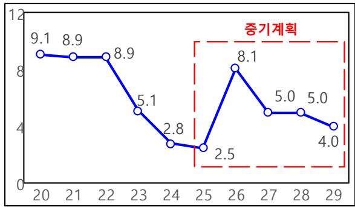
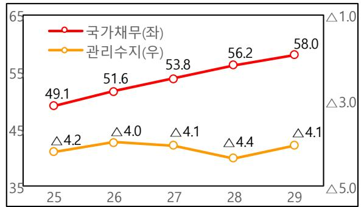
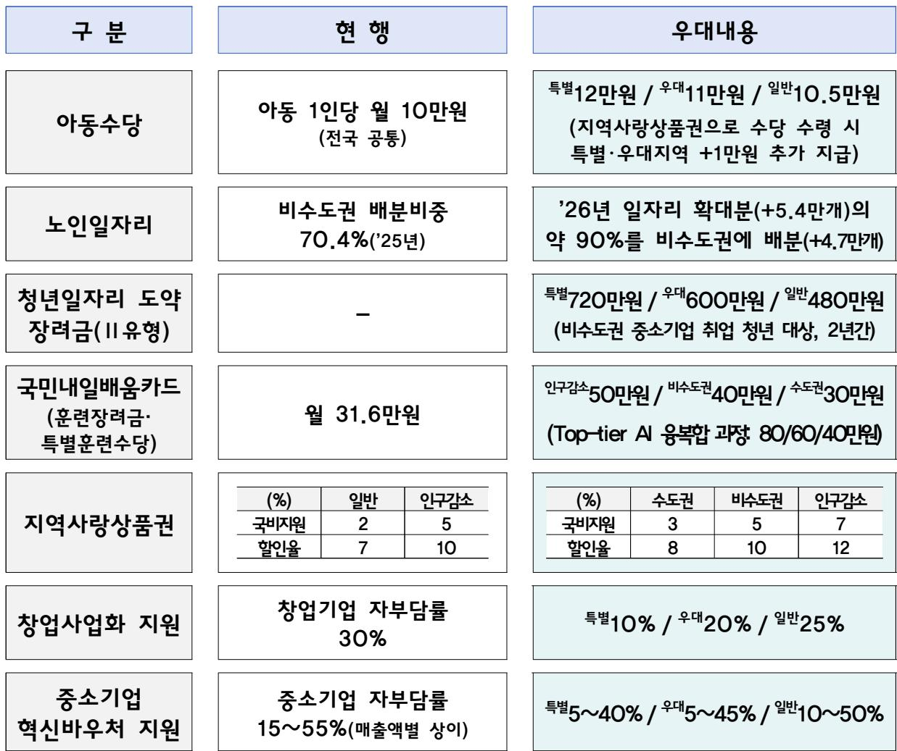
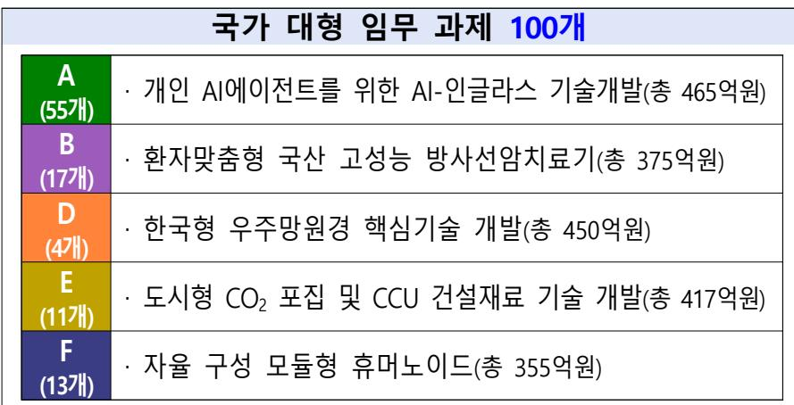

# “ 회복과 성장을 위한 2026년 예산안

2025. 8.

## 순 서

Ⅰ. 기본방향  
Ⅱ. 예산안 전체모습 2  
Ⅲ. 재정 혁신 5  
Ⅳ. 중점 투자방향 ··· 8  
1. 기술이 주도하는 초혁신경제  
2. 모두의 성장, 기본이 튼튼한 사회  
3. 국민안전, 국익 중심의 외교·안보  
(별첨) 분야별 투자방향 ······40

## Ⅰ. 기본방향

◇ 이재명 정부가 편성한 첫 예산안 : 새정부 핵심과제 충실히 반영

적극적인 재정운용을 통해 경제 선순환 구조 정착

高성과에 집중투자하고, 低성과는 구조조정 → 성과 중심 재정운용

##  선도경제로 대혁신을 위해 재정을 보다 적극적으로 운용

ㅇ AI 대전환 시대에 선도국가 도약의 마지막 골든타임,초혁신 선도경제로 대혁신을 위해 재정의 적극적 역할 강화

ㅇ ｢적극재정 → 경제성장 → 지속가능 재정｣의 선순환 구조 정착

##  초혁신경제, 주요 핵심과제 등 高성과 부문에 전략적 재정투자

ㅇ 우리 경제의 ‘대혁신’을 이끌 AI 대전환, 신산업 혁신,지방거점성장 등 초혁신아이템을 발굴하여 집중 투자

ㅇ 새정부 주요 핵심과제\*는 충실하게 반영하여 국정철학 뒷받침

\* 아동수당 확대, 청년미래적금, 농어촌 기본소득, 국민성장펀드 조성 등

ㅇ 따뜻한 공동체 구축을 위한 사회적약자 지원, 국민안전에도 중점

##  低성과 부문에 대해서는 강도 높은 구조조정 추진

ㅇ 모든 재량지출 사업에 대한 전면 재검토를 통해 낭비성ㆍ관행적 지출을 과감히 구조조정하고, 핵심과제에 재투자

ㅇ 의무지출도 경제·사회구조 변화 감안하여 제도를 개편하고,반복·부정수급 등 지출누수 최소화

## Ⅱ. 예산안 전체모습

## □ [총수입] 전년 대비 3.5% 증가한 674.2조원 [+22.6조원]

ㅇ 국세수입은 내수 중심의 경기회복, 세수확보 노력 등으로’25년 대비 +7.8조원 증가(’25년 본예산 382.4 → ’26년안 390.2조원)

\* 세입경정(△10.3조)을 고려한 ’25년 추경 대비로는 +18.1조 증가(+4.9%)

ㅇ 세외수입은 사회보장성기금 수입 증가 등으로 +14.8조원증가(’25년 본예산 269.1 → ’26년안 283.9조원)

## □ [총지출] 전년 대비 8.1% 증가한 728.0조원 [+54.7조원]

ㅇ 재정이 마중물 역할로 성장과 회복을 뒷받침하기 위해 총지출증가율 대폭 상향(’25년 본예산 2.5 → ‘26년안 8.1%)

ㅇ 초혁신경제, 사회적약자 지원 등 핵심과제에 중점 투자

< 2026년 재정운용 모습 >

(단위: 조원, %)

<table><tr><td rowspan="2"></td><td colspan="2">&#x27;25년</td><td rowspan="2">&#x27;26년 예산안(B)</td><td rowspan="2">증감(B-A)</td><td></td></tr><tr><td>본예산(A)</td><td>2회 추경</td><td>%</td></tr><tr><td>총수입 &gt;</td><td>651.6</td><td>642.4</td><td>674.2</td><td>+22.6</td><td>3.5</td></tr><tr><td>·국세수입</td><td>382.4</td><td>372.1</td><td>390.2</td><td>+7.8</td><td>2.0</td></tr><tr><td>세외수입</td><td>269.1</td><td>270.3</td><td>283.9</td><td>+14.8</td><td>5.5</td></tr><tr><td>총지출 &gt;</td><td>673.3</td><td>703.3</td><td>728.0</td><td>+54.7</td><td>8.1</td></tr><tr><td>·예산</td><td>447.4</td><td>467.3</td><td>481.5</td><td>+34.1</td><td>7.6</td></tr><tr><td>.기금</td><td>225.9</td><td>235.9</td><td>246.5</td><td>+20.6</td><td>9.1</td></tr></table>

## □ [수지·채무] 관리재정수지 △4.0%, 국가채무 51.6%

ㅇ 통합재정수지는 GDP 대비 △2.0%이며,

관리재정수지는 전년대비 적자 폭이 △1.2%p 상승한 △4.0%

ㅇ 국가채무(GDP 대비)는 전년대비 3.5%p 증가한 51.6%

(단위: 조원, %)

<table><tr><td rowspan=2 colspan=1></td><td rowspan=1 colspan=2>&#x27;25년</td><td rowspan=2 colspan=1>&#x27;26년 예산안(B)</td><td rowspan=2 colspan=1>증감(B-A)</td></tr><tr><td rowspan=1 colspan=1>본예산(A)</td><td rowspan=1 colspan=1>2회 추경</td></tr><tr><td rowspan=1 colspan=1>통합재정수지(GDP 대비)</td><td rowspan=1 colspan=1>21.7(0.8)</td><td rowspan=1 colspan=1>60.8(2.3)</td><td rowspan=1 colspan=1>53.8(2.0)</td><td rowspan=1 colspan=1>32.1(1.1%p)</td></tr><tr><td rowspan=1 colspan=1>&lt;관리재정수지(GDP 대비)</td><td rowspan=1 colspan=1>73.9(2.8)</td><td rowspan=1 colspan=1>∆111.6(4.2)</td><td rowspan=1 colspan=1>109.0(4.0)</td><td rowspan=1 colspan=1>∆35.1(1.2%p)</td></tr><tr><td rowspan=1 colspan=1>&gt;국가채무</td><td rowspan=1 colspan=1>1,273.3</td><td rowspan=1 colspan=1>1,301.9</td><td rowspan=1 colspan=1>1,415.2</td><td rowspan=1 colspan=1>+141.8</td></tr><tr><td rowspan=1 colspan=1>(GDP 대비)</td><td rowspan=1 colspan=1>(48.1)</td><td rowspan=1 colspan=1>(49.1)</td><td rowspan=1 colspan=1>(51.6)</td><td rowspan=1 colspan=1>(+3.5%p)</td></tr></table>

## □ [중기계획] 국가채무 \`29년 GDP대비 50% 후반 수준으로 관리

ㅇ 관리재정수지는 GDP 대비 △4% 수준,

총지출 증가율은 경상성장률 수준으로 점진적 축소

ㅇ 국가채무(GDP 대비)는 ’29년 50% 후반 수준으로 관리

< 총지출 증가율(전년대비 %) >  
  
\* 본예산 기준

< 중기 국가채무·관리수지(GDP 대비 %) >  
  
\* ‘25년은 2차추경 기준

## < 분야별 재원배분 모습 >

(조원)

<table><tr><td rowspan=1 colspan=1>구    분</td><td rowspan=1 colspan=1>&#x27;25년본예산(A)</td><td rowspan=1 colspan=1>&#x27;26년예산안(B)</td><td rowspan=1 colspan=1>증감(B-A)</td><td rowspan=1 colspan=2>증감률</td></tr><tr><td rowspan=1 colspan=1>총지출</td><td rowspan=1 colspan=1>673.3</td><td rowspan=1 colspan=1>728.0</td><td rowspan=1 colspan=1>54.7</td><td rowspan=1 colspan=2>8.1</td></tr><tr><td rowspan=1 colspan=1>1.보건·복지·고용</td><td rowspan=1 colspan=1>248.7</td><td rowspan=1 colspan=1>269.1</td><td rowspan=1 colspan=1>20.4</td><td></td><td rowspan=1 colspan=1>8.2</td></tr><tr><td rowspan=1 colspan=1>2.교육(교부금 제외)</td><td rowspan=1 colspan=1>98.5(26.2)</td><td rowspan=1 colspan=1>99.8(28.2)</td><td rowspan=1 colspan=1>1.4(2.0)</td><td rowspan=1 colspan=2>1.4(7.5)</td></tr><tr><td rowspan=1 colspan=1>3.문화·체육·관광</td><td rowspan=1 colspan=1>8.8</td><td rowspan=1 colspan=1>9.6</td><td rowspan=1 colspan=1>0.8</td><td></td><td rowspan=1 colspan=1>8.8</td></tr><tr><td rowspan=1 colspan=1>4.환경</td><td rowspan=1 colspan=1>13.0</td><td rowspan=1 colspan=1>14.0</td><td rowspan=1 colspan=1>1.0</td><td></td><td rowspan=1 colspan=1>7.7</td></tr><tr><td rowspan=1 colspan=1>5. R&amp;D</td><td rowspan=1 colspan=1>29.6</td><td rowspan=1 colspan=1>35.3</td><td rowspan=1 colspan=1>5.7</td><td rowspan=1 colspan=2>19.3</td></tr><tr><td rowspan=1 colspan=1>6.산업·중소기업·에너지</td><td rowspan=1 colspan=1>28.2</td><td rowspan=1 colspan=1>32.3</td><td rowspan=1 colspan=1>4.1</td><td rowspan=1 colspan=1></td><td rowspan=1 colspan=1>14.7</td></tr><tr><td rowspan=1 colspan=1>7.SOC</td><td rowspan=1 colspan=1>25.4</td><td rowspan=1 colspan=1>27.5</td><td rowspan=1 colspan=1>2.0</td><td rowspan=1 colspan=1></td><td rowspan=1 colspan=1>7.9</td></tr><tr><td rowspan=1 colspan=1>8.농림·수산·식품</td><td rowspan=1 colspan=1>25.9</td><td rowspan=1 colspan=1>27.9</td><td rowspan=1 colspan=1>2.0</td><td rowspan=1 colspan=1></td><td rowspan=1 colspan=1>7.7</td></tr><tr><td rowspan=1 colspan=1>9.국방</td><td rowspan=1 colspan=1>61.2</td><td rowspan=1 colspan=1>66.3</td><td rowspan=1 colspan=1>5.0</td><td rowspan=1 colspan=1></td><td rowspan=1 colspan=1>8.2</td></tr><tr><td rowspan=1 colspan=1>10.외교·통일</td><td rowspan=1 colspan=1>7.7</td><td rowspan=1 colspan=1>7.0</td><td rowspan=1 colspan=1>∆0.7</td><td rowspan=1 colspan=2>∆9.1</td></tr><tr><td rowspan=1 colspan=1>11.공공질서·안전</td><td rowspan=1 colspan=1>25.0</td><td rowspan=1 colspan=1>27.2</td><td rowspan=1 colspan=1>2.2</td><td rowspan=1 colspan=2>8.8</td></tr><tr><td rowspan=1 colspan=1>12.일반·지방행정</td><td rowspan=1 colspan=1>110.7</td><td rowspan=1 colspan=1>121.1</td><td rowspan=1 colspan=1>10.4</td><td rowspan=1 colspan=1></td><td rowspan=1 colspan=1>9.4</td></tr><tr><td rowspan=1 colspan=1>(교부세 제외)</td><td rowspan=1 colspan=1>(43.6)</td><td rowspan=1 colspan=1>(51.7)</td><td rowspan=1 colspan=1>(8.1)</td><td rowspan=1 colspan=2>(18.6)</td></tr></table>

## Ⅲ. 재정 혁신

1

## 지출 구조조정

□ (실적) 역대 최대인 △27조원 수준을 절감하여 핵심과제에 재투자

\* 지출구조조정 실적(조원): (‘22) △12.8 (’23) △24.1 (‘24) △22.7 (’25) △23.9

□ (특징) 사업 재구조화 적극 추진, 경상비·의무지출 절감 병행

➊ 단순 감액을 넘어 사업 전반에 대한 재구조화 추진

➋ 사업비 외에도 연례적 행사·홍보, 행정경비 등 경상비에 대한구조조정도 추진하여 공공부문 효율화 도모

➌ 중장기 재정 효율성 제고를 위해 의무지출 제도개선도 병행

➍ 국민참여플랫폼을 통한 국민들의 제안 적극 반영

<table><tr><td rowspan=1 colspan=1></td><td rowspan=1 colspan=1>주요 사례</td></tr><tr><td rowspan=1 colspan=1>1경상비</td><td rowspan=1 colspan=1>√공무원 출장 최소화 및 회의·교육 비대면 전환 등 효율화√연례적 행사·홍보성 경비 절감(약 스500억원)</td></tr><tr><td rowspan=1 colspan=1>2사업비</td><td rowspan=1 colspan=1>√단기간 급증한 ODA사업 정상화 및 저성과·중복사업 정비 등(스1.6조원)√좀비·우량 중소기업 금융지원 축소(스0.7조원)→유망기업 집중 지원√비도전적 소규모 수탁과제 감축(스0.5조원)→국가임무 대형 과제로 전환</td></tr><tr><td rowspan=1 colspan=1>3의무지출</td><td rowspan=1 colspan=1>√교육세 배분구조를 개편하여 고등교육 및 영유아 교육·보육에 재투자√반복수급자 대상 재취업(구직)활동 인정기준 강화→도덕적해이 최소화</td></tr><tr><td rowspan=1 colspan=1>4국민제안</td><td rowspan=1 colspan=1>√대학일자리플러스센터 참여수당 조정(시간→활동별)→취업지원 내실화√장병수요 감안,병영독서용 종이책 절감→전자책,AI 교육에 재투자</td></tr></table>

## 재정사업 지방우대

□ (시범사업 추진) 아동수당 등 7개 주요 재정사업에 인구감소,지역낙후도 등을 반영한 지방우대 원칙 시범 도입

ㅇ 비수도권 167개 시군구를 특별지원･우대지원･일반지역 3단계 구분

• (특별지원) 농어촌 인구감소지역(84개) 중 균형발전 하위지역(58개), 예타 낙후도평가하위 지역(58개)에 공통으로 해당하는 40개 시･군

• (우대지원) 특별지원지역에 해당하지 않는 농어촌 인구감소지역 44개 시･군

ㅇ 사업 특성에 따라 수혜자 지원금 인상(예: 특별20%/우대10%/일반5%),사업 물량 추가 배분, 자부담률 인하 등 지역별 지원 차등화

(통합지표 개발) 지역발전 수준을 객관적으로 진단할 수 있는 통합지표를 마련하고, 이를 토대로 ’27년부터 지방우대 사업 순차 확대

## 지방 자율성 제고

(포괄보조) 지방 여건에 맞게 자율적으로 편성하는 포괄보조규모를 ’25년 3.8 → ’26년 10.6조원으로 3배 정도 대폭 확대

ㅇ 지역적 사업 74개(47→121개, 5.7조원)를 이관하고, 안정적 재원마련 및 자율성 제고를 위해 1조원 투자재원 추가

\* (예) 도시재생, 하수관로 등 지역 기반시설 정비, 로컬문화관광단지 조성 등

ㅇ 과소투자 우려 등이 제기되는 사업에 대해서는별도 한도 지정(예) 노인일자리, 숲가꾸기, 경로당 등 6개 사업)

□ (초광역권) 초광역권 단위로 수행시 지역간 특화산업 연계,자원 공동활용 등 시너지 창출이 가능한 사업에 인센티브 부여\* (’26년) 사업설계를 위한 사업기획비 반영 → (’27년\~) 본격적으로 추진

## 성과지향 출연연구기관 개편

□ (과기계) 소규모 수탁과제(1,877개, 4,685억원) 지원 방식을 폐지하고,국가 대형 임무 과제(100개)에 집중 투자

ㅇ 전담평가센터를 통해 성과를 예산으로 환류하고,사업 목표 조기 달성시 잔여사업비를 성과급으로 지급

‘25년 종료소규모 과제1,877개(각 2\~3억원)

(인문사회계) 기관 본연의 연구에 집중하고 부처 정책 수요를충분히 반영 → ➀수탁과제 최소화, ➁부처 의견수렴 의무화

## Ⅳ. 중점 투자방향

## 1. 기술이 주도하는 초혁신경제 (51→72조원, +41%)

##  AI 3강을 위한 대전환 (3.3→10.1조)

· 신규피지컬 AI 중점사업 추진 0.5조

· 신규AX-Sprint 300(생활밀접형) 0.9조

· 국내 핵심 인재 1.1만명 양성 등 0.6조

· GPU 1.5만장 구매 2.1조

##  신산업·R&D 혁신 (36.4→44.3조)

· R&D 역대 최대 증가(+19.3%) 35.3조

\* A·B·C·D·E·F 첨단기술 고도화(10.6조)

신규국민성장펀드(100조원 이상) 1.0조

· 모태펀드 역대 최대 출자 1.0→2.0조

 통상현안대응·수출 지원 (1.6→4.3조)

· 조선 MRO 등 글로벌 협력 강화 0.1조

· 수출바우처 대폭 확대 0.2조

##  에너지 전환·탄소중립 (6.0→7.9조)

· 신규RE100 산단, 신규분산형 전력망 0.3조

· 신재생에너지 보조·융자 확대 0.5→0.9조

· 신규전기차 전환지원금(최대 100만원) 0.2조

##  글로벌 문화강국 조성 (4.2→5.7조)

· 한류연계 붐업 3.2조

· 콘텐츠 정책금융 확대 0.5조

## 2. 모두의 성장, 기본이 튼튼한 사회 (144→175조원, +22%)

##  지방거점성장 (19.0→29.2조)

· 거점국립대 집중 육성 0.9조

· 지역 주력산업 육성 지원 0.5조

신규농어촌 기본소득 시범사업(6개 군) 0.2조

· 지역‧필수‧공공 의료 확대 1.1조

##  저출생·고령화 대응 (62.6→70.4조)

· 아동수당 연령 상향(+1세) 및 지방 우대 2.5조

신규청년미래적금(납입금 6/12% 매칭) 0.7조

· 신규비수도권 취업청년 우대 0.9조

· 신규어르신 지역사회 통합돌봄 0.1조

 촘촘한 사회안전매트 (29.2→32.1조)

· 기초생활보장 확대 22.5조

· 장애인 돌봄·일자리 확대 4.6조

· 자살 고위험군 치료비·상담 지원 등 0.1조

##  민생·사회연대경제 (17.6→26.2조)

· 지역사랑상품권 24조원 발행 지원 1.2조

· 소상공인 경영안정바우처(25만원) 0.6조

· 사회연대경제 기반 조성 0.2조

##  산재예방·취약노동자 보호(16.0→17.6조)

· 산업재해 예방 필수설비·인력 지원 0.3조

· 도산사업장 체불임금 대지급 확대 0.7조

## 3. 국민안전, 국익 중심의 외교·안보 (25→30조원, +18%)

 재난 예측·예방·대응(3.9→5.8조)

· 풍수해정비 등 재난 대응 2.6 → 3.3조

· 신규한국형 기상 예측 시스템 등 276억

 첨단국방, 한반도 평화(21.2→23.8조)

· 최첨단 무기체계로 전환 3.2조

· 남북협력기금 확대 0.8 → 1.0조

<table><tr><td>1AI 3강 도약을 위한 대전환 3.3→10.1조원</td></tr></table>

【 AX 】 “산업·생활·공공 전분야 AI 도입” 0.5→2.6조원

ㅇ (산업) 피지컬 AI 선도 국가 달성을 위해 국내의 우수한 제조 역량·데이터를 활용하여 중점사업 집중 투자(0.5조원, 5년간 6조원)

\* 주요 중점사업은 예비타당성조사 면제를 통해 신속하게 추진

- 로봇, 자동차, 조선, 가전·반도체, 팩토리 등 주요 산업분야를 중심으로 AI 대전환 선도

<table><tr><td rowspan=1 colspan=3>주요 내용                                   사업 예시</td></tr><tr><td rowspan=1 colspan=1>·AI로봇</td><td rowspan=1 colspan=1>√휴머노이드 로봇용 AI 모델·플랫폼,로봇 핵심부품 개발·상용화</td><td rowspan=1 colspan=1>·글로벌 AX혁신 기술개발(총사업비 5,510억원)</td></tr><tr><td rowspan=1 colspan=1>·AI자동차</td><td rowspan=1 colspan=1>√완전자율주행 자동차 상용화,자율주행 기반 교통서비스 도입</td><td rowspan=1 colspan=1>·AX 실증밸리 조성(총사업비 6,000억원)</td></tr><tr><td rowspan=1 colspan=1>·AI조선</td><td rowspan=1 colspan=1>√스마트항해시스템·기관시스템 무인화,AI 기반 항로표지 설치 등</td><td rowspan=1 colspan=1>완전자율운항선박기술 개발(총사업비 약 6,000억원,잠정)</td></tr><tr><td rowspan=1 colspan=1>·AI가전·반도체</td><td rowspan=1 colspan=1>√TV.냉장고,지능형 홈서비스 등글로벌 AI 가전·홈 시장 선점</td><td rowspan=1 colspan=1>·온디바이스 AI 반도체 개발(총사업비 9,973억원)</td></tr><tr><td rowspan=1 colspan=1>·AI 팩토리</td><td rowspan=1 colspan=1>√제조 데이터 수집·가공,업종별특화 AI 솔루션 보급·도입</td><td rowspan=1 colspan=1>·피지컬 AI 기반 자율제조(총사업비2조원)</td></tr></table>

- 지역 특화산업과 연계한 피지컬 AI 지역거점 조성 및 대규모AX R&D·실증 추진을 통해 AI 기반 지역 혁신 촉진

• (광주) 에너지‧모빌리티 AX(’26년 240억원) • (대구) 로봇‧바이오 AX(’26년 198억원)

• (경남) AI 기반 기계‧부품 가공(’26년 400억원) • (대전) 버티컬AI 대전환(’26년 1,594억원)

• (전북) AI 팩토리 테스트베드(’26년 400억원) • (부울경) 해양‧항만 AX(’26년 370억원) 등

ㅇ (생활) 제조, 바이오헬스, 주택·물류 등 생활밀접형 제품 300개의신속한 AI 적용을 지원하는 “신규AX-Sprint 300” 추진(0.9조원)\* (예) 자동음향조절 마이크, 피부분석·화장품 추천 거울, 신생아 울음소리 분석 등

• (개요) 총 10개 부처\* 참여, 제품별 10\~40억원 출연‧보조 + 2,000억원 융자\* 산업부, 중기부, 과기부, 복지부, 농림부, 환경부, 국방부, 해수부, 국토부, 식약처

• (유형) Type1 : 즉시 개발 가능하며 시장에 빠르게 침투(145개, 기간 1년)

Type2 : 국민 활용도가 높고, 시장 파급력이 큰 품목(155개, 기간 2년)

ㅇ (공공) 공공 AX 프로그램 확대 및 복지·고용, 납세, 신약심사 등3대 선도프로젝트를 중심으로 공공부문 AI 도입·확산(0.2조원)

<table><tr><td rowspan=1 colspan=2>구분(&#x27;26년안)                                           주요 사업</td></tr><tr><td rowspan=1 colspan=1>·공공 AX 프로그램(1,000억원,공모)</td><td rowspan=1 colspan=1>·(Track 1)2년간 30억원 × 40개(20개 계속 +20개 신규)·(Track 2)2년간100억원 ×5개(신규)</td></tr><tr><td rowspan=1 colspan=1>·대국민 편의 제고(370억원)</td><td rowspan=1 colspan=1>·AI 기반 맞춤형 복지·고용서비스 실시간 추천(총 355억원)·세무상담, 납부신청 자동화 등 납세편의 제고(총 0.1조원)</td></tr><tr><td rowspan=1 colspan=1>·국민안전·재난대응(239억원)</td><td rowspan=1 colspan=1>·AI 기반 과학적 순찰 등 경찰 현장 대응력 강화(총 64억원)·실시간 AI 화선 탐지 등 효율적 산불 진화체계 구축(총 30억원)</td></tr><tr><td rowspan=1 colspan=1>·편리한 기업환경 조성(194억원)</td><td rowspan=1 colspan=1>·AI 활용을 통한 신약허가 심사기간 단축(총 201억원)·제조데이터 A분석을 통한 공정관리·예측 등 지원(총 180억원)</td></tr></table>

- 대규모 NPU 테스트베드 확대(2→3개) 및 단계별 사업화 지원,신규공공 CCTV AI 전환 등 국산 NPU 수요 창출(0.1조원)

(단위: 억원)

<table><tr><td rowspan=1 colspan=1></td><td rowspan=1 colspan=1>&#x27;25년</td><td rowspan=1 colspan=1>&#x27;26안</td><td rowspan=1 colspan=1>비고</td></tr><tr><td rowspan=1 colspan=1>-피지컬 AI 중점 사업</td><td rowspan=1 colspan=1></td><td rowspan=1 colspan=1>4,862</td><td rowspan=1 colspan=1>·로봇·자동차·조선·가전·팩토리 등</td></tr><tr><td rowspan=1 colspan=1>-공공AX프로그램</td><td rowspan=1 colspan=1>(추경150)</td><td rowspan=1 colspan=1>1,000</td><td rowspan=1 colspan=1>·45개 사업 AX 추진</td></tr><tr><td rowspan=1 colspan=1>-공공 선도 프로젝트</td><td rowspan=1 colspan=1>111</td><td rowspan=1 colspan=1>803</td><td rowspan=1 colspan=1>·고용·복지,납세,신약심사 등</td></tr><tr><td rowspan=1 colspan=1>- AX-Sprint 300</td><td rowspan=1 colspan=1></td><td rowspan=1 colspan=1>8,920</td><td rowspan=1 colspan=1>생활밀접형 300개 제품 AX(출연·보조 6,920억원 +융자2,000억원)</td></tr></table>

ㅇ (인재양성) AI 경쟁력 강화를 위한 국내 고급인재 양성 확대,세대별 맞춤형 교육 등 전국민 AI시대 개막

- AI·AX 대학원(19→24개교), 생성형 AI 선도 연구과제\*(5→13개)확대로 국내 고급인재 1.1만명 양성

\* 석·박사 재학생을 대상으로 국내·외 생성AI 기업과 국내 대학과의 공동연구 지원

- 청년인재 육성을 위해 기존 교육을 AI 중심으로 전환하여대폭 확대\*(410→1,650명)하고, Top-tier\*\* 등 직업훈련 과정 신설

\* AI·이노아카데미(300→1,200명), AI마에스트로(110→450명) + 우수학생 해외 연수(80명)

\*\* 기업협력형 AI융합 직업훈련 프로그램 +1만명(기존유형 전환 0.6+신규 0.4)

- AI 교육과정을 개발하여 온·오프라인 교육센터를 통해 확산하고, 자격제도 신설, 경진대회 개최 등 AI Boom-up 추진

<table><tr><td rowspan=1 colspan=1>대상</td><td rowspan=1 colspan=1>초·중·고</td><td rowspan=1 colspan=1>대학생</td><td rowspan=1 colspan=1>연구자·전문가</td><td rowspan=1 colspan=1>청년·전국민</td></tr><tr><td rowspan=1 colspan=1>On-Off 거점</td><td rowspan=1 colspan=4>4대 과기원, AI테스트베드, A라운지,AI배움터 등</td></tr><tr><td rowspan=1 colspan=1>프로그램</td><td rowspan=1 colspan=1>EBS</td><td rowspan=1 colspan=1>비전공생활용교육</td><td rowspan=1 colspan=1>심화교육</td><td rowspan=1 colspan=1>직업훈련,군장병</td></tr><tr><td rowspan=1 colspan=1>·경진대회·관련행사</td><td rowspan=1 colspan=1>A창작대회,로보틱스챌린지</td><td rowspan=1 colspan=1>AI루키</td><td rowspan=1 colspan=1>AI챔피언</td><td rowspan=1 colspan=1>공모전퀴즈톡톡페스티벌</td></tr></table>

ㅇ (인프라) 최신 고성능 GPU 구매, 전주기(데이터·GPU·클라우드 등)바우처 지급, 데이터 개방·활용 지원 등 필수 인프라 조성

- (GPU) 고성능 GPU 1.5만장을 추가 구매하여, 5만장 확보목표(정부 3.5만 + 민간 SPC 1.5만) 중 정부구매분 조기 달성

- (바우처) 서비스 개발을 위한 신규통합바우처(20개사)를 제공하고,기존 소규모 데이터·클라우드·GPU 바우처도 지속 지원(0.1조원)

- (클라우드) 신규국립·지방의료원 시스템의 AI-SaaS 개발 사업을신설(150억원)하는 등 클라우드 가속화 추진

- (데이터) 학습용 데이터를 통합·개방하는 “신규클러스터\*(300억원)”및 분야별 데이터 공유·거래 플랫폼 “신규스페이스\*\*(120억원)” 구축

\* 바우처 등으로 확보된 데이터, 민간·공공데이터를 AI 학습용으로 전환·공개\*\* 표준·규칙에 따라 신뢰할 수 있는 방식으로 데이터를 공유·거래할 수 있는 플랫폼

ㅇ (연구기반) 신규AGI 준비 프로젝트, 신규피지컬AI 선도기술,신규버티컬AI 연구지원센터(NAIS) 등 미래 AI 연구기반 조성

- (AGI) 민간 중심의 세계 최고 수준 연구기업(SPC) 출자

- (피지컬AI) 제조·물류 등 全분야에 활용가능한 선도기술 개발

- (버티컬AI) 단기간 내 특화 모델 확보를 위해 연구센터를설립\*하여, 7대 도메인\*\* AX에 필수적인 버티컬AI 개발

\* 국가과학기술연구회(NST) 부설 독립연구센터(대덕 본원/부산 센터 포함) 구성

\*\* A(Quantum+Base AI), B(AI+Bio), C(AI+Culture), D(AI+Defence), E(AI+Energy+Material), F(AI+Factory+Mobility), G(AI+Green Intelligent Marine Technology)

주요 내용
<table><tr><td rowspan=1 colspan=1>·AGI(범용인공지능)</td><td></td><td rowspan=1 colspan=1>·AGI 시대 준비를 위한 민간주도형 SPC 출자</td><td></td><td rowspan=1 colspan=1>200억원</td></tr><tr><td rowspan=1 colspan=1>·피지컬AI</td><td></td><td rowspan=1 colspan=1>·제조업,물류,서비스 등 조분야에 활용 가능한초적응·초성능 피지컬AI 선도기술 개발</td><td></td><td rowspan=1 colspan=1>150억원</td></tr><tr><td rowspan=1 colspan=1>·버티컬A</td><td></td><td rowspan=1 colspan=1>·국가과학기술연구회(NST)부설 버티컬AI연구지원(NAIS)를 신설하여 7대 도메인 버티컬 AI 개발</td><td></td><td rowspan=1 colspan=1>400억원</td></tr></table>

ㅇ (자금지원) AI 혁신펀드(0.1조원), 딥테크· I펀드(0.3조원) 조성등을 통해 AI 분야 혁신기업 창업 활성화 지원

(단위: 억원)

<table><tr><td rowspan=1 colspan=1></td><td rowspan=1 colspan=1>&#x27;25년</td><td rowspan=1 colspan=1>&#x27;26안</td><td rowspan=1 colspan=1>비고</td></tr><tr><td rowspan=1 colspan=1>ㅇ인력 확보</td><td rowspan=1 colspan=1>0.7조</td><td rowspan=1 colspan=1>1.4조</td><td rowspan=1 colspan=1></td></tr><tr><td rowspan=1 colspan=1>-AIAX대학원</td><td rowspan=1 colspan=1>335(추경100)</td><td rowspan=1 colspan=1>610</td><td rowspan=1 colspan=1>·19→24개 확대</td></tr><tr><td rowspan=1 colspan=1>-AI 마에스트로</td><td rowspan=1 colspan=1>78</td><td rowspan=1 colspan=1>277</td><td rowspan=2 colspan=1>·AI 교육 참여수당 지급(100만원/월) 및해외연수 제공 등</td></tr><tr><td rowspan=1 colspan=1>-AI·이노아카데미</td><td rowspan=1 colspan=1>51</td><td rowspan=1 colspan=1>451</td></tr><tr><td rowspan=1 colspan=1>ㅇ인프라·연구기반 조성</td><td rowspan=1 colspan=1>1.9조</td><td rowspan=1 colspan=1>5.4조</td><td rowspan=1 colspan=1></td></tr><tr><td rowspan=1 colspan=1>-고성능 GPU 구입</td><td rowspan=1 colspan=1>-(경14,608)</td><td rowspan=1 colspan=1>20,841</td><td rowspan=1 colspan=1>·1.5만장 추가 구매(&#x27;25년 추경 1.0만장)</td></tr><tr><td rowspan=1 colspan=1>신규AX통합바우처등</td><td rowspan=1 colspan=1></td><td rowspan=1 colspan=1>898</td><td rowspan=1 colspan=1>기업당2년간30억원지원등</td></tr><tr><td rowspan=1 colspan=1>신규AGI준비프로젝트</td><td rowspan=1 colspan=1></td><td rowspan=1 colspan=1>200</td><td rowspan=1 colspan=1>AGI준비를위한 SPC 출자</td></tr><tr><td rowspan=1 colspan=1>신규버티컬A연구지원센터</td><td rowspan=1 colspan=1>-</td><td rowspan=1 colspan=1>400</td><td rowspan=1 colspan=1>핵심분야 버티컬 AI 개발·최적화</td></tr><tr><td rowspan=1 colspan=1>ㅇ자금지원 등</td><td rowspan=1 colspan=1>0.1조</td><td rowspan=1 colspan=1>0.7조</td><td rowspan=1 colspan=1></td></tr><tr><td rowspan=1 colspan=1>-AI 혁신펀드</td><td rowspan=1 colspan=1>450</td><td rowspan=1 colspan=1>1,000</td><td rowspan=1 colspan=1>민간투자 유도 AI기업 전용펀드 출자</td></tr><tr><td rowspan=1 colspan=1>-딥테크·AI펀드</td><td rowspan=1 colspan=1>–(추경1,500)</td><td rowspan=1 colspan=1>2,750</td><td rowspan=1 colspan=1>·답테크·AI기업 중심 전용펀드 출자</td></tr></table>

 R&D 확대, 유망기업 스케일업으로 신산업 혁신 36.4→44.3조원

## 【 R&D 】“역대 최대 수준인 19.3% 증가” 29.6→35.3조원

ㅇ (첨단기술) A·B·C·D·E·F 첨단산업 분야별 핵심 기술개발에

적극적으로 투자하여 R&D 성과 가시화 촉진(8.0→10.6조원)

• (A, AI) 피지컬 AI 5대 선도사업, K-온디바이스 AI 반도체 기술개발(1.1→2.2조원)

• (B, 바이오) 국가 통합 바이오 빅데이터, AI 모델 활용 항체 개발·실증(1.3→1.6조원)

• (C, 콘텐츠) AI 콘텐츠 제작기술 개발, IP기획 창작기술 개발(0.1→0.2조원)

• (D, 방산) 보라매(KF21), L-SAM-Ⅱ, 핵심부품 국산화 및 국산 엔진 개발(3.1→3.9조원)

• (E, 에너지) SiC반도체, 태양광유리, LNG 화물창 등 핵심기술 개발·상용화(2.2→2.6조원)

• (F, 제조) 특수탄소강 기술개발, 국가 로봇 테스트필드(0.4→0.5조원)

- 스마트팜·피셔리 등 이상기후 대응을 위한 R&D 확대(0.7→1.0조)

ㅇ (민간연계) TIPS, 사업화보증 등 민간 수요 기반의 기술사업화

• (TIPS) 지원 금액(일반 5→8억원, 스케일업 12→30억원) 및 기업(846→1,240개) 대폭 확대

• (사업화보증) 유망기업 대상 프로젝트 기반 신규R&D 사업화 보증(0.3조원 공급)

ㅇ (인재) 첨단인력 3.3만명 확보를 위한 3대 프로젝트 추진

• (국내인재 양성) 첨단분야 인재양성 확대(2.7→3.1만명), 산학공동연구 강화

• (해외인재 유치) 세계 최대 규모 해외인재 유치(640명, 5년간 2,000명)

• (우수인력 유출방지) 집단·개인연구 확대(과기원·일반대 700명, 신진연구 7→27개)이공계 연구생활장려금 확대(월 80/110만원), 신규박사우수 장학금(연 750만원) 등

ㅇ (연구기반) 지방·신진 연구자의 연구 지속성을 보장하기 위해신규풀뿌리 소액연구 신설(2천개) 등 기초연구 생태계 복원

(단위: 억원)

<table><tr><td rowspan=1 colspan=1></td><td rowspan=1 colspan=1>&#x27;25년</td><td rowspan=1 colspan=1>&#x27;26안</td><td rowspan=1 colspan=1>비고</td></tr><tr><td rowspan=1 colspan=1>-출연연(47개) 사업군</td><td rowspan=1 colspan=1>36,005</td><td rowspan=1 colspan=1>41,823</td><td rowspan=1 colspan=1>·국가 대형 임무 과제 100개 추진</td></tr><tr><td rowspan=1 colspan=1>-TIPS 사업군</td><td rowspan=1 colspan=1>6,412</td><td rowspan=1 colspan=1>11,064</td><td rowspan=1 colspan=1>·1,240개 기업에 최대 200억원 지원</td></tr><tr><td rowspan=1 colspan=1>-첨단인력 사업군</td><td rowspan=1 colspan=1>9,634</td><td rowspan=1 colspan=1>14,386</td><td rowspan=1 colspan=1>·첨단분야고급인재 2.7→3.3만명</td></tr><tr><td rowspan=1 colspan=1>-개인 기초연구</td><td rowspan=1 colspan=1>19,053</td><td rowspan=1 colspan=1>22,657</td><td rowspan=1 colspan=1>·1억원 미만 과제(0.5~0.8억원), 2천개</td></tr></table>

ㅇ (금융지원) 첨단전략산업 분야 육성을 위한 혁신금융 지원 강화

- 5년간 100조원 이상의 신규국민성장펀드를 신규 조성하여,

AI·반도체·바이오 등 미래전략산업에 대한 투자 확대

- 모태펀드 역대 최대 규모 출자(1.0→2.0조원) 및 전략적 투자

강화\*를 통해 유망 중소·벤처 기업의 스케일업 적극 뒷받침

\* 신규첨단산업 유니콘 육성(0.6조원), 재창업 기업 재도전(100→800억원) 등

- 첨단산업 특례보증을 확대(4.7→7.5조원)하여 혁신기업 자금 공급

ㅇ (혁신창업) 첨단산업 특화 트랙 신설, 국내외 오픈이노베이션 및

지역 창업인프라 확충 등 혁신 창업 생태계 활성화

- AI·딥테크 신규특화형 창업패키지\*(+175개), 신규유니콘 브릿지\*\*

사업(50개사) 신설 등 성장 단계별 맞춤형 지원 강화

\* AI·딥테크 유망기업 대상 사업화 자금 및 맞춤형 지원(300억원)

\*\* 100억원 이상 선투자 받은 유망기업에 특화지원, 특례보증 패키지(최대200억원)

- 대기업과 협업하는 오픈이노베이션을 확대(523→600개)하고,

스타트업파크(+2개), 공유공장(+2개) 등 지역 창업인프라 확충

ㅇ (기반확보) 신규반도체 첨단패키징 실증 인프라(85억원)를 조성하고,

신규이차전지 원자재·소재(59억원) 평가·실증으로 국내 공급망 강화

(단위: 억원)

<table><tr><td rowspan=1 colspan=1></td><td rowspan=1 colspan=1>&#x27;25년</td><td rowspan=1 colspan=1>&#x27;26안</td><td rowspan=1 colspan=1>비고</td></tr><tr><td rowspan=1 colspan=1>-국민성장펀드</td><td rowspan=1 colspan=1></td><td rowspan=1 colspan=1>10,000</td><td rowspan=1 colspan=1>5년간100조원 이상 편드 조성</td></tr><tr><td rowspan=1 colspan=1>-모태펀드 출자</td><td rowspan=1 colspan=1>9,896</td><td rowspan=1 colspan=1>19,997</td><td rowspan=1 colspan=1>첨단산업(0.6조원), 재도전(100→800억원)등</td></tr><tr><td rowspan=1 colspan=1>-창업패키지</td><td rowspan=1 colspan=1>1,538</td><td rowspan=1 colspan=1>1,624</td><td rowspan=1 colspan=1>·AI·답테크(신규175개), 투자연계(신규100개)</td></tr><tr><td rowspan=1 colspan=1>-민관협력 오픈이노베이션</td><td rowspan=1 colspan=1>730</td><td rowspan=1 colspan=1>842</td><td rowspan=1 colspan=1>·대기업(170→200개), 글로벌기업(353→400개)</td></tr><tr><td rowspan=1 colspan=1>반도체 첨단패키징 실증</td><td rowspan=1 colspan=1></td><td rowspan=1 colspan=1>85</td><td rowspan=1 colspan=1>·실증인프라 구축(&#x27;26~&#x27;30, 2개소)</td></tr></table>

## 【 통상대응 】“대미 관세협상 뒷받침” 0.03→2.1조원

(한·미협력) 산은·수은·무보 등 정책금융 패키지 지원을 통해조선·반도체 등 대미 관세협상 차질없이 뒷받침(1.9조원)

- 조선업 협력을 위해 신규한·미 기술협력센터를 설립하고,중소조선사의 신규함정 MRO 역량 강화 등 지원(708억)

(관세피해 지원) 관세로 인한 피해 분석, 물류비 등에 활용할 수있는 신규긴급지원바우처 제공(약 800개사)

(방산·조선) 중소조선사 대상 RG 특례보증을 2,000억원 공급하고, 방산수출기업 지원펀드 출자 확대(200→300억)

## 【수출지원】 “K-유통플랫폼 해외진출 지원 신설” 1.6→2.2조원

ㅇ (수출기반) 유망 내수기업에 마케팅·R&D 등을 통해 수출업체로집중 육성(신규K-수출스타 500)하고, 수출기업의 비용경감 지원

• (K-수출스타 500) 유망 내수 중소·중견기업에 마케팅·인증·R&D 등 지원(연 100개사)

• (수출바우처) 현지마케팅, 중소 테크·물류 바우처 등 지원물량 확대(4,690→6,394개)

• (인증·자금) 해외인증(605→630개사), 수출기업 글로벌화 자금(770→954개사)

신규유통기업 해외 진출로 유망 소비재 동반 수출도 촉진(500억원)

ㅇ (공급망) 첨단전략산업 핵심 품목을 생산하는 소부장 중소·중견기업에 투자보조금(30\~50%)을 지원하여 공급망 안정화 도모

- 핵심광물 확보를 위한 해외자원개발 융자 확대(390→710억원) 및신규핵심광물 재자원화 시설·장비 지원(38억원)

(단위: 억원)

<table><tr><td rowspan=1 colspan=1></td><td rowspan=1 colspan=1>&#x27;25년</td><td rowspan=1 colspan=1>&#x27;26안</td><td rowspan=1 colspan=1>비고</td></tr><tr><td rowspan=1 colspan=1>신규통상대응프로그램</td><td rowspan=1 colspan=1></td><td rowspan=1 colspan=1>19,000</td><td rowspan=1 colspan=1>산은·수은·무보 등 금융 패키지</td></tr><tr><td rowspan=1 colspan=1>신규긴급지원바우처</td><td rowspan=1 colspan=1></td><td rowspan=1 colspan=1>424</td><td rowspan=1 colspan=1>관세대응,물류비 등 지원바우처 신설</td></tr><tr><td rowspan=1 colspan=1>신규유통기업해외진출</td><td rowspan=1 colspan=1></td><td rowspan=1 colspan=1>500</td><td rowspan=1 colspan=1>.유통기업과 유망 소비재 동반수출 촉진</td></tr><tr><td rowspan=1 colspan=1>-소부장 투자보조금</td><td rowspan=1 colspan=1>-(추경700)</td><td rowspan=1 colspan=1>1,000</td><td rowspan=1 colspan=1>지원규모 확대(25추경700→1,000억원)</td></tr></table>

 에너지 전환, 탄소중립 가속화 뒷받침

6.0→7.9조원

## 【에너지 전환】“RE100 산단·차세대 전력망 구축” 2.8→4.2조원

ㅇ (신재생에너지) 기존 화석연료를 태양광·풍력 등 신재생에너지로전환하기 위해 발전설비 융자‧보조 대폭 확대(0.5→0.9조원)

- RE100 산단, 햇빛‧바람연금 융자지원을 강화(지원율 80→85%)

• (해상풍력) 대규모 사업자 저리융자(+800억원), 보증(+1,000억원) 확대

• (영농형태양광) 유휴농지 매입을 확대(+1,700ha, +0.7조원)하여, 설비투자 기반 확보

• (전환지원) 연탄보조금은 축소하되, 폐광지역 경제진흥사업(총사업비 1.1조원) 추진

(분산형 전력망) 전력계통 포화 지역의 안정성 강화를 위해신규ESS 설치비용을 지원하여 AI 분산형 전력망 구축(0.1조원)

- RE100 산단 조성에 필요한 신규전력망 선제 구축(250억원) 및신규마이크로그리드 실증으로 차세대 전력망 산업 육성(702억원)

## 【탄소중립】 “전기차 전환지원금 최대 100만원”3.1→3.7조원

ㅇ (산업지원) 온실가스 감축설비 도입 지원(201개사) 및 소규모사업장 측정기기 확충(0.7→1.7만개) 등으로 탄소감축 기반 조성

(보급확산) 신규전기차 전환지원금\*을 신설하고, 신규무공해차인프라 펀드(0.1조원)를 조성하는 등 무공해차 보급 촉진

\* 내연차를 폐차 또는 판매 후 전기차로 전환 시, 최대 100만원 지원

- 에너지자립, 기후 적응을 위한 공공건축물 리모델링 지원(0.2조원)

ㅇ (녹색금융) 저금리 융자·보증 등 8.8조원 수준의 정책금융을공급(0.8조원)하여 기업의 녹색 투자 활성화

(단위: 억원)

<table><tr><td rowspan=1 colspan=1></td><td rowspan=1 colspan=1>&#x27;25년</td><td rowspan=1 colspan=1>&#x27;26안</td><td rowspan=1 colspan=1>비고</td></tr><tr><td rowspan=1 colspan=1>신재생에너지금융지원</td><td rowspan=1 colspan=1>3,263</td><td rowspan=1 colspan=1>6,480</td><td rowspan=1 colspan=1>·RE100산단(120MM), 햇빛연금(100MW)등</td></tr><tr><td rowspan=1 colspan=1>신규RE100산단 전력망</td><td rowspan=1 colspan=1></td><td rowspan=1 colspan=1>250</td><td rowspan=1 colspan=1>·전력망 구축 촉진을 위해250억원 지원</td></tr><tr><td rowspan=1 colspan=1>무공해차보급</td><td rowspan=1 colspan=1>22,631</td><td rowspan=1 colspan=1>22,825</td><td rowspan=1 colspan=1>·.전기차 전환 지원금,구매융자 신설 등</td></tr><tr><td rowspan=1 colspan=1>-녹색금융 규모 확대</td><td rowspan=1 colspan=1>6,448</td><td rowspan=1 colspan=1>8,179</td><td rowspan=1 colspan=1>·융자·이차보전 등 정책금융 지원 강화</td></tr></table>

4.2→5.7조원

## 【K-컬처】 “K-컬처 확산 및 수출강화”

1.3→1.8조원

ㅇ (콘텐츠) 정책금융, 장르별 특화지원·인재양성, AI 활용 제작 등집중지원을 통해 콘텐츠산업 수출 확대 뒷받침(0.8→1.2조원)

• (정책금융) 문화분야 모태펀드, 전략·글로벌리그 펀드, 융자·보증 확대(0.3→0.5조원)

• (장르특화) OTT 특화 장편드라마(8→12편), 중예산영화 제작지원(9→18편)

• (인력양성) AI 특화 교육과정 신설(1,000명), 교육과정 융합운영 및 일괄 통합공고

• (제작지원) AI 기반 영화·애니·게임·방송·예술작품 등 제작 지원(17→150편)

ㅇ (예술) 뮤지컬·문학 등 해외진출 지원 및 정책금융 신설(250억원),순수창작자 지원 강화로 제2의 토니상·노벨문학상 적극 발굴

- 대형 공연장 임차·제작·공연(12편) 및 해외 시범 공연(13편)지원, 집필·번역·출판 문학 해외진출 패키지 추진(10편)

- 신규청년 창작자 지원\*(3,000명), 신규예술인 복지금고 신설(50억원) 및생활안정자금 지원 확대(180→280억원) 등 안정적 창작기반 조성

\* 작곡가, 희곡·미술작가 등 청년 예술가 대상 연 9백만원의 창작활동금 지원

(글로벌 K-컬처 허브) 산재된 해외문화 기관·사업 통폐합으로국외「문화 수출거점+협업·연계」시너지 극대화(0.2→0.3조원)

- 베트남 코리아센터 신축(90억원), 통합형 허브 확대(6→11개소) 등세계 주요도시 중심으로 문화 재외기관 거점 기지화

- 고품격 체험·전시 신규글로벌 홍보관 신설(11개), 콘텐츠·뷰티·푸드 등신규한류연계 융합 지원(319억원) 및 신규한국문화 적극 전파(봉사단 1천명)

(단위: 억원)

<table><tr><td rowspan=1 colspan=1></td><td rowspan=1 colspan=1>&#x27;25년</td><td rowspan=1 colspan=1>&#x27;26안</td><td rowspan=1 colspan=1>비고</td></tr><tr><td rowspan=1 colspan=1>-K-콘텐츠 펀드 출자</td><td rowspan=1 colspan=1>2,950</td><td rowspan=1 colspan=1>4,650</td><td rowspan=1 colspan=1>|·대형 프로젝트 전략펀드 150→ 650억원</td></tr><tr><td rowspan=1 colspan=1>_신규청년 창작자 지원</td><td rowspan=1 colspan=1></td><td rowspan=1 colspan=1>180</td><td rowspan=1 colspan=1>·청년 창작자 3천명,1인당 9백만원</td></tr><tr><td rowspan=1 colspan=1>-글로벌 K-컬처 허브 구축</td><td rowspan=1 colspan=1>1,786</td><td rowspan=1 colspan=1>2,627</td><td rowspan=1 colspan=1>신규글로벌 K-존·융합지원 525억원신규해외 문화봉사단 70억원</td></tr></table>

ㅇ (관광) 국내관광 활성화를 위한 외래객 유치, 편리한 관광환경 조성, 특색있는 지역관광 콘텐츠 확충

• (외래객) 국내관광 홍보(20→25개국), 신규K-관광 패스(교통·입장료), 맞춤형 AI 안내

• (지역관광) 인구감소지역(20개 지자체) 여행비의 50%(최대 20만원)를 환급 해주는신규지역사랑 휴가지원제 신설, 여행가는달 확대(연 2→3회), 글로벌 관광특구(2개소)

ㅇ (푸드) 생산·가공·물류·홍보 등 수출 全단계 맞춤형 지원

- 수출바우처 확대(460→878개사), 융자지원 강화(0.6→0.7조원),복합 거점형 물류센터(50억원) 및 해외 모방품 대응(7개소) 지원

ㅇ (뷰티) 밸류체인(생산\~판매\~유통)별 지원 및 생태계 강화

• (생산) 신규제조원료 국산화(50개사) 지원, 안전성 평가 컨설팅 제공(1,200개사)

• (판매·유통) 신규컨설팅‧마케팅 등 글로벌 진출 통합 프로그램(225억원) 신설,신규해외 공동물류기지 구축(美 2개소), 플래그쉽 스토어 확대(4→8개소)

ㅇ (제약·의료) 신규임상3상 특화펀드(0.2조원) 및 바이오시밀러 인허가기간 단축(406→295일), 의료 AI 활용모델 개발·확산(0.2조원)

## 【 문화향유 】“지방 공연·전시 순회 대폭 확대” 0.6→0.7조원

ㅇ (문화패스) 통합문화이용권 단가 인상(14→15만원) 및 청년문화패스 지원 강화\* 등을 통해 보다 많은 문화향유 기회 제공

\* (장르) 공연·전시→영화 추가, (연령) 19세→19\~20세, (금액) 비수도권 +5만원

ㅇ (지역문화) 지역의 문화 격차 해소를 위해 우수한 공연·전시의지방 순회 약 3배 확대 (공연·전시 400 → 1,200회)

(단위: 억원)

<table><tr><td rowspan=1 colspan=2></td><td rowspan=1 colspan=1>&#x27;25년</td><td rowspan=1 colspan=1>&#x27;26안</td><td rowspan=1 colspan=1>비고</td></tr><tr><td rowspan=1 colspan=2>신규외래객 K-관광 패스</td><td rowspan=1 colspan=1></td><td rowspan=1 colspan=1>28</td><td rowspan=1 colspan=1>·4만명 대상, 5일권 기준 약 20% 할인</td></tr><tr><td rowspan=1 colspan=1></td><td rowspan=1 colspan=1>신규지역사랑휴가지원</td><td rowspan=1 colspan=1></td><td rowspan=1 colspan=1>65</td><td rowspan=1 colspan=1>20개 지자체, 여행경비 50%지원</td></tr><tr><td rowspan=1 colspan=2>-글로벌관광특구육성</td><td rowspan=1 colspan=1>8</td><td rowspan=1 colspan=1>32</td><td rowspan=1 colspan=1>2개소, 지원 확대(1년간2억원→2년간30억원)</td></tr><tr><td rowspan=1 colspan=2>-청년문화패스(지원금)</td><td rowspan=1 colspan=1>160</td><td rowspan=1 colspan=1>349</td><td rowspan=1 colspan=1>수도권 15만원,비수도권 20만원 등</td></tr><tr><td rowspan=1 colspan=2>-공연·전시 지방 순회</td><td rowspan=1 colspan=1>438</td><td rowspan=1 colspan=1>1,123</td><td rowspan=1 colspan=1>·공연.전시 400→ 1,200회</td></tr></table>

[ ’26년 달라지는 모습 ]
<table><tr><td rowspan=10 colspan=5>분야                주요사업                     &#x27;25년                   &#x27;26안재정지원 규모                3.3조원               10.1조원인재확보                  0.8만명                3.8만명AI생활밀접형AX                                         300개 제품고성능GPU(정부누적)   2.0만장(추경기준)         3.5만장R&amp;D 규모                 29.6조원              35.3조원신산업                                                                             100조원이상국민성장펀드(5년간)모태펀드출자 예산           1.0조원               2.0조원</td></tr><tr><td rowspan=5 colspan=1>AI</td><td rowspan=1 colspan=1>재정지원 규모</td><td rowspan=1 colspan=1>3.3조원</td><td rowspan=1 colspan=1>10.1조원</td></tr><tr><td rowspan=1 colspan=1>인재확보</td><td rowspan=1 colspan=1>0.8만명</td><td rowspan=1 colspan=1>3.8만명</td></tr><tr><td rowspan=1 colspan=1>생활밀접형AX</td><td rowspan=1 colspan=1></td><td rowspan=1 colspan=1>300개 제품</td></tr><tr><td rowspan=1 colspan=1>고성능GPU(정부누적)</td><td rowspan=1 colspan=1>2.0만장(추경기준)</td><td rowspan=1 colspan=1>3.5만장</td></tr><tr><td rowspan=1 colspan=1></td><td rowspan=1 colspan=1></td><td rowspan=1 colspan=1></td></tr><tr><td rowspan=3 colspan=1>신산업</td><td rowspan=1 colspan=1>R&amp;D 규모</td><td rowspan=1 colspan=1>29.6조원</td><td rowspan=1 colspan=1>35.3조원</td></tr><tr><td rowspan=1 colspan=1>국민성장펀드</td><td rowspan=1 colspan=1></td><td rowspan=1 colspan=1>100조원이상(5년간)</td></tr><tr><td rowspan=1 colspan=1>모태펀드출자 예산</td><td rowspan=1 colspan=1>1.0조원</td><td rowspan=1 colspan=1>2.0조원</td></tr><tr><td rowspan=1 colspan=1></td><td rowspan=1 colspan=1></td><td rowspan=1 colspan=1></td><td rowspan=1 colspan=1></td></tr><tr><td></td><td rowspan=3 colspan=1>통상수출</td><td rowspan=1 colspan=1>통상대응프로그램</td><td rowspan=1 colspan=1></td><td rowspan=1 colspan=1>1.9조원</td></tr><tr><td></td><td rowspan=1 colspan=1>조선업글로벌협력</td><td rowspan=1 colspan=1></td><td rowspan=1 colspan=1>708억원</td></tr><tr><td></td><td rowspan=1 colspan=1>수출바우처</td><td rowspan=1 colspan=1>4,690개</td><td rowspan=1 colspan=1>6,394개</td></tr><tr><td></td><td rowspan=1 colspan=1></td><td rowspan=1 colspan=1></td><td rowspan=1 colspan=1></td><td rowspan=1 colspan=1></td></tr><tr><td></td><td rowspan=2 colspan=1>에너지</td><td rowspan=1 colspan=1>신재생 에너지 융자·보조</td><td rowspan=1 colspan=1>0.5조원</td><td rowspan=1 colspan=1>0.9조원</td></tr><tr><td></td><td rowspan=1 colspan=1>전기차전환지원금</td><td rowspan=1 colspan=1></td><td rowspan=1 colspan=1>최대100만원</td></tr><tr><td></td><td rowspan=1 colspan=1></td><td rowspan=1 colspan=1></td><td rowspan=1 colspan=1></td><td rowspan=1 colspan=1></td></tr><tr><td></td><td rowspan=3 colspan=1>문화</td><td rowspan=1 colspan=1>K-콘텐츠 정책펀드</td><td rowspan=1 colspan=1>0.3조원</td><td rowspan=1 colspan=1>0.5조원</td></tr><tr><td></td><td rowspan=1 colspan=1>청년문화패스</td><td rowspan=1 colspan=1>(장르) 공연·전시등(연령)19세(금액) 15만원</td><td rowspan=1 colspan=1>(장르) 영화 추가(연령) 19~20세(금액)비수도권+5만원</td></tr><tr><td></td><td rowspan=1 colspan=1>공연·전시 지방 순회</td><td rowspan=1 colspan=1>400회</td><td rowspan=1 colspan=1>1,200회</td></tr></table>

## 【거점국립대】 “지역전략산업 연계 집중 육성” 0.4→0.9조원

(집중육성) 거점국립대별 지역전략산업과 연계한 집중육성 분야에학부\~대학원\~연구소 패키지 지원(‘26년 3개교 → 단계적 확대)

\* 연구중심대학 인센티브(교당 400억원), AI 지역거점대학(교당 100억원) 등

- 과기원·출연연·기업연구소 등 역량을 갖춘 지역 기관과 전면적협력체계를 구축하여 교육·연구 경쟁력을 획기적으로 제고

ㅇ (지역허브) 거점국립대 중심으로 지역 국·사립대와 네트워크를구축하여 연구·교육 협력, 장비 공유 등 동반성장 도모

(단위: 억원)

<table><tr><td rowspan=1 colspan=1></td><td rowspan=1 colspan=1>&#x27;25년</td><td rowspan=1 colspan=1>&#x27;26안</td><td rowspan=1 colspan=1>비고</td></tr><tr><td rowspan=1 colspan=1>-거점국립대 집중육성</td><td rowspan=1 colspan=1>3,956</td><td rowspan=1 colspan=1>8,733</td><td rowspan=1 colspan=1>신규+연구중심대학 인센티브 1,200억원.신규AI 지역거점대학 300억원|·거점국립대 교육·혁신 지원 1,922→2552억원신규거점대 지역혁신허브화 1,200억원·고가연구기자재 162→486억원</td></tr></table>

## 【전략산업】 “지역별 전략산업 특화 지원” 0.3→1.0조원

ㅇ (지역특화) 지역별 전략산업(조선, 에너지, 첨단과학·산업 등)에기반하여 R&D, 클러스터 조성 등 특화 지원

• (조선·방산, 동남권) 신규함정MRO·클러스터(150억원), 신규K-조선 인재·혁신밸리(62억원)

• (에너지, 서남권) 신규AI 기반 분산형 전력망(1,196억원), 신규K-그리드 인재·창업밸리(245억원)

• (휴머노이드, 대경권) 로봇 실증을 위한 국가로봇테스트필드(R&D)(577억원)

• (첨단과학·산업, 중부권) 신규반도체 후공정 테스트베드(25억원), 신규첨단소재 AX플랫폼(22억원)

ㅇ (기반조성) 지방투자촉진보조금을 확대\*(2,251→2,553억원)하고,지역 내 산학연 협업을 통한 기술개발 강화(647→1,772억원)

\* 균형발전하위지역 투자에 대해 ➊보조금 한도 상향(건당150·기업당200→건당·기업당300억원),➋(現) 대기업은 입지보조금 미지원 → (改) 지방이전 대기업 입지보조금 지원➌(現) 신·증설 투자는 입지보조금 미지원 → (改) 입지보조금 지원(중소·중견)

ㅇ (초광역권) 지역간 특화산업 연계, 자원 공동 활용 등 시너지창출이 가능한 신규초광역권 사업 발굴·구체화(50억원)

(단위: 억원)

<table><tr><td rowspan=1 colspan=1></td><td rowspan=1 colspan=1>&#x27;25년</td><td rowspan=1 colspan=1>&#x27;26안</td><td rowspan=1 colspan=1>비고</td></tr><tr><td rowspan=1 colspan=1>-지방투자촉진보조금</td><td rowspan=1 colspan=1>2,251</td><td rowspan=1 colspan=1>2,553</td><td rowspan=1 colspan=1>·균형발전하위지역 투자 인센티브 확대</td></tr><tr><td rowspan=1 colspan=1>-신규초광역권 사업 기획</td><td rowspan=1 colspan=1>-</td><td rowspan=1 colspan=1>0</td><td rowspan=1 colspan=1>50초광역권사업발굴·구체화</td></tr></table>

## 【 생활여건 】“의료·교통 인프라 확대” 2.3→3.1조원

ㅇ (의료) 국립대병원, 지방의료원 등 의료기관 시설·장비 보강을통해 지역·필수·공공의료 인프라 강화(0.9→1.1조원)

• (지역의료) 국립대병원·지방의료원 시설 확충(0.3조원), 신규AI 기반 진료모델(142억원),취약지 지방의료원 운영비 지원 확대(10→15억원비수도권)

• (필수의료) 신규응급의료기관 시설·장비 설치(융자(0.1조원), 취약지 보조금(191억원)),중증외상센터 핵심권역(2개)에 대한 치료 인프라 대폭 강화(109억원) 등

ㅇ (교통·도시) 광역·도시철도 적기 구축(1.4→1.7조원)으로 지역간연결을 강화하고, 항공사고 대응\*(0.1조원) 등 안전 투자 확대

\* 활주로 이탈방지 장치 3개소(545억원), 조류탐지레이더 6개소(307억원) 등

- 대통령 세종집무실, 국회 세종의사당 건립 설계 착수를 통해행정수도 세종 완성 뒷받침(395→1,196억원)

(단위: 억원)

<table><tr><td rowspan=1 colspan=1></td><td rowspan=1 colspan=1>&#x27;25년</td><td rowspan=1 colspan=1>&#x27;26안</td><td rowspan=1 colspan=2>비고</td></tr><tr><td rowspan=1 colspan=1>-국립대병원 시설·운영</td><td rowspan=1 colspan=1>1,908</td><td rowspan=1 colspan=1>2,459</td><td rowspan=1 colspan=1>·시</td><td rowspan=1 colspan=1>.시설장비 0.2조원,AI 진료모델142억원</td></tr><tr><td rowspan=1 colspan=1>-지방의료원 시설·운영</td><td rowspan=1 colspan=1>1,783</td><td rowspan=1 colspan=1>1,815</td><td rowspan=1 colspan=1></td><td rowspan=1 colspan=1>·시설장비 0.1조원,운영비 621억원</td></tr><tr><td rowspan=1 colspan=1>-응급의료기관 시설장비</td><td rowspan=1 colspan=1>–</td><td rowspan=1 colspan=1>1,191</td><td rowspan=1 colspan=2>·융자 0.1조원,취약지 보조금191억원</td></tr><tr><td rowspan=1 colspan=1>-세종의사당·집무실</td><td rowspan=1 colspan=1>395</td><td rowspan=1 colspan=1>1,196</td><td rowspan=1 colspan=2>대상 부지 매입비,설계비 반영</td></tr></table>

(정주여건 개선) 인구감소지역 거주 주민(24만명)에 월 15만원을지급하는 신규농어촌 기본소득 시범사업 추진(0.2조원)

- 농어촌 환경 개선을 위한 신규국토대청소\* 사업 추진(0.1조원)

\* 생활·영농쓰레기 수거(분기별 4천만원) 및 댐쓰레기·해양폐기물 처리 지원

ㅇ (소득안정) 수입안정보험, 직불금 확대 등 농어가소득망 확충

• (수입보험) 평년 수입 일정수준(최대 85%)을 보장하는 수입안정보험 품목 확대(9→14개)

• (수급안정) 신규수급조절용벼 재배농가 대상 신규 직불금 지원(2만ha, 0.1조원),민간 RPC 벼 매입자금 확대(1.3→1.4조원), 신규김 계약재배 융자 신설(408억원)

ㅇ (소비촉진) “신규직장인 든든한 한끼\*”(79억원)사업을 신설하고,대학생 “천원의 아침밥” 지원 확대(450→540만명, 201→240개교)

\* 인구감소지역 소재 중소기업 근로자(5.4만명) 대상 월 4만원 상당 식비 시범지원

- 초등 1\~2학년 늘봄학교 대상 주 1회 과일 간식 지급(169억원)

ㅇ (경쟁력 강화) AI·데이터 기반 스마트화를 통한 농어업 체질 개선

• (민간 확산) 신규국가 농어업 AX 플랫폼(807억원), 신규노지 농업 솔루션 확산(1,400농가)

• (기술개발) 신규피지컬 AI 농작업 협업로봇(84억원), 신규AI기반 작물 생육 진단(78억원) 등

• (자금) 신규스마트팜 미래혁신성장 펀드 조성(0.1조원)

- 농수산물 유통시설 확충(76→135개소) 및 신규온라인 도매시장전용 바우처(825개소) 등 유통구조 개선도 병행

(단위: 억원)

<table><tr><td rowspan=1 colspan=1></td><td rowspan=1 colspan=1>&#x27;25년</td><td rowspan=1 colspan=1>&#x27;26안</td><td rowspan=1 colspan=1>비고</td></tr><tr><td rowspan=1 colspan=1>_신규농어촌기본소득</td><td rowspan=1 colspan=1></td><td rowspan=1 colspan=1>1,703</td><td rowspan=1 colspan=1>|·6개 군(공모) 주민에 월 15만원 지급</td></tr><tr><td rowspan=1 colspan=1>-전략작물직불</td><td rowspan=1 colspan=1>2,440</td><td rowspan=1 colspan=1>4,196</td><td rowspan=1 colspan=1>·수급조절용벼 등 신규 품목 도입</td></tr><tr><td rowspan=1 colspan=1>-수입안정보험</td><td rowspan=1 colspan=1>2,078</td><td rowspan=1 colspan=1>2,752</td><td rowspan=1 colspan=1>·감귤,배추 등 5개 품목 본사업 도입</td></tr><tr><td rowspan=1 colspan=1>신규초등과일간식</td><td rowspan=1 colspan=1></td><td rowspan=1 colspan=1>169</td><td rowspan=1 colspan=1>|·초등 1,2학년 과일 간식 주1회 지원</td></tr><tr><td rowspan=1 colspan=1>신규직장인 든든한 한끼</td><td rowspan=1 colspan=1></td><td rowspan=1 colspan=1>79</td><td rowspan=1 colspan=1>|·월 4만원 상당 식사비 보조 시범사업</td></tr></table>

 저출생·고령화 대응

62.6→70.4조원

【 저출생 반등 】“아동수당 지급연령 1세 상향”32.8→35.8조원

ㅇ (육아) 아동수당 연령 상향 및 지역별 최대 3만원 추가 지원

① (지급연령) 만 7→8세 이하로 +1세 확대

② (지원금) 수도권 10만원, 비수도권 10.5만원, 인구감소지역 우대11/특별12만원(지역사랑상품권으로 지급하는 인구감소지역은 +1만원 → 최대12\~13만원)

- 다자녀·장애인가구 기저귀·분유 지원대상 3.5만명 확대(중위 80→100%)

- 독감(13→14세 이하)·HPV(12세 남성 추가) 등 무료예방접종 확대

ㅇ (돌봄) 아이돌봄 지원확대(중위 200→250%), 사각지대 보완

• (취약계층) 한부모·장애 등 취약계층 돌봄시간 960→1,080h/연 확대인구감소지역 신규본인부담금 10% 추가 지원

• (사각지대) 심야 돌봄 공백 해소 위한 신규야간 긴급돌봄 수당 5,000원/일 신설

- 유아교육지원특별회계(3\~5세)를 영유아특별회계(0\~5세)로 확대·개편하여 영유아 교육·보육 지원 강화

• (교육여건) 유아 단계적 무상교육·보육 확대(4\~5세), 신규0세반 교사비율 개선(1:3→1:2)• (사각지대) 맞벌이 부부 등을 위한 신규오전 08시 이전 틈새돌봄 지원(365억원)

(일가정양립) 육아기 근로시간 단축급여 인상(상한220→250만원)으로근로자 지원, 대체인력·업무분담지원금 확대\*로 사업주 부담 경감\* (대체인력지원금) 월120→130\~영세140만원, (업무분담지원금) 월20→40\~영세60만원

ㅇ (주거) 신혼부부 공공임대주택 공급을 확대하고(2.8→3.1만호),공공임대주택에 신규육아친화플랫폼 10개소 조성(76억원)

(단위: 억원)

<table><tr><td rowspan=1 colspan=1></td><td rowspan=1 colspan=1>&#x27;25년</td><td rowspan=1 colspan=1>&#x27;26안</td><td rowspan=1 colspan=1>비고</td></tr><tr><td rowspan=1 colspan=1>-아동수당</td><td rowspan=1 colspan=1>19,588</td><td rowspan=1 colspan=1>24,822</td><td rowspan=1 colspan=1>·지급대상 7세→8세 이하 확대</td></tr><tr><td rowspan=1 colspan=1>-아이돌봄</td><td rowspan=1 colspan=1>4,750</td><td rowspan=1 colspan=1>6,003</td><td rowspan=1 colspan=1>중위소득200→250%, 돌봄시간 확대</td></tr><tr><td rowspan=1 colspan=1>-유아단계적무상교육보육</td><td rowspan=1 colspan=1>-(예비,289)</td><td rowspan=1 colspan=1>4,703</td><td rowspan=1 colspan=1>·지급대상 5세→4-5세로 확대</td></tr><tr><td rowspan=1 colspan=1>-모성보호육아지원</td><td rowspan=1 colspan=1>40,225</td><td rowspan=1 colspan=1>40,728</td><td rowspan=1 colspan=1>·육아기근로지원금 220→250만원 상향</td></tr></table>

ㅇ (자산형성) 신규청년미래적금\*을 신설하여 미래세대 자산형성 지원\* 만 19\~34세 청년(소득 6,000만원 이하) 대상 납입금(50만원 한도)의 6/12%를 매칭

(일자리) 신규비수도권 중소기업 취직 청년 대상 근속 인센티브\*신설(인구감소지역 우대) 및 구직촉진수당 상향(50→60만원)

\* (비수도권) 2년간 480만원, (인구감소지역) 우대지역 600만원, 특별지역 720만원

ㅇ (주거) 저소득 청년에 월세 지원(월 20만원, 24개월)을 상시화하고,청년 공공임대주택을 확대(2.7→3.5만호)하여 주거안정 지원

(단위: 억원)

<table><tr><td rowspan=1 colspan=1></td><td rowspan=1 colspan=1>&#x27;25년</td><td rowspan=1 colspan=1>&#x27;26안</td><td rowspan=1 colspan=1>비고</td></tr><tr><td rowspan=1 colspan=1>_신규청년미래적금</td><td rowspan=1 colspan=1></td><td rowspan=1 colspan=1>7,446</td><td rowspan=1 colspan=1>월 납입한도 50만원,정부 매칭6/12%</td></tr><tr><td rowspan=1 colspan=1>-청년일자리도약장려금</td><td rowspan=1 colspan=1>7,772</td><td rowspan=1 colspan=1>9,080</td><td rowspan=1 colspan=1>비수도권 취업청년 근속 인센티브(894억원)</td></tr><tr><td rowspan=1 colspan=1>-청년월세지원</td><td rowspan=1 colspan=1>777</td><td rowspan=1 colspan=1>1,300</td><td rowspan=1 colspan=1>신규 6만명,계속 12.7만명 지원</td></tr></table>

## 【 고령화 대응 】“지역사회 통합돌봄 전국 확산” 25.6→27.5조원

ㅇ (돌봄) 어르신이 살던 곳에서 건강한 생활을 영위할 수 있도록지역사회 통합돌봄 전국확산 지원(71→777억원)

\* 재정 여건이 어려운 183개 시군구 사업비(4\~10억원국비+지방비) 차등 지원

ㅇ (소득) 노인일자리를 확대(+5만명)하고 지자체 주도로 사업 전환- 신규고령자통합장려금 신설 및 비수도권 월 10만원 추가지원

ㅇ (재산관리) 의사결정 능력이 저하된 치매환자 등의 경제적 피해 예방을위해 신규치매안심재산관리서비스 시범사업 도입(750명 목표)

(단위: 억원)

<table><tr><td rowspan=1 colspan=1></td><td rowspan=1 colspan=1>&#x27;25년</td><td rowspan=1 colspan=1>&#x27;26안</td><td rowspan=1 colspan=1>비고</td></tr><tr><td rowspan=1 colspan=1>-지역사회 통합돌봄</td><td rowspan=1 colspan=1>71</td><td rowspan=1 colspan=1>777</td><td rowspan=1 colspan=1>의료·요양 통합돌봄 본사업 시행</td></tr><tr><td rowspan=1 colspan=1>-노인일자리</td><td rowspan=1 colspan=1>21,847</td><td rowspan=1 colspan=1>23,851</td><td rowspan=1 colspan=1>·노인일자리110→115만개 확대</td></tr><tr><td rowspan=1 colspan=1>-고령자통합장려금</td><td rowspan=1 colspan=1></td><td rowspan=1 colspan=1>107</td><td rowspan=1 colspan=1>·월 30만원, 최대 3년간 지원(계속고용시)</td></tr><tr><td rowspan=1 colspan=1>-기초연금</td><td rowspan=1 colspan=1>218,146</td><td rowspan=1 colspan=1>233,627</td><td rowspan=1 colspan=1>·기초연금34.3→34.9만원 인상</td></tr></table>

【 주요 청년지원 예산 】
<table><tr><td rowspan=1 colspan=1>사업명</td><td rowspan=1 colspan=1>지원 내용</td><td rowspan=1 colspan=1>&#x27;26예산안(억원)</td></tr><tr><td rowspan=1 colspan=3>①일자리</td></tr><tr><td rowspan=1 colspan=1>국민취업지원제도</td><td rowspan=1 colspan=1>취약계층(1유형) 구직촉진수당 확대(50→60만원),지원대상 확대(1유형 +2.7만명,2유형 +1.8만명)</td><td rowspan=1 colspan=1>10,128</td></tr><tr><td rowspan=1 colspan=1>청년일자리도약장려금</td><td rowspan=1 colspan=1>비수도권 취업청년(중소기업)5만명 대상근속 인센티브 신설(2년간 480~720만원)등</td><td rowspan=1 colspan=1>9,080</td></tr><tr><td rowspan=1 colspan=1>청년창업사관학교</td><td rowspan=1 colspan=1>청년창업사관학교 글로별 과정확대(60→100개),AI딥테크 특화과정 신설(+200개)</td><td rowspan=1 colspan=1>1,025</td></tr><tr><td rowspan=1 colspan=1>신규사회적기업 창업지원</td><td rowspan=1 colspan=1>사회적기업 창업을희망하는500팀대상으로창업자금 등 지원</td><td rowspan=1 colspan=1>300</td></tr><tr><td rowspan=1 colspan=3>②주거·자산형성</td></tr><tr><td rowspan=1 colspan=1>신규청년미래적금</td><td rowspan=1 colspan=1>연 6,000만원 이하, 중위 200% 이하 청년 대상청년미래적금 신설(납입금의 6/12%매칭지원)</td><td rowspan=1 colspan=1>7,446</td></tr><tr><td rowspan=1 colspan=1>청년 공공임대</td><td rowspan=1 colspan=1>청년 공공임대 확대(2.7→3.5만호, +0.8만호)</td><td rowspan=1 colspan=1>42,831</td></tr><tr><td rowspan=1 colspan=1>청년 월세지원</td><td rowspan=1 colspan=1>·저소득 청년 대상 월 20만원 월세지원 상시화</td><td rowspan=1 colspan=1>1,300</td></tr><tr><td rowspan=1 colspan=3>③ 교육(직업훈련 포함)</td></tr><tr><td rowspan=1 colspan=1>신규Top-tier(탑티어)AI 융복합 과정</td><td rowspan=1 colspan=1>선도기업 및 우수대학이 참여하는 최고 수준의AI 실무인재 양성 과정 신설(+1만명)</td><td rowspan=1 colspan=1>1,338</td></tr><tr><td rowspan=1 colspan=1>첨단산업 인재양성부트캠프</td><td rowspan=1 colspan=1>대학·기업이 공동 개발·운영하는 학부 대상단기집중 교육과정 대폭 확대*(AI)신규 40개, (로봇) 신규 2개, (미래차)2→4개</td><td rowspan=1 colspan=1>1,342</td></tr><tr><td rowspan=1 colspan=1>신규이공계우수인재성장트랙</td><td rowspan=1 colspan=1>학부-대학원-박사후 국내 정착까지 체계적성장트랙 제공(학부 2~4학년 400명,연 2천만원)</td><td rowspan=1 colspan=1>85</td></tr><tr><td rowspan=1 colspan=1>④복지·기타</td><td rowspan=1 colspan=2></td></tr><tr><td rowspan=1 colspan=1>천원의 아침밥</td><td rowspan=1 colspan=1>대학생 대상 아침밥 제공 확대(450→540만식)</td><td rowspan=1 colspan=1>111</td></tr><tr><td rowspan=1 colspan=1>가족돌봄청년고립은둔청년 지원</td><td rowspan=1 colspan=1>가족돌봄·고립은둔청년 지원대상 대상 확대(1,000→2,000명)</td><td rowspan=1 colspan=1>50</td></tr><tr><td rowspan=1 colspan=1>신규경계선지능청년일자리 지원</td><td rowspan=1 colspan=1>경계선지능청년 200명 대상 기초소양·구직기술 습득 프로그램 운영(참여수당 20만원 지급)</td><td rowspan=1 colspan=1>3</td></tr></table>

 촘촘한 사회안전매트 구축

29.2→32.1조원

## 【저소득층】 “4인가구 생계급여 200만원 돌파” 21.0→23.1조원

ㅇ (기초생보) 기준중위소득 역대 최대인 6.51%(4인 가구) 인상

- (생계급여) 4인 가구 월 수급액 200만원 초과(195.1 →207.8만원)

- (의료급여) 부양비\* 제도를 완전 폐지하고, 신규요양병원

간병비 급여 지급(200개소) 등 의료급여 대폭 확대(8.7→9.8조원)

\* 부양의무자가 소득 중 일부를 수급자에게 생활비로 지원하는 것으로 간주

- (주거·교육) 임차가구 기준임대료를 4.7\~11% 상향(+1.7\~3.9만원/월),

고교생 12% 인상(+9.2만원) 등 교육활동지원비 평균 +6% 인상\*

\* (초등생) 연 48.7→50.2만원, (중학생) 연 67.9→69.9만원, (고교생) 연 76.8→86.0만원

ㅇ (바우처) 농식품바우처(1인 가구 월 4만원) 대상에 청년 가구 포함\*

\* (기존) 생계급여 수급가구 중 임산부·영유아·초중고생 포함 가구

- 에너지바우처 지원을 다자녀가구까지 확대(+2만 가구)하고,

미사용·저사용 가구에 신규찾아가는 안내서비스로 사각지대 해소

(보험료) 월소득 80만원 미만 지역가입자(73.6만명)의 신규국민연금

보험료 납부(월 최대 3.8만원)를 지원하여 저소득층 노후소득 보장

(단위: 억원)

<table><tr><td rowspan=1 colspan=3></td><td rowspan=1 colspan=1>&#x27;25년</td><td rowspan=1 colspan=1>&#x27;26안</td><td rowspan=1 colspan=1>비고</td></tr><tr><td rowspan=1 colspan=3>-기초생활보장</td><td rowspan=1 colspan=1>203,802</td><td rowspan=1 colspan=1>224,146</td><td rowspan=1 colspan=1>기준중위소득 역대최대(6.51%) 인상</td></tr><tr><td rowspan=1 colspan=3>생계급여</td><td rowspan=1 colspan=1>84,900</td><td rowspan=1 colspan=1>91,727</td><td rowspan=1 colspan=1>195.1→207.8만원(4인 가구)</td></tr><tr><td rowspan=1 colspan=3>의료급여</td><td rowspan=1 colspan=1>86,882</td><td rowspan=1 colspan=1>98,400</td><td rowspan=1 colspan=1>·부양비 폐지, 요양병원 간병비 지원 등</td></tr><tr><td rowspan=1 colspan=1>·주거급여</td><td rowspan=1 colspan=2></td><td rowspan=1 colspan=1>30,368</td><td rowspan=1 colspan=1>32,309</td><td rowspan=1 colspan=1>기준임대로4.7~11%상향</td></tr><tr><td rowspan=1 colspan=3>·교육급여</td><td rowspan=1 colspan=1>1,652</td><td rowspan=1 colspan=1>1,711</td><td rowspan=1 colspan=1>교육활동비 평균 6%인상</td></tr><tr><td rowspan=1 colspan=2>-농식품바우처</td><td rowspan=1 colspan=1></td><td rowspan=1 colspan=1>381</td><td rowspan=1 colspan=1>740</td><td rowspan=1 colspan=1>·생계급여수급청년가구대상추가</td></tr><tr><td rowspan=1 colspan=3>-지역가입자 보험료 지원</td><td rowspan=1 colspan=1>-*</td><td rowspan=1 colspan=1>824</td><td rowspan=1 colspan=1>·73.6만명,최대 3.8만원/월(12개월)지원</td></tr></table>

\* ‘25년 국민연금 납부재개자 대상 보험료 지원 예산 519억원

ㅇ (돌봄) 발달장애인 돌봄 국가책임제 구현을 위해 주간활동서비스를 1.2→1.5만명으로 확대(2,222→2,848억원)

- 고난도 업무를 수행하는 최중증 발달장애인 돌보미 전문수당을

3배 상향(월 5→15만원)하고, 지원 단가 인상(일반지원의 150→170%)

- 장애 조기발견·지원을 위한 신규장애아동지원센터 신규 설립

(17개소, 59억원) 및 중증 장애아동 돌봄시간 확대(1,080→1,200시간)

- 발달장애인·장애아 가족 휴식프로그램 확대(1.5→1.9만명)

ㅇ (소득) 장애인 일자리를 2,300개 확충(3.4→3.6만개)하고, 중증

장애인 직업훈련 수당을 인상(월 10→13만원)하여 소득기반 확보

- 중증장애인 생산품목 다변화\*를 위한 신규품목 인큐베이팅 확대(3→5개소)

\* 예: (기존) A4용지 등 → (개선) 운동매트, 다회용컵 대여서비스 등

## 【한부모】 “한부모양육비 지원대상 확대” 0.58→0.6조원

ㅇ (양육비) 한부모 양육비(월 23만원) 지원 기준을 기준 중위소득

63 → 65% 확대하여 1만명(25→26만명) 추가 지원(+194억원)

- 조손가족, 미혼모·부 등 추가양육비 지원 확대(월 5→10만원)

ㅇ (돌봄) 미혼모·부, 조손가정에 출산·양육 등 지원을 위한온가족보듬사업 지원 가족센터 6개소 추가(+6억원)

- 한부모복지시설 입소 가족 생활보조금 인상(월 5→10만원)

(단위: 억원)

<table><tr><td rowspan=1 colspan=2></td><td rowspan=1 colspan=1>&#x27;25년</td><td rowspan=1 colspan=1>&#x27;26안</td><td rowspan=1 colspan=1>비고</td></tr><tr><td rowspan=1 colspan=2>-장애인 활동지원</td><td rowspan=1 colspan=1>25,323</td><td rowspan=1 colspan=1>28,102</td><td rowspan=1 colspan=1>지원인원(13.3→14.0만명)</td></tr><tr><td rowspan=1 colspan=2>-발달장애인 지원</td><td rowspan=1 colspan=1>4,030</td><td rowspan=1 colspan=1>4,810</td><td rowspan=1 colspan=1>·주간활동서비스 인원(1.2→1.5만명)최중층 돌보미 전문수당(5→15만원)</td></tr><tr><td rowspan=1 colspan=1>-한부모가족 양육비</td><td rowspan=1 colspan=1></td><td rowspan=1 colspan=1>5,528</td><td rowspan=1 colspan=1>5,722</td><td rowspan=1 colspan=1>중위소득 63→65%이하</td></tr></table>

ㅇ (위기가구) 위기가구 누구나 기본적인 생필품을 보장받도록지원하고, 단전·연체 등 정보와 AI를 활용해 사각지대 해소

• (생필품) 최초 방문시 기본 생필품(2\~3만원 한도)을 지원하고 2회 이상 방문시 상담 후읍면동 행정복지센터 연계하는 신규전국민 기본보장 코너 신설(130개소)

• (긴급복지) 실직·질병 등 갑작스러운 위기가구 생계비·의료비 지원(3,501→4,053억원)

• (사각지대) AI 기반 위기가구 선제발굴 시범사업(AI콜을 통해 고위험가구 선별)

(청년·청소년) 가족돌봄청년 자기돌봄비(연 200만원) 대상 확대(4→8개 시도)

- 가정밖 청소년의 사회 진입을 위한 신규사전훈련(3개소)을 신규지원하고, 인문·문화 등 신규청소년 그룹활동 지원(1,020팀)

ㅇ (여성) 지역산업 수요를 반영한 새일센터 신규지역주도형 직업훈련신설(99억원), 호신용 스프레이 등 신규스토킹피해자 안심장비 보급

- 신규직장 내 성평등 개선 지원 등 양성평등 문화 확산(7억원)

## 【심리안정】 “자살예방 전담인력 2배수준 확대” 0.2→0.22조원

ㅇ (자살위험군) 자살예방 전담인력을 대폭 확충(668→1,275명)하고,고위험군 자살예방을 위한 치료비 지원 소득기준 폐지\*

\* (현행) 비청년층의 경우 중위소득 120% 이하 → (개편) 소득요건 폐지

- 유가족 심리‧경제 지원 프로그램\*을 전국으로 확대(81억원)하고,신규찾아가는 청년 비대면 1:1 상담(1,300명) 신설

\* 상담, 상속·시체검안 등 법률·행정 처리, 특수청소비, 일시주거비 등 경제 지원

(트라우마) 산불 등 재난피해자 트라우마 극복(58억원) 뒷받침

(단위: 억원)

<table><tr><td rowspan=1 colspan=2></td><td rowspan=1 colspan=1>&#x27;25년</td><td rowspan=1 colspan=1>&#x27;26안</td><td rowspan=1 colspan=1>비고</td></tr><tr><td rowspan=1 colspan=2>신규생필품 보장코너</td><td rowspan=1 colspan=1></td><td rowspan=1 colspan=1>50</td><td rowspan=1 colspan=1>필요한 사람에게 생필품 무료 지원</td></tr><tr><td rowspan=1 colspan=1>-긴급복지</td><td rowspan=1 colspan=1></td><td rowspan=1 colspan=1>3,501</td><td rowspan=1 colspan=1>4,053</td><td rowspan=1 colspan=1>·생계지원 대상 33.1→37.5만건 확대</td></tr><tr><td rowspan=1 colspan=2>-자살예방 및 생명존중</td><td rowspan=1 colspan=1>562</td><td rowspan=1 colspan=1>708</td><td rowspan=1 colspan=1>·고위험군 치료비·사후관리 강화 등</td></tr></table>

 민생경제 회복, 사회연대경제 기반 구축 17.6→26.2조원

## 【 민생회복 】“대중교통 정액패스 신설” 17.1→23.7조원

ㅇ (서민금융) 저소득·저신용 금융 취약계층에 햇살론 6조원 공급,상품구조 개편\* 및 취급창구 확대\*\*를 통해 수요자의 접근성 제고

\* 기존 5개 상품(5.95조원) → 햇살론 일반/특례/유스 3개 상품으로 통합(6조원)

\*\* (기존) 은행·저축은행별 취급상품 상이 → (개편) 취급은행 확대 및 모든 상품 제공

ㅇ (교통비) 월 5～6만원으로 대중교통(지하철·버스)을 월 20만원까지이용할 수 있는 신규대중교통 정액 패스 도입

\* 지하철·버스 : (청년·어르신·다자녀·저소득) 5.5만원, (일반) 6.2만원GTX·광역버스 포함시 : (청년·어르신·다자녀·저소득) 9만원, (일반) 10만원

- 기존 K-패스 환급지원도 어르신 대상 환급률 상향

\* 일반 20%, 청년 30%, 3자녀 50%, 저소득층 53%, 어르신 20→30%

ㅇ (주거) 서민층 주거 안정을 위해 공적주택 19.4만호를 공급하고,청년·신혼·고령자 등 취약계층 중심으로 공급(‘30년까지 110만호 공급)

(단위: 억원)

<table><tr><td rowspan=1 colspan=1></td><td rowspan=1 colspan=1>&#x27;25년</td><td rowspan=1 colspan=1>&#x27;26안</td><td rowspan=1 colspan=1>비고</td></tr><tr><td rowspan=1 colspan=1>-햇살론 특례·유스</td><td rowspan=1 colspan=1>3,424</td><td rowspan=1 colspan=1>4,500</td><td rowspan=1 colspan=1>서민금융 공급규모 5.95→6.0조원</td></tr><tr><td rowspan=1 colspan=1>-대중교통비 환급</td><td rowspan=1 colspan=1>2,375</td><td rowspan=1 colspan=1>5274</td><td rowspan=1 colspan=1>정액패스 신설(일반 6.2 청년등 5.5만원)</td></tr><tr><td rowspan=1 colspan=1>-공적주택 사업군</td><td rowspan=1 colspan=1>165,170</td><td rowspan=1 colspan=1>227,701</td><td rowspan=1 colspan=1>공적주택 공급 18.1→19.4만호</td></tr></table>

## 【소상공인】 “25만원 경영안정바우처 지급” 0.4→2.3조원

ㅇ (경영안정) 연매출 1.04억 미만 소상공인(230만개사) 대상 공과금,보험료 등에 사용 가능한 경영안정바우처 25만원 지급(0.6조원)

ㅇ (매출신장) 24조원 규모의 지역사랑상품권 발행을 지원하고,지역별 여건을 고려하여 국비보조율 상향\*(1.15조원)

\* (수도권) 2→3%, (비수도권) 2→5%, (인구감소지역) 5→7%

- 디지털 온누리상품권도 역대 최대 규모인 4.5조원 발행(0.4조원)

ㅇ (경쟁력 강화) 민관협업으로 지역상권을 혁신하고, 신규수출지원·AI교육 신설 및 온라인 진출지원을 통한 근본적 경쟁력 강화

• (지역상권) 민간 주도 전략을 기반으로 전국 66개 상권 규모별 최대 50억원 지원

• (수출) 신규유망 소상공인 100개사 대상 해외 진출을 위한 사업화자금(최대 1억원) 지원

• (디지털화) 신규AI 교육·컨설팅·상품화 지원(0.2만개), 온라인 플랫폼 연계 확대(0.3→0.4만개)

(단위: 억원)

<table><tr><td rowspan=1 colspan=2></td><td rowspan=1 colspan=1>&#x27;25년</td><td rowspan=1 colspan=1>&#x27;26안</td><td rowspan=1 colspan=1>비고</td></tr><tr><td rowspan=1 colspan=2>-경영안정바우처</td><td rowspan=1 colspan=1>-(추경15,660)</td><td rowspan=1 colspan=1>5,790</td><td rowspan=1 colspan=1>·25만원 바우처(공과금·보험료 등)지원</td></tr><tr><td rowspan=1 colspan=2>-지역사랑상품권</td><td rowspan=1 colspan=1>-(추경10,000)</td><td rowspan=1 colspan=1>11,500</td><td rowspan=1 colspan=1>·24조원 발행지원+국비지원율 상향</td></tr><tr><td rowspan=1 colspan=1>-온누리상품권</td><td rowspan=1 colspan=1>상품권</td><td rowspan=1 colspan=1>3,907</td><td rowspan=1 colspan=1>4,580</td><td rowspan=1 colspan=1>·디지털 4.5조원+지류1.0조원 발행</td></tr><tr><td rowspan=1 colspan=2>-경쟁력 강화 사업군</td><td rowspan=1 colspan=1>150</td><td rowspan=1 colspan=1>419</td><td rowspan=1 colspan=1>·수출·AI·온라인 3종 경쟁력 강화지원</td></tr></table>

## 【 사회연대경제 】“마을기업·협동조합 성장자금”0.1→0.2조원

ㅇ (사회적기업) 사회적기업 창업, 취약계층 고용, 판로개척 등 전주기맞춤형 지원 확대, 지자체 협업형 사회문제 해결 모델 신규 도입

• (창업) 신규사회적기업 창업희망 500팀 대상 창업자금 제공(300억원)

• (채용) 신규취약계층 고용한 사회적기업에 인건비(최대 3년간 월 50\~90만원) 지원(321억원)

• (협업) 신규사회적기업‧지자체 협업을 통한 일자리매칭 등 지역 문제해결 지원(137억원)

ㅇ (성장지원) 우수 협동조합(60개사) 대상 사업화자금 등 단계별패키지 지원 및 신규마을기업 대상 성장자금 지원(130개사)

• (협동조합) 신규경제성 있는 유망조합(도약단계 30개) → 진단·교육·컨설팅 지원신규수익 발생하고 있는 우수조합(고도화 단계 30개) → 사업화자금 지원 등(31억원)

• (마을기업) 신규 지정 130개사 대상 5천만원 성장자금 지원 등(53억원)

ㅇ (공정경제) 공정거래 관련 조사인력 등을 대폭 증원하고,AI 활용 허위·과장광고에 의한 신규소비자 피해방지(2억원)

(단위: 억원)

<table><tr><td rowspan=1 colspan=1></td><td rowspan=1 colspan=1>&#x27;25년</td><td rowspan=1 colspan=1>&#x27;26안</td><td rowspan=1 colspan=1>비고</td></tr><tr><td rowspan=1 colspan=1>-사회적기업 지원</td><td rowspan=1 colspan=1>284</td><td rowspan=1 colspan=1>1,180</td><td rowspan=1 colspan=1>1,180·창업자금 지원(500팀), 지역사회 문제해결</td></tr><tr><td rowspan=1 colspan=1>-마을기업 육성사업</td><td rowspan=1 colspan=1>17</td><td rowspan=1 colspan=1>53</td><td rowspan=1 colspan=1>53마을기업130개선발, 사업화자금 지원</td></tr></table>

## 【안전한 사업장】 “산재 예방시설·안전인력 투자 강화”1.3→1.5조원

ㅇ (예방투자 확대) 산재사고 예방을 위해 영세사업장·건설현장에필수 안전시설·장비\* 및 기술지원 대폭 확충(1.1→1.7만개소)

\* 추락 방호망, 고소 작업대, 끼임·충돌 등 방지시설, 스마트 안전장비 등

- 산재예방 융자(2,600→3,054개소), 안전컨설팅(+1,500개소)을 확대하고,신규지자체 협업 프로그램\* 신설 등 전방위 안전관리체계 구축

\* (지역 중대재해 사각지대 해소) 10개 지자체 선정(공모) → 산재예방 프로그램 운영

ㅇ (안전점검 강화) 신규일터지킴이 1,000명을 선발하여 주요 업종(건설·조선업 등) 대상 상시 점검을 통한 안전한 일터 조성

- 신규신고 포상금 제도를 신설\*하여 일터 안전 인식확산 기여

\* 사업주의 산업안전보건기준 규칙 위반(50만원), 산재 은폐 등(500만원) 신고시 포상금 지급

(단위: 억원)

<table><tr><td rowspan=1 colspan=1></td><td rowspan=1 colspan=1>&#x27;25년</td><td rowspan=1 colspan=1>&#x27;26안</td><td rowspan=1 colspan=2>비고</td></tr><tr><td rowspan=1 colspan=1>-클린사업장조성지원</td><td rowspan=1 colspan=1>4,818</td><td rowspan=1 colspan=1>5,371</td><td rowspan=1 colspan=2>·영세사업장 등 시설지원(1.7만 개소) 등-(50인 미만등, 보조 최대 80%) 11,865개소-(10인 미만등, 보조 최대 90%) 5,593개소</td></tr><tr><td rowspan=1 colspan=1>산재예방시설 융자</td><td rowspan=1 colspan=1>4,588</td><td rowspan=1 colspan=1>5,388</td><td rowspan=1 colspan=2>융자지원 물량 확대(2,600→3,054개소)</td></tr><tr><td rowspan=1 colspan=1>안전보건 컨설팅</td><td rowspan=1 colspan=1>637</td><td rowspan=1 colspan=1>820</td><td rowspan=1 colspan=2>컨설팅 물량 확대(3.35→3.5만개소)</td></tr><tr><td rowspan=1 colspan=1>신규안전한일터지킴이</td><td rowspan=1 colspan=1></td><td rowspan=1 colspan=1>446</td><td rowspan=1 colspan=2>일터 지김이 1천명(직접800+위촉200명)</td></tr><tr><td rowspan=1 colspan=1>신규신고 포상금</td><td rowspan=1 colspan=1></td><td rowspan=1 colspan=1>111</td><td rowspan=1 colspan=1>규칙 위반(50만원), 고의적 법 위반(500만원)</td><td rowspan=1 colspan=1>법 위반(500만원)</td></tr></table>

## 【권익보장】 “도산사업장 체불임금 대지급 확대” 2.3→2.8조원

(취약노동자 보호) 도산사업장 체불임금 대지급금 지급 범위확대(3→6개월)를 통해 임금체불 근로자 생계보장 강화(+0.2조원)

- 신규장애인 고용개선장려금\* 신설 및 근로지원인 확대(+500명),외국인근로자 지원센터 확충\*\*(+2개소) 등 취약노동자 현안 대응

\* 의무고용률 이행 촉진을 위해 50\~100인 미만 사업장 대상 월 35\~45만원 장려금 지급\*\* 외국인 근로자 대상 다국어 상담, 한국어교육, 지역별 특화 서비스 등 수행

ㅇ (근로복지 증진) 중소기업 대상 주 4.5일제 도입 컨설팅 지원및 장려금 지급 등을 통해 일·생활 균형 촉진

• (도입장려금) 신규주 4.5일제 도입사업장에 월 20\~50만원 장려금 지급

• (고용창출장려금) 신규주 4.5일제 도입 후 신규 고용시 60\~80만원 장려금 지급

• (기반확보) 신규육아기 10시출근제(0.2만명), 일터혁신상생컨설팅(200개소 추가)

(근로감독 강화) 근로·산업안전감독관 증원(+2천명), AI 노동법상담 시스템 구축을 통한 노동자의 권익보호 강화

(단위: 억원)

<table><tr><td rowspan=1 colspan=1></td><td rowspan=1 colspan=1>&#x27;25년</td><td rowspan=1 colspan=1>&#x27;26안</td><td rowspan=1 colspan=1>비고</td></tr><tr><td rowspan=1 colspan=1>-체불임금 대지급</td><td rowspan=1 colspan=1>5,293</td><td rowspan=1 colspan=1>7,465</td><td rowspan=1 colspan=1>대지급금 지급범위 확대(도산시 최대6개월)</td></tr><tr><td rowspan=1 colspan=1>-장애인 근로지원인</td><td rowspan=1 colspan=1>2,470</td><td rowspan=1 colspan=1>2,659</td><td rowspan=1 colspan=1>근로지원인 확대(11,000→11,500명)</td></tr><tr><td rowspan=1 colspan=1>신규워라벨+4.5 프로젝트</td><td rowspan=1 colspan=1></td><td rowspan=1 colspan=1>277</td><td rowspan=1 colspan=1>주4.5일제도입 중소기업 장려금(257억원).주4.5일제 고용창출 장려금(20억원)</td></tr><tr><td rowspan=1 colspan=1>신규육아기 10시출근제</td><td rowspan=1 colspan=1></td><td rowspan=1 colspan=1>31</td><td rowspan=1 colspan=1>육아기 근로시간 단축시 임금100%보전 사업주 지원(월 30만원, 0.2만명)</td></tr><tr><td rowspan=1 colspan=1>·근로감독관 업무지원</td><td rowspan=1 colspan=1>172</td><td rowspan=1 colspan=1>1,126</td><td rowspan=1 colspan=1>신규근로감독관 업무지원</td></tr></table>

## 【고용안전망】 “구직촉진수당 50→60만원” 12.4→13.3조원

ㅇ (구직지원) 국민취업지원제도 지원인원을 확대(30.5→35.0만명)하고,구직촉진수당 인상(월 50→60만원)으로 취약계층 구직활동 지원

- 은퇴계층 대상 신규일손부족 일자리 동행 인센티브\* 도입(0.1만명)

\* 특화 교육훈련을 이수한 50세 이상 은퇴계층이 구인난 업종 취업시 최대 360만원 지급

ㅇ (실업자 보호) 구직급여(161.1→163.5만명) 및 자영업자 실업급여지원 확대(0.3→0.4만명)를 통해 실업자를 두텁게 보호

(단위: 억원)

<table><tr><td rowspan=1 colspan=1></td><td rowspan=1 colspan=1>&#x27;25년</td><td rowspan=1 colspan=1>&#x27;26안</td><td rowspan=1 colspan=1>비고</td></tr><tr><td rowspan=1 colspan=1>-국민취업지원제도</td><td rowspan=1 colspan=1>8,457</td><td rowspan=1 colspan=1>10,129</td><td rowspan=1 colspan=1>·구직촉진수당 월 50→60만원 등</td></tr><tr><td rowspan=1 colspan=1>-구직급여</td><td rowspan=1 colspan=1>109,171</td><td rowspan=1 colspan=1>115,376</td><td rowspan=1 colspan=1>·지급단가 +2.9%, 지원인원 확대 등</td></tr><tr><td rowspan=1 colspan=1>신규일손부족일자리동행 인센티브</td><td rowspan=1 colspan=1></td><td rowspan=1 colspan=1>18</td><td rowspan=1 colspan=1>·은퇴 중장년 연 0.1만명 대상</td></tr></table>

[ ’26년 달라지는 모습 ]
<table><tr><td rowspan=1 colspan=5>20분야                주요사업                     &#x27;25년                   &#x27;26안</td></tr><tr><td></td><td rowspan=3 colspan=1>진방성장</td><td rowspan=1 colspan=1>거점국립대집중육성</td><td rowspan=1 colspan=1>0.4조원</td><td rowspan=1 colspan=1>0.9조원</td></tr><tr><td></td><td rowspan=1 colspan=1>농어촌기본소득</td><td rowspan=1 colspan=1></td><td rowspan=1 colspan=1>월15만원(6개군, 시범)</td></tr><tr><td></td><td rowspan=1 colspan=1>직장인 든든한 한끼</td><td rowspan=1 colspan=1></td><td rowspan=1 colspan=1>5.4만명</td></tr><tr><td></td><td rowspan=1 colspan=1></td><td></td><td rowspan=1 colspan=1></td><td></td></tr><tr><td></td><td rowspan=3 colspan=1>전출생고령화</td><td rowspan=1 colspan=1>아동수당</td><td rowspan=1 colspan=1>(연령) 7세 이하(금액) 월 10만원</td><td rowspan=1 colspan=1>(연령) 8세 이하(금액)비수도권최대3만원추가</td></tr><tr><td></td><td rowspan=1 colspan=1>유아단계적무상교육·보육</td><td rowspan=1 colspan=1>5세</td><td rowspan=1 colspan=1>4~5세</td></tr><tr><td></td><td rowspan=1 colspan=1>청년미래적금</td><td rowspan=1 colspan=1>-</td><td rowspan=1 colspan=1>납입금의 6/12%</td></tr><tr><td></td><td rowspan=1 colspan=1></td><td></td><td rowspan=1 colspan=1></td><td></td></tr><tr><td></td><td rowspan=4 colspan=1>사회안전매트</td><td rowspan=1 colspan=1>생계급여(4인가구)</td><td rowspan=1 colspan=1>월195.1만원</td><td rowspan=1 colspan=1>월207.8만원</td></tr><tr><td></td><td rowspan=1 colspan=1>지역사회통합돌봄</td><td rowspan=1 colspan=1>12개(시범사업)</td><td rowspan=1 colspan=1>전국 확대</td></tr><tr><td></td><td rowspan=1 colspan=1>한부모양육비</td><td rowspan=1 colspan=1>중위소득63% 이하중위소득65% 이하</td><td rowspan=1 colspan=1>중위소득63% 이하중위소득65% 이하</td></tr><tr><td></td><td rowspan=1 colspan=1>위기가구기본생필품보장코너</td><td rowspan=1 colspan=1></td><td rowspan=1 colspan=1>130개소</td></tr><tr><td></td><td rowspan=1 colspan=1></td><td></td><td></td><td></td></tr><tr><td></td><td rowspan=3 colspan=1>민생경제</td><td rowspan=1 colspan=1>대중교통 정액패스</td><td rowspan=1 colspan=1></td><td rowspan=1 colspan=1>일반 월 6.2만원청년·노인월5.5만원</td></tr><tr><td></td><td rowspan=1 colspan=1>공적주택 공급</td><td rowspan=1 colspan=1>18.1만호</td><td rowspan=1 colspan=1>19.4만호</td></tr><tr><td></td><td rowspan=1 colspan=1>지역사랑상품권</td><td rowspan=1 colspan=1>-(추경1.0조원)</td><td rowspan=1 colspan=1>1.15조원(24조원 발행지원)</td></tr><tr><td rowspan=4 colspan=2>노동</td><td rowspan=1 colspan=1></td><td></td><td rowspan=1 colspan=1></td></tr><tr><td rowspan=1 colspan=1>산업재해안전장비지원</td><td rowspan=1 colspan=1>1.1만개사업장(보조을 최대80%)</td><td rowspan=1 colspan=1>1.7만개사업장(보조율최대 90%)</td></tr><tr><td rowspan=1 colspan=1>도산사업장체불임금대지급</td><td rowspan=1 colspan=1>3개월</td><td rowspan=1 colspan=1>6개월</td></tr><tr><td rowspan=1 colspan=1>구직촉진수당</td><td rowspan=1 colspan=1>월50만원</td><td rowspan=1 colspan=1>월60만원</td></tr></table>

## 3 국민안전, 국익 중심의 외교·안보

 재난 예측·예방·대응으로 국민 안전 확보 3.9→5.8조원

【재해·재난】 “재해위험지역 정비 확대” 3.7→5.5조원

ㅇ (예측) AI·드론을 활용하여 재해·재난 예측력을 강화

- 신규한국형 기상모델(27억원)을 개발하여 이상기후로 인한 재난을사전에 예측하고, 홍수예보를 위한 수위관측소 확대(+40개소)

- 재난 실시간 대응을 위해 신규드론 재난 대응시스템 구축(34억원)

ㅇ (예방·대응) 호우·산불·싱크홀 등 재해 발생을 사전에 예방

• (호우) 재해위험지역 정비(0.9→1.1조원), 지능형 CCTV 국가하천 全구간 설치(+1,000개소),모든 상습침수지역에 신규맨홀 추락방지시설(21만개) 설치 지원

• (산불·화재) 지능형 산불 감시카메라(+120대, ’29년 목표 조기달성), 신규산림인접마을비상소화장치(+456개소), 신규중용량포 방사시스템(4대), 신규화재 연기감지기(50만 세대)

• (싱크홀) 노후하수관로 개량(0.3조원), 싱크홀 지반탐사 장비 구입(+19대)

- 경찰·소방 등 고위험 직종 위험근무수당을 인상(월 7→8만원)하고,재난안전 담당공무원 신규격무·정근 가산금 신설(각 월 5만원)

(복구·관리) 재난 현장에 신규원스톱 피해자지원 센터를 구축하고,신규국민안전펀드 200억원 조성으로 재난안전산업 육성 지원

(단위: 억원)

<table><tr><td rowspan=1 colspan=1></td><td rowspan=1 colspan=1>&#x27;25년</td><td rowspan=1 colspan=1>&#x27;26안</td><td rowspan=1 colspan=1>비고</td></tr><tr><td rowspan=1 colspan=1>-AI홍수예보 시설 구축</td><td rowspan=1 colspan=1>95</td><td rowspan=1 colspan=1>215</td><td rowspan=1 colspan=1>·수위관측소 신규 40개소 신설</td></tr><tr><td rowspan=1 colspan=1>-재해위험지역정비</td><td rowspan=1 colspan=1>8,803</td><td rowspan=1 colspan=1>10,546</td><td rowspan=1 colspan=1>·풍수해생활권 정비 신규지구 41개소</td></tr><tr><td rowspan=1 colspan=1>-하수관로정비</td><td rowspan=1 colspan=1>3,471</td><td rowspan=1 colspan=1>3,652</td><td rowspan=1 colspan=1>침수우려지역 92개소 보수·정비 등</td></tr><tr><td rowspan=1 colspan=1>신규피해자 통합지원</td><td rowspan=1 colspan=1></td><td rowspan=1 colspan=1>2</td><td rowspan=1 colspan=1>.재난현장에 원스톱 지원센터 설치</td></tr><tr><td rowspan=1 colspan=1>신규국민안전펀드</td><td rowspan=1 colspan=1></td><td rowspan=1 colspan=1>100</td><td rowspan=1 colspan=1>민간자본 포함하여, 총 200억원 조성</td></tr><tr><td rowspan=1 colspan=1>-재해·재난대책비</td><td rowspan=1 colspan=1>9,270</td><td rowspan=1 colspan=1>20,093</td><td rowspan=1 colspan=1>|·피해지원 항목 확대 및 기준 상향</td></tr></table>

ㅇ (수사지원) 경찰인력 충원 대폭 확대(4,800→6,400명) 및 저위험권총·외근조끼 등 장비 확충으로 현장 대응 수사역량 강화

• (AI기반) 신규온라인 사제총기 위험정보 감시체계(9억원), CCTV 영상분석(28억원)AI를 활용한 신규마약채널 첩보시스템 구축(7억원)

• (인력·장비) 신임경찰 충원 확대(4,800→6,400명) 및 저위험권총(7,746정), 차세대 외근조끼(7,765벌) 보급, 무도실무관 바디캠 확충 등 현장대응 인력·장비 확충

• (생활범죄) 법무부-경찰 스토킹 위치추적 시스템 연계강화, 신규경찰사칭 통신사인증 발신정보 표시(9억원), 검찰사칭 보이스피싱 확인(찐센터) 보강(9억원)

ㅇ (피해자보호) 취약 계층을 보다 두텁게 지원하는 방식으로 범죄피해구조금을 개편\*하고, 경상피해자 대상 신규긴급생활안정비 도입

\* 자녀·손자 사망시 월수입(또는 도시일용직 평균임금)의 24개월분 보장 등

- 강력범죄 피해자 심리치료 보장을 위해 스마일센터(범죄피해자심리치유전문기관) 야간·주말 운영 확대

ㅇ (권리구제) 형사피고인 국선전담 변호인을 증원(254→274명)

- 회생법원 추가 신설(3→6개소) 및 통합도산지원센터 운영확대를 통해 경제적 약자의 빠른 재기 지원

(단위: 억원)

<table><tr><td rowspan=1 colspan=1></td><td rowspan=1 colspan=1>&#x27;25년</td><td rowspan=1 colspan=1>&#x27;26안</td><td rowspan=1 colspan=1>비고</td></tr><tr><td rowspan=1 colspan=1>-AI기반 수사역량강화</td><td rowspan=1 colspan=1>15</td><td rowspan=1 colspan=1>88</td><td rowspan=1 colspan=1>·SNS마약채널(7억원),CCTV분석(28억원),정신질환행동분석(21억원)등</td></tr><tr><td rowspan=1 colspan=1>-현장대응 인력·장비 확충</td><td rowspan=1 colspan=1>433</td><td rowspan=1 colspan=1>729</td><td rowspan=1 colspan=1>·신임경찰 충원 확대(4,800→6,400명),저위험 권총·차세대 외근조끼 보급 등</td></tr><tr><td rowspan=1 colspan=1>-생활범죄 근절</td><td rowspan=1 colspan=1>372</td><td rowspan=1 colspan=1>587</td><td rowspan=1 colspan=1>법무부-경찰청 스토킹 112시스템 연계 등</td></tr><tr><td rowspan=1 colspan=1>-피해자 보호</td><td rowspan=1 colspan=1>224</td><td rowspan=1 colspan=1>310</td><td rowspan=1 colspan=1>범죄피해구조금 개편,스마일센터심리치료 운영 야간주말 확대 등</td></tr><tr><td rowspan=1 colspan=1>-권리구제</td><td rowspan=1 colspan=1>1,000</td><td rowspan=1 colspan=1>1,387</td><td rowspan=1 colspan=1>국선변호인 증원, 회생법원 추가신설 등</td></tr></table>

 군 자긍심 고취, 첨단군대 육성

20.4→22.8조원

## 【장병복지】 “초급간부 처우개선 3종 세트” 14.4→15.1조원

ㅇ (간부) 보수 인상, 단기복무장려금 지원 대상 확대, 자산형성 등초급간부 대상 처우개선 등 복지 증진

• (보수) 5년미만 초급간부(하사·중사, 소위·중위) 대상 최대6.6% 수준 보수 인상(3.5%+3.1%)

• (단기복무장려금·수당) 장려금·장려수당 지원대상 확대(민간획득 부사관, 학군부사관 등)

• (신규내일준비적금) 장기복무자(장기전환 포함) 대상 3년간 1,080만원(월 30만원) 매칭 지원

- 당직비(평일 2→3만원 / 휴일 4→6만원), 전투역량강화비(+3.2%),주임원사활동비(월 30→35만원) 인상 등 복무여건 개선

ㅇ (장병) 3년간 동결되었던 급식단가를 인상(1.3→1.4만원/일)하고,지역상생자율특식을 2배 확대(4회+자율 증·특식)하여 급식의 질 제고

- 전방부대 위주로 보급되었던 신형 전투피복을 전부대로 확대(0.1조원)하고, 구형 전투차량을 신형으로 본격 교체(211→729대)

- 병 자기개발을 위한 원격강좌(3→4만명)·신규e북 지원을 확대하고,전장병 AI(409억원)·드론(190억원) 교육 등 인프라 조성

ㅇ (예비군) 동원훈련비 및 도시락비 인상\* , 신규기본·작계훈련비를 신설(1만원)하여 예비군 훈련 보상 확대

\* (동원Ⅰ) 8.2→9.5만원, (동원Ⅱ) 4→5만원, (도시락비) 8→9천원

(단위: 억원)

<table><tr><td rowspan=1 colspan=1></td><td rowspan=1 colspan=1>&#x27;25년</td><td rowspan=1 colspan=1>&#x27;26안</td><td rowspan=1 colspan=1>비고</td></tr><tr><td rowspan=1 colspan=1>-간부확보장려사업</td><td rowspan=1 colspan=1>934</td><td rowspan=1 colspan=1>1,668</td><td rowspan=1 colspan=1>신규장기복무자 적금, 단기복무장려금 확대등</td></tr><tr><td rowspan=1 colspan=1>-부대운영지원</td><td rowspan=1 colspan=1>2,202</td><td rowspan=1 colspan=1>2,660</td><td rowspan=1 colspan=1>·당직비,전투역량강화비 인상 등</td></tr><tr><td rowspan=1 colspan=1>-기본급식</td><td rowspan=1 colspan=1>16,844</td><td rowspan=1 colspan=1>18,057</td><td rowspan=1 colspan=1>·급식단가 인상,지역상생자율특식 확대 등</td></tr><tr><td rowspan=1 colspan=1>-일반훈련</td><td rowspan=1 colspan=1>739</td><td rowspan=1 colspan=1>968</td><td rowspan=1 colspan=1>|.기본·작계훈련비 신설,도시락비 인상 등</td></tr></table>

(한국형 최첨단 전투기) 보라매(KF-21) 최초 개발·양산(신규전용미사일･엔진 개발 포함, 1.3→2.4조원)을 차질없이 지원

- 축적된 연구 역량을 극대화하여 “한국형 차세대 스텔스 전투기”연구(스텔스 브릿지, 구조·소재·센서 3대기능) 착수(신규636억원)

(첨단무기) 미래전 대비 AI･드론･로봇 등 투자 확대(0.5→0.8조원) 및민간 우수기술 활용 피지컬 드론･로봇 연구개발 착수(신규418억원)

ㅇ (K-방산) 첨단기술을 보유한 스타트업 발굴‧육성·해외진출 등생태계 구축으로 K-방산 4대 강국 발판 마련(0.3→0.5조)

(단위: 억원)

<table><tr><td rowspan=1 colspan=1></td><td rowspan=1 colspan=1>&#x27;25년</td><td rowspan=1 colspan=1>&#x27;26안</td><td rowspan=1 colspan=1>비고</td></tr><tr><td rowspan=1 colspan=1>-한국형 최첨단 전투기</td><td rowspan=1 colspan=1>12,533</td><td rowspan=1 colspan=1>24,284</td><td rowspan=1 colspan=1>·보라매 양산·한국형 스텔스 전투기 연구 등</td></tr><tr><td rowspan=1 colspan=1>-A1·드론·로봇 등</td><td rowspan=1 colspan=1>4,612</td><td rowspan=1 colspan=1>7,608</td><td rowspan=1 colspan=1>·미래전 대비 최첨단 무기체계 전환</td></tr><tr><td rowspan=1 colspan=1>-K-방산 육성</td><td rowspan=1 colspan=1>3,326</td><td rowspan=1 colspan=1>4,728</td><td rowspan=1 colspan=1>방산 스타트업 발굴·육성 및 수출지원 등</td></tr></table>

## 【 보훈 】“저소득 참전유공배우자 수당 신설” 4.3→4.5조원

(보훈급여) 보훈보상금을 5% 인상하고, 참전명예수당(45→48만원),무공영예수당(51\~53→54\~56만원) 등 +3만원 정액 인상

- 신규저소득 참전유공배우자 수당(월 10만원)을 신설하고, 부양가족수당을 7급 재해군경까지 확대하여 안정적 소득기반 확충

(ci: (의료지원) 보훈위탁병원을 확대(연 +200개, ’30년까지 2천개)하고,신규준보훈병원\*을 새로 도입하여 보훈의료 사각지대 축소

\* 보훈병원이 없는 권역에 지역 공공병원을 활용하여 의료서비스 제공

(단위: 억원)

<table><tr><td rowspan=1 colspan=1></td><td rowspan=1 colspan=1>&#x27;25년</td><td rowspan=1 colspan=1>&#x27;26안</td><td rowspan=1 colspan=1>비고</td></tr><tr><td rowspan=1 colspan=1>-보훈급여군사업</td><td rowspan=1 colspan=1>50,816</td><td rowspan=1 colspan=1>51,998</td><td rowspan=1 colspan=1>·보상금·수당 단가 인상,지원대상 확대 등</td></tr><tr><td rowspan=1 colspan=1>-보훈·위탁병원 진료</td><td rowspan=1 colspan=1>6,414</td><td rowspan=1 colspan=1>7,200</td><td rowspan=1 colspan=1>.위탁병원 확대,준보훈병원 도입 등</td></tr></table>

##  국익 중심의 실용외교, 지속가능한 한반도 평화 7.4→6.4조원

6.6→5.4조원

ㅇ (ODA) 사업성과를 점검하여 국익과 연계한 실용적 ODA로 개편

- 코로나19, 우크라이나 전쟁 등으로 일시 확대된 인도적지원\*,국제기구 재량분담금 등 사업 정상화

\* 인도적지원 : (’23) 2,994 → (’24) 7,401 → (’25) 6,775 → (’26안) 3,315억원 재량분담금 : (’23) 2,767 → (’24) 3,016 → (’25) 3,833 → (’26안) 2,807억원

- 우리 산업 수요와 연계한 신규개도국 기술인재 양성 지원(68억원),철도차량 공급, 랜드마크 건설 등 양자 차관(1.4→1.6조원)은 확대

ㅇ (실용외교) 새정부 외교전략 수립 및 국제행사(한·중앙아 정상회의)개최(77억원)를 지원하고, 공공외교 활성화\*로 국가 이미지 제고

\* 현지 수요에 맞는 문화·학술 교류 및 외교정책 홍보 추진(225→256억원)

(재외동포) 신규해외 동포청년 400명 대상 학업 및 취업 지원\*을통해 차세대 인재의 국내 유치·정착 유도

\* (학업지원, 150명) 등록금 50%, 어학연수, 학업장려금 등(취업지원, 250명) 직업교육 훈련비(60만원/인), 자격증 취득비, 정착금 등

## 【한반도 평화】 “남북협력기금 1조원으로 확대”0.8→1.0조원

(남북협력) 민생·경제협력을 위한 남북협력기금 확대(0.8→1.0조)

ㅇ (사회적대화) 신규사회적 통일대화 기구 구성·운영(25억원),북한이탈주민 맞춤형 심리안정지원(상담센터 1→2개소) 강화

(단위: 억원)

<table><tr><td rowspan=1 colspan=1></td><td rowspan=1 colspan=1>&#x27;25년</td><td rowspan=1 colspan=1>&#x27;26안</td><td rowspan=1 colspan=1>비고</td></tr><tr><td rowspan=1 colspan=1>-ODA</td><td rowspan=1 colspan=1>65,835</td><td rowspan=1 colspan=1>53,573</td><td rowspan=1 colspan=1>국익과연계한실용적ODA로개편</td></tr><tr><td rowspan=1 colspan=1>-공공외교등</td><td rowspan=1 colspan=1>304</td><td rowspan=1 colspan=1>332</td><td rowspan=1 colspan=1>지역전략, 국제행사,공공외교 지원</td></tr><tr><td rowspan=1 colspan=1>-재외동포인재 유치정착</td><td rowspan=1 colspan=1>-</td><td rowspan=1 colspan=1>31</td><td rowspan=1 colspan=1>신규규학업지은|원150명,취업지원250명</td></tr><tr><td rowspan=1 colspan=1>-남북협력기금</td><td rowspan=1 colspan=1>7,981</td><td rowspan=1 colspan=1>10,003</td><td rowspan=1 colspan=1>.한반도평화및남북간 관계 개선대비</td></tr></table>

[ ’26년 달라지는 모습 ]
<table><tr><td rowspan=1 colspan=1>재해위험지역 정비</td><td rowspan=1 colspan=1>0.9조원</td><td rowspan=1 colspan=1>1.1조원</td></tr><tr><td rowspan=1 colspan=1>신규주택 연기감지기 보급</td><td rowspan=1 colspan=1></td><td rowspan=1 colspan=1>50만세대(노후아파트)</td></tr><tr><td rowspan=1 colspan=1>신규맨홀 추락방지시설</td><td rowspan=1 colspan=1></td><td rowspan=1 colspan=1>21만개소(모든상습침수지역)</td></tr><tr><td rowspan=1 colspan=1>지능형산불감시카메라</td><td rowspan=1 colspan=1>256대</td><td rowspan=1 colspan=1>376대(&#x27;29년 목표 조기 달성)</td></tr><tr><td rowspan=1 colspan=1>경찰·소방위험근무수당</td><td rowspan=1 colspan=1>7만원/월</td><td rowspan=1 colspan=1>8만원/월</td></tr><tr><td rowspan=1 colspan=1>국가하천지능형 CCTV</td><td rowspan=1 colspan=1>-</td><td rowspan=1 colspan=1>+1,000개소(전구간 도입)</td></tr><tr><td rowspan=1 colspan=1></td><td rowspan=1 colspan=1></td><td rowspan=1 colspan=1></td></tr><tr><td rowspan=1 colspan=1>신임경찰 충원</td><td rowspan=1 colspan=1>4,800명</td><td rowspan=1 colspan=1>6,400명</td></tr><tr><td rowspan=1 colspan=1>긴급생활안정비</td><td rowspan=1 colspan=1>-</td><td rowspan=1 colspan=1>300만원 수준</td></tr><tr><td rowspan=1 colspan=1>회생법원</td><td rowspan=1 colspan=1>3개소</td><td rowspan=1 colspan=1>6개소</td></tr><tr><td rowspan=1 colspan=1></td><td rowspan=1 colspan=1></td><td rowspan=1 colspan=1></td></tr><tr><td rowspan=1 colspan=1>신규초급간부내일준비적금</td><td rowspan=1 colspan=1></td><td rowspan=1 colspan=1>1,080만원(3년간)</td></tr><tr><td rowspan=1 colspan=1>당직비</td><td rowspan=1 colspan=1>평일2만원휴일4만원</td><td rowspan=1 colspan=1>평일3만원휴일6만원</td></tr><tr><td rowspan=1 colspan=1>군급식단가</td><td rowspan=1 colspan=1>1.3만원/일</td><td rowspan=1 colspan=1>1.4만원/일</td></tr><tr><td rowspan=1 colspan=1>장병AI 교육</td><td rowspan=1 colspan=1>3만명</td><td rowspan=1 colspan=1>47만명(전장병)</td></tr><tr><td rowspan=1 colspan=1>신규참전유공배우자 생계지원금</td><td rowspan=1 colspan=1></td><td rowspan=1 colspan=1>1.7만명(월10만원)</td></tr><tr><td rowspan=1 colspan=1>남북협력기금</td><td rowspan=1 colspan=1>0.8조원</td><td rowspan=1 colspan=1>1.0조원</td></tr></table>

1. 보건ㆍ복지ㆍ고용 분야

2. 교육 분야

3. 문화ᆞ체육ᆞ관광 분야

4. 환경 분야

5. R&D 분야

6. 산업ᆞ중소기업ᆞ에너지 분야

7. SOC 분야

8. 농림ᆞ수산ᆞ식품 분야

9. 국방 분야

10. 외교ᆞ통일 분야

11. 공공질서ᆞ안전 분야

12. 일반ᆞ지방행정 분야

## 보건ㆍ복지ㆍ고용 분야

◇ 촘촘하고 두툼한 사회안전매트 구축으로 국민의 기본적 삶 보장

◇ 양육부담 경감 등 저출생 반등 공고화 및 초고령사회 적극 대응

◇ 지역·필수·공공의료 확충으로 국민의 치료받을 권리 보장

□ 기본적 삶을 보장하는 사각지대 없는 두툼한 사회안전매트 구축

ㅇ 기준중위소득 역대 최대 인상(+6.51%)으로 최대 급여액을 200만원

(월195.1→207.8만원, 4인) 이상으로 확대, 청년 근로 인센티브 확충\*

\* 근로·사업 소득공제: (연령) 만29세→34세 이하, (지원) 40만원+30%→60만원+30%

- 의료급여 부양비 제도 완전 폐지 및 신규요양병원 간병비 지원

- 저소득층 대상 국민연금 보험료 지원(월 최대 3.8만원, 74만명)

ㅇ 신규전국민 생필품 기본보장 코너\* , 신규AI 기반 위기가구 발굴,

긴급복지 지원 확대 등을 통해 복지 사각지대 최소화

\* (1차 방문) 생필품 무료 제공(2\~3만원 한도) → (2차) 대상자 확인 후 상담·사례관리

ㅇ 발달장애인 주간활동서비스(1.2→1.5만명), 최중증 발달장애인 전문

수당(월 5→15만원) 등 돌봄 확충, 장애인 일자리 확대(3.4→3.6만개)

ㅇ 한부모가정 양육비 지원기준 완화(중위 63→65%) 및 조손가족 등

추가양육비 인상(5→10만원), 가족돌봄청년 자기돌봄비 확대(4→8개 시도)

□ 양육부담, 돌봄, 일·가정양립, 주거 등 저출생 반등 투자 확대

ㅇ 아동수당 지급연령 상향(만 7→8세이하), 지역별 10\~13만원 차등 지원\*

\* 수도권 10만원, 비수도권 10.5만원, 인구감소지역 11(우대지역)\~12만원(특별지역)(인구감소지역은 지역사랑상품권으로 지급시 +1만원→12\~13만원)

ㅇ 아이돌봄서비스 대상확대(중위 200→250%) 및 사각지대 보완\*

\* 인구감소지역 본인부담금 10% 추가 지원, 야간긴급돌봄 수당 5,000원/일 신설,한부모·장애 등 취약계층 돌봄시간 960→1,080h/年 확대 등

□ 어르신 돌봄, 소득보장, 고령산업 육성 등 초고령사회 대응 강화

ㅇ 살던 곳에서 건강한 노후를 보내는 지역사회 통합돌봄 전국확산

(71→777억원), 노인일자리 지자체 주도 전환 및 확대(110→115만개)

신규치매안심재산관리서비스 시범사업 도입(750명 목표) 및고령친화산업육성

□ 지역·필수·공공의료 지속적 투자 확대\*로 의료 사각지대 해소

\* ’24년 0.6조원 → ’25년 0.8조원(완료사업 제외) → ’26년 1.1조원

ㅇ 국립대병원 및 지방의료원에 시설·장비 개선, 운영 지원 확대

\* 국립대병원 : 신규24시간 진료체계 지원(126억원) / 취약지 지방의료원 : 現10→改15억원비수도권

신규응급의료기관 시설·장비 개선을 위한 ‘저리융자+보조금’ \*(0.1조원)

지원을 신설하고, 중증외상센터 2개소 최중증 치료역량 대폭 확대(109억원)

\* 응급의료기관 융자(1,000억원) + 취약지 응급의료기관 보조금(191억원)

ㅇ 선진국 수준의 전공의 수련환경 구축\*을 지원하고, 지역의사

‧시니어의사‧진료간호사(PA) 지원 예산 확대(0.2조원)

\* 수련환경 평가·인증체계 구축 82억원, 우수 수련병원 인센티브 954억원

(단위: 억원)

<table><tr><td rowspan=1 colspan=3></td><td rowspan=1 colspan=1>&#x27;25년</td><td rowspan=1 colspan=1>&#x27;26안</td><td rowspan=1 colspan=1>비고</td></tr><tr><td rowspan=1 colspan=3>기초생활보장</td><td rowspan=1 colspan=1>218,616</td><td rowspan=1 colspan=1>239,868</td><td rowspan=1 colspan=1>생계급여(84,900→91,727), 주거급여(30,368→32,309)</td></tr><tr><td rowspan=1 colspan=3>·취약계층지원</td><td rowspan=1 colspan=1>58,322</td><td rowspan=1 colspan=1>64,724</td><td rowspan=1 colspan=1>장애인활동지원(25,323→28,102)</td></tr><tr><td rowspan=1 colspan=3>·공적연금</td><td rowspan=1 colspan=1>883,794</td><td rowspan=1 colspan=1>969,925</td><td rowspan=1 colspan=1>·국민연금급여지급(484,133→545,085)</td></tr><tr><td rowspan=1 colspan=3>·보훈</td><td rowspan=1 colspan=1>65,375</td><td rowspan=1 colspan=1>67,459</td><td rowspan=1 colspan=1>보상금(35,628→37,175), 보훈병원진료(3,923→4,505)</td></tr><tr><td rowspan=1 colspan=3>·주택</td><td rowspan=1 colspan=1>355,911</td><td rowspan=1 colspan=1>383,937</td><td rowspan=1 colspan=1>다가구매입임대(융자) (30,444→63,788)</td></tr><tr><td rowspan=1 colspan=3>·사회복지일반</td><td rowspan=1 colspan=1>10,820</td><td rowspan=1 colspan=1>12,098</td><td rowspan=1 colspan=1>사례관리 전달체계 개선(1,709→1,793)</td></tr><tr><td rowspan=1 colspan=3>·아동·보육</td><td rowspan=1 colspan=1>52,304</td><td rowspan=1 colspan=1>61,149</td><td rowspan=1 colspan=1>아동수당(19,588→24,822)</td></tr><tr><td rowspan=1 colspan=3>·노인</td><td rowspan=1 colspan=1>274,413</td><td rowspan=1 colspan=1>293,161</td><td rowspan=1 colspan=1>기초연금(218,146→233,627)</td></tr><tr><td rowspan=1 colspan=3>·여성·기족·청소년</td><td rowspan=1 colspan=1>17,383</td><td rowspan=1 colspan=1>19,462</td><td rowspan=1 colspan=1>아이돌봄지원(4,750→6,003)</td></tr><tr><td rowspan=1 colspan=3>·고용</td><td rowspan=1 colspan=1>235,801</td><td rowspan=1 colspan=1>249,402</td><td rowspan=1 colspan=1>모성보호육아지원(40,225→40,728)</td></tr><tr><td rowspan=1 colspan=3>·노동</td><td rowspan=1 colspan=1>111,048</td><td rowspan=1 colspan=1>118,683</td><td rowspan=1 colspan=1>·산재보험급여(80,043→81,463)</td></tr><tr><td rowspan=1 colspan=3>고용노동일반</td><td rowspan=1 colspan=1>6,899</td><td rowspan=1 colspan=1>8,255</td><td rowspan=1 colspan=1>노동위원회 전문성 강화(89→96)</td></tr><tr><td rowspan=1 colspan=3>보건의료</td><td rowspan=1 colspan=1>47,958</td><td rowspan=1 colspan=1>51,977</td><td rowspan=1 colspan=1>·응급의료기관지원발전프로그램(629→1,765)</td></tr><tr><td rowspan=1 colspan=3>·건강보험</td><td rowspan=1 colspan=1>141,277</td><td rowspan=1 colspan=1>143,161</td><td rowspan=1 colspan=1>·건강보험가입자 지원(126,093→127,171)</td></tr><tr><td rowspan=1 colspan=1>식</td><td rowspan=1 colspan=1>품으</td><td rowspan=1 colspan=1>약품안전</td><td rowspan=1 colspan=1>7,544</td><td rowspan=1 colspan=1>8,149</td><td rowspan=1 colspan=1>인허가 심사지원 등(수입대체경비)(286→346)</td></tr><tr><td rowspan=1 colspan=3>합계</td><td rowspan=1 colspan=1>2,487,466</td><td rowspan=1 colspan=1>2,691,411</td><td rowspan=1 colspan=1>전년대비+8.2%</td></tr></table>

## <참고> 일자리 분야

노동시장 격차 해소를 위해 청년·지역일자리 창출에 적극투자하고, 산재·체불 등 취약근로자 권익을 두텁게 지원

□ 세대·지역간 노동시장 이중구조 해소 및 일자리 창출 촉진

ㅇ 비수도권 중소기업 취업청년 대상 근속 인센티브\* 신설,중장년층 구인난 업종 취업 인센티브 신설(최대 360만원, 1년)

\* 청년일자리도약장려금(10→10.5만명, +1,308억원), 인구감소지역 우대지원 제공

ㅇ 노인일자리를 110→115만개까지 확대하는 등 고령자의안정적 노후소득 보장을 위한 지원 강화

ㅇ 초광역, 광역-기초 등 지역연계 강화 및 지역 고용현안 대응을위한 ‘일자리 이음 프로젝트\*’ 신설

\* 신규광역이음프로젝트(초광역 3개소, 300억원), 신규기초이음프로젝트(광역-기초,기초간 등 10개소, 200억원), 신규고용이음프로젝트(4개소, 200억원)

□ 직업훈련 재구조화를 통한 AI 산업전환 대응 투자 강화

ㅇ 청년 등 대상 AI 특화훈련 신설 및 중소기업 AI 전환 촉진을위한 재직자 AI 과정·AX 현장 맞춤형 교육 지원에 투자

\* 신규내일배움카드 Top-tier AI 융복합 과정(1만명, 1,338억원)신규중소기업 재직자 AI 특화 과정(고급3만명, 173억원 / 기초10만명, 135억원)신규민간능력개발주치의(2천개소, 29억원), 신규중소기업 AX 전환 지원(600개소, 47억원)

ㅇ 청년창업사관학교 內 AI·딥테크 특화과정 신설(+200개), 글로벌과정 확대(60→100개) 등 청년 창업지원 확대

ㅇ 내일배움카드 자부담 부과 및 훈련장려금 재설계, 유사·중복 훈련과정 정비를 통해 훈련 품질을 제고하고 교육생 훈련 완수 유도

□ 일·가정 양립 지원 강화, 주4.5일제 도입 지원으로 근로조건 개선

ㅇ 육아기 근로시간 단축급여 상한\* , 대체인력지원 단가 인상 등

직장·육아를 병행할 수 있는 여건 조성

\* (주10시간단축) 220→250만원, (주10시간초과) 150→160만원

ㅇ 주4.5일제 도입 지원으로 자발적 참여 및 문화 확산 유도

\* 신규주4.5일제 도입 장려금(부분도입20, 전면도입40만원), 신규주4.5일제 고용창출

장려금(60만원), 신규육아기 10시출근제(30만원), 일터혁신상생컨설팅

□ 임금체불·장애인·외국인 등 취약노동자 권익보호 강화

ㅇ 체불임금 대지급 범위 확대\*로 체불근로자의 생활안정 지원

\* (현행) 최종 3개월 임금 → (개선) 최종 6개월 임금 (도산사업장 대상 확대, +0.2조원)

ㅇ 장애인 고용개선장려금\* 신설 및 근로지원인 확대(+500명)

\* 의무고용률 이행 촉진을 위해 50\~100인 미만 사업장 대상 월 35\~45만원 장려금 지급

□ 취약계층 구직지원, 실업자 보호 등 고용안전망 확충

ㅇ 국민취업지원제도 지원인원을 확대(30.5→35.0만명)하고, 구직촉진

수당 인상(월 50→60만원)으로 저소득층·청년 등 구직활동 지원

ㅇ 구직급여·자영업자 실업급여 확대로 실업자 보호체계 강화

\* 구직급여(161.1→163.5만명), 자영업자 실업급여(0.3→0.4만명)

(단위: 억원)

<table><tr><td rowspan=1 colspan=1></td><td rowspan=1 colspan=1>&#x27;25년</td><td rowspan=1 colspan=1>&#x27;26안</td><td rowspan=1 colspan=1>비고</td></tr><tr><td rowspan=1 colspan=1>직접일자리</td><td rowspan=1 colspan=1>36,824</td><td rowspan=1 colspan=1>38,265</td><td rowspan=1 colspan=1>노인일자리(110→115만명)</td></tr><tr><td rowspan=1 colspan=1>·직업훈련</td><td rowspan=1 colspan=1>22,628</td><td rowspan=1 colspan=1>22,365|</td><td rowspan=1 colspan=1>Top-Tier AI 과정(1만명) 신설</td></tr><tr><td rowspan=1 colspan=1>·고용서비스</td><td rowspan=1 colspan=1>17,120</td><td rowspan=1 colspan=1>19,016</td><td rowspan=1 colspan=1>·국민취업지원제도(30.5→35만명, 구촉수당 인상)</td></tr><tr><td rowspan=1 colspan=1>·고용장려금</td><td rowspan=1 colspan=1>57,046</td><td rowspan=1 colspan=1>59,176</td><td rowspan=1 colspan=1>·육아기 근로시간 단축급여 상한 인상</td></tr><tr><td rowspan=1 colspan=1>·창업지원</td><td rowspan=1 colspan=1>28,762</td><td rowspan=1 colspan=1>30,203</td><td rowspan=1 colspan=1>창업성장기술개발(4,777→6,684억원)</td></tr><tr><td rowspan=1 colspan=1>·실업소득유지·지원</td><td rowspan=1 colspan=1>130,954</td><td rowspan=1 colspan=1>140,504</td><td rowspan=1 colspan=1>구직급여(161→164만명), 대지급금(도산사업장36개월)</td></tr><tr><td rowspan=1 colspan=1>·지원고용 및 재활</td><td rowspan=1 colspan=1>10,754</td><td rowspan=1 colspan=1>11,585</td><td rowspan=1 colspan=1>·장애인고용개선장려금 신설</td></tr><tr><td rowspan=1 colspan=1>합계</td><td rowspan=1 colspan=1>304,089</td><td rowspan=1 colspan=1>321,114</td><td rowspan=1 colspan=1>전년대비 +5.6%</td></tr></table>

## 교육 분야

◇ 지역전략산업 연계 거점국립대 육성 및 지역·대학 동반성장 강화

◇ 대학의 첨단분야 교육혁신 및 이공계 학생의 성장 전폭 지원

◇ 영유아(0\~5세) 교육·보육 지원 강화 및 교육격차 해소

◇ 직업계고 취·학업 연계 및 해외 한국 관련 교육 기반 강화

## □ 교육세 배분구조를 개편하여 고등교육 및 영유아 투자 확대

ㅇ 교육세 중 금융·보험업분을 고등교육 재원으로 활용하고,

나머지는 신설영유아특별회계(60%) 및 교부금(40%)으로 배분

※ (기존) 유아교육지원특별회계(유특, ’17\~‘30) : 만 3\~5세 유아 대상 교육·보육비 지원

(개편) 신설영유아특별회계(’26\~‘30) : 만 0\~5세 영유아 대상 교육·보육비 지원

□ 지역전략산업과 연계하여 거점국립대는 지산학연 협력의 허브로육성하고, 사립·전문대는 특성화 및 RISE 체계 통한 동반성장 추진

ㅇ 거점국립대별 집중 육성 분야를 선정하고

학부-대학원-연구소까지 패키지 지원(‘26년 3개교 → 단계적 확대)

\* 신규연구중심대학 인센티브(교당 400억원), 신규AI 지역거점대학(교당 100억원) 등

- 과기원·출연연·기업연구소 등 역량을 갖춘 지역 기관과 전면적

협력체계를 구축하여 교육·연구 경쟁력을 획기적으로 제고

ㅇ 거점국립대와 지역대학 간 연구·교육 협력, 장비 공유를 통한

네트워크 체계를 구축하여 대학 혁신 및 협력 시너지 창출

\* 신규거점국립대 지역혁신허브화 인센티브(9교 1,200억원), 고가연구기자재(9교 486억원) 등

ㅇ 사립·전문대의 특성화 인센티브를 신설\*하고, RISE 지원규모확대 및 재구조화\*\* 통해 지역·대학의 동반성장 강화

\* 대학혁신지원(신규특성화인센티브) 850억원, 전문대학혁신지원(신규특성화인센티브) 340억원

\*\* (’25) 2.0 → 2.1조원(8개 사업 추가 통합)

□ AI 등 첨단분야 대학 교육혁신 및 이공계 학생 성장지원 강화

ㅇ 첨단분야 대학 교육과정을 산업 수요에 맞추어 혁신할 수 있도록,단기 집중교육부터 전공 과정까지 지원 분야 및 투자 확대

\* 지원분야 : 반도체·이차전지·바이오 등 → AI·로봇까지 확대예산 : <부트캠프>660(44개) → 1,342억원(88개) / <특성화대학>1,167(28개) → 1,208억원(33개)

ㅇ 우수 이공계 학생의 취업·연구 및 박사후까지 전주기 성장단계를 전폭 지원하여 핵심 인재의 전략적 육성 추진

\* 신규첨단분야 인턴십 41억원, 신규글로벌 교육과정 8억원, 신규학부연구생 32억원,신규이공계 우수인재 성장트랙(학부 2\~4학년 年 2천 \~ 박사후 年 6천) 85억원

□ 유아교육지원특별회계(3\~5세)를 영유아특별회계(0\~5세)로 확대·개편하여 영유아 교육·보육 지원 강화

\* (기존) 3\~5세유특회계 3.1 + 0\~2세일반회계(보육) 5.3 → (개편) 0\~5세영유아특별회계 9.2조원(+9.3%)

신규’26년 만 4\~5세 대상 유아 단계적 무상교육·보육 실현 및신규교사대 아동비율 개선\* , 신규틈새돌봄 등 지원 확대(+0.8조원)

\* 0세반 교사대 아동비율 1:3 → 1:2 개선에 따른 추가교사 1.5만명 채용 지원

□ 직업계고 취업·학업 연계 확대 및 해외 한국 관련 교육 기반 강화

ㅇ 직업계고 학생들의 취업지원을 위해 채용연계형 실습과정 확대(+33억원) 및 신규직업계고-전문대 간 교육과정 연계 지원(50억원)

ㅇ 재외 한국학교 지원 강화(828→921억원) 및 해외 한국어 교육수요 증가에 대응한 한국어 보급 확대(193→213억원)

(단위: 억원)

<table><tr><td rowspan=1 colspan=1></td><td rowspan=1 colspan=1>&#x27;25년</td><td rowspan=1 colspan=1>&#x27;26안</td><td rowspan=1 colspan=1>비고</td></tr><tr><td rowspan=1 colspan=1>·영유아·초중등교육</td><td rowspan=1 colspan=1>813,807</td><td rowspan=1 colspan=1>820,465</td><td rowspan=1 colspan=1>·영유아 교육 보육 지원 강화(+8,331)-만 4~5세 무상교육·보육(4,703), 교사대아동비율 개선(3,237), 틈새돌봄 지원(365) 등</td></tr><tr><td rowspan=1 colspan=1>·고등교육</td><td rowspan=1 colspan=1>157,600</td><td rowspan=1 colspan=1>162,742</td><td rowspan=1 colspan=1>.국립대학 육성사업(4,243→8,736)162,742·지역혁신중심 대학지원체계(20,010→21,403)·산학연협력 고도화 지원(1,827→2,625)</td></tr><tr><td rowspan=1 colspan=1>·평생·직업교육</td><td rowspan=1 colspan=1>11,588</td><td rowspan=1 colspan=1>13,410</td><td rowspan=1 colspan=1>·재외동포교육 운영지원(828→935)·현장실습 기업현장교육 지원(124→189)·직업계고 채용연계형 직무교육과정 지원(43→75)</td></tr><tr><td rowspan=1 colspan=1>·교육일반</td><td rowspan=1 colspan=1>1,638</td><td rowspan=1 colspan=1>1,658</td><td rowspan=1 colspan=1>소속기관 청사유지관리(76→94)</td></tr><tr><td rowspan=1 colspan=1>합계</td><td rowspan=1 colspan=1>984,633</td><td rowspan=1 colspan=1>998,274</td><td rowspan=1 colspan=1>전년대비 +1.4%</td></tr><tr><td rowspan=1 colspan=1>교부금 제외 합계</td><td rowspan=1 colspan=1>261,839</td><td rowspan=1 colspan=1>281,532</td><td rowspan=1 colspan=1>전년대비 +7.5%</td></tr></table>

## 문화·체육·관광 분야

◇ K-컬처 확산을 통한 글로벌 경쟁력 강화 및 문화향유·격차해소

◇ K-붐업을 통한 지역관광 활성화 및 체육 기반 강화

◇ 국가유산 재난대응 역량 강화 및 전국민 향유기회 확대

□ 콘텐츠 수출 확대, 문학·뮤지컬 등 순수예술 해외진출 확대,글로벌 K-컬처 허브 구축을 통한 문화예술 수출 통합·거점화

ㅇ 수출특화 펀드 중심 정책금융(0.3→0.5조원), 장르별 특화지원\*,맞춤형 인재양성, AI 활용지원 등을 통한 콘텐츠 수출 확대

\* OTT 특화 장편 드라마 제작지원(8→12편), 중예산영화 제작지원(9→18편)

ㅇ 제2의 토니상, 노벨문학상 발굴을 위한 순수예술 해외진출 지원,글로벌 K-컬처 허브구축을 통한 체계적인 K-컬처 확산 지원

ㅇ K-pop 공연장 개보수(2개소, 각 20억원), K-pop 체험존 리모델링,중소 음악기획사 해외진출 지원(30억원) 등 한류인프라 확충

□ 문화패스 확대 및 우수한 공연·전시의 지방 확산, 예술인 창작지원 강화 등을 통해 문화향유 및 격차 해소 유도

ㅇ 통합문화이용권 및 청년문화예술패스 지원 강화\* , 우수한공연·전시의 지방순회 대폭 확대(공연·전시 400 → 1,200회)

\* [통합] 단가인상(14→15만원) / [청년] 장르(영화 추가), 연령(19→19\~20세) 등

□ 편리한 국내관광 환경 조성을 통한 외래관광객 유치 확대,국민의 지역관광 유인 제고 등을 통해 내수 활성화 추진

ㅇ AI 활용 개인 맞춤형 관광지·숙박·교통 등 안내시스템 도입,외래객 대상 통합 관광패스\* 신설을 통해 한국관광 매력도 제고\* 일정기간(예: 5일권) 동안 교통, 관광지 입장, 관광콘텐츠 등을 이용할 수 있는 패스

ㅇ 지역사랑 휴가지원제(‘반값여행’, 65억원) \* 시범실시, 근로자휴가지원 확대(6.5→10만명) 등 관광지원 강화

\* 인구감소지역 여행시 20만원 내에서 쓴돈의 절반을 지역사랑상품권으로 환급 지원

□ 전 생애 맞춤형 스포츠 기회 보장, 전문체육인 성장단계별 지원강화, 스포츠 인프라 확충을 통해 모두가 누리는 스포츠 문화 확산

ㅇ 어르신 건강을 위한 스포츠프로그램 신설(100만명), 모든 지역에균등한 스포츠 기회 제공을 위한 국민체육센터 확충\*(신규 30개소)\* 신규스마트형(VR-AR), 시니어형, 장애인형, 유아형 특화 체육시설

ㅇ 우수선수 육성을 위한 체육선수들의 훈련여건 개선\* 및 예비국가대표 훈련 신규도입(5개 종목, 100여명)을 통한 성장 기회 확대

\* 국가대표 선수촌 메디컬체크 신설(14억), 태릉선수촌 노후시설 개보수(신규 41억)학생선수 체전 출전 단가인상 : 숙박비(4→6만), 식대(2→3만) 등

□ 국가유산의 체계적·사전적 재난피해 대응 역량을 강화하고,전국민의 체험·향유 기회를 확대하여 국가유산 가치 제고

ㅇ 국가유산 모니터링·재난방재 시설 확충\* 및 재난안전관리통합플랫폼 구축으로 재난위험을 조기 포착하여 피해 예방

\* 소방시설(442→470개소), CCTV(525→615개소), IoT(111→118개소) 등 설치 확대

ㅇ 지역별 국가유산을 활용한 교육·체험프로그램\* 확대(1.7→2.0만회),안내판 전면 고도화(‘26년 2,400개)를 통한 국가유산 주변 정비

\* (예) 향교·서원 유교문화 체험 프로그램, 고택·종갓집 전통음식 만들기 체험 등

(단위: 억원)

<table><tr><td rowspan=1 colspan=1></td><td rowspan=1 colspan=1>&#x27;25년</td><td rowspan=1 colspan=1>&#x27;26안</td><td rowspan=1 colspan=1>비고</td></tr><tr><td rowspan=1 colspan=1>·문화예술</td><td rowspan=1 colspan=1>39,857</td><td rowspan=1 colspan=1>45,405</td><td rowspan=1 colspan=1>·전략편드(150→650)중심정책금융확대·공연장 개보수(2개× 20억원), K-pop 체험존·취약계층통합문화이용권 단가인상(14→15만원)</td></tr><tr><td rowspan=1 colspan=1>체육</td><td rowspan=1 colspan=1>16,739</td><td rowspan=1 colspan=1>16,795</td><td rowspan=1 colspan=1>.신규어르신 스포츠프로그램 신설(75)·태릉선수촌 노후시설 개보수(41)신규예비국가대표 훈련지원(31)</td></tr><tr><td rowspan=1 colspan=1>·관광</td><td rowspan=1 colspan=1>13,477</td><td rowspan=1 colspan=1>14,750</td><td rowspan=1 colspan=1>신규지역사랑 휴가지원제 신설(65)신규외래관광객통합 관광패스(28)</td></tr><tr><td rowspan=1 colspan=1>·국가유산</td><td rowspan=1 colspan=1>13,874</td><td rowspan=1 colspan=1>14,624</td><td rowspan=1 colspan=1>·국가유산 재난방지 시설 구축(100→149)·우리고장 국가유산 활용사업(176→211)</td></tr><tr><td rowspan=1 colspan=1>·문화예술일반</td><td rowspan=1 colspan=1>3,941</td><td rowspan=1 colspan=1>4,026</td><td rowspan=1 colspan=1>·한국문화정보원 운영(101→153)</td></tr><tr><td rowspan=1 colspan=1>합계</td><td rowspan=1 colspan=1>87,888</td><td rowspan=1 colspan=1>95,600</td><td rowspan=1 colspan=1>전년대비+8.8%</td></tr></table>

## 환경 분야

◇ 녹색금융, 온실가스 감축설비 도입 보조 등 탈탄소 전환 적극 지원

◇ 무공해차 보급확대, 녹색실천 지원 등 탄소중립 생활기반 강화

◇ 기후위기에 따른 수해예방 및 깨끗하고 안전한 먹는 물 확보 지원

□ 2030년 온실가스 감축목표(NDC) 이행을 위해 녹색금융, 온실가스

감축설비 보조금 등을 통해 기존 산업의 탈탄소 전환을 적극 지원

ㅇ 국내기업의 탄소중립 투자유도를 위한 녹색금융 공급 확대\*

\* (펀드) 미래환경산업투자펀드(456→592억원), (융자) 미래환경산업융자(3,333→4,253억원),

(이차보전) 녹색정책금융 활성화(540→665억원), (출자) 산업은행 녹색금융(500→900억원)

ㅇ 배출권 유상할당 비율 확대로 인한 기업부담 완화와 국제 탄소

무역규제 대응 등을 위해 온실가스 감축설비 도입 지원 강화\*

\* 할당업체 설비도입 지원(1,350억원, +25.1%), 비할당업체 설비도입 지원(296억원, +111.8%)

ㅇ 20년 이상 경과한 노후산단의 에너지 자립화를 위해 모든

스마트그린산단 대상 신재생에너지, ESS 구축 등 지원

\* (에너지 자급자족형 인프라 구축) ‘25년 전체 24개소 중 15개소 지원 중

→ ’26년 전국의 모든 스마트그린산단 지원(+신규 9개소)

□ 내연차에서 무공해차로의 전환 촉진 및 충전 인프라 내실화

ㅇ 그간 축소해왔던 전기차 구매보조금을 300만원으로 유지하고,

전환지원금\*(추가100만원) 신설, 전체 보조금 예산도 확대( ‘251.5→’261.6조원)

\* 내연차를 폐차 또는 판매 후 전기차로 전환 시, 최대 100만원 지원

ㅇ ➊무공해차 인프라펀드, ➋무공해차 구매융자, ➌무공해차 안심보험 등

‘금융지원 3종패키지’를 신설(+1,500억)하여 튼튼한 보급 기반 마련

➊펀드(740억): 민간자금을 유치하여 사용자 수요 반영한 충전인프라 구축 및 품질관리 강화

➋융자(737억): 운송사업자가 전기·수소버스 구매 시 저리융자

➌보험(20억): 전기차 화재로 타인 손해야기 시 보험금 지급

□ 자원의 순환이용과 탄소중립 녹색생활 실천 지원 확대

신규CE100 프로젝트(10억원), 신규전기차 사용후 핵심부품 순환이용(23억원),

신규일회용컵 무인회수기 설치(10억원) 등 자원순환 촉진 지원\*

\* CE100(Circular Economy 100) : 폐기물을 자원으로 재활용할 수 있도록 컨설팅 지원

ㅇ 일반 국민들의 녹색생활 실천 활동에 대한 인센티브 지급 확대

\* 탄소중립포인트제 녹색생활 실천 ‘25년 159억원(180만명) → ‘26년 181억원(220만명, +40만명)

□ 빈번한 수해로부터 국민 보호, 깨끗하고 안전한 먹는 물 확보,국립공원 산불대응 역량 제고 등 국민 환경 안전 강화

ㅇ 홍수 및 싱크홀 예방을 위해 도시침수 사업과 노후 하수관로정비 등을 확대(7,706억원)

- 전국 모든 상습침수지역(21만개, 서울시는 자체추진)에 맨홀 추락방지시설 설치 신규 지원(1,104억원)

ㅇ 국가하천 全구간 설치된 CCTV에 AI기능을 탑재하고(+1,000개소),정수장 위험지역 사전점검을 위해 점검로봇 도입(13억원)

ㅇ 전국 국립공원 내 신규IoT 산불감지기(36억원) 설치,산불진화 중형헬기 교체 및 대형헬기 도입소요\* 확대

\* 중형헬기(25추경74→99억원), 대형헬기(25추경110→165억원)

(단위: 억원)

<table><tr><td rowspan=1 colspan=1></td><td rowspan=1 colspan=1>&#x27;25년</td><td rowspan=1 colspan=1>&#x27;26안</td><td rowspan=1 colspan=1>비고</td></tr><tr><td rowspan=1 colspan=1>·자원순환·환경경제</td><td rowspan=1 colspan=1>17,364</td><td rowspan=1 colspan=1>18,857</td><td rowspan=1 colspan=1>·미래환경산업육성융자(3,333→4,253)·전기전자제품 등재활용체계구축운영(87→260)</td></tr><tr><td rowspan=1 colspan=1>·기후대기·환경안전</td><td rowspan=1 colspan=1>43,612</td><td rowspan=1 colspan=1>43,114</td><td rowspan=1 colspan=1>·무공해차 보급사업(22,631→22,825)·무공해차 충전인프라 확층(9,284→9,309)</td></tr><tr><td rowspan=1 colspan=1>·물환경</td><td rowspan=1 colspan=1>51,223</td><td rowspan=1 colspan=1>57,986</td><td rowspan=1 colspan=1>·노후하수관로정비및도시침수대응(6,759→7,706)</td></tr><tr><td rowspan=1 colspan=1>·자연환경</td><td rowspan=1 colspan=1>8,118</td><td rowspan=1 colspan=1>8,969</td><td rowspan=1 colspan=1>·AI대응 철새정보 네트워크 구축(10→32)</td></tr><tr><td rowspan=1 colspan=1>·환경일반</td><td rowspan=1 colspan=1>5,671</td><td rowspan=1 colspan=1>6,330</td><td rowspan=1 colspan=1>신규AI응용제품 신속 상용화 지원사업(500)</td></tr><tr><td rowspan=1 colspan=1>해양환경</td><td rowspan=1 colspan=1>3,729</td><td rowspan=1 colspan=1>4,505</td><td rowspan=1 colspan=1>연안정비(872→1,142)</td></tr><tr><td rowspan=1 colspan=1>합 계</td><td rowspan=1 colspan=1>129,717</td><td rowspan=1 colspan=1>139,760</td><td rowspan=1 colspan=1>전년대비+7.7%</td></tr></table>

## R&D 분야

◇ ABCDEF 첨단산업 분야별 핵심 기술개발 투자 대폭 확대

출연연은 국가 임무중심 대규모 융합연구 체제로 전환

◇ 첨단인재 양성-유치-유출방지 3대 프로젝트 추진

□ ABCDEF 첨단산업 분야별 핵심 기술개발 투자를 대폭 확대

하여 R&D 성과 가시화 촉진(8.0→10.6조원)

\* A(인공지능), B(바이오), C(문화콘텐츠), D(방사), E(에너지), F(첨단제조)

ㅇ AI는 4극 3특 체제 기반의 지역 주도 피지컬 AI 5대 선도

사업\* 집중 육성 등 AI 3강 도약을 위한 투자 확대

\* 대구(로봇), 광주(자동차·에너지), 부울경(제조·조선), 충청(가전), 전북(팩토리)

ㅇ 첨단 바이오 핵심기술 선점을 위해 AI 모델 활용 항체 개발·

실증, 국가 통합 바이오 빅데이터 구축 등에 집중 투자

□ 소규모 수탁과제를 경쟁 수주하던 출연연 PBS 제도를 폐지하고,

국가 임무 중심의 대규모 융합연구 체제로 전환(+0.5조원)

\* (기존) 2\~3억원, 1,877개 과제 → (개편) 90\~450억원, 100개 과제

ㅇ 각 기관의 기술개발 목표를 온 국민에 투명하게 공개하고,

전담평가센터를 통해 성과를 예산으로 환류

□ 시장 수요 중심의 기술사업화 지원 강화(0.7 → 1.3조원)

ㅇ TIPS 사업은 지원 금액\* 및 지원 기업(846→1,240개) 대폭 확대

\* 일반 TIPS(5→8억원), 스케일업 TIPS(12→30억원)

ㅇ 프로젝트 기반\* 신규R&D 사업화 보증 신설(‘25년 0.3조원, 5년간 10조원)

\* (현재) 기술력+매출액, 기업단위 대출 → (개선) 기술력+성장성, 프로젝트 대출

□ 지방 및 신진 연구자의 연구 지속성 보장을 위해 풀뿌리 소액연구 신설 등 기초연구 생태계 복원(1.2 → 1.5만개)

\* 1억원 미만(0.5\~0.8억원)의 소액 과제 2천개 복원 등

□ 첨단인력 확충 3대 프로젝트 추진(0.9→1.4조원, 2.7 → 3.3만명)

ㅇ (양성Core in Korea) 첨단 분야 인재양성 규모 확대\*(2.7→3.1만명),현장 기반 산학공동 연구 강화\*\*

\* 산업혁신인재성장지원 등 핵심 신산업 교육과정 확대(0.2→0.3조원)\*\* 전략기술박사후연구원산학프로젝트 신설 등 4개 사업 신설(265억원)

ㅇ (유치Brain to Korea) 세계 최고 수준 투자를 통해 세계 최대규모 해외인재 유치(0.15조원, 640명)

\* 5년간 1.2조원 투자를 통해 총 2,000명 해외인재 유치

\*\* BP·BP+ 537억원, 최고급 해외인재 유치 160억원, 세종펠로우십 복귀트랙 260억원 등

ㅇ (유출방지Star in Korea) 집단·개인연구\* 지원 확대 및 연구자사기 진작\*\*을 통해 우수인재 유출 방지(0.23조원, 약 1,300명)

\* 4대 과기원·일반대학 InnoCORE 700명, AI최고급신진연구자지원(신규 7→20개) 등\*\* 이공계연구생활장려금 확대(4.8→5.6만명), 박사우수장학금 신설(1,000명) 등

(단위: 억원)

<table><tr><td rowspan=1 colspan=1></td><td rowspan=1 colspan=1>&#x27;25년</td><td rowspan=1 colspan=1>&#x27;26안</td><td rowspan=1 colspan=1>비   고</td></tr><tr><td rowspan=1 colspan=1>·과학기술·통신 분야</td><td rowspan=1 colspan=1>108,588</td><td rowspan=1 colspan=1>129,893</td><td rowspan=1 colspan=1>·개인기초연구(22,657), 집단연구(4,706)·바이오의료기술개발(4,343)</td></tr><tr><td rowspan=1 colspan=1>·산업·중소기업및 에너지 분야</td><td rowspan=1 colspan=1>71,806</td><td rowspan=1 colspan=1>88,211</td><td rowspan=1 colspan=1>·소재부품기술개발(12,909)·창업성장기술개발(7,864)</td></tr><tr><td rowspan=1 colspan=1>·교육분야</td><td rowspan=1 colspan=1>14,864</td><td rowspan=1 colspan=1>16,717</td><td rowspan=1 colspan=1>·이공학학술연구기반구축(6,208)인문사회 기초연구(2,827)</td></tr><tr><td rowspan=1 colspan=1>·보건·복지 분야</td><td rowspan=1 colspan=1>13,992</td><td rowspan=1 colspan=1>15,608</td><td rowspan=1 colspan=1>국가 통합 바이오 빅데이터구축(521)연구중심병원육성(947)</td></tr><tr><td rowspan=1 colspan=1>·교통 및 물류 분야</td><td rowspan=1 colspan=1>9,892</td><td rowspan=1 colspan=1>11,308</td><td rowspan=1 colspan=1>차세대쇄빙연구선 건조사업(611)·한국형도심항공교통 핵심기술개발(307).</td></tr><tr><td rowspan=1 colspan=1>기타부문</td><td rowspan=1 colspan=1>76,645</td><td rowspan=1 colspan=1>91,212</td><td rowspan=1 colspan=1>·정보통신방송혁신인재양성(1,441)·차세대네트워크(6G)산업기술개발(1,068)</td></tr><tr><td rowspan=1 colspan=1>합계</td><td rowspan=1 colspan=1>295,787</td><td rowspan=1 colspan=1>352,949</td><td rowspan=1 colspan=1>전년대비 +19.3%</td></tr></table>

## 산업･중소기업･에너지 분야

첨단·주력산업 고도화 및 유망산업 글로벌경쟁력 강화

◇ RE100 산단조성 등 재생에너지 중심 에너지 대전환 촉진

AI 선도국가 도약을 위한 딥테크·혁신창업 생태계 확충

◇ 소상공인 재기지원·경쟁력 강화 및 시장·상권 혁신 지원

□ 첨단·주력산업 기반 고도화 및 유망산업 글로벌 진출 적극 지원

신규반도체 첨단패키징 실증인프라 신규 조성(2개소), 신규이차전지원료·소재 실증기반 확충 등 통해 국내 공급망 강화(59억원)

- 조선·해양·항만·방산(동남권), 에너지·자율차·반도체(서남권),첨단과학·산업(중부권) 등 지역주력산업 중점 육성

\* 신규K-조선 인재·혁신밸리(동남권, 62억원), 신규해상풍력용 부품 시험센터(서남권,20억원), 신규첨단소재 AX혁신플랫폼(중부권, 22억원) 등

ㅇ 韓·美 조선협력 확대 위한 신규현지 기술협력센터 구축, 신규MRO역량강화, 신규국내기업 美 진출 등 적극 뒷받침(193억원)

신규유통플랫폼과 소비재(K-뷰티 등)의 대중소 동반진출 지원(500억원)

□ 재생에너지 중심 에너지 대전환 및 AI 분산형 전력망 구축 지원

ㅇ 신재생에너지 발전설비 융자‧보조를 대폭 확대(0.5→0.9조원)하고,대규모 해상풍력 사업에 대한 정책융자‧보증 강화(0.4→0.6조원)

- 지원목적 달성\*한 석탄, 석유 재정투자 축소(△1,379억원)

\* (석탄) ’25년 석탄공사 조기폐광 완료, (석유) 비축유 1억 배럴 달성 등

- 원전 유망기업 육성 등 신규원전 산업 고도화 지원(80억원) 및신규SMR 제조기술 확보(총사업비 0.3조) 등 원전 산업 지속 투자(0.9조원)

ㅇ 전력계통 포화 지역의 안정성 강화를 위해 신규ESS 설치를 지원하여AI기반의 분산형 전력망 구축(’26년 0.1조원)

- ｢신규K-그리드 인재‧창업 밸리｣ 조성을 통한 창업‧실증 지원,산단 등 신규마이크로그리드 실증으로 차세대 전력망산업육성(0.1조원)

- RE100 산업단지 조성에 필요한 신규전력망 선제 구축 지원(250억원)

□ AI·딥테크 등 첨단산업 분야 혁신 스타트업 육성 강화

ㅇ AI·딥테크 신규특화형 창업패키지(+175개), 신규유니콘 브릿지사업(50개사) 신설 등 성장 단계별 맞춤형 지원 강화

\* 100억원 이상 선투자를 받은 유망기업 대상 특례보증 포함 최대 200억 지원

ㅇ 대기업·글로벌 기업과의 중소·벤처 오픈 이노베이션을 확대(523→600개)하고, 스타트업 파크 등 지역 창업 인프라도 확충

ㅇ 모태펀드 출자를 역대 최대로 확대(1.0→2.0조원)하고, AI·딥테크등 첨단분야 대상의 특례보증, 특화자금도 대폭 확충

□ 소상공인 재기지원·근본적 경쟁력 강화 및 시장·상권 혁신 지원

ㅇ 경영안정바우처\* 신설(0.6조원), 점포철거비 인상(4→6백만원) 및폐업자 전직·취업연계수당 확대(1.0→1.2만건) 등 재기지원 강화

\* 연매출 1.04억원 미만 소상공인 대상 공과금 등 25만원 지원

ㅇ AI활용, 수출지원 및 온라인 진출 등 경쟁력 강화 지원

\* 신규AI교육(114억원), 신규수출육성(K-소상공인, 95억원), 온라인 TOPS(150→210억원)

ㅇ 디지털 온누리상품권 역대 최대 4.5조원 발행(0.5조)

ㅇ 민간 역량을 활용한 전국 66개 상권 규모별 혁신 지원 및지역 거점별 브랜드 전통시장(10곳) 종합 패키지 육성 신설

\* (상권) 신규글로컬(6곳), 지역대표(10곳), 신규골목형(50곳)/ (시장) 신규브랜드 전통시장(10곳)

(단위: 억원)

<table><tr><td rowspan=1 colspan=1></td><td rowspan=1 colspan=1>&#x27;25년</td><td rowspan=1 colspan=1>&#x27;26안</td><td rowspan=1 colspan=1>비고</td></tr><tr><td rowspan=1 colspan=1>·에너지및 자원개발</td><td rowspan=1 colspan=1>46,185</td><td rowspan=1 colspan=1>50,745</td><td rowspan=1 colspan=1>·신재생에너지금융지원(6,480), 에너지바우처(5,172)</td></tr><tr><td rowspan=1 colspan=1>·산업혁신지원</td><td rowspan=1 colspan=1>68,172</td><td rowspan=1 colspan=1>81,623</td><td rowspan=1 colspan=1>81,623·소부장공급망안정종합지원(1,350), 산단환경조성(4,073)</td></tr><tr><td rowspan=1 colspan=1>·무역 및 투자유치</td><td rowspan=1 colspan=1>9,718</td><td rowspan=1 colspan=1>16,820</td><td rowspan=1 colspan=1>16,820·KOTRA지원(3,401),수출지원기반활용(1,811)</td></tr><tr><td rowspan=1 colspan=1>·창업 및벤처</td><td rowspan=1 colspan=1>39,505</td><td rowspan=1 colspan=1>45,274</td><td rowspan=1 colspan=1>45,274·중소기업모태조합출자(11,000), 혁신창업사업화(16,358)</td></tr><tr><td rowspan=1 colspan=1>·중소기업 및 소상공인 육성</td><td rowspan=1 colspan=1>106,835</td><td rowspan=1 colspan=1>116,465</td><td rowspan=1 colspan=1>|106,835116,465·소상공인지원(융자)(33,620), 신성장기반자금(11,11)</td></tr><tr><td rowspan=1 colspan=1>·지식재산일반</td><td rowspan=1 colspan=1>3,567</td><td rowspan=1 colspan=1>4,101</td><td rowspan=1 colspan=1>4,101·특허심사지원(726), 지식재산활용지원(367)</td></tr><tr><td rowspan=1 colspan=1>합 계</td><td rowspan=1 colspan=1>281,772323,264|</td><td rowspan=1 colspan=1>281,772323,264|</td><td rowspan=1 colspan=1>전년대비+14.7%</td></tr></table>

## SOC 분야

철도·도로 확충 등 균형발전 견인 및 건설경기 진작 뒷받침

◇ 항공기 사고 대응, 싱크홀 탐지 등 노후 SOC 안전 투자

◇ 대중교통 정액패스 도입 등 국민 생활 부담 경감

◇ AI 시티, 스마트 건설 등 신산업 미래 혁신 SOC 강화

□ (균형) 5극 3특 중심 균형성장을 위한 교통·도시 인프라 구축

ㅇ 국민의 출퇴근 불편 해소를 위한 도시철도 공사를 적기 지원하고

(0.5→0.8조), 권역별 지방 광역철도\* 구축도 적극 뒷받침

\* 부산-양산-울산 광역철도 예비 타당성 조사 통과(‘25.7)로 기본계획 수립 착수

ㅇ 보성-임성리 철도건설, 함양-울산 고속도로(0.08→0.12조) 등철도·도로 준공 지원을 통한 지역간 연결성 강화

ㅇ 행정수도 완성을 위한 국회 세종의사당 설계 착수(350→956억),

북극항로 개척\*을 위한 거점 조성 등 지역 인프라 지원

\* 부산 북항 재개발(0.11→0.14조), 차세대 쇄빙연구선 건조(79→532억원) 등

□ (안전) 교통 인프라 위험 예방·대응, 노후시설 보강 집중 투자

ㅇ 활주로 이탈방지 장치, 조류탐지 충돌 예방, 신규김포공항관제탑 신축(23억, 총 480억원) 등 공항 안전 인프라 확보(0.1조)

ㅇ 수도권 광역철도 내 AI CCTV 확충(400→850대), 싱크홀 대비지하탐사 지원(15→131억) 등 일상속 교통 위험 최소화

- 철도 유지보수 대피 공간\* 보강(550→799억) 등 환경여건도 개선

\* 유지보수 구간 교량·옹벽 등 개소내 작업자 안전사고 방지 설비 설치

ㅇ 하천 재해대책비(0.2→0.4조), 극한 홍수·가뭄 대응 국가하천정비(0.68→0.75조) 등 재해·재난 대비 안전 강화 투자

□ (생활) 교통비 부담 경감 등 국민 교통 이용 접근성 확대

ㅇ 버스·지하철 대중교통을 월 5～6만원 부담으로 최대 20만원까지이용할 수 있는 신규정액 패스\* 도입

\* (지하철·버스) 청년·어르신·다자녀: 월 5.5만원, 일반: 월 6.2만원(GTX·광역버스 포함시) 청년·어르신·다자녀: 월 9만원, 일반: 월 10만원

ㅇ 수도권 광역 교통 이동성 강화 및 출퇴근 편의를 위해광역버스 준공영제 대상 노선 확대(250→267개, +17개)

ㅇ 고령 운수사업 종사자의 신규페달 오조작 방지 장치(2천건) 등교통사고 안전 예방 강화

□ (신산업) 항공·건축·도시 부문내 AI 접목 등 SOC 혁신 강화

ㅇ 외산 의존도가 높은 드론은 5대 분야\*(소방·항공·농업·배송·건설)중심으로 AI 드론 국산화(48→122억) 및 국내 활용 강화 추진

\* (소방) 고중량(100kg이상) 소화액 탑재가능 / (항공) 조류퇴치용 군집드론 등

ㅇ 3D 모델링(BIM), 공장 생산(OSC), 장비 자동화(MC), IoT 등스마트 기술을 건설현장(6개)에 적용하여 안전성·생산성 제고

ㅇ AI 종합 실증이 가능한 AI 특화 시범도시 구축을 위해신규사업기획 착수(40억), 우수 실증사례 확보 등 지원

ㅇ 우리 기업의 해외 진출·수주를 지원하는 PIS 펀드 조성(300억)

\* ’27년까지 총 1,100억원 조성 목표(‘25년 300억원, ’26안 300억원)

(단위: 억원)

<table><tr><td rowspan=1 colspan=1>구분</td><td rowspan=1 colspan=1>&#x27;25년</td><td rowspan=1 colspan=1>&#x27;26안</td><td rowspan=1 colspan=1>비고</td></tr><tr><td rowspan=1 colspan=1>·도로부문</td><td rowspan=1 colspan=1>71,922</td><td rowspan=1 colspan=1>62,525</td><td rowspan=1 colspan=1>민자도로(9,799→2,758), 고속도로(10,445→9,941)</td></tr><tr><td rowspan=1 colspan=1>·철도부문</td><td rowspan=1 colspan=1>70,016</td><td rowspan=1 colspan=1>88,411</td><td rowspan=1 colspan=1>·광역철도(9,131→9,476), 도시철도건설(5,209→7,885)</td></tr><tr><td rowspan=1 colspan=1>·항만수자원부문</td><td rowspan=1 colspan=1>13,533</td><td rowspan=1 colspan=1>13,464</td><td rowspan=1 colspan=1>·하천재해대책비(2320→4,00), 국가하천정비(6,794→7477)</td></tr><tr><td rowspan=1 colspan=1>·지역 및 도시부문</td><td rowspan=1 colspan=1>19,860</td><td rowspan=1 colspan=1>22,383</td><td rowspan=1 colspan=1>·세종의사당(350→956), 대통령집무실(45→240)</td></tr><tr><td rowspan=1 colspan=1>·물류등기타</td><td rowspan=1 colspan=1>42,767</td><td rowspan=1 colspan=1>45,160</td><td rowspan=1 colspan=1>·정액패스(2,375→5,274), 준공영제(1,638→1,971)</td></tr><tr><td rowspan=1 colspan=1>·항공·공항·산단</td><td rowspan=1 colspan=1>16,311</td><td rowspan=1 colspan=1>15,906</td><td rowspan=1 colspan=1>공항시설관리(3→1,177), 울릉도소형공항(254→1,149)</td></tr><tr><td rowspan=1 colspan=1>합계</td><td rowspan=1 colspan=1>254,344274,506</td><td rowspan=1 colspan=1>254,344274,506</td><td rowspan=1 colspan=1>전년대비+7.9%</td></tr></table>

## 농림･수산･식품 분야

◇ AI·데이터기반 스마트화를 통한 농어업의 미래 산업화

◇ 유통구조 개선 및 수출시장 개척으로 K-FOOD 생태계 확장

◇ 선제적 수급관리와 식비 지원으로 국민 필수 먹거리 확보

◇ 소득안전망 확충 및 환경 개선으로 살고싶은 농산어촌 구현

□ AI·데이터 기반의 스마트화를 통해 우리 농어업의 체질 개선

ㅇ 농어업 AI 대전환을 위한 신규국가 농어업 AX 플랫폼 조성,

신규데이터기반 노지 농업 솔루션 확산(1,400농가) 등 확산 기반 마련

\* 신규국가 농어업 AX 플랫폼 조성(807억원), 신규노지 스마트농업 솔루션 확산(1,400농가)

신규피지컬 AI 농작업 협업로봇, 신규AI 위성기반 작황 예측,

신규중소농가형 스마트팜 모델 개발 등 첨단 R&D·실증 확대

신규스마트팜 미래혁신성장 펀드 신설(결성규모 1,000억원),

신규스마트피셔리 전문교육·판로 등 창업·교육 및 자금 지원

□ 유통구조 혁신 및 수출 활성화로 K-FOOD 가치사슬 강화

ㅇ 농수산물 유통시설 확충(APC·FPC 등 76개소→135개소) 및 신규온라인

도매시장 전용 바우처, 직거래 소비 활성화 등 유통구조 개선

\* (유통) 스마트APC 확대(240억), 산지유통시설(FPC) 확충, 온도 결제·정산자금 확대(600→1,000억)

(소비) 소비지유통시설(FDC) 착공, 수산물 직매장 확대(30→60개)

ㅇ 수출바우처·융자 지원 등 기업육성 패키지 지원 확대, 비관세·

물류장벽 완화 및 新수출시장 개척 교두보 확보

\* (기업육성) 수출바우처 확대(726→1,095억원), 융자 확대(6,216→6,958억원)

(수출 활성화) 신규복합 거점형 물류센터(1개소), 무역지원센터 확장(11→12개소)

ㅇ 수출 선도품목 중심으로 수출단지, 스마트장비 등 생산역량 확충

및 SNS, 한류스타 마케팅 등 인지도 제고

□ 농수산물 수급 및 가격 안정과 필수먹거리 식비 지원 확대

ㅇ 식량 수급안정 및 자급률 제고를 위해 전략작물 직불 재배면적확대, 단가 인상, 신규 품목(수급조절용벼 등) 추가(2,440→4,196억원)\* 재배 면적: 176→205천ha, 단가 인상: (조사료) 500→550만원/ha 등\*\* 신규 품목: 수급조절용벼, 메밀, 수수, 율무, 알팔파 등

ㅇ 신규청년농의 논타작물 및 영농형 태양광 사업 지원을 위한공공비축농지 임대 추진(1,700ha, 여의도 6개 면적)

ㅇ 선제적 수급조절 강화를 위해 민간 RPC 벼매입자금 확대,신규쌀 품목별 자조금 단체 지원, 신규김 계약재배 전용 융자 신설\* 확대민간RPC 벼매입자금(융자 1.3조→1.4조) , 신규쌀 품목별자조금 단체 지원(29억)신규김 계약재배 전용 융자 신설(408억원)

ㅇ 필수먹거리 소비 지원을 위해 초등 1\~2학년 늘봄학교 대상주1회 과일 간식을 지원하고, 신규“직장인 든든한 한끼\*” 신설\* 인구감소지역 소재 중소기업 근로자(5.4만명) 대상 월 4만원 상당 식비 시범지원

□ 소득안전망 확충 및 환경 개선 등 농어촌 삶의질 제고 지원

ㅇ 인구소멸지역 대상 공모를 통해 월 15만원 수준의 신규농어촌기본소득 시범사업 추진(0.2조원, 24만명)

ㅇ 농가 평년수입의 일정수준(최대 85% 수준)을 보장하는 수입안정보험 대상 품목(9종→14종) 확대 및 신규 품목(5종) 도입

ㅇ 생활·영농쓰레기 수거 및 해양폐기물 처리비용을 지원하는신규국토 대청소 사업을 통해 농어촌 환경 개선

(단위: 억원)

<table><tr><td rowspan=1 colspan=1></td><td rowspan=1 colspan=1>&#x27;25년</td><td rowspan=1 colspan=1>&#x27;26안</td><td rowspan=1 colspan=1>비고</td></tr><tr><td rowspan=1 colspan=1>·농업·농촌</td><td rowspan=1 colspan=1>189,155</td><td rowspan=1 colspan=1>202,125</td><td rowspan=1 colspan=1>맞춤형농지지원(11,134→18,077), 수입안정보험(2,078→2,752)</td></tr><tr><td rowspan=1 colspan=1>수산·어촌</td><td rowspan=1 colspan=1>31,931</td><td rowspan=1 colspan=1>34,541</td><td rowspan=1 colspan=1>신규수산물계약생산융자(408), 수산물해외시장개척(546→782)</td></tr><tr><td rowspan=1 colspan=1>임업·산촌</td><td rowspan=1 colspan=1>28,408</td><td rowspan=1 colspan=1>31,918</td><td rowspan=1 colspan=1>·사방사업(2,784→3,185), 산사태재난 경계피난(216→324)</td></tr><tr><td rowspan=1 colspan=1>·식품업</td><td rowspan=1 colspan=1>9,383</td><td rowspan=1 colspan=1>10,184</td><td rowspan=1 colspan=1>·농식품글로벌경쟁력강화(927→1,158)등</td></tr><tr><td rowspan=1 colspan=1>합계</td><td rowspan=1 colspan=1>258,878</td><td rowspan=1 colspan=1>278,768</td><td rowspan=1 colspan=1>전년대비+7.7%</td></tr></table>

## 국방 분야

보수, 급식·피복, 교육·훈련 등 장병 인적투자 전방위 확대

◇ 재래식 무기를 미래전 대비 최첨단 무기체계 전환 및 K-방산 육성

□ 초급간부 처우를 획기적으로 개선하고, 장병 인적투자 확대

ㅇ 추가 보수인상률 적용(최대 +6.6%), 단기복무장려금 확대\*,장기복무자 대상 내일준비적금 신설\*\* 등 초급간부 처우개선\* 단기복무장려금 · 장려수당 지원대상 확대(민간획득 부사관, RNTC 등)

\*\* 장기복무자(장기복무 전환자 포함) 대상 3년간 1,080만원(월 30만원) 매칭 지원

ㅇ 급식단가 인상(1.3→1.4만원/일), 지역상생자율특식 2배 확대(특식4회+자율 증/특식), 신형 전투피복 전부대 보급 등 복무여건 제고

ㅇ 전장병 AI·드론 교육 인프라를 조성\*하고, 병 자기개발을 위한원격강좌·e북 지원을 확대\*\*하는 등 장병 교육·훈련 강화

\* AI 교육인원 전장병 확대(3→47만명), 교육용 드론 전부대 보급(0.3→11천대)

\*\* 원격강좌 수강료 지원인원 확대(3→4만명), 맞춤형 e북 지원 신설(전체 병사, 분기당 2만원)

□ 최근 드론 활용이 현대전의 새로운 전쟁 양상 → 교훈을 토대로미래전 대비 AI 기반 최첨단 무기 전략화 및 K-방산 육성

ㅇ 한국형 최신 전투기(KF-21) 개발․양산(신규전용 미사일･엔진 개발 포함,1.3→2.4조) 및 축적된 역량 기반 ｢차세대 스텔스 전투기\*｣ 연구(신규636억원)

\* 스텔스 브릿지 예산 반영(636억원) : 한국형 차세대 스텔스 전투기 개발 연구용역(24억원),스텔스 기능(구조, 소재 등)을 혁신･도전형 R&D로 추진(612억원)

ㅇ 미래전 대비 AI·드론·로봇 등 투자 확대(0.5→0.8조) 및 민간우수기술 활용 피지컬 드론·로봇 연구개발 착수(신규418억원)

ㅇ AI･드론·로봇 등 첨단기술 보유 스타트업 발굴·육성·해외진출 등생태계 구축으로 K-방산 4대 강국 도약 기반 마련(0.3 →0.5조)

(단위: 억원)

<table><tr><td rowspan=1 colspan=1></td><td rowspan=1 colspan=1>&#x27;25년</td><td rowspan=1 colspan=1>&#x27;26안</td><td rowspan=1 colspan=1>비고</td></tr><tr><td rowspan=1 colspan=1>·전력운영</td><td rowspan=1 colspan=1>434,007</td><td rowspan=1 colspan=1>461,203</td><td rowspan=1 colspan=1>·초급간부 내일준비적금(+0.03조원)·급식단가 인상, 지역상생자율특식 확대 등(+0.1조원)</td></tr><tr><td rowspan=1 colspan=1>·방위력 개선</td><td rowspan=1 colspan=1>178,462</td><td rowspan=1 colspan=1>201,744</td><td rowspan=1 colspan=1>·한국형 최신 전투기 양산및 스텔스 전투기 연구(+1.1조원)·첨단 무기 전환을 위한 국방 R&amp;D(+0.9조원)·K-방산 육성 지원(+0.2조원)</td></tr><tr><td rowspan=1 colspan=1>합계</td><td rowspan=1 colspan=1>612,469</td><td rowspan=1 colspan=1>662,947</td><td rowspan=1 colspan=1>전년대비+8.2%</td></tr></table>

## 외교ᆞ통일 분야

◇ ODA 규모를 정상화하고 국익 연계 실용적 ODA로 개편

◇ 국익중심 실용외교 기반 구축 → 급변하는 국제정세 효율적 대응

◇ 지속 가능한 한반도 평화공존 기반 구축

□ 최근 급격히 확대된 ODA 예산을 정상화하고 사업 내실화에집중, 국익 연계 실용적 ODA로 개편

ㅇ 일시 확대된 인도적지원(0.7→0.3조원), 국제기구 재량분담금(0.4→0.3조원) 등 사업을 정상화하고, 저성과･중복사업 등은 효율화\*

\* 민간･국제 차관(0.8→0.3조원), 소규모 초청연수(11개 부처, 13개 사업) 통폐합

ㅇ 개도국 개발 지원과 국익을 연계한 실용적 ODA는 확대\*

\* 신규KOICA 개도국 산업인재 국내 학위연수･직무실습 지원(68억원), 핵심광물 기술협력(80→108억원), EDCF 철도차량 공급, 랜드마크 건설 등 양자 차관(1.4→1.6조원) 등

□ 한미 동맹을 미래형 포괄적 전략 동맹으로 발전 지원\*하고새정부 외교전략 수립 및 국제행사(한·중앙아 정상회의) 개최 지원\*\*

\* 미국 정세분석팀･주정부협력팀 신설, 고위급·실무급 회의 지원 확대 등(51→75억원)\*\* 지역별 외교전략 수립(9억원), 한·중앙아 정상회의(68억원)

ㅇ 공공외교 활성화(256억원), 신규동포청년 국내 유치·정착지원(31억원)

□ 남북 간 관계 개선에 대비한 남북협력기금 확대(0.8→1.0조)

(단위: 억원)

<table><tr><td rowspan=1 colspan=1></td><td rowspan=1 colspan=1>&#x27;25년</td><td rowspan=1 colspan=1>&#x27;26안</td><td rowspan=1 colspan=1>비      고</td></tr><tr><td rowspan=1 colspan=1>·외교·통상 부문</td><td rowspan=1 colspan=1>66,563</td><td rowspan=1 colspan=1>57,419</td><td rowspan=1 colspan=1>·ODA*(타분야 포함, 65,835→53,573)* 인도적 지원(6,775→3,315), EDCF(21,500→19,006)·지역별 외교전략 수립(9), 한중앙 정상회의(68).신규해외 동포청년 국내 유치·정착지원(31)</td></tr><tr><td rowspan=1 colspan=1>·통일 부문</td><td rowspan=1 colspan=1>10,654</td><td rowspan=1 colspan=1>12,746</td><td rowspan=1 colspan=1>·남북협력기금(7,981→10,003)</td></tr><tr><td rowspan=1 colspan=1>합계</td><td rowspan=1 colspan=1>77,218</td><td rowspan=1 colspan=1>70,164</td><td rowspan=1 colspan=1>전년대비 스9.1%</td></tr></table>

## 공공질서ᆞ안전 분야

◇ 현장대응 인력·장비 확충 및 범죄 피해자 보호 강화

◇ 재해예방 인프라 내실화 및 현장 대응능력 확충

□ 현장경찰 인력보강 및 과학수사 인프라 확충, 범죄피해구조금개편, 교정 시설 안전 보강 등에 적극 투자

ㅇ 신임경찰 충원확대(4,800→6,400명), 저위험총 확충 등 현장 즉시대응력을 강화하고, AI 기술 도입 및 마약장비 보강 등 수사역량 제고

ㅇ 취약계층을 보다 두텁게 지원하는 방식으로 범죄피해구조금을개편하고, 국선변호인 증원(254→274명), 회생법원 신설(3개소) 등 지원

ㅇ 교정, 검찰, 경찰 등 시설에 대한 관행적인 투자를 축소하고,재난안전 시설 보강에 집중 투자(0.2→0.3조원)

□ 기후위기에 선제 대응하기 위해 지역맞춤형 재해예방 인프라 확대및 AI·드론을 활용한 디지털 기반 재난 대응 체계 고도화

ㅇ 지자체 정비계획 기반 재해예방 인프라 투자 확대(0.9→1.1조),신규노후아파트에 화재 연기감지기 지원(50만 세대)

ㅇ 재난 실시간 대응을 위한 신규드론-상황실 연계시스템 구축 및재난 예방을 위한 신규재난안전 AI 학습용 데이터 구축 등

(단위: 억원)

<table><tr><td rowspan=1 colspan=1></td><td rowspan=1 colspan=1>&#x27;25년</td><td rowspan=1 colspan=1>&#x27;26안</td><td rowspan=1 colspan=1>비고</td></tr><tr><td rowspan=1 colspan=1>·법원및헌재</td><td rowspan=1 colspan=1>24,621</td><td rowspan=1 colspan=1>26,602</td><td rowspan=1 colspan=1>·국선변호(780→946), 전문재판운영(23→252)</td></tr><tr><td rowspan=1 colspan=1>·법무 및 검찰</td><td rowspan=1 colspan=1>46,212</td><td rowspan=1 colspan=1>49,285</td><td rowspan=1 colspan=1>·마약수사(78→106), 범죄피해구조금(96→118),범죄피해자치료및자립지원(214→278)</td></tr><tr><td rowspan=1 colspan=1>경찰</td><td rowspan=1 colspan=1>139,078|146,579</td><td rowspan=1 colspan=1>139,078|146,579</td><td rowspan=1 colspan=1>·저위험권총(탄)(+167), 신임경찰 충원확대(+95),전기통신금융사기 통합신고(+15), 마약수사장비(+12)</td></tr><tr><td rowspan=1 colspan=1>해경</td><td rowspan=1 colspan=1>20,060</td><td rowspan=1 colspan=1>21,032</td><td rowspan=1 colspan=1>신규시물레이터 구축(22), 항공기도입(378→666)함정건조(1,571→2,025)</td></tr><tr><td rowspan=1 colspan=1>재난관리</td><td rowspan=1 colspan=1>36,547</td><td rowspan=1 colspan=1>54,886</td><td rowspan=1 colspan=1>·재해위험지역정비(8,803→10,546), 신규구화재연기감지기 지원(72), 신규재난드론-상황실 연계구축(34)</td></tr><tr><td rowspan=1 colspan=1>합계</td><td rowspan=1 colspan=1>250,031|272,114</td><td rowspan=1 colspan=1>250,031|272,114</td><td rowspan=1 colspan=1>전년대비 +8.8%</td></tr></table>

## 일반·지방행정 분야

공공부문 AI 대전환 지원 및 정책금융 공급 확대

◇ 지역 균형발전 및 과거사 등에 대한 국가책임 강화

□ AI 정부 실현을 위해 신규정부·지자체 AI 서비스 확산(206억원),공공데이터 개방 확대(264→305억원) 등 지원

ㅇ 범정부 인공지능(AI) 공통기반(54→74억원)을 바탕으로 부처공통 AI 서비스, 지자체 표준 AI 모델 개발 지원

□ 첨단전략산업 분야 육성을 위한 금융지원 및 청년층 자산형성지원 등 정책금융 공급 확대

ㅇ 5년간 100조원 이상의 신규국민성장펀드를 조성하여 AI, 반도체,바이오 등 미래전략산업에 대한 투자 확대(1조원)

신규청년미래적금을 신설하여 미래세대 자산형성 지원(7,446억원)

□ 지역 균형발전 및 과거사 극복 등에 대한 국가책임 강화

ㅇ 지역사랑상품권 발행지원 의무화로 안정적 발행을 지원(1.15조원)하고, 국가폭력 트라우마치유센터 운영비 지원 확대(19→32억원)

(단위: 억원)

<table><tr><td rowspan=1 colspan=1></td><td rowspan=1 colspan=1>&#x27;25년</td><td rowspan=1 colspan=1>&#x27;26안</td><td rowspan=1 colspan=1>비고</td></tr><tr><td rowspan=1 colspan=1>·정부자원관리</td><td rowspan=1 colspan=1>11,165</td><td rowspan=1 colspan=1>12,189</td><td rowspan=1 colspan=1>·디지털배움터(+132), 공공부문 AI서비스 지원(+206)</td></tr><tr><td rowspan=1 colspan=1>재정·금융</td><td rowspan=1 colspan=1>351,390</td><td rowspan=1 colspan=1>415,681</td><td rowspan=1 colspan=1>·국고채 이자상환(249,644→291,639)·국민성장편드(+10,000), 청년미래적금(+7,446)</td></tr><tr><td rowspan=1 colspan=1>·지방행정·재정지원</td><td rowspan=1 colspan=1>689,216</td><td rowspan=1 colspan=1>725,141</td><td rowspan=1 colspan=1>·교부세(670,385→693,459)·지역사랑상품권 발행지원(+11,500)</td></tr><tr><td rowspan=1 colspan=1>·일반행정</td><td rowspan=1 colspan=1>36,527</td><td rowspan=1 colspan=1>36,423</td><td rowspan=1 colspan=1>·한국전쟁전후민간인희생자전국단위위령시설조성(+184)·경제총조사(14→663), 인구주택 총조사(1,158→56)</td></tr><tr><td rowspan=1 colspan=1>입법및선거관리</td><td rowspan=1 colspan=1>11,666</td><td rowspan=1 colspan=1>12,894</td><td rowspan=1 colspan=1>·정당보조금(524→1,170), 전국동시지방선거관리(+188)</td></tr><tr><td rowspan=1 colspan=1>·국정운영</td><td rowspan=1 colspan=1>6,745</td><td rowspan=1 colspan=1>8,410</td><td rowspan=1 colspan=1>·PBS 제도 개선(5,454→7,074)</td></tr><tr><td rowspan=1 colspan=1>합계</td><td rowspan=1 colspan=1>1,106,7101,210,739</td><td rowspan=1 colspan=1>1,106,7101,210,739</td><td rowspan=1 colspan=1>전년대비+9.4%</td></tr></table>